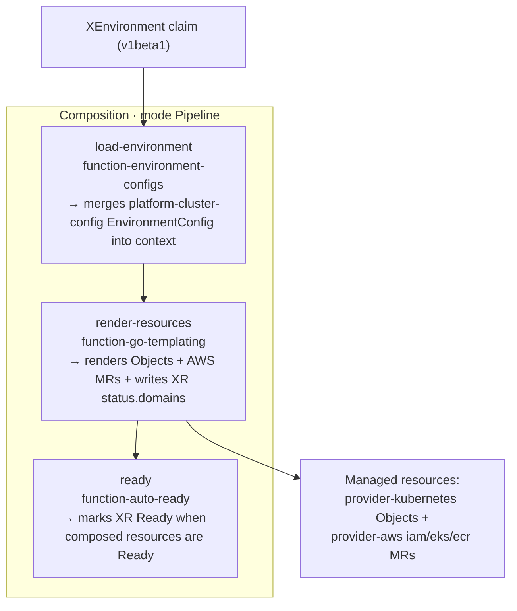

# Crossplane Composition Authoring

The **HOW** behind the environment model — for someone who needs to **extend** the Composition. The contract (the
`XEnvironment` claim, what gets provisioned, claim delivery) is [crossplane-environment-api.md](crossplane-environment-api.md);
this doc is the implementation: the XRD schema, the Pipeline + its three functions, the go-template that
renders every managed resource **and** writes the XR status, providers + Pod Identity, and the hub/spoke ECR
hop.

Source of truth:

- XRD — `infra/modules/crossplane/charts/environment-api/templates/xenvironment-xrd.yaml`
- Composition — `infra/modules/crossplane/charts/environment-api/files/composition.yaml`
- Control plane (core, providers, ProviderConfig, identity) — `infra/modules/crossplane/main.tf`
- Status-loop proof — [ADR-061 Phase 2 spike](../spikes/adr-061-phase2-ingress-spike.md) (Q1)

## XRD design

The `CompositeResourceDefinition` is **Crossplane v2** (`apiextensions.crossplane.io/v2`), `scope: Cluster`
(an environment provisions a namespace + cluster-scoped policies and composes across namespaces; cluster scope also
means creating an `XEnvironment` needs cluster RBAC — developers can't self-provision, gate S1). One served
version:

- **`v1beta1`** — `served: true`, **`referenceable: true`**, `storage: true` (the **storage/bound** version,
  ADR-067). The live `environment` Composition (`metadata.name: environment`) binds to it
  (`compositeTypeRef.apiVersion: platform.refplat.org/v1beta1`). `spec` is the Environment contract — a
  Product at a Stage [for a Customer]: `team`, `product`, `stage`, optional `customer`, `tier`,
  `isolation.compute`, `residency`, `quota`, `domains`, `lifecycle.phase`, and `services.<svc>` (each with
  `serviceAccount`, `preview`, `image`, `permissions.aws.policyStatements`). `status` carries `namespace` + the
  `domains[]` ingress state machine. This is a **greenfield rename** of the retired v2 `XTenant` — no stored v2
  objects survive the from-scratch rebuild, so there is no served compatibility version.

The XRD is **structural + self-contained validation only**. Cross-object envelope checks — `team ==
Product.team`, `tier ∈ Team.allowedTiers`, `stage ∈ Team.allowedStages`, `quota ≤ Team.quotaCap`, image
registry ⊆ `team-<team>/<product>`, etc. — are enforced by Kyverno against the projected `Team` + `Product`
CRs (`restrict-environment-envelope`), not in the schema.

When extending the **live** behaviour, edit **`v1beta1`** `spec`/`status` and the Composition together: a
field the template reads must exist in the bound schema, and a `status` field the template writes must be
declared or the apiserver drops it.

## The Composition pipeline (mode `Pipeline`)



The functions are installed by the control-plane module (`var.functions`); the pipeline references them by
name. Each step's `input` is function-specific.

### Step 1 — `function-environment-configs` (cluster constants out of the claim)

Per-cluster constants must **not** leak into the environment-facing spec. The `crossplane_environment_api` Helm release
(`infra/modules/crossplane/main.tf`) templates an `EnvironmentConfig` named `platform-cluster-config` carrying
`ecrRegistry`, `baseDomain`, `region`, `workloadAccountId`, `managementAccountId`, `clusterName`,
`resourcePrefix`, `pullAccountIds`, `permissionsBoundaryArn`, `providerConfigEcr`. Step 1 references
it by name and merges it into the pipeline **context**, where the template reads it as
`index .context "apiextensions.crossplane.io/environment"`.

The Composition file ships **raw** (`.Files.Get`) so Helm does not try to process the template's inline
`{{ }}` — only Crossplane's go-templating function does.

### Step 2 — `function-go-templating` (the engine)

One inline Go template renders **every** composed resource. Two output classes share the one template:

- **Composed (managed) resources** — each carries the annotation
  `gotemplating.fn.crossplane.io/composition-resource-name: <name>`. Kubernetes resources are
  `provider-kubernetes` `Object`s (`providerConfigRef.name: default`); AWS resources are provider-aws MRs
  (`iam.aws.upbound.io/Role`+`RolePolicy`, `eks.aws.upbound.io/PodIdentityAssociation`,
  `ecr.aws.upbound.io/Repository`+`RepositoryPolicy`). Note: the live Composition renders **only**
  `PodIdentityAssociation` for cluster identity — **no** `AccessEntry` / `DeveloperAccess-<team>` role yet
  (#647); developer cluster access is the in-cluster `<ns>:developers` RoleBinding only. External names are pinned with
  `crossplane.io/external-name` where the AWS name must be deterministic (e.g.
  `Pod-<team>-<product>-[<customer>-]<stage>-<svc>`). Per-service resources (ECR, the Pod-Identity role +
  association) are rendered by ranging over `spec.services`.
- **The composite's own status** — see the status loop below.

### Step 3 — `function-auto-ready`

Marks the `XEnvironment` `Ready` once its composed resources report Ready. No input.

## The status-loop pattern (write composite status)

The ADR-061 Phase 2a `status.domains` rendering runs **inside the Composition** — **no separate controller**
— because `function-go-templating` can *write the composite's own status* in the same pass that renders the
managed resources. The spike (Q1) proved the broader *read-observed-status-and-write* loop; **the live
template uses only the write half (Phase 2a).** Gating a domain on an observed composed resource's status is
**Phase 2b design, not built** (covered at the end of this section).

**Writing composite status.** Emit a YAML doc whose `apiVersion`/`kind` are the **XR's own GVK**
(`platform.refplat.org/v1beta1` / `XEnvironment`) with `metadata.name: {{ $xrName }}` and **NO
`gotemplating.fn.crossplane.io/composition-resource-name` annotation**. Crossplane merges that into the
composite's status. The live template does exactly this to publish `status.domains` (composition.yaml around
the `kind: XEnvironment` / `status: domains:` block):

> **Gotcha — omit the resource-name annotation.** With the annotation present, the emitted XR is treated as a
> *composed nested `XEnvironment`* (it shows up as an unready resource and never merges into status). Without it,
> it merges into the composite status. This is the single most error-prone part of extending the status.

The same template pass builds the `restrict-route-hostnames-<ns>` Kyverno allow-list (`<ns>` =
`<team>-<product>-<stage>`) and the `status.domains[]` entries from one source. In **Phase 2a, every bound
host is marked `Active`** — the generated host (`<product>-<team>-<stage>.<baseDomain>` plus the `-pr-*`
preview wildcard) and each `spec.domains` alias under `.<baseDomain>` alike. There is **no Pending→Active
state machine today**; the real ingress-admission boundary is the Kyverno allow-list this same pass emits.
See [gateway-and-ingress.md](gateway-and-ingress.md) for how that allow-list enforces ingress.

**Phase 2b (designed, not built) — reading observed composed status.** `function-go-templating` *can* also
read an observed composed resource's status — observed resources are at `.observed.resources`; for a resource
by composition-resource-name, `index $observed "<name>"` then `.resource.status.conditions`. The intended use
is gating a tier-3 / external host on its observed `Certificate` `Ready` condition (cert issuance *is* the
verification signal, no extra poller) so such a host stays `Pending` until proven. The **live** template does
**not** do this yet — its only `.observed` access reads the XR's own spec. If you build it:

> **Gotcha — capture root `.` before `range`.** Inside `{{ range }}` Go rebinds `.` to the loop element, so
> `.observed` is **nil** inside the loop. Capture it first:
> `{{- $observed := .observed.resources | default dict }}` *before* the range, then index `$observed`.

## Providers, ProviderConfig, and Pod Identity

`infra/modules/crossplane/main.tf` installs the runtime as layered Helm releases:

- **`crossplane`** (core) — CRDs + package/rbac managers.
- **`crossplane-runtime`** — the `Provider` CRs + `DeploymentRuntimeConfig`, plus a wait-Job that blocks until
  providers are Healthy (i.e. their `ProviderConfig` CRDs exist). The **family** provider
  (`provider-family-aws`) installs first and every member sets `skipDependencyResolution` so they don't
  contend on the package Lock. AWS members run on `hostNetwork` (the EKS control plane must reach their
  multi-version conversion webhooks). `provider-kubernetes` is kept at **list index 0** so its port assignment
  is stable across phases.
- **`crossplane-config`** — the `ProviderConfig`s. The **`default`** ProviderConfig (AWS) is credentialed by
  **EKS Pod Identity**, not IRSA: the `aws_eks_pod_identity_association.provisioner` binds
  `(namespace, provider ServiceAccount) → crossplane-provisioner-<cluster>`, and that association is the
  **only** thing crediting the provider pods (no SA annotation). `provider-kubernetes` uses
  `InjectedIdentity` (in-cluster, its own scoped ClusterRole).
- **`crossplane-environment-api`** — the XRD + Composition + the `platform-cluster-config` EnvironmentConfig.

The provisioning IAM role (`crossplane-provisioner-<cluster>`) is deliberately scoped: on an environment-provisioning
(workload) cluster it may create `Pod-*`/`DeveloperAccess-*` roles **only with the deny-escalation
permissions boundary attached** (and cannot strip it — no `Put/DeleteRolePermissionsBoundary`), `PassRole`
those roles to `pods.eks.amazonaws.com` only, and manage EKS Pod Identity associations + access entries on its
own cluster. Effective environment-role perms = the role's declared policy **∩** the boundary, so even a
compromised provisioner can't escalate an environment role.

## Hub / spoke — cross-account ECR

Crossplane is **federated** (one per cluster); the only cross-account hop is ECR. Environment image repos live in
the **platform** account, but a workload cluster (e.g. preprod) runs its own Crossplane. So the ECR MRs use a
**second** ProviderConfig — **`platform-ecr`** — that `assumeRoleChain`s the platform
`crossplane-ecr-provisioner` role (`var.ecr_provisioner_role_arn`). The template selects it per-resource:
`providerConfigRef.name: {{ $ecrCfg }}` where `$ecrCfg = $env.providerConfigEcr | default "default"`. Every
other MR uses `default` (local Pod Identity). The chain hop needs `sts:AssumeRole` **and** `sts:TagSession`
(provider-upjet passes session tags), allowed on the provisioner role and trusted by the target.

## Extending the Composition — checklist

When adding a resource or field:

1. **Add the field** to `v1beta1` `spec` (and a `status` field if the template writes one) in
   `xenvironment-xrd.yaml`.
2. **Render the resource** in the go-template with a unique
   `gotemplating.fn.crossplane.io/composition-resource-name`; gate optional resources with `{{- if ... }}`.
3. **Cross-account?** Set `providerConfigRef.name: {{ $ecrCfg }}` (or add a new ProviderConfig in the config
   chart) instead of `default`.
4. **New provider service?** Add it to `var.provider_services` (one-word; e.g. `route53`) — it appends a
   provider without re-indexing `provider-kubernetes`.
5. **Reading observed status?** Capture `$observed` before any `range`; gate on the observed condition.
6. **Writing composite status?** Emit the XR's own GVK with **no** resource-name annotation.
7. **Render-test offline** before applying:
   `crossplane render xr.yaml composition.yaml functions.yaml [--observed-resources <dir>]`.

## Verification

```bash
kubectl --context preprod get xenvironment <ns>              # SYNCED=True READY=True (<ns> = <team>-<product>-<stage>)
kubectl --context preprod get managed | grep <ns>           # all Object + aws.upbound.io MRs Ready
kubectl --context preprod get xenvironment <ns> -o jsonpath='{.status.domains}' | jq
kubectl --context preprod get providers.pkg.crossplane.io   # all HEALTHY
```
