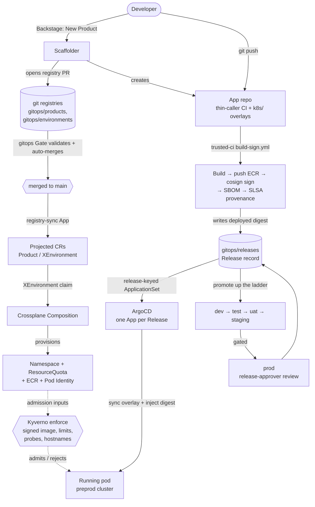

# Delivery Pipeline

How an application goes from *"a developer wants to ship a new service"* to *"a signed image is running in
production behind a gated approval"* — the **orchestration layer** that ties the platform's subsystems together.

> **Positioning.** This is the **application delivery** pipeline (the app lifecycle: scaffold → build → deliver →
> promote). It complements, and does not replace:
>
> - [Onboarding](../onboarding.md) — the new-joiner quickstart.
> - [User Guide](../user-guide.md) and [`infra/docs/`](../../infra/docs/) — operating the *platform infra*
>   (Terragrunt units, modules, day-2).
> - [Documentation Index](../README.md) — the map of everything.
>
> Each stage below is a short narrative + the key files + a **deep-dive link** to the subsystem doc that already
> covers it in full. For the promotion/gated-prod mechanics specifically, see the companion
> [Promotion & Release](promotion-and-release.md) doc.

---

## The pipeline at a glance

The spine is **git-as-source-of-truth**: every fact lives in a registry file under `gitops/`, a gate validates
the PR, ArgoCD projects it onto the cluster, and a controller (Crossplane Composition or the delivery
ApplicationSet) reconciles it into running infrastructure or a running pod. Nothing is applied by hand.

---

## Stage by stage

### 1. Scaffolding — the Backstage paved road

A developer opens the **New Product** template in Backstage. It produces three things in one shot:

- an **app repository** (`app-<team>-<product>`) seeded from the generic starter — `k8s/` overlays plus a
  **thin-caller** CI that calls the shared supply-chain workflows (it never owns the build/sign logic, ADR-050);
- a **Product registry entry** at `gitops/products/<team>/<product>.yaml` (repo, tenancy, owned domains);
- a **dev Environment claim** at `gitops/environments/<team>/<product>/dev.yaml`.

The registry files land as a PR against the platform repo via the scaffolder's write App.

**Deep dive →** the scaffolder templates live in [`scaffolder/templates/`](../../scaffolder/templates/); the
domain model the templates emit is the [Platform Domain API](platform-domain-api.md).
**Governs:** [ADR-067](../adrs/067-idp-domain-model.md) (domain model), [ADR-050](../adrs/050-shared-build-sign-reusable-workflow.md)
(thin-caller CI).

### 2. Registry & domain model — one home per fact

The git registries under `gitops/` are the **single source of truth**. Each is projected onto every cluster as a
plain, data-only **CR** by the `argocd-apps` **registry-sync** Applications
([`infra/modules/argocd-apps/delivery.tf`](../../infra/modules/argocd-apps/delivery.tf)), so that Kyverno
admission and the Crossplane Composition can read them:

| Registry (git) | Projected CR | Reconciled by |
|----------------|--------------|---------------|
| `gitops/teams/<team>.yaml` | `Team` | admission input only (envelope) |
| `gitops/products/<team>/<product>.yaml` | `Product` | admission input; delivery derives directly from git |
| `gitops/environments/<team>/<product>/<stage>.yaml` | `XEnvironment` (Crossplane claim) | **Crossplane Composition** → namespace, ResourceQuota, ECR, Pod Identity |
| `gitops/releases/<team>/<product>/<stage>.yaml` | *(read by the delivery ApplicationSet)* | delivery (digest → pod) |
| `gitops/grants/…` | `AccessGrant` | admission + Backstage soft-scoping |

The **`XEnvironment` claim is the sole provisioner** of an environment's footprint — the Crossplane Composition
reconciles it into a namespace, ResourceQuota, scoped ECR repositories, and per-environment AWS access (EKS Pod
Identity). One claim per `Product × Stage` (`<team>-<product>-<stage>`, e.g. `alpha-checkout-dev`).

**Deep dive →** [Platform Domain API](platform-domain-api.md) (the normative schema),
[Crossplane Environment API](crossplane-environment-api.md) (how the Composition provisions),
[ADR-069](../adrs/069-delivery-source-of-truth-product-environment.md) (one home per fact).

### 3. Self-service governance — the gates as the control plane

Every change to the registries is a pull request, and **two gates** are the enforcement spine that makes
self-service safe. They run as `pull_request_target` (so they execute trusted code from the base branch, never
the PR's) and publish their verdict as required commit-status checks:

| Gate | Workflow | Guards |
|------|----------|--------|
| **gitops Gate** | [`.github/workflows/gitops-gate.yml`](../../.github/workflows/gitops-gate.yml) | `gitops/products/**`, `gitops/environments/**`, `gitops/releases/**` — schema validation, **auto-merge** of bot/scaffolder registry PRs, the **deletion / decommission-first** guard (ADR-062), and **prod-promotion approval** (see A2) |
| **Teams Gate** | [`.github/workflows/teams-gate.yml`](../../.github/workflows/teams-gate.yml) | `gitops/teams/**` — Team envelope validation + the **roles-edit approval** guard |

A **bot-authored, registry-only, fully-valid, non-deletion** PR (the scaffolder, the promote bot ≤ staging) arms
GitHub auto-merge and lands with no human in the loop. Anything **privileged** — a deletion, a prod promotion, or
an edit to who can approve (`spec.roles`) — requires an approving review and **fails closed** until it gets one.
This is the difference between a convenience and a control plane: the gate is where "developers can self-serve"
and "but only within policy" are both true at once.

**Deep dive →** [Environment-Claims PR Automerge runbook](../runbooks/gitops-gate-automerge.md) (the auto-merge +
deletion model); the prod-approval half is detailed in [Promotion & Release](promotion-and-release.md).
**Governs:** [ADR-062](../adrs/062-self-service-tenant-provisioning.md).

### 4. Supply chain — build once, sign, attest

On every push to the app repo's `main`, its **thin-caller** CI invokes the shared, app-team-unwritable
`trusted-ci/build-sign.yml` reusable workflow: **build → push** to the product-scoped ECR
(`team-<team>/<product>-<svc>`) → **cosign keyless sign** → **SBOM**, plus `slsa-provenance.yml` for build
provenance. The supply-chain backbone is **never copied per app** — apps are thin callers, so the platform can
evolve signing centrally (ADR-050).

At admission, Kyverno's `verify-images-product-<team>-<product>` admits only images **signed by the shared
identity, gated to the product** by the signing cert's `githubWorkflowRepository` extension; another team's image
is rejected.

**Deep dive →** [Supply-Chain Overview](supply-chain-overview.md), [Cosign Image Signing](cosign-image-signing.md),
[App Supply-Chain Onboarding runbook](../runbooks/app-supply-chain-onboarding.md).
**Governs:** [ADR-050](../adrs/050-shared-build-sign-reusable-workflow.md).

### 5. Delivery — the release-keyed ApplicationSet

The platform ArgoCD delivers each Product via a **per-Product `ApplicationSet`**
([`infra/modules/argocd-apps/delivery.tf`](../../infra/modules/argocd-apps/delivery.tf)). Its git generator fans
out over the Product's **Release records** (`gitops/releases/<team>/<product>/*.yaml`) — producing **one ArgoCD
`Application` per Release**, i.e. per environment that has a deployed digest. Each Application:

- syncs the app repo's per-stage overlay `k8s/overlays/<stage>`;
- derives the **namespace** and generated **host** from the Release's `spec.environmentRef`;
- injects the per-Service **signed digest** as a kustomize image override.

Workloads run on the **target environment cluster** (preprod today); the platform-account ArgoCD delivers there as
a remote destination. Keying on the *Release* (not the Environment) is the fix that lets a single Product deliver
to **more than one stage** — see [Promotion & Release](promotion-and-release.md) for why the prior design broke.

### 6 & 7. Promotion and gated prod

The same signed digest **climbs the stage ladder** (dev → test → uat → staging → prod) by writing it into the
next stage's Release record — never a rebuild. Promotion ≤ staging is **automatic**; **prod is gated** behind a
release-approver review (author ≠ approver). This is the heart of [#377](https://github.com/asanexample/platform/issues/377)
and has its own architecture doc:

**Deep dive →** [Promotion & Release](promotion-and-release.md) · user runbook: [Promote a Release](../runbooks/promote-a-release.md).

---

## Who owns what · where each fact lives

| Fact | Home (git) | Author | Read by |
|------|-----------|--------|---------|
| Team envelope (stages, tiers, quota) | `gitops/teams/<team>.yaml` | platform / team lead | Kyverno envelope, Teams Gate |
| Release approvers (`spec.roles.releaseApprover`) | `Team` (default) / `Product` (override) | team admin (gated) | gitops/Teams Gate verdict |
| Product identity (repo, tenancy, domains) | `gitops/products/<team>/<product>.yaml` | team lead (scaffolder) | delivery, Kyverno, github-oidc |
| Environment footprint | `gitops/environments/<team>/<product>/<stage>.yaml` | team lead (scaffolder) | Crossplane Composition, Kyverno |
| Deployed digest per stage | `gitops/releases/<team>/<product>/<stage>.yaml` | app CI / promote bot / gated PR | delivery ApplicationSet |
| Cross-team access | `gitops/grants/…` | team admin (gated) | Kyverno, Backstage |

This is ADR-069's **"one home per fact"**: delivery and policy *derive* from these registries; they are never the
source of an independent second copy.

---

## Cross-cutting concerns

These are first-class but already have deep docs — linked here, not re-explained:

- **Identity & access** — who can open the portal, who owns a Team, how SSO groups map to RBAC.
  → [Identity & SSO](identity-and-sso.md) ([ADR-053](../adrs/053-identity-and-cross-system-authorization-strategy.md)).
- **Policy / admission** — the Kyverno enforce-mode floor every environment workload must satisfy (signed digest
  image, resource limits, probes, `ClusterIP`, allow-listed hostnames). → [Kyverno Policy Catalog](kyverno-policy-catalog.md)
  and CLAUDE.md *"Authoring Policy-Compliant Workloads"*.
- **App config & secrets** — a workload gets secrets through the **External Secrets Operator**: a hand-authored
  `ExternalSecret` in the environment namespace pulls from AWS Secrets Manager via the `aws-secrets-manager`
  `ClusterSecretStore`. → [Secrets & External Secrets](secrets-and-external-secrets.md).
  **Known gap:** the *declarative, claim-driven* config/secrets paved road
  ([ADR-070](../adrs/070-tenant-app-config-and-secrets.md)) is **Proposed, not yet built** — the
  Composition emits no `ExternalSecret` and the scaffolder skeleton uses plain `env:`. Today an app wires its own
  `ExternalSecret` against the platform ClusterSecretStore.
- **PR preview environments** ([ADR-032](../adrs/032-pr-preview-environments.md)) — **partially built.** The
  app skeleton's [`preview.yml`](../../scaffolder/templates/new-product/skeleton/.github/workflows/preview.yml)
  **builds + signs + attests a PR image**, so a preview *would* satisfy Kyverno's verify-images/attestations
  checks. But **PR-preview *delivery* is not wired in v3**: the per-Product ApplicationSet is release-keyed (not a
  `pullRequest` generator), and Environment claims ship `preview: false`. Ephemeral per-PR environments are a
  **known future enhancement**, not a live capability.

---

## Key design decisions

The choices that shape the whole pipeline (one line each; follow the ADR for the rationale):

- **Git is the single source of truth; clusters read projected CRs.** Delivery and admission *derive* from the
  `gitops/` registries — no out-of-band second copy. → [ADR-069](../adrs/069-delivery-source-of-truth-product-environment.md).
- **Promote by digest, never rebuild.** The same signed artifact moves up the ladder; the digest is the unit of
  promotion. → [ADR-067 §8](../adrs/067-idp-domain-model.md), [ADR-071](../adrs/071-digest-promotion-via-control-plane.md).
- **The control plane carries the digest; the app's `main` stays protected and CI-free for delivery.** Promotion
  edits `gitops/releases/**` in the platform repo, not the app repo. → [ADR-071](../adrs/071-digest-promotion-via-control-plane.md).
- **Self-service is gated, fail-closed.** Privileged registry changes (deletion, prod promotion, approver edits)
  require an approving review and block until they get one. → [ADR-062](../adrs/062-self-service-tenant-provisioning.md), #501.
- **Thin-caller supply chain.** Apps call shared signing workflows they cannot edit, so the backbone evolves
  centrally. → [ADR-050](../adrs/050-shared-build-sign-reusable-workflow.md).
- **One provisioner.** The `XEnvironment` Composition is the sole creator of an environment's footprint — no
  parallel Terragrunt path. → [ADR-067](../adrs/067-idp-domain-model.md).

---

## See also

- [Promotion & Release](promotion-and-release.md) — the ladder, auto-promotion, and gated-prod mechanics.
- [Ship a Service](../ship-a-service.md) — the developer's paved-road walkthrough.
- [Promote a Release](../runbooks/promote-a-release.md) — the promote/approve runbook.
- [Platform Domain API](platform-domain-api.md) · [Crossplane Environment API](crossplane-environment-api.md) ·
  [Supply-Chain Overview](supply-chain-overview.md) · [Kyverno Policy Catalog](kyverno-policy-catalog.md).
