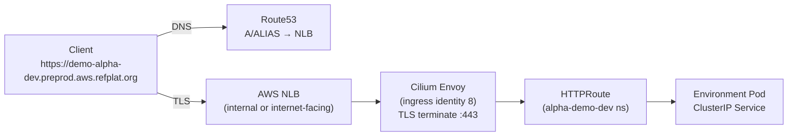

# Gateway & Environment Ingress

How an external request reaches an environment pod end to end: a single shared **Cilium Gateway** (Gateway API)
fronted by an NLB, TLS terminated with a cert-manager-issued **wildcard** certificate, DNS synced by
external-dns, and route hostnames bounded by a per-product Kyverno guard. Every piece is platform-owned
substrate; environments only ship `HTTPRoute`s whose hostnames their `XEnvironment` claim authorises.

See also: [ADR-029](../adrs/029-preprod-public-ingress-gateway-api.md) (public ingress via Gateway API),
[ADR-060](../adrs/060-tenant-app-hostname-convention.md) (generated hostname),
[ADR-061](../adrs/061-tenant-ingress-and-custom-domain-strategy.md) (custom-domain strategy), and the
[Crossplane Environment API](crossplane-environment-api.md) (`status.domains`).

## The request path



1. The client resolves the host via **Route53** (record written by external-dns) to the Gateway's NLB.
2. The **NLB** forwards to Cilium's Envoy. Envoy presents the wildcard cert and terminates TLS at `:443`.
3. Envoy matches the `Host` header to an attached **`HTTPRoute`** and forwards to the route's backend
   (an environment **ClusterIP** Service — `LoadBalancer`/`NodePort` are denied by Kyverno).
4. Inside the cluster, Envoy traffic carries Cilium's reserved `ingress` identity (8), so environment
   `CiliumNetworkPolicy`s must allow `fromEntities: ["ingress"]` (the Environment Composition does this).

## The shared Cilium Gateway

> The ingress stack is split across two units: **`gateway`** (the foundational `Gateway` + `ClusterIssuer`,
> applied early, no app deps) and **`gateway-config`** (the later configuration layered on top). This doc
> describes the `gateway` side unless noted.

`infra/modules/gateway/main.tf` creates one `Gateway` (`gatewayClassName: cilium`) with two listeners, both
scoped to the **wildcard** hostname `*.${domain}` (e.g. `*.preprod.aws.refplat.org`):

- **`https`** (`:443`, `protocol: HTTPS`) — `tls.mode: Terminate`, `certificateRefs: [<gateway>-tls]`,
  `allowedRoutes.namespaces.from: All` so any namespace may attach a route.
- **`http`** (`:80`) — exists only so per-app HTTP→HTTPS `301` redirect routes have a parent.

The NLB is created by the AWS Load Balancer Controller from `spec.infrastructure.annotations`
(`aws-load-balancer-type: nlb`; `scheme: internal` when `var.internal`). `GatewayClass cilium` is installed
by the Cilium Helm chart, not this module. The Gateway is a **foundational** unit with no app dependencies,
so ingress is up before any app routes attach (ADR-059).

This is the **single** ingress surface for environment apps. Adding listeners to it is constrained (see
[Why custom domains are deferred](#why-external-custom-domains-are-deferred)).

## TLS — wildcard cert via cert-manager DNS-01

The Gateway is annotated `cert-manager.io/cluster-issuer: <cluster_issuer_name>`. cert-manager's
**gateway-shim** watches that annotation and provisions a `Certificate` for each listener's TLS secret
(`<gateway>-tls`) covering `*.${domain}`. The `ClusterIssuer` itself (`letsencrypt-prod` by convention) is
also created in `infra/modules/gateway/main.tf`: ACME against Let's Encrypt production, solved by a single
**DNS-01** solver over **Route53** (`hostedZoneID`, `region`).

cert-manager authenticates to Route53 via **EKS Pod Identity** (ADR-047,
`infra/modules/cert-manager/main.tf`): a role scoped to
`route53:ChangeResourceRecordSets`/`ListResourceRecordSets` on the one hosted-zone ARN, plus
`route53:GetChange` (challenge-propagation polling) and the unscopable `ListHostedZones*`, bound to the
cert-manager service account by a Pod Identity association (no `eks.amazonaws.com/role-arn` annotation). A
wildcard cert requires DNS-01 (HTTP-01 cannot validate a wildcard).

Once issued, Cilium **automatically** copies the Gateway-referenced TLS secret into the `cilium-secrets`
namespace where Envoy reads it — no module code does this (confirmed in the
[Phase 2 spike](../spikes/adr-061-phase2-ingress-spike.md), Q2). So every host under the wildcard is served
by the existing cert with **zero** per-host cert work.

## DNS — external-dns syncs route hostnames

`infra/modules/external-dns/main.tf` runs external-dns with `sources` including Gateway-API `HTTPRoute`s and
a `domainFilters` of the zone (e.g. `preprod.aws.refplat.org`). For each attached route hostname it writes the
matching Route53 record pointing at the Gateway NLB, and a `TXT` ownership record keyed by
`txtOwnerId = <cluster_name>` (so multiple clusters can share a zone without clobbering each other's records).

Its role (assumed via **EKS Pod Identity**, ADR-047 — no SA annotation) is scoped to
`route53:ChangeResourceRecordSets` on the single zone ARN plus the unscopable
`List*` actions. external-dns is purely a **reconciler of records from routes** — it grants no authorisation;
which hostnames a route may carry is enforced separately by Kyverno (below).

## Hostname authorisation — the claim is the source of truth

An environment must not be able to route an arbitrary or another team's hostname. Two mechanisms, one source:

- **Generated host (ADR-060).** Every Environment has an implicit canonical host
  `<product>-<team>-<stage>.<baseDomain>` (e.g. `shop-alpha-dev.preprod.aws.refplat.org`). It is never
  declared; `argocd-apps` injects it into the app's `HTTPRoute` at deploy — a `preview_domain`-gated patch
  that rewrites `spec.hostnames[0]` to `<product>-<team>-<stage>.<preview_domain>` (delivery.tf) — and the
  shift-left CI injects the same at PR time (see [kyverno-shift-left.md](kyverno-shift-left.md)).
- **`spec.domains` aliases (ADR-061).** Additional vanity hosts declared on the `XEnvironment` claim.

The Environment Composition unions the generated host(s) with `spec.domains` into a per-product Kyverno
`ClusterPolicy` **`restrict-route-hostnames-<ns>`** (`<ns>` = `<team>-<product>-<stage>`) that **denies** any `HTTPRoute`/`GRPCRoute`/
`TLSRoute` hostname not in the allow-list (Enforce). The allow-list and the matching `status.domains` entries
are both rendered from the same template pass in
`infra/modules/crossplane/charts/environment-api/files/composition.yaml` — see
[crossplane-composition-authoring.md](crossplane-composition-authoring.md) for the mechanism. There is **no
second registry**: the v2 `teams.hcl` hostnames were retired (ADR-061 Phase 1).

### `status.domains` gating (ADR-061 Phase 2a — shipped)

A host is admitted **only while its `status.domains[].state` is `Active`**. Hosts under the wildcard base
domain (the generated host + tier-1/2 aliases) are platform-owned and marked `Active` immediately.
Verification is the security boundary: an environment cannot route a host whose state is not `Active`.

## Why external custom domains are deferred

A domain we **don't own** (e.g. `shop.acme.com`) does not match `*.${baseDomain}`, so it cannot reuse the
wildcard cert and would need its own listener/cert on the shared Gateway. On **Cilium 1.19.4** that is unsafe:

- [cilium #44123](https://github.com/cilium/cilium/issues/44123) — adding a specific-hostname HTTPS listener
  to a Gateway that **also** has a wildcard listener breaks the wildcard listener entirely (its
  `CiliumEnvoyConfig` stops generating). That is exactly the shared Gateway → risk of dropping **all** environment
  ingress.
- [cilium #41228](https://github.com/cilium/cilium/issues/41228) — multiple `certificateRefs` on one listener
  fail Envoy config ("duplicate matcher"), ruling out single-listener multi-cert SNI.

The [Phase 2 spike](../spikes/adr-061-phase2-ingress-spike.md) (Q2) records the verdict: **do not add
per-domain listeners to the shared Gateway.** External custom domains (Phase 2b) are therefore **deferred** —
they need extra infra (an isolated origin Gateway and/or a Cloudflare-for-SaaS edge, ≈ one extra NLB) and are
not built until a concrete customer domain exists. What *is* live and free: vanity labels **under** the
existing wildcard (`*.preprod.aws.refplat.org`), declared in `spec.domains` and marked `Active` on creation.

## Verification

```bash
kubectl --context preprod get gateway -A
kubectl --context preprod get httproute -A
kubectl --context preprod get certificate -A                       # <gateway>-tls Ready=True
kubectl --context preprod get xenvironment <ns> -o jsonpath='{.status.domains}' | jq
aws route53 list-resource-record-sets --hosted-zone-id <zone> --profile preprod \
  --query "ResourceRecordSets[?contains(Name, '<product>-<team>')]"
```
