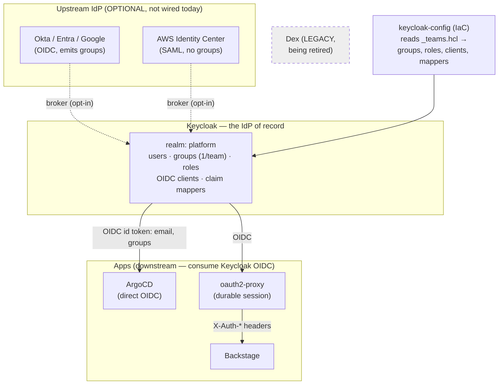

# Identity & SSO

**How a human signs into the platform's apps (ArgoCD, Backstage), where their permissions come from, and how
the pieces fit together.** This is the architecture explainer; the step-by-step setup/operations live in the
runbooks linked at the end.

> **Current state — as of 2026-06.** **Keycloak is the app-facing identity provider (IdP) of record.** ArgoCD
> logs in against Keycloak directly; Backstage logs in against Keycloak through an oauth2-proxy in front of it.
> **Dex is legacy** — it is still deployed and still holds client config, but no app uses it as the active
> login path anymore; it is being retired. Identity is **standalone** today (users live in Keycloak, no
> corporate IdP wired in); federating to Okta/Entra/AWS Identity Center is an opt-in backend change that
> changes nothing for the apps.

## The one-paragraph mental model

There is **one issuer the apps trust — Keycloak** (`https://keycloak.aws.refplat.org/realms/platform`). Keycloak
owns the users (or brokers them from a corporate IdP, if you wire one up), owns the **groups** that represent
teams, and mints the OIDC tokens the apps consume. Each app maps the token's **`groups` claim** to its own
permissions. The team→group→role mapping is **generated from one file** (`infra/live/aws/_teams.hcl`) by the
`keycloak-config` unit. AWS account access is a **separate** system (AWS Identity Center), deliberately
decoupled from app login.

## Components



- **Keycloak** (`infra/modules/keycloak`, namespace `keycloak`, CloudNativePG-backed) — the OIDC IdP the apps
  trust. Issuer: `https://keycloak.aws.refplat.org/realms/platform`. Reached in-cluster via the shared Cilium
  Gateway. Admin bootstrap credential is generated into Secrets Manager (`platform/keycloak/admin`).
- **keycloak-config** (`infra/modules/keycloak-config`) — **access-model-as-code.** A Terraform run (the
  Keycloak provider, over an in-cluster `kubectl` port-forward — `scripts/kc-portforward.sh`) that configures
  the *running* Keycloak: the realm, one **group per team** + platform groups (e.g. `platform-admins`), the
  developer-access **roles** (`tenant-operate`, `tenant-view`), the per-app **OIDC clients**, the **claim
  mappers** that put group names into the `groups` claim, the optional **upstream broker**, and (in standalone
  mode) the **seed users**. All of it derived from `infra/live/aws/_teams.hcl`.
- **oauth2-proxy** (`infra/modules/oauth2-proxy`, in the `backstage` namespace) — a small reverse proxy that
  sits **in front of Backstage**. It runs the OIDC login against Keycloak and then holds a **durable session
  cookie**, injecting `X-Auth-Request-*` identity headers into Backstage. It exists to fix "logged out on every
  refresh" (see *Why oauth2-proxy exists* below, #202).
- **ArgoCD** — consumes Keycloak OIDC **directly** (its own embedded Dex is off: `dex_enabled = false`).
- **Dex** (`infra/modules/dex`, **LEGACY**) — the platform's first SSO broker (ADR-052). Superseded by Keycloak
  (ADR-053). Still deployed and still carries a `backstage` client + an oauth2-proxy callback as transitional
  remnants, but is **not the active login path for any app** today and is slated for removal.

## How a login actually works

### Signing into ArgoCD

1. You click **Log in via SSO**; ArgoCD redirects you to Keycloak (`client_id=argocd`).
2. Keycloak authenticates you (today: against its own user store; if federation were enabled, it would bounce
   you to the upstream IdP first).
3. Keycloak issues an **OIDC id token** with `email` and a **`groups`** claim (group *names*, e.g.
   `["alpha"]` or `["platform-admins"]`).
4. ArgoCD exchanges the code (confidential client; secret synced from Secrets Manager via an ExternalSecret)
   and reads the **`groups` claim** for RBAC (`rbac_scopes = [groups]`, default policy = **deny**).
5. ArgoCD's RBAC (generated from `_teams.hcl`) maps the group to a role:
   - `g, platform-admins, role:org-admin` → full access.
   - `g, alpha, role:team-alpha` → `get`/`sync`/`logs` on `alpha/*` apps only.
6. Logout is **RP-initiated** — ArgoCD redirects to Keycloak's end-session endpoint, ending the SSO session
   (not just the local cookie).

The **ArgoCD CLI** uses a separate **public** Keycloak client (`argocd-cli`, PKCE, no secret).

### Signing into Backstage

Backstage is **fronted by oauth2-proxy**, so the login you actually do is oauth2-proxy's:

1. You hit `backstage.aws.refplat.org`; the gateway routes to **oauth2-proxy**.
2. oauth2-proxy runs OIDC against **Keycloak** (`client_id=oauth2-proxy`, issuer = the Keycloak realm) and, on
   success, sets its **own durable session cookie** and proxies you to Backstage, injecting
   `X-Auth-Request-Email` / `X-Auth-Request-Groups` headers.
3. Backstage's **`oauth2Proxy` sign-in provider** (ProxiedSignInPage) trusts those headers to identify you. A
   NetworkPolicy locks Backstage's `:7007` so **only the oauth2-proxy pod** can reach it (the headers are only
   trustworthy because nothing else can set them).

> A legacy **Dex** OIDC provider config still lingers in the Backstage unit (`enable_oidc`, the
> `sso.aws.refplat.org` host-alias) from the pre-oauth2-proxy era. It is **not** the active path — the
> oauth2-proxy→Keycloak flow above is. It will go away with Dex.

### Why oauth2-proxy exists (the durable-session fix, #202)

Backstage's own session refresh expects the IdP to issue an OAuth **refresh token**. The pre-Keycloak setup
(SAML via Dex) issued none, so Backstage's `/refresh` returned 401 and you were bounced to the login screen on
**every page reload**. oauth2-proxy solves this by owning the session itself: it sets `cookie-refresh = 0` (no
doomed upstream-token refresh) and keeps **its own** cookie valid for `cookie-expire`. So the session is the
proxy's cookie, independent of any refresh token. (This is why Backstage uses the header-based `oauth2Proxy`
provider rather than a direct OIDC provider.)

## Where permissions come from — the access model

The single source of truth is **`infra/live/aws/_teams.hcl`**. `keycloak-config` turns it into Keycloak
objects; the apps read the resulting claims.

```text
_teams.hcl                         keycloak-config                 claims            app RBAC
─────────────────────────────────  ──────────────────────────────  ───────────────   ────────────────────────
team "alpha":                      group  "alpha"                   groups:           ArgoCD:
  envelope.allowedEnvironments       role-of-env(preprod)             ["alpha"]          g, alpha, role:team-alpha
    = ["preprod"]                      = "tenant-operate"            roles:             → get/sync alpha/* apps
  ssoGroup = "Dev-alpha"             group "alpha" → tenant-operate    ["tenant-operate"]
                                                                                       Kubernetes:
platform group "platform-admins"   group "platform-admins"         groups:              team-alpha:developers
                                                                      ["platform-admins"]  (via EKS access entry)
```

- **Team key = Keycloak group name** (`alpha` → group `/alpha`).
- **Roles** are the *developer-access posture* by environment (ADR-049): `tenant-operate` for preprod,
  `tenant-view` for prod. A team's group gets the roles implied by its `envelope.allowedEnvironments`.
- **`groups` claim** (names, not UUIDs) is what every app keys off. ArgoCD maps it to `role:team-<team>` /
  `role:org-admin`; Kubernetes namespace access is granted separately by the Crossplane tenant Composition
  (`team-<team>:developers`, ADR-039); **AWS** access is separate again (Identity Center permission sets).
- **`ssoGroup`** matters **only when federating** — it's the *upstream* group name that maps into the Keycloak
  group (see below). In standalone mode it's unused.

## Membership: how a user ends up in a group

This is the part that trips people up. A user only gets permissions if they're **in a Keycloak group**. There
are three modes (the *pluggable seam*, ADR-059) — the apps are identical across all three:

| Mode | When | How membership is set | Today? |
|------|------|------------------------|--------|
| **Standalone** | No corporate IdP | Seed users in `keycloak-config` are placed into groups; or assign in the Keycloak admin UI | ✅ **current** |
| **Federated, group-emitting** (Okta/Entra/Google, OIDC) | You have a corporate IdP that emits group claims | Upstream group claim → an **advanced-group mapper** auto-joins the matching Keycloak group (keyed by `ssoGroup`) | opt-in |
| **Federated, no groups** (AWS Identity Center, SAML) | AWS-only shop | IdC can't emit group claims → mappers are inert → membership must be assigned **manually** in Keycloak (the "membership gap") | opt-in |

Today (standalone), the seed users are `admin` (→ `platform-admins`), `dev-alpha` (→ `alpha`), `dev-bravo`
(→ `bravo`); their one-time passwords are in Secrets Manager at `platform/keycloak/seed-user/<username>`. To
add a person now, create them in the Keycloak admin UI and add them to a group — or wire an upstream IdP so
membership flows automatically.

## The pluggable seam (ADR-059), in one breath

**Keycloak is a stable issuer the apps are coded against; the *source of identity behind it* is swappable.**
Flip `keycloak-config`'s `upstream` from null (standalone) to an Okta/Entra/AWS-IdC preset and **nothing
downstream changes** — same clients, same `groups` claim, same RBAC. That's the whole point: you can start
standalone and adopt a corporate IdP later without touching the apps.

## Current vs planned

| Thing | Status |
|-------|--------|
| ArgoCD → Keycloak OIDC | ✅ done |
| Backstage → oauth2-proxy → Keycloak | ✅ done |
| Standalone identity (seed users) | ✅ current |
| Dex serving any app | ❌ legacy; no active path; pending removal |
| Upstream federation (Okta/Entra/IdC) | ⏳ designed + supported, **not wired** |
| Hostname `keycloak.aws.refplat.org` → `sso.aws.refplat.org` | ⏳ planned at the Dex retirement |
| Keycloak→AWS group sync (SCIM) so app groups drive AWS access | ⏳ future (ADR-059); AWS access is manual in IdC today |
| Backstage group-based RBAC (#197) | ⏳ future |

## Glossary

- **IdP of record** — the identity provider the apps trust to authenticate users (here: **Keycloak**).
- **Upstream / downstream** — *upstream* is an external IdP Keycloak federates *to* (Okta/IdC); *downstream* is
  an app that consumes Keycloak's tokens (ArgoCD/Backstage).
- **Broker / federation** — Keycloak "brokering" a login to an upstream IdP and importing the user.
- **Claim** — a field in the OIDC id token (`email`, `groups`, `roles`). The **`groups` claim** carries group
  *names* and is what app RBAC keys off.
- **Membership** — which Keycloak groups a user belongs to (set by seed/UI, or an upstream group mapper).
- **`ssoGroup`** — a team's *upstream* group name in `_teams.hcl`; used only to map a federated upstream group
  into the Keycloak group. Unused in standalone mode.
- **The seam** — the invariant contract (Keycloak issuer + `groups` claim) that keeps the upstream IdP
  swappable without changing the apps (ADR-059).

## Related docs

- Runbooks: [keycloak-sso](../runbooks/keycloak-sso.md) · [keycloak-upstream-idp](../runbooks/keycloak-upstream-idp.md)
  · [argocd-sso](../runbooks/argocd-sso.md) (legacy) · [dex-sso](../runbooks/dex-sso.md) (legacy) ·
  **[identity-sso-troubleshooting](../runbooks/identity-sso-troubleshooting.md)**
- ADRs: [052 (Dex broker, superseded)](../adrs/052-centralized-dex-sso-broker.md) ·
  [053 (identity & cross-system authz)](../adrs/053-identity-and-cross-system-authorization-strategy.md) ·
  [059 (pluggable IdP seam)](../adrs/059-identity-topology-pluggable-idp-seam.md) ·
  [049 (team/tenant model)](../adrs/049-tenant-model-team-tenant-zone.md)
- The access-model source: `infra/live/aws/_teams.hcl`.
