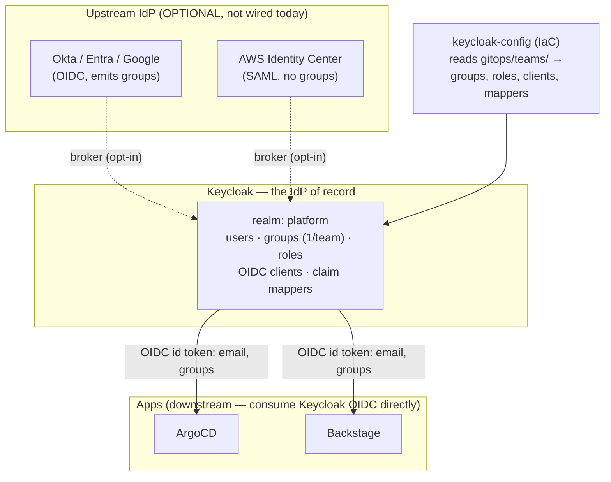

# Identity & SSO

**How a human signs into the platform's apps (ArgoCD, Backstage), where their permissions come from, and how
the pieces fit together.** This is the architecture explainer; the step-by-step setup/operations live in the
runbooks linked at the end.

> **Current state — as of 2026-06.** **Keycloak is the app-facing identity provider (IdP) of record**, and
> **both ArgoCD and Backstage authenticate against it directly over OIDC.** (Dex and the oauth2-proxy that used
> to front Backstage were retired once Backstage moved to direct Keycloak OIDC — see the history note below.)
> Identity is **standalone** today (users live in Keycloak, no corporate IdP wired in); federating to
> Okta/Entra/AWS Identity Center is an opt-in backend change that changes nothing for the apps.

## The one-paragraph mental model

There is **one issuer the apps trust — Keycloak** (`https://keycloak.aws.refplat.org/realms/platform`). Keycloak
owns the users (or brokers them from a corporate IdP, if you wire one up), owns the **groups** that represent
teams, and mints the OIDC tokens the apps consume. Each app maps the token's **`groups` claim** to its own
permissions. The team→group→role mapping is **generated from the git-native `Team` CRs** (`gitops/teams/`,
ADR-063) by the `keycloak-config` unit. AWS account access is a **separate** system (AWS Identity Center),
deliberately decoupled from app login.

## Components



- **Keycloak** (`infra/modules/keycloak`, namespace `keycloak`, CloudNativePG-backed) — the OIDC IdP the apps
  trust. Issuer: `https://keycloak.aws.refplat.org/realms/platform`. Reached in-cluster via the shared Cilium
  Gateway. Admin bootstrap credential is generated into Secrets Manager (`platform/keycloak/admin`).
- **keycloak-config** (`infra/modules/keycloak-config`) — **access-model-as-code.** A Terraform run (the
  Keycloak provider, over an in-cluster `kubectl` port-forward — `scripts/kc-portforward.sh`) that configures
  the *running* Keycloak: the realm, one **group per team** + platform groups (e.g. `platform-admins`), the
  developer-access **roles** (`tenant-operate`, `tenant-view` — the `environment-*` rename is not yet
  applied), the per-app **OIDC clients**, the **claim
  mappers** that put group names into the `groups` claim, the optional **upstream broker**, and the **realm
  users**. Groups, roles, clients, and mappers are derived from the git-native `Team` CRs (`gitops/teams/`,
  ADR-063); the **users** are now generated from the `gitops/people/` roster (× the `gitops/roles/` catalog,
  #889), not the Team CRs.
- **ArgoCD** — consumes Keycloak OIDC **directly** (its own embedded Dex is off: `dex_enabled = false`).
- **Backstage** — consumes Keycloak OIDC **directly** (the `oidc` sign-in provider; the `backstage` confidential
  client). It is reached directly through the gateway and authenticates each request itself.

> **History (retired):** Backstage used to be fronted by an **oauth2-proxy** that held a durable session and
> injected headers, and before that the platform brokered SSO through **Dex** (SAML → Identity Center). Both
> were removed when Backstage moved to direct Keycloak OIDC — Keycloak issues refresh tokens, so the proxy's
> reason to exist (#202) is gone. See *Why oauth2-proxy existed* below.

## How a login actually works

### Signing into ArgoCD

1. You click **Log in via SSO**; ArgoCD redirects you to Keycloak (`client_id=argocd`).
2. Keycloak authenticates you (today: against its own user store; if federation were enabled, it would bounce
   you to the upstream IdP first).
3. Keycloak issues an **OIDC id token** with `email` and a **`groups`** claim (group *names*, e.g.
   `["alpha"]` or `["platform-admins"]`).
4. ArgoCD exchanges the code (confidential client; secret synced from Secrets Manager via an ExternalSecret)
   and reads the **`groups` claim** for RBAC (`rbac_scopes = [groups]`, default policy = **deny**).
5. ArgoCD's RBAC (generated from the `Team` CRs) maps the group to a role:
   - `g, platform-admins, role:org-admin` → full access.
   - `g, alpha, role:team-alpha` → `get`/`sync`/`logs` on `alpha/*` apps only.
6. Logout is **RP-initiated** — ArgoCD redirects to Keycloak's end-session endpoint, ending the SSO session
   (not just the local cookie).

The **ArgoCD CLI** uses a separate **public** Keycloak client (`argocd-cli`, PKCE, no secret).

### Signing into Backstage

Backstage authenticates **directly against Keycloak**, just like ArgoCD:

1. You hit `backstage.aws.refplat.org`; the gateway routes straight to the Backstage Service (`:7007`).
2. Backstage's **`oidc` sign-in provider** redirects you to Keycloak (`client_id=backstage`, the realm
   discovery `metadataUrl`). You authenticate; Keycloak issues an OIDC id token with `email` + `groups`.
3. The Backstage backend exchanges the code (confidential client; secret synced from
   `platform/keycloak/backstage-oidc` via an ExternalSecret) and establishes the Backstage session. Because
   Keycloak issues a **refresh token**, the silent `/refresh` on reload succeeds — the session survives without
   a fronting proxy.

### Why oauth2-proxy existed (history — retired, #202)

Backstage's session refresh expects the IdP to issue an OAuth **refresh token**. The original SSO went
Backstage → **Dex** → Identity Center over **SAML**, which issues *no* refresh token — so Backstage's
`/refresh` returned 401 and you were logged out on **every reload**. The fix at the time was an **oauth2-proxy**
in front of Backstage that held its own durable cookie and injected identity headers. Moving the upstream to
**Keycloak (OIDC, which issues refresh tokens)** removed that root cause, so Backstage now does direct OIDC and
both Dex and oauth2-proxy were **retired for this purpose**.

**oauth2-proxy itself was later reintroduced elsewhere** — the `oauth2-proxy` module is now a reusable
Keycloak-SSO front for UIs with no native auth of their own; the `rollouts-sso` unit uses it to front the
Argo Rollouts dashboard (#919). Don't read "retired" above as "gone from the platform."

## Where permissions come from — the access model

The single source of truth is the git-native **`Team` CRs** (`gitops/teams/`, ADR-063). `keycloak-config`
turns them into Keycloak objects; the apps read the resulting claims.

```text
gitops/teams/alpha.yaml            keycloak-config                 claims            app RBAC
─────────────────────────────────  ──────────────────────────────  ───────────────   ────────────────────────
Team "alpha":                      group  "alpha"                   groups:           ArgoCD:
  envelope.allowedStages             role-of-stage(test)              ["alpha"]          g, alpha, role:team-alpha
    = [dev, test, …]                   = "tenant-operate"            roles:             → get/sync alpha/* apps
  ssoGroup = "Dev-alpha"             group "alpha" → tenant-operate    ["tenant-operate"]
                                                                                       Kubernetes:
platform group "platform-admins"   group "platform-admins"         groups:              alpha-demo-test:developers
                                                                      ["platform-admins"]  (via EKS access entry)
```

- **Team key = Keycloak group name** (`alpha` → group `/alpha`).
- **Roles** are the *developer-access posture* by stage (ADR-049): `tenant-operate` for non-prod,
  `tenant-view` for prod. A team's group gets the roles implied by its `envelope.allowedStages`.
- **`groups` claim** (names, not UUIDs) is what every app keys off. ArgoCD maps it to `role:team-<team>` /
  `role:org-admin`; Kubernetes namespace access is granted separately, per **Environment**, by the Crossplane
  Environment Composition (a `<team>-<product>-<stage>:developers` RoleBinding → ClusterRole
  `environment-developer`, ADR-039); **AWS** access is separate again (Identity Center permission sets).
- **`ssoGroup`** matters **only when federating** — it's the *upstream* group name that maps into the Keycloak
  group (see below). In standalone mode it's unused.

## Membership: how a user ends up in a group

This is the part that trips people up. A user only gets permissions if they're **in a Keycloak group**. There
are three modes (the *pluggable seam*, ADR-059) — the apps are identical across all three:

| Mode | When | How membership is set | Today? |
|------|------|------------------------|--------|
| **Standalone** | No corporate IdP | Realm users are generated from the `gitops/people/` roster and placed into the groups their roles imply | ✅ **current** |
| **Federated, group-emitting** (Okta/Entra/Google, OIDC) | You have a corporate IdP that emits group claims | Upstream group claim → an **advanced-group mapper** auto-joins the matching Keycloak group (keyed by `ssoGroup`) | opt-in |
| **Federated, no groups** (AWS Identity Center, SAML) | AWS-only shop | IdC can't emit group claims → mappers are inert → membership must be assigned **manually** in Keycloak (the "membership gap") | opt-in |

Today (standalone), the realm users are generated from the `gitops/people/` roster (joined with the
`gitops/roles/` catalog, #889); their one-time passwords are in Secrets Manager at
`platform/keycloak/seed-user/<username>`. To add a person now, add a `Person` file to `gitops/people/`
(one reviewed PR) — a user created by hand in the Keycloak admin UI would not be reconciled. Or wire an
upstream IdP so membership flows from the corporate directory automatically.

## The pluggable seam (ADR-059), in one breath

**Keycloak is a stable issuer the apps are coded against; the *source of identity behind it* is swappable.**
Flip `keycloak-config`'s `upstream` from null (standalone) to an Okta/Entra/AWS-IdC preset and **nothing
downstream changes** — same clients, same `groups` claim, same RBAC. That's the whole point: you can start
standalone and adopt a corporate IdP later without touching the apps.

## Current vs planned

| Thing | Status |
|-------|--------|
| ArgoCD → Keycloak OIDC (direct) | ✅ done |
| Backstage → Keycloak OIDC (direct) | ✅ done |
| Standalone identity (seed users) | ✅ current |
| Dex + oauth2-proxy | ❌ removed (Backstage moved to direct Keycloak OIDC) |
| Upstream federation (Okta/Entra/IdC) | ⏳ designed + supported, **not wired** |
| Hostname `keycloak.aws.refplat.org` → `sso.aws.refplat.org` | ⏳ optional future change |
| Keycloak→AWS group sync (SCIM) so app groups drive AWS access | ⏳ future (ADR-059); AWS access is manual in IdC today |
| Backstage group-based RBAC (#197) | ✅ done (permission policy live; scaffolder execution is admin-only) |

## Glossary

- **IdP of record** — the identity provider the apps trust to authenticate users (here: **Keycloak**).
- **Upstream / downstream** — *upstream* is an external IdP Keycloak federates *to* (Okta/IdC); *downstream* is
  an app that consumes Keycloak's tokens (ArgoCD/Backstage).
- **Broker / federation** — Keycloak "brokering" a login to an upstream IdP and importing the user.
- **Claim** — a field in the OIDC id token (`email`, `groups`, `roles`). The **`groups` claim** carries group
  *names* and is what app RBAC keys off.
- **Membership** — which Keycloak groups a user belongs to (set by seed/UI, or an upstream group mapper).
- **`ssoGroup`** — a team's *upstream* group name in its `Team` CR; used only to map a federated upstream group
  into the Keycloak group. Unused in standalone mode.
- **The seam** — the invariant contract (Keycloak issuer + `groups` claim) that keeps the upstream IdP
  swappable without changing the apps (ADR-059).

## Related docs

- Runbooks: [keycloak-sso](../runbooks/keycloak-sso.md) · [keycloak-upstream-idp](../runbooks/keycloak-upstream-idp.md)
  · [argocd-sso](../runbooks/argocd-sso.md) (legacy) · [dex-sso](../runbooks/dex-sso.md) (legacy) ·
  **[identity-sso-troubleshooting](../runbooks/identity-sso-troubleshooting.md)**
- ADRs: [052 (Dex broker, superseded)](../adrs/052-centralized-dex-sso-broker.md) ·
  [053 (identity & cross-system authz)](../adrs/053-identity-and-cross-system-authorization-strategy.md) ·
  [059 (pluggable IdP seam)](../adrs/059-identity-topology-pluggable-idp-seam.md) ·
  [049 (team/environment model)](../adrs/049-tenant-model-team-tenant-zone.md)
- The access-model source: the git-native `Team` CRs (`gitops/teams/`, ADR-063).
