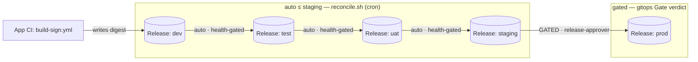
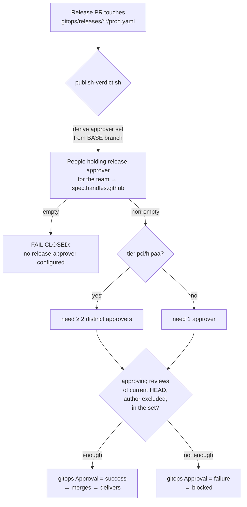

# Promotion & Release

How a signed image climbs the stage ladder — **dev → test → uat → staging → prod** — by moving a **digest**, not
by rebuilding; automatically up to staging, gated by a human at prod. This is the architecture behind
[#377](https://github.com/asanexample/platform/issues/377) (the promotion ladder) and
[#501](https://github.com/asanexample/platform/issues/501) (the release-approver role).

> **Context.** This doc is the deep dive referenced from the [Delivery Pipeline](delivery-pipeline.md) spine
> (stages 6–7). Read that first for where promotion sits in the whole flow. For the operator/developer procedure,
> see the [Promote a Release runbook](../runbooks/promote-a-release.md).

---

## The Release record — desired deployed state

A **Release** is a small git record naming the digest deployed (or to-be-deployed) at one stage:

```yaml
# gitops/releases/alpha/checkout/test.yaml
apiVersion: platform.refplat.org/v1beta1
kind: Release
metadata:
  name: alpha-checkout-test
spec:
  environmentRef: alpha-checkout-test          # the sibling Environment (= namespace)
  services:
    web:
      digest: sha256:20c7787344f6…             # the SIGNED image digest to run
```

One Release per `Product × Stage`. It is the **control-plane's desired-deployed-state**: the delivery
ApplicationSet reads it and makes the cluster match. **Promotion is nothing more than writing a digest into the
next stage's Release** — the same digest that is already running one rung below.

Crucially, the Release lives in the **platform (control-plane) repo**, not the app repo. The app's `main` stays
branch-protected and is **never touched** by a promotion — delivery state is carried entirely by the control
plane ([ADR-071](../adrs/071-digest-promotion-via-control-plane.md)).

---

## Delivery — release-keyed ApplicationSet

The per-Product `ApplicationSet` in
[`infra/modules/argocd-apps/delivery.tf`](../../infra/modules/argocd-apps/delivery.tf) has a **single git
generator** over `gitops/releases/<team>/<product>/*.yaml` → **one ArgoCD `Application` per Release**. For each, it:

1. derives **stage** as the final dash-segment of `spec.environmentRef` (`allowedStages` is a closed enum with no
   dashes), and the optional **customer** as whatever precedes it;
2. sets the destination **namespace** to `spec.environmentRef` verbatim (with the same 63-char truncate-and-hash
   the Composition applies), so the App targets exactly the namespace the Composition created;
3. syncs the app overlay `k8s/overlays/<stage>` and injects the generated **host** (HTTPRoute patch) and the
   per-Service **digest** as a kustomize image override (`templatePatch`).

> ### Why release-keyed (the multi-environment fix)
>
> The prior design used a `merge` generator keyed on `path.basenameNormalized`. Under `goTemplate` that key is
> **null** (every field nests), so a *second* Environment for the same Product collided on the `{null}` key and
> broke the **entire** ApplicationSet — no Product could deliver to more than one stage. Keying on the Release
> record removes the merge key entirely: each Release is its own Application. An Environment with no Release yet
> simply generates **no** Application (no doomed `:placeholder` sync) until its first promotion writes one.

---

## The ladder



There are two ways a digest moves up, plus one automatic reconciler:

### On-demand promote-up

A developer (or operator) promotes a specific stage→stage hop explicitly:

- **Backstage** — the **Request Promotion** template
  ([`scaffolder/templates/request-promotion/`](../../scaffolder/templates/request-promotion/)) resolves the
  source stage's digest (`platform:resolve-release-digest`), renders the **target** Release, and opens the PR.
- **App repo** — `promote.yml` (a thin caller of trusted-ci `promote.yml`) via `workflow_dispatch`, taking a
  `from_stage` input; the source digest is resolved post-clone, so the caller need not paste a digest.

Both end in an `asanexample-promote[bot]` Release PR against the platform repo.

### Auto ≤ staging — the reconciler

[`.github/workflows/auto-promote.yml`](../../.github/workflows/auto-promote.yml) runs
[`scripts/auto-promote/reconcile.sh`](../../.github/scripts/auto-promote/reconcile.sh) on a **cron** (on the
in-VPC `platform-infra` runner, which has ArgoCD API access via Pod Identity). For each Product it walks the
**adjacent** pairs `dev→test→uat→staging` (prod is deliberately excluded) and, for each Service:

- skips a rung already carrying the lower digest (**idempotent**);
- requires the upper Environment to **declare** that Service (else the gate would reject the Release);
- gates on a **health check** — the lower stage's ArgoCD `Application` must be **`Synced` + `Healthy`**, proving
  the lower digest is actually running and settled. Because of this gate the digest climbs **one rung per run**,
  baking at each stage until the next reconcile sees it healthy — a real ladder, not a fan-out;
- opens (and does not re-open) a single promote-bot Release PR per hop, on a branch named
  `auto-promote/<env>-<svc>-<digest>` — content-deterministic, so the push is **forced**: the reconciler is
  the sole writer of these ephemeral branches (each is deleted immediately after its PR opens), so a same-name
  branch can only be a leftover from an earlier attempt at promoting that exact digest, never a conflicting
  change.

The reconciler is the automated sibling of the on-demand path: both produce the *same* promote-bot Release PR that
the gitops Gate validates and auto-merges (≤ staging), and the delivery ApplicationSet then injects.

---

## Gated prod + the release-approver

Prod is the one rung that **never** auto-merges. A prod-stage Release PR is held by the **gitops Gate** verdict
([`.github/workflows/gitops-gate.yml`](../../.github/workflows/gitops-gate.yml) →
[`scripts/gitops-gate/publish-verdict.sh`](../../.github/scripts/gitops-gate/publish-verdict.sh)), which publishes
a required **`gitops Approval`** commit status:



The properties that make this trustworthy:

- **Registry-sourced approver set.** The approvers are **derived from Person grants** (ADR-090, the single
  source for role-holding) — the People holding `release-approver` for the team, projected to their
  `spec.handles.github`. Defined as code, reviewed as code.
- **Read from the BASE branch only.** `publish-verdict.sh` reads the approver list, tiers, and environment files
  from the trusted base checkout (`$BASE_DIR`) — never from the PR's head — so a PR **cannot edit its own
  approver list to self-approve**.
- **Author ≠ approver.** The PR author is excluded from the set of approving reviewers (separation of duties).
- **Regulated tiers need two.** A `pci`/`hipaa` environment requires **≥2 distinct** approvers.
- **Fail closed.** A Product/Team with **no** release-approver configured **blocks** prod — silence is not consent.

### The two-step roles-edit guard

Because the approver set *is* the control, editing it is itself privileged. A change to `spec.roles` is gated by
the **same verdict machinery**, split across the two gates by where the file lives:

| Edit | Gate | Required status |
|------|------|-----------------|
| `Product.spec.roles` (`gitops/products/**`) | gitops Gate | `gitops Approval` |
| `Team.spec.roles` (`gitops/teams/**`) | Teams Gate | `Teams Approval` |

Either requires an **admin/maintainer** approval (≠ author). This closes the obvious attack — *"add myself as an
approver, then approve my own prod promotion"* — because step one (the roles edit) is already gated and read from
base.

> **Bootstrapping note.** Because `pull_request_target` runs the gate from the **base** branch, the PR that first
> teaches a gate to *accept* a `roles` key cannot also be the PR that *adds* `roles` to a registry file — the base
> gate would still reject the unknown key. The machinery and the first seed therefore land as **separate** PRs
> (#501 shipped as platform #503 machinery + #504 seed).

---

## Key design decisions

- **A control-plane Release record (not a tag in the app repo).** Promotion writes `gitops/releases/**` in the
  platform repo, so the app's `main` stays branch-protected and free of delivery mutations. →
  [ADR-071](../adrs/071-digest-promotion-via-control-plane.md).
- **Release-keyed delivery (one App per Release).** Removes the null merge-key collision that capped a Product at
  one stage; lets the same Product fan out across the whole ladder. → #377.
- **Auto ≤ staging, gated prod.** Low-risk rungs move with no human (velocity); prod carries a separation-of-duties
  review (safety). The health gate makes each rung bake before the next. → [ADR-067 §8](../adrs/067-idp-domain-model.md).
- **The approver set is registry-sourced, read from base, fail-closed.** No self-add, no self-approve, no
  silent-allow; regulated tiers escalate to two approvers. → #501,
  [ADR-068 §7](../adrs/068-product-scoped-and-cross-team-access-model.md).
- **Promote by digest, never rebuild.** The artifact verified and signed at build time is the exact artifact that
  reaches prod — byte-identical up the ladder. → [ADR-067 §8](../adrs/067-idp-domain-model.md).

---

## Progressive delivery (built)

- **Progressive delivery is live** ([ADR-056](../adrs/056-progressive-delivery-and-safe-rollback.md), Phase 1
  built + applied on **both clusters**). `argo-rollouts` is the in-cluster control plane and **every environment
  workload is an Argo `Rollout`** (direct `spec.template`); the **tier picks the strategy** — dev/preprod
  auto-promote to dogfood the path, while the scaffolder's prod overlay ships a **metric-gated canary**
  (`k8s/overlays/prod/progressive.yaml`). So a prod promotion is **not** a 100%-at-once sync — it is a
  health-gated, automatically-reversible canary. The traffic-correctness foundation (graceful drain / PDB /
  topology spread) is [zero-downtime-deployments.md](zero-downtime-deployments.md) (ADR-085). Remaining work is
  tracked under [#500](https://github.com/asanexample/platform/issues/500).

## Not yet built

- **Multi-service Request Promotion** — the Backstage template is single-service v1; promoting one Service of a
  multi-Service Product must merge into (not overwrite) the target Release. Tracked as
  [#502](https://github.com/asanexample/platform/issues/502).

---

## See also

- [Delivery Pipeline](delivery-pipeline.md) — the end-to-end spine this fits into.
- [Promote a Release](../runbooks/promote-a-release.md) — the procedure (promote, approve, troubleshoot).
- [Environment-Claims PR Automerge](../runbooks/gitops-gate-automerge.md) — the gate's auto-merge/deletion model.
- [ADR-067](../adrs/067-idp-domain-model.md) §8 · [ADR-071](../adrs/071-digest-promotion-via-control-plane.md) ·
  [ADR-068](../adrs/068-product-scoped-and-cross-team-access-model.md) §7 ·
  [ADR-069](../adrs/069-delivery-source-of-truth-product-environment.md).
