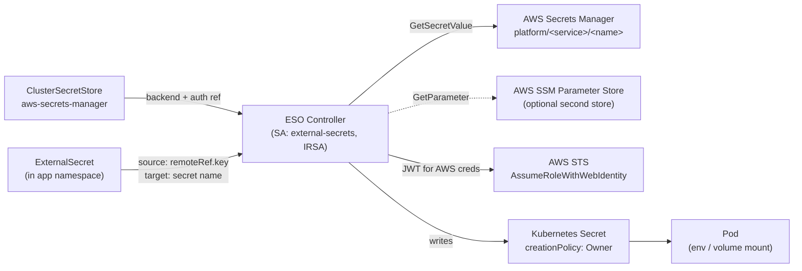

# Secrets & External Secrets

How a secret stored in **AWS Secrets Manager** lands in a Kubernetes pod without any long-lived credential in
the cluster. The **External Secrets Operator** (ESO) is the only sync path: a `ClusterSecretStore` names the
backend + auth, an `ExternalSecret` declares "pull *this* remote key into *this* k8s Secret", and ESO
reconciles. Authentication is **IRSA** — ESO exchanges its ServiceAccount token for AWS credentials via STS;
nothing static is stored.

See also: [ADR-019](../adrs/019-external-secrets-operator.md) (adopt ESO),
[ADR-025](../adrs/025-secret-naming-convention.md) (naming), the
[secrets-management runbook](../runbooks/secrets-management.md), and the
[secret-rotation runbook](../runbooks/secret-rotation.md).

## The sync flow



The chain end to end: **Secrets Manager** → **IRSA (STS `AssumeRoleWithWebIdentity`)** → **ESO controller**
→ **`ExternalSecret`** → **Kubernetes `Secret`** → **Pod**.

## The ESO controller (IRSA)

`infra/modules/external-secrets/main.tf` installs the ESO Helm chart and provisions its IAM role. The role's
trust policy (`external_secrets_trust`) federates the cluster OIDC provider and binds the subject
`system:serviceaccount:<namespace>:external-secrets`, so **only** the ESO ServiceAccount can assume it. The
SA carries the `eks.amazonaws.com/role-arn` annotation.

The attached policy (`external_secrets`) is path-scoped, not account-wide:

- `secretsmanager:GetSecretValue` / `DescribeSecret` / `ListSecretVersionIds` on
  `arn:aws:secretsmanager:*:<account>:secret:<secret_path_prefix>/*`
- `ssm:GetParameter*` on `arn:aws:ssm:*:<account>:parameter<ssm_path_prefix>/*`
- `kms:Decrypt` on `var.kms_key_arns` (only when CMK-encrypted secrets are in use)

Operational details worth knowing: the validating webhook runs on `hostNetwork` (the EKS managed control
plane can't reach Cilium overlay pod IPs) on a private `1026x` port, and its `failurePolicy` is **`Ignore`**
— a down webhook must never block `ExternalSecret` *deletes* and strand owning units on teardown.

## The ClusterSecretStore

`infra/modules/secret-stores/main.tf` creates the `ClusterSecretStore` resources that point ESO at a backend.
The primary is `aws-secrets-manager` (`spec.provider.aws.service: SecretsManager`); a second
`<name>-ssm` (`ParameterStore`) is created when `var.create_ssm_store` is set. Both use **`auth.jwt`** with a
`serviceAccountRef` to the ESO ServiceAccount — i.e. ESO presents that SA's projected token to STS via IRSA
(no static keys in the store). `ClusterSecretStore` is **cluster-scoped**, so any namespace can reference it.

## The ExternalSecret CRD

An `ExternalSecret` is the per-secret instruction. It names the store, the **source** remote key(s), and the
**target** Kubernetes Secret. From the Keycloak module (`infra/modules/keycloak/main.tf`), a JSON secret split
into two keys:

```yaml
apiVersion: external-secrets.io/v1beta1
kind: ExternalSecret
metadata:
  name: keycloak-admin
  namespace: keycloak
spec:
  refreshInterval: 1h
  secretStoreRef:
    name: aws-secrets-manager
    kind: ClusterSecretStore
  target:
    name: keycloak-admin
    creationPolicy: Owner          # ESO owns the k8s Secret; deleting the ES deletes the Secret
  data:
    - secretKey: username
      remoteRef:
        key: platform/keycloak/admin
        property: username
    - secretKey: password
      remoteRef:
        key: platform/keycloak/admin
        property: password
```

ESO fetches on the `refreshInterval` cadence (so a freshly-rotated value in Secrets Manager appears after the
next refresh, not instantly). `creationPolicy: Owner` ties the k8s Secret's lifecycle to the `ExternalSecret`.

## Platform vs environment secret boundaries

Today **all** ESO secrets are **platform-scoped**. The `aws-secrets-manager` `ClusterSecretStore` runs on the
platform and preprod clusters and reads `platform/<service>/<name>` from Secrets Manager via the single
platform-scoped ESO IRSA role. Platform services — Keycloak, oauth2-proxy, Dex, Tailscale, ArgoCD SSO —
consume their secrets this way.

**Environment workloads do not get AWS access through ESO.** Environment access to AWS *resources* (S3, etc.) is **EKS
Pod Identity** (ADR-041/047): an association binds a named ServiceAccount to a per-service
`Pod-<team>-<product>-[<customer>-]<stage>-<svc>` role, declared in the `XEnvironment`'s
`spec.services.<svc>.permissions.aws` block — see
[crossplane-environment-api.md](crossplane-environment-api.md). The per-namespace, IRSA-scoped environment
*secret* path (a namespace-scoped `SecretStore` per environment) is the documented **target** model but is
**not yet deployed** (per the
[secrets-management runbook](../runbooks/secrets-management.md), "Creating a New App Team Secret"). Do not
describe it as live.

| Concern | Mechanism | Status |
| --- | --- | --- |
| Platform service secrets | ESO + `aws-secrets-manager` `ClusterSecretStore` (platform IRSA) | Live |
| Environment AWS *resource* access | EKS Pod Identity (`Pod-<team>-<product>-…-<svc>`), declared in the `XEnvironment` | Live |
| Environment per-namespace *secrets* via ESO | namespace-scoped `SecretStore` + per-environment IRSA | Target model, not deployed |

## Rotation

The source of truth is the value in **Secrets Manager**, so rotation is "update the secret, let ESO re-pull":

1. `aws secretsmanager put-secret-value --secret-id <path> --secret-string '<new>'` in the owning account.
2. ESO re-fetches on the next `refreshInterval` and rewrites the k8s Secret; consuming pods pick it up on
   restart (some, like Keycloak, are restarted by a config hash change).

Provider/credential rotations that are Terraform-managed (Tailscale OAuth, ArgoCD SSO cert) and the
compromised-secret emergency procedure (rotate → revoke → CloudTrail blast-radius → monitor) are documented
step-by-step in the [secret-rotation runbook](../runbooks/secret-rotation.md). All `GetSecretValue` calls are
CloudTrail-logged and attributable, which is the basis of the blast-radius assessment.

## Verification

```bash
kubectl get externalsecret -A                                   # STATUS=SecretSynced
kubectl describe externalsecret <name> -n <ns>                  # Events on failure
kubectl describe sa external-secrets -n external-secrets        # eks.amazonaws.com/role-arn present
kubectl logs -n external-secrets -l app.kubernetes.io/name=external-secrets --tail=100
aws secretsmanager get-secret-value --secret-id platform/<svc>/<name> --profile platform
```
