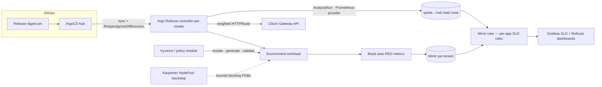
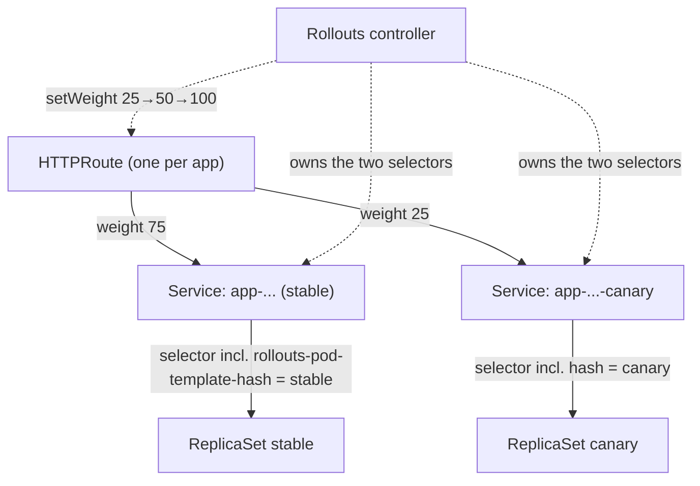

# Zero-downtime deployments — architecture

How the platform delivers application changes without dropping traffic and without exposing all users
to a bad version. This is the architecture reference; the audience-facing explanations are
[for developers](../guides/zero-downtime/overview-developers.md) and
[for platform engineers](../guides/zero-downtime/overview-platform.md).

## Goal & approach

Two independent properties, delivered as two layers on the shared admission + GitOps substrate:

- **Continuity under disruption** — pods drain gracefully and never all vanish at once, through
  restarts, node consolidation, upgrades, and scaling. *(ADR-085, the `policy` module.)*
- **Safe change** — production changes shift in gradually, are gated on live SLO metrics, and reverse
  automatically on harm. *(ADR-056, Argo Rollouts.)*

The first is **always on** and independent of deploys; the second governs deploys specifically. A
production change benefits from both at once.

## Component model

## Traffic-shifting mechanics (the canary)

A canary keeps **both** versions receiving real traffic and moves the dial. There is no service mesh —
the split is **L7 weighted `backendRefs`** on the app's existing Cilium-Gateway HTTPRoute (ADR-056 D4).

- Each canary-ed app has a **stable** and a **canary** ClusterIP Service, both weighted backends of
  its single HTTPRoute. The controller injects the `rollouts-pod-template-hash` into each Service's
  selector to point it at the right ReplicaSet.
- `setWeight` steps (25 → 50 → 100) edit the HTTPRoute `backendRefs[].weight`; Cilium honours them.
- **Blue-green** is the same minus the plugin: a single Service whose selector is *swapped* from old
  to new after a health check — a clean instant cutover, **zero** traffic to a bad version.

Because the controller owns the Service selectors and the route weights at runtime, the tenant
ArgoCD Application must run with **`ServerSideApply=true`** and `ignoreDifferences` keyed on
**`managedFieldsManagers: ["rollouts-controller"]`** (and `["cilium-operator-generic"]` for the
HTTPRoute) **and** set `RespectIgnoreDifferences=true` (#894). Under client-side apply ArgoCD would
fight the rollouts-controller's co-owned `spec` fields and show a false empty-diff `OutOfSync`; SSA +
the managed-fields ignore is what lets the two field managers coexist. Without `RespectIgnoreDifferences`
an unrelated sync still stomps them mid-rollout — see the
[platform internals](../guides/zero-downtime/overview-platform.md#the-argocd-integration--the-one-gotcha-that-bites).

## Deploy lifecycle

A merge becomes a gated, reversible rollout. The full sequence (freeze → weighted steps → analysis →
promote/abort) is diagrammed in the
[developer overview](../guides/zero-downtime/overview-developers.md#how-a-production-deploy-actually-flows).
Two gates run, answering different questions — *"is the service healthy enough to deploy?"* (pre-flight
**freeze**) and *"is the new version healthy?"* (background **metric gate**, auto-rollback) — detailed
in the [two-gates section](../guides/zero-downtime/overview-platform.md#the-two-gates).

## Metric & data flow

`Beyla` auto-instruments every workload (RED metrics, no app changes) → `Mimir` (per-tenant, the spoke
remote-writes to the hub) → the **Mimir ruler** evaluates per-app **Sloth-style SLO recording rules**
producing `slo:current_burn_rate:ratio` and SLI ratios → `AnalysisRun`s (Rollouts' Prometheus
provider) query them over the **spoke→hub read route**. Grafana reads the **federated** `mimir-all`
datasource so the SLO and Rollouts dashboards span both clusters.

## Decision map

| Decision | Where | ADR |
|---|---|---|
| Graceful drain, PDB, topology spread, prod replica floor | `policy` module (Kyverno mutate/generate/validate) | [085](../adrs/085-workload-availability-graceful-disruption-defaults.md) |
| Karpenter NodePool drain backstop | `karpenter` module | [085](../adrs/085-workload-availability-graceful-disruption-defaults.md) D5 / [078](../adrs/078-cluster-elasticity-karpenter.md) |
| Argo Rollouts for every workload; strategy by stage | `argo-rollouts` module + scaffolder `deployStrategy` | [056](../adrs/056-progressive-delivery-and-safe-rollback.md) D1–D3 |
| L7 weighted-HTTPRoute canary (no mesh) | Gateway-API trafficrouter plugin | [056](../adrs/056-progressive-delivery-and-safe-rollback.md) D4 |
| Metric gates from Beyla→Mimir; SLOs; error-budget velocity | `observability-mimir` / `observability-slo` | [056](../adrs/056-progressive-delivery-and-safe-rollback.md) D5–D6, [054](../adrs/054-platform-resilience-and-business-continuity.md), [077](../adrs/077-application-instrumentation-strategy.md) |
| Separation of duties for the (deferred) regulated gate | — | [049](../adrs/049-tenant-model-team-tenant-zone.md) |
| ArgoCD `ServerSideApply=true` + `ignoreDifferences` (`managedFieldsManagers`) + `RespectIgnoreDifferences` | `argocd-apps/delivery.tf` | [056](../adrs/056-progressive-delivery-and-safe-rollback.md) as-built (#894) |

## As-built status

**Live on both clusters:**

- Availability defaults (ADR-085) — drain, PDB, topology spread, replica-floor validate, Karpenter
  backstop. The replica-floor is **Enforce** on both clusters (a single-replica prod deploy is rejected
  at admission), flipped from audit-first after a clean review ([#844]).
- Rollouts-everywhere, canary **and** blue-green, on the same controller.
- Gateway-API weighted canary (Cilium honours `backendRefs` weights; proven 50/50 split + promote).
- **W8c** background metric gate with **automatic rollback** (proven live: healthy canary promoted; a
  forced-bad canary auto-rolled-back).
- Per-app SLOs in the Mimir ruler + the **W11 error-budget freeze** (live on alpha-shop prod).
- SLO + Argo Rollouts Grafana dashboards; the per-cluster SSO'd Rollouts web UI.

**Deferred:** **W10** regulated-tier manual-approval gate (deployer ≠ approver) → the compliance-tier
work ([#908]). Smarter dashboard default-namespace ([#926]); platform web UI is empty until platform
runs rollouts ([#927]).

## Key tradeoffs

- **No mesh** — L7 canary is replica-weighted at the gateway, not request-shaped; east-west canary is
  out of scope (revisited in [ADR-057](../adrs/057-service-identity-and-east-west-zero-trust.md)).
- **Per-cluster controllers** — the operator UI is per-cluster; the single pane is Grafana, not the
  native UI.
- **Metric gates need the read path** — a spoke must be able to *read* Mimir, not just write; the gate
  runs where the rollout's cluster can read.

[#844]: https://github.com/asanexample/platform/issues/844
[#908]: https://github.com/asanexample/platform/issues/908
[#926]: https://github.com/asanexample/platform/issues/926
[#927]: https://github.com/asanexample/platform/issues/927
