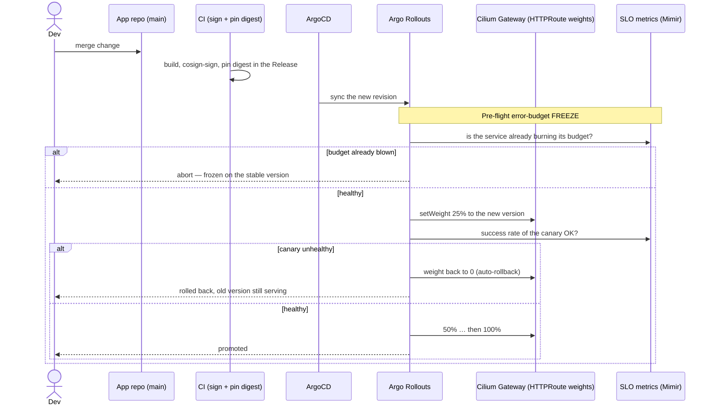

# Zero-downtime deployments — for developers

You deploy by merging a change; CI signs an image and pins the digest; ArgoCD rolls it out. This page
explains **what the platform does for you** so that roll-out doesn't drop traffic — and the **few
things that are still your job**.

> TL;DR — almost all of it is automatic. The one thing you must do yourself is **handle `SIGTERM`**
> (stop accepting work, finish in-flight requests, exit). Everything else is injected or generated.

## What's automatic (you do *not* write any of this)

When your workload lands in an environment namespace, Kyverno injects and generates the
availability machinery for you ([ADR-085](../../adrs/085-workload-availability-graceful-disruption-defaults.md)):

| Injected/generated for you | What it does |
|---|---|
| `lifecycle.preStop.sleep` (10s) + `terminationGracePeriodSeconds: 30` | On shutdown, the pod keeps serving for a beat while the load balancer stops sending it new connections — so a restart never races traffic into a dying pod |
| A **PodDisruptionBudget** (`maxUnavailable: 1`) | Node consolidation, cluster upgrades, and drains can't evict all your replicas at once |
| **`topologySpreadConstraints`** (zone + node) | Your replicas land on different nodes/zones, so one node or AZ event can't take them all |
| The **canary rollout** itself (in prod) | Your change is shifted in gradually and watched — see below |

You'll see these appear on your running resources even though they're not in your `k8s/` manifests —
that's expected.

## What's yours

| Your responsibility | Why |
|---|---|
| **Handle `SIGTERM`** | The injected `preStop` sleep only buys the window for the network to stop sending new traffic. *Draining in-flight work* — finishing requests, closing listeners, sending `GOAWAY` on long-lived gRPC/websocket streams — is something only your app can do |
| **Keep `replicas >= 2` in prod** | A single replica can never be zero-downtime (restart it and it's gone). Prod namespaces enforce a floor of 2; set an HPA `minReplicas: 2` or `replicas: 2`. Lower stages can stay at 1 for cost |
| **Pick a deploy strategy** (optional) | The scaffolder's `deployStrategy` chooses **canary** (default — gradual weighted shift) or **blue-green** (all-at-once cutover after a health check). Both are zero-downtime; canary limits blast radius, blue-green gives a clean instant switch |
| **Your SLO** (optional) | Every prod environment gets a default **99.9% availability** SLO from its HTTP metrics, which the gates below use. You don't have to author it |

## How a production deploy actually flows

Two independent safety gates run on every prod canary, and they answer different questions:

- **Error-budget freeze** (pre-flight): *"Is the service healthy enough to deploy at all?"* If it's
  already burning through its error budget, the deploy is **frozen** before any traffic shifts.
- **Metric gate** (during the canary): *"Is the new version healthy?"* It watches the canary's live
  success rate and **rolls back automatically** if it degrades.

So a bad change is caught *coming in* (freeze) and *going out* (rollback), and either way your users
keep hitting the working version.

## Watching your rollout

- **Grafana → "Argo Rollouts" dashboard** — status, replicas, analysis-run (gate) results across both
  clusters. **Grafana → SLO dashboard** — your burn rate + error budget.
- **The Rollouts web UI** — `https://rollouts.preprod.aws.refplat.org` (your app rollouts;
  Tailscale + SSO). Live canary progression and manual promote/abort.
- **CLI** — `kubectl argo rollouts get rollout <app> -n <team>-<product>-prod --watch`.

## Gotchas

- **One replica ≠ zero-downtime.** With a single replica there's nothing to fail over to. Prod
  requires ≥ 2.
- **`SIGTERM` is on you.** If your app ignores it, in-flight requests are cut at the
  `terminationGracePeriodSeconds: 30` deadline. Drain explicitly.
- **Long-lived connections** (websockets, gRPC streams) won't drain on their own — add app-level age
  limits / `GOAWAY`.
- **A "stuck" canary is usually working.** A prod canary pauses between steps and waits on the metric
  gate — that's the system protecting you, not a hang.

## See also

- [How it works under the hood](overview-platform.md) (platform internals)
- [Architecture](../../architecture/zero-downtime-deployments.md)
- The `authoring-k8s-workloads` guidance for writing compliant environment manifests
