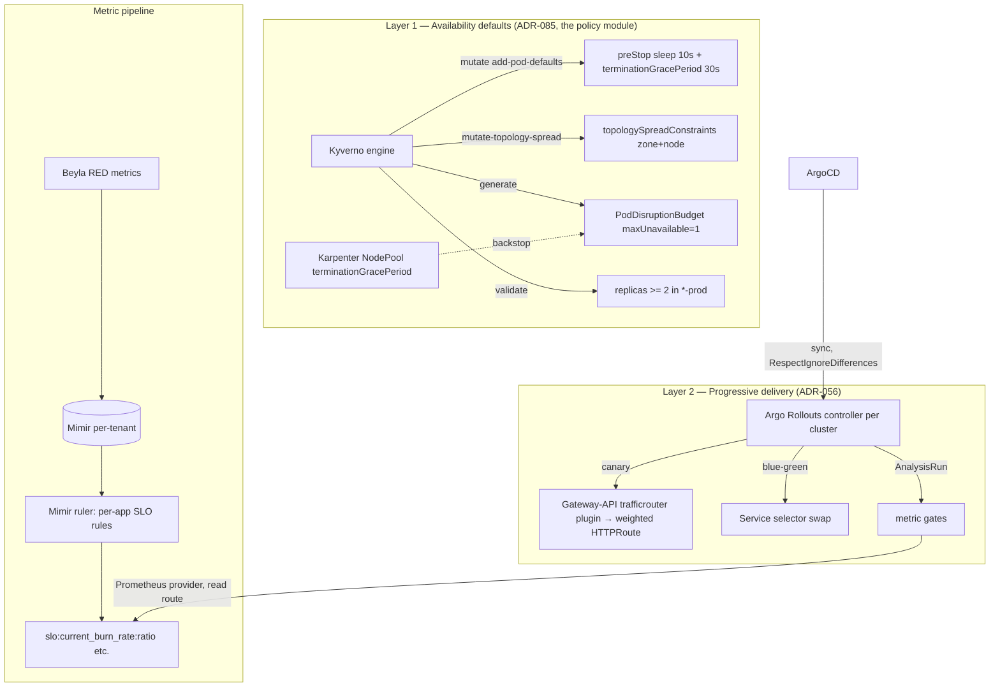
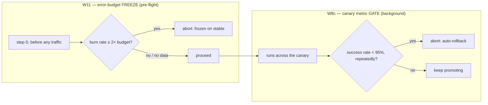

# Zero-downtime deployment internals — for platform engineers

Zero-downtime here is two layers stacked on the same admission + delivery substrate. This page is the
mechanism, component by component. For the "why," see [ADR-085](../../adrs/085-workload-availability-graceful-disruption-defaults.md)
and [ADR-056](../../adrs/056-progressive-delivery-and-safe-rollback.md); for diagrams + the decision
map, the [architecture doc](../../architecture/zero-downtime-deployments.md).

## The two layers

## Layer 1 — availability defaults (ADR-085)

All four mechanisms live in the **`policy`** module as Kyverno rules, applied to every environment
namespace (`<team>-<product>-<stage>`). They are **paved-by-default and mostly invisible** — tenant
manifests carry none of them.

- **Graceful draining — `mutate`.** The `add-pod-defaults` rule (the same add-if-absent
  strategic-merge patch that injects `securityContext`/`automountServiceAccountToken`) adds a
  container `lifecycle.preStop.sleep.seconds: 10` (native **`SleepAction`**, GA on K8s 1.35 — no shell,
  no extra binary) and a pod `terminationGracePeriodSeconds: 30`. The sleep holds the pod serving
  while Cilium deprograms its datapath endpoint, so traffic stops arriving *before* the container
  exits. **It does not drain in-flight work — that's the app's `SIGTERM` handler.**
- **Topology spread — a separate `mutate`.** `mutate-topology-spread` matches the **controller**
  (Deployment/StatefulSet) directly, because a spread constraint's `labelSelector` must match the
  pod's labels; injecting it into the pod template at the same time as the PDB selector would race.
  Soft zone + node spread, selector derived from the workload.
- **PodDisruptionBudget — `generate`.** A Kyverno `generate` rule fires on
  `Deployment`/`StatefulSet` in env namespaces and creates a PDB with **`maxUnavailable: 1`**, GC'd
  with the workload. `maxUnavailable` (not `minAvailable`) is mandatory: a `minAvailable`/percentage
  PDB on a single replica permits **zero** evictions and **hangs `kubectl drain`, EKS upgrades, and
  Karpenter consolidation forever**. The selector is derived from the trigger workload (the
  Composition can't build a matching selector — ADR-085 D3).
- **Replica floor — `validate`.** `replicas >= 2` enforced **only** in `*-prod` namespaces (the
  `namespace-governance` name-glob), and **validated, never mutated** — mutating `replicas` would
  fight the HPA (ADR-078). Lower stages stay at 1 for cost.
- **Karpenter backstop — D5.** The NodePool's `spec.template.spec.terminationGracePeriod` bounds how
  long *any* blocking PDB (or `do-not-disrupt` pod) can stall voluntary disruption before Karpenter
  forcibly drains. Prevents a stuck workload from wedging node lifecycle.

Together these make node consolidation / upgrades / parking non-disruptive **independently of**
whether a deploy is happening.

## Layer 2 — progressive delivery (ADR-056)

- **Argo Rollouts, per cluster (D1, D7).** A platform addon (`argo-rollouts` module), one controller
  **per cluster** — it mutates ReplicaSets/Services/HTTPRoutes in-cluster, so it must be local to the
  workloads (unlike ArgoCD, which is one hub managing both clusters). Every environment workload is a
  `Rollout`, all stages.
- **Direct-template Rollouts + first-class admission (D2).** Rollouts carry the pod template directly
  (no referenced Deployment). The `policy` module's availability rules and the workload policies match
  the **`Rollout`** kind as a first-class pod controller — a Kyverno rule naming a kind with no CRD
  fails to create, so the argo-rollouts CRDs must land **before** the `policy` unit (the DAG enforces
  it).
- **Strategy by stage, not per-app (D3).** dev/test/preprod = a **trivial auto-promoting canary**
  (`setWeight: 100`, no analysis); **prod/standard** = a **stepped canary** (25 → 50 → 100) with the
  metric gates + auto-rollback. Shaped by the scaffolder's `deployStrategy` (canary | blue-green).
- **L7 canary via Gateway API (D4).** No mesh. The
  [argoproj-labs Gateway-API trafficrouter plugin](https://github.com/argoproj-labs/rollouts-plugin-trafficrouter-gatewayapi)
  drives **weighted `backendRefs`** on the app's single HTTPRoute (Cilium 1.19 honours them). Each
  canary-ed app has a **stable + canary Service** (both ClusterIP); the controller injects the
  `rollouts-pod-template-hash` into their selectors. **Blue-green** needs no plugin — it's a pure
  Service-selector swap, and gives a *stronger* guarantee (a bad version gets **zero** prod traffic).
- **Metric gates from Beyla → Mimir (D5).** No per-app instrumentation: **Beyla** auto-emits RED
  metrics per workload → **Mimir** (per-tenant). Per-app **SLO recording rules** run in the **Mimir
  ruler** (preprod tenant) and produce `slo:current_burn_rate:ratio` + the SLI ratios.
  `AnalysisTemplate`s query Mimir's **Prometheus provider** over the **spoke→hub read route** (a spoke
  is write-only by default; the read route is wired in `observability-mimir`). The gate runs where the
  *rollout's cluster can read Mimir*.

### The two gates

| | **W8c — canary gate** | **W11 — error-budget freeze** |
|---|---|---|
| Question | is the *new version* healthy? | is the *service* healthy enough to deploy at all? |
| When | background, across the canary | one-shot, pre-flight (step 0) |
| Signal | canary success rate (Beyla RED) | `slo:current_burn_rate:ratio` (30-day SLO) |
| Trips → | **roll back** the bad version | **freeze** — don't deploy now |
| Status | live | live |

**W10** (regulated-tier manual approval, deployer ≠ approver, ADR-049) is **deferred** to the
compliance-tier work ([#908](https://github.com/asanexample/platform/issues/908)).

### Error budgets gate velocity (D6)

The per-app SLO produces a burn rate; the freeze gate turns "you're over budget" into "you can't ship
risky change right now," automatically. The SLO rules + dashboards are in `observability-mimir` /
`observability-slo` (Sloth-style multi-window burn-rate rules; the SLO Grafana dashboard reads the
federated `mimir-all` datasource so it spans both clusters).

## The ArgoCD integration — the one gotcha that bites

The Rollouts controller mutates two fields at runtime that ArgoCD `selfHeal` will otherwise revert
**mid-rollout**, fighting the canary:

- the **Service `.spec.selector`** (the injected `rollouts-pod-template-hash`), and
- the **HTTPRoute `backendRefs[].weight`** (the plugin's canary weights).

So the tenant Application sets `ignoreDifferences` on both **and** —
**critically — `RespectIgnoreDifferences=true` in `syncOptions`.** `ignoreDifferences` *alone is not
enough*: without `RespectIgnoreDifferences`, a sync triggered by any *other* change still stomps those
fields. (This was found in prod; the offline spikes couldn't surface it.) Wired in
`argocd-apps/delivery.tf`.

## Cross-cluster shape

- **Controllers + the web UI are per-cluster.** Each cluster's Rollouts controller drives its own
  rollouts; each cluster gets its own SSO'd web UI (`rollouts.aws.refplat.org` = platform,
  `rollouts.preprod.aws.refplat.org` = preprod app rollouts).
- **The cross-cluster *view* is Grafana.** Both controllers' metrics land in Mimir (platform +
  preprod tenants); the Grafana "Argo Rollouts" dashboard reads the **federated** datasource, so it
  shows rollouts from both clusters in one pane. The native UI is the per-cluster operator console.

## Operate / extend (pointers — runbooks are a planned follow-on)

- Verify a workload is paved: `kubectl get rollout,pdb,svc -n <ns>` — you should see the PDB, the
  stable+canary Services, and (prod) the analysis on the canary steps.
- A metric gate returning **no data** usually means the spoke→hub Mimir **read path** is down (we hit
  a post-unpark query-frontend degradation once) or the SLO rules aren't syncing into the ruler.
- Tuning the availability defaults, adding a new analysis gate, or onboarding a per-app SLO are
  `policy` / `observability-mimir` / scaffolder changes — see ADR-085 / ADR-056 and the
  `kyverno-policy-authoring` + `observability-authoring` guidance.
