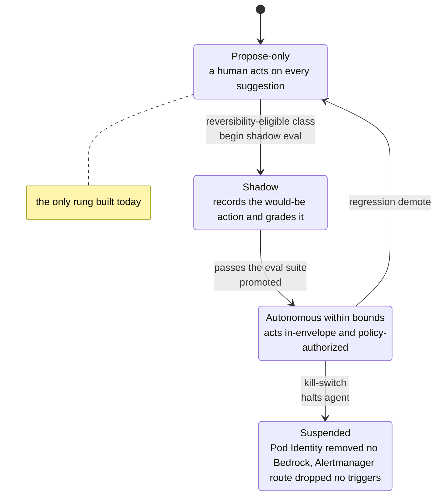

# Learn: The Agentic Platform — autonomy & evaluation (deep dive)

An agent on this platform is an `XAgent` claim, boxed in on four axes, and today it is strictly
**propose-only**. This dive is about the one hard question that raises: how an agent could earn the right to
act — and why almost none of that machinery exists yet. The ladder is a drawing; the only rung that's been
built is a tape recorder.

## The honest headline

Everything below describes a design. [ADR-086](../../adrs/086-autonomous-agent-access.md) — which specifies
how autonomy would work — carries the status header **"Proposed (draft / sketch — 2026-06-27)"**, and it
means it. The grader doesn't exist. The reversibility registry doesn't exist. The action-time policy engine
doesn't exist. The `autonomy.mode` field in the live API is schema-locked so it *cannot express* anything but
propose-only. There is exactly one shipped artifact in this whole topic, and it governs nothing: a hardened
S3 bucket that records incidents so that someday, if the rest gets built, there's a corpus to grade against.

So this dive has two halves, and confusing them is the trap: **the design** (what earning autonomy would look
like) and **the one built piece** (the capture substrate). The line between them stays loud, because this is
the easiest area in the platform to oversell.

## Why the floor isn't the ceiling

Propose-only is safe and it's real: a fully hijacked triage agent can, at worst, post an ignored Slack
message. But a suggestion-only agent can't *auto-remediate* — restart a wedged pod at 3 a.m., scale to absorb
load, roll back a bad deploy — the cases where waiting for a human to click approve defeats the point of
having the agent. ADR-086 opens with the two wrong answers to that: **propose-only forever** (safe, but caps
the platform's value) and **give a trusted agent broad `operate`** (powerful, but a prompt-injected agent
holding standing operate is the single worst case in the system). The design lives in the narrow middle.

One reframe carries the whole philosophy:

> **"More permissive" must not mean "fewer guardrails." It means moving the guardrail from a
> human-in-the-loop to a *machine-enforced* bound. Safety doesn't decrease; it changes shape.**

A person approving each action is one kind of guardrail. A policy authorizing each action against tight,
reversible, proven bounds is another. The design swaps the first for the second on carefully chosen actions —
it never removes the rail.

## The design: autonomy is graduated, per-class, earned, and machine-bounded

The core decision (ADR-086) is a single sentence, and each adjective does work:

> Autonomy is **graduated, per-action-class, earned, and machine-bounded — never a global property of an
> agent.**

There is no "autonomous agent." There is *this agent, autonomous on this one action-class, because it earned
it, within these machine bounds.* An agent can be autonomous on "restart a pod" and still strictly
propose-only on everything else at the same time.

Think of a graduated driver's license. A new driver earns privileges one skill at a time — learner's permit
(supervised) → provisional (measured) → full — and a violation **demotes** them. Where it breaks: a license
is a property of the *person*; here it's per-*maneuver*. You can be fully licensed to change lanes and still
hold a learner's permit for the freeway, on the same trip, enforced separately each second.

The ladder for a single action-class — the floor is real today; every rung above it is design:



### The five conditions — all must hold

An agent may act autonomously on an action-class **only when every one** of these is true; miss any and the
action falls back to propose-and-gate (the propose-only path, unchanged):

1. the class is inside the agent's **explicit capability envelope** (an allow-list, not "operate");
2. the class is **reversible or bounded-impact** — this is the *license* for autonomy;
3. each action is **authorized by machine policy at action-time**, against the envelope, the live-caller
   intersection, and the reversibility classification;
4. the agent is within its **rate / budget / circuit-breaker** limits;
5. the agent has **earned** autonomy on that class through evaluation (shadow → proven → promoted).

Two of these deserve unpacking — they're the parts most likely to be built wrong.

### The reversibility registry — the crux, and it's platform-owned

The hardest, most safety-critical piece is deciding *which action-classes are even eligible*. ADR-086 puts
this in a **platform-owned classification registry** — never author-set, never agent-set — that classifies
each class by reversibility × blast radius:

- **reversible / self-limiting** → autonomy-eligible: restart a pod, scale within bounds, roll back to a
  known-good, requeue a stuck message;
- **irreversible / unbounded** → **never** autonomous: delete data, mutate prod config or secrets, widen
  access, spend money.

The design's own stated dominant risk is **misclassification** — an autonomous agent does machine-speed
damage before a human notices — so the rule is **conservative-by-default**: a class is eligible *only by
explicit listing*, reviewed like policy. "We forgot to classify it" resolves to "not eligible," which is the
safe direction.

### The action-time decision lives at the trusted boundary, not a central engine

Condition 3 is a deliberate architectural stance. Each autonomous action is authorized *before it executes*
by a **policy decision at the action boundary** — the trusted code that actually holds the capability — not a
central policy engine the agent calls out to. A central decision point the agent queries is one the agent (or
an injection riding it) can try to *talk past*; keep the check at the boundary that owns the capability and
the code that would do the thing is the code that refuses — no "may I?" round-trip to spoof. A deny doesn't
error; it **degrades to propose + human gate**, the behavior you have today.

The capability envelope itself is a spec field the design adds to the agent — each entry
`(action-class, target-scope, mode)` where `mode ∈ {propose, autonomous}`, Kyverno-validated, and
`autonomous` admissible *only* for a registry-reversible class. Changing it is a gated, elevated-review PR,
because the envelope is a control surface, not config.

## The status, verified against the code

Now the primary sources, because the design above reads as if it exists and it does not.

**The API physically cannot express autonomy.** In the `XAgent` XRD
([`xagent-xrd.yaml`](https://github.com/asanexample/platform/blob/main/infra/modules/crossplane/charts/agent-api/templates/xagent-xrd.yaml)),
the `autonomy.mode` field is an enum with exactly one member:

```yaml
mode:
  type: string
  enum: ["propose-only"]
  default: propose-only
```

There is no `autonomous` value to set. This isn't a policy that could be relaxed at runtime — the schema
itself refuses the word. The temptation to set `autonomy.mode: autonomous` is answered by the OpenAPI
validator, not by a human reviewer.

**The two sibling fields are theatre, honestly labelled.** `maxConcurrent` (default `4`) and `tokenBudget`
sit right beside `mode`, and the XRD's own description says they are **"informational to the Composition,
enforced by the agent."** They are *not* a platform-level circuit breaker — the Composition doesn't wire them
to anything that can halt the agent. The design (ADR-086 §"circuit breakers, budgets, rate limits") wants a
real breaker that trips and falls back to the gated path; what exists is a hint the agent's own code may
honor. Believe the description, not the field name.

**The grader, registry, and policy engine are all unbuilt** — and ADR-086 says so in its own Consequences:
*"the grader, reversibility registry, and action-time policy remain unbuilt."* The whole thing is gated on an
**eval-as-a-service** that doesn't exist.

**There is one inert artifact worth knowing about.** The "Triage Agent" dashboard
([`agent-triage.json`](https://github.com/asanexample/platform/blob/main/infra/modules/observability/dashboards/agent-triage.json))
carries a panel titled *"Autonomy actions — shadow vs promoted (file-ticket)"* that graphs
`agent_autonomy_actions_total` by `class`, `mode`, and `decision`. It's the shadow-vs-promoted graduation
signal made visible — and **nothing emits that metric.** It's a dial wired to a sensor nobody installed. Even
the *example* class in the title is `file-ticket`, a low-stakes reversible action, not "remediate prod" — the
design's conservatism shows even in the mock.

## The one thing that's real: the forward-capture substrate

Here's the built piece, and it's good engineering precisely *because* it does so little. Merged as **#1074**
(2026-07-01), it's the module
[`agent-eval-store`](https://github.com/asanexample/platform/blob/main/infra/modules/aws/agent-eval-store/main.tf)
plus its live unit, standing up a single S3 bucket: **`platform-agent-eval-corpus`**. It captures real triage
episodes as fixtures — `{alert-group, telemetry snapshot, structured label, rubric}` — and does **nothing
else**. It captures; it does not grade.

### Why build the recorder before the examiner exists

Think of a flight-data recorder installed before the plane is certified for autopilot. You run the black box
on every human-flown flight *now* — not because autopilot is coming next week, but because the moment you *do*
want to certify it, you'll need thousands of real flights on tape, and you cannot record a flight that already
landed.

The concrete reason is telemetry retention. Metrics, logs, and traces **age out fast**. An incident you don't
snapshot *at the moment it fires* is gone — you cannot reconstruct "what did the cluster look like when this
alert triggered" a month later. So an eval corpus **cannot be built retroactively**; it has to be captured
forward, always-on, at incident time. Build the pipeline, not a corpus — the bucket is the front of a pipeline
that fills itself.

### The hardening — read it as "this holds sensitive data forever and gets fed to an LLM"

Because the corpus holds potentially-sensitive telemetry **forever** and is later **replayed into a model**,
the module ([`main.tf`](https://github.com/asanexample/platform/blob/main/infra/modules/aws/agent-eval-store/main.tf))
is locked down hard. Every one of these is in the code:

- **TLS-only** — a `DenyInsecureTransport` bucket policy denying `s3:*` when `aws:SecureTransport` is false;
- **full public-access block** — all four of `block_public_acls` / `block_public_policy` /
  `ignore_public_acls` / `restrict_public_buckets` set true;
- **versioning enabled** — no silent overwrite;
- **write-once integrity** — the writer is granted `s3:PutObject`/`s3:GetObject` and pointedly **no
  `s3:DeleteObject`**; a captured fixture can't be un-captured (Object Lock/WORM is wired as a `seam` —
  `object_lock_enabled` — but deferred);
- **SSE-S3 by default, upgradable to a CMK** via `use_kms_cmk` — wired at the unit to
  `high_availability` (the cost profile), so dev/cost runs plain SSE-S3 and prod/regulated gets a dedicated
  rotating key.

### The write grant lives in the *agent's* claim, not the bucket

This detail is worth stealing. The agent's permission to *write* to the corpus is identity-based, in its own
`XAgent` claim —
[`triage-copilot.yaml`](https://github.com/asanexample/platform/blob/main/gitops/agents/triage-copilot.yaml)
carries `awsPermissions.policyStatements` with `WriteEvalCorpus` (PutObject/GetObject on the bucket ARN) and
`UseEvalCorpusKey` — **not** in the bucket's resource policy. The reason is a chicken-and-egg: the Composition
*mints* the agent's Pod-Identity role ARN, so it isn't known when you're writing the bucket's Terraform.
Granting from the identity side (the claim) instead of the resource side (the bucket) sidesteps that entirely
— the bucket name is deterministic, so the claim can name it, and the role grants itself access when the
Composition creates it.

The KMS statement in that claim uses `resources: ["*"]`, which looks alarming and isn't — it's
**doubly-gated**. A `kms:*`-style identity grant is only *effective* on keys whose **own** key policy enables
IAM delegation (the `EnableIAMUserPermissions` root-enable statement), and the only key in the account that
does that is the corpus CMK. Under the SSE-S3 (dev) profile there's no CMK at all, so the whole statement is
**inert**. Broad-looking, tightly-bounded.

## The eval loop this feeds (the metrics live next door)

The corpus is only half the evaluation story. The other half is the **online signal** already flowing from
the live triage agent, and the mechanism is cheap: the Slack triage card carries **accept / correct /
dismiss** buttons, and the human's click *is* the eval label. Each verdict increments
`triage_feedback_total{verdict, triage_disposition}`, and the "Accept-rate by disposition" panel divides
accepts by all verdicts *per disposition* — the **calibration** signal. (The dispositions are
`confident_lead` / `weak_leads` / `insufficient_evidence`; a low accept-rate on `confident_lead` means the
agent is over-confident.) Those metrics belong to
[Agent observability](../observability/deep-dive-agent-observability.md).

The corpus and the online signal combine into a would-be regression suite. The bootstrap is **fault
injection**: deliberately break something in a walled-off preprod namespace, snapshot the telemetry into a
**frozen, graded fixture** — fault injection has a *known* culprit, which is how you manufacture an answer key
where none exists in nature. Add production-shadow episodes over time and you can **replay the whole set as a
CI regression suite on every prompt, model, or tool change**. The grading is set-membership scoring —
**top-1 / top-3 culprit-service**, **failure-class accuracy**, and the strict gate **change-attribution** —
each replayed `k` times with a **`pass^k` consistency** check that fails on flapping (right 6 times in 10 is
not "promoted"). Calibration is scored too, not just correctness: a correct *abstention* is rewarded; a
confident-but-wrong root cause is scored *worse* than admitting uncertainty. Feasibility was proven by a spike
on **2026-06-24/25** on a **12-fixture corpus** — result **GO** — which is exactly why the capture substrate
got built. But "GO on feasibility" is not "grader shipped"; the grader still lives in the backlog.

## Where the whole thing actually sits today

Strip away the design and here's the floor you're standing on: **every agent is pinned at tier-0
propose-only, enforced by the *absence of capability* — the enum lock — not by policy that could be
toggled.** The human is the entire governance layer: the agent proposes, a human acts, and on low-confidence
evidence the agent is *designed* to abstain and page rather than bluff. That's not a placeholder for the
ladder; it *is* the safety model until eval-as-a-service exists to justify anything else.

## Gotchas that teach

- **"The autonomy panel is on the dashboard, so autonomy must be live."** No — the panel graphs a metric
  (`agent_autonomy_actions_total`) that nothing emits. A dashboard is a *question*, not an *answer*; this one
  is asking a question no code has answered yet. Verify the emitter, not the dashboard.
- **"`maxConcurrent` / `tokenBudget` are the circuit breaker."** They're **informational to the
  Composition** — the XRD says so. The design *wants* a platform breaker that halts the agent; what's built is
  a hint the agent may self-honor. Don't mistake a documented intention for an enforced bound.
- **"I'll grant the corpus write in the bucket policy."** That reintroduces the chicken-and-egg the design
  avoided — the Composition mints the agent's role ARN, so the bucket can't name it at apply time. The write
  lives in the *agent's claim* (identity-side) on purpose. Copy that pattern for any Composition-minted
  principal.
- **"`resources: [\"*\"]` on KMS is a hole."** It's doubly-gated and inert under SSE-S3. A broad *identity*
  grant only bites on keys whose *own* policy delegates to IAM — here, only the corpus CMK. Read both sides of
  a KMS grant before calling it wide.
- **"Autonomy is a setting we'll flip when we trust the agent."** It's not a global switch and never will be —
  it's per-action-class, earned per class, and gated on a reversibility classification the *platform* owns.
  "Trust the agent" is exactly the thing the design refuses to rely on.

## Go deeper

- [ADR-086](../../adrs/086-autonomous-agent-access.md) — the autonomy design in full (Proposed): the five
  conditions, the reversibility registry, the action-time boundary, the graduation ladder.
- [ADR-080](../../adrs/080-triage-copilot.md) — the reference agent and, in D6/D10/D11, the eval mechanism:
  fault-injection oracle, `pass^k`, calibration scoring, and the accept/correct/dismiss feedback capture.
- [ADR-074](../../adrs/074-agentic-workloads-platform.md) — the substrate ADR-086 extends; the `auto-policy-gate`
  seam it leaves open.
- The built substrate:
  [`agent-eval-store/main.tf`](https://github.com/asanexample/platform/blob/main/infra/modules/aws/agent-eval-store/main.tf)
  · its [live unit](https://github.com/asanexample/platform/blob/main/infra/live/aws/platform/us-east-1/platform/agent-eval-store/terragrunt.hcl)
  · the enum lock in
  [`xagent-xrd.yaml`](https://github.com/asanexample/platform/blob/main/infra/modules/crossplane/charts/agent-api/templates/xagent-xrd.yaml)
  · the eval write-grant in
  [`triage-copilot.yaml`](https://github.com/asanexample/platform/blob/main/gitops/agents/triage-copilot.yaml).
- Sibling reading: the [agentic orientation](orientation.md) for the whole picture, and
  [Agent observability](../observability/deep-dive-agent-observability.md) for the feedback/calibration
  metrics this dive deliberately doesn't re-teach.
- External, verified: the [NIST AI Risk Management Framework](https://www.nist.gov/itl/ai-risk-management-framework)
  (NIST; the govern/map/measure/manage frame this "earn autonomy by measured reliability" design instantiates;
  ~20 min) and [AWS Bedrock's security & IAM reference](https://docs.aws.amazon.com/bedrock/latest/userguide/security-iam.html)
  (how the agent's model-invocation grant is scoped; ~10 min).
