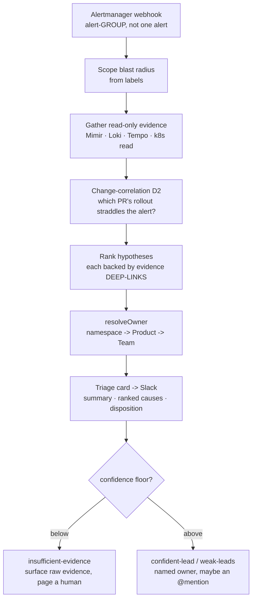

# Learn: The Agentic Platform — the triage copilot (deep dive)

The platform runs one live agent, and it exercises the whole agentic model end to end: an alert hits a
webhook, evidence gets gathered, a triage card lands in Slack, and someone gets pinged. This follows that
agent through the loop. The frame to keep in mind is that an agent here is a contractor you don't trust —
bounded by its badge, allowed to propose but never act. Every claim below is traceable to the real claim,
Composition, and ADRs.

## What's verified, and what isn't

Everything here is checked against primary source: the `XAgent` claim
([`gitops/agents/triage-copilot.yaml`](https://github.com/asanexample/platform/blob/main/gitops/agents/triage-copilot.yaml)),
the agent Composition, the XRD schema, the platform `Team` / `Product` registries, the observability
dashboard JSON, and [ADR-080](../../adrs/080-triage-copilot.md) / [ADR-084](../../adrs/084-platform-identity-directory-and-owner-resolution.md).
Where a thing is designed but not built, or where I couldn't live-verify, I say so. The hub cluster is
parked this session, so nothing here was confirmed by `kubectl` — it's read off code, ADR status headers,
and git history. The agent's own loop code (Go) lives in a separate app repo
(`asanexample/platform-triage-copilot`); this infra repo defines the claim, runtime, identity-directory
backend, and observability, so a few loop internals below come from the ADR's as-built notes rather than
code in front of me.

## The job, in one line

> **Shorten the time from "an alert fired" to "a human knows where to look, and who owns it."**

That's the entire mandate ([ADR-080](../../adrs/080-triage-copilot.md), D1). It does not fix anything. It
reads and proposes; a human acts. Two everyday roles cover it, and the whole agent falls out of them:

- **A triage nurse.** Reads the vitals, ranks who's sickest, flags the doctor with a one-line summary and
  the chart — and does not operate. Her value is the ranking and the handoff, not the scalpel.
- **A dispatcher.** Looks up who owns the call and rings the on-call — and does not drive the truck.

> **Where the metaphor breaks:** a real nurse can, in extremis, start CPR — she has hands. This agent has
> none. "Never remediates" isn't professional restraint it might abandon under pressure; it's the literal
> absence of any write/exec/remediation permission in its identity (D4). A perfectly hijacked triage
> copilot still can't touch production, because there is no tool wired in that could. Autonomous trigger,
> never autonomous action — that distinction is the single most important fact in this module.

## The loop, traced end to end

An alert fires. Here's the whole path, each step tied to its ADR clause.



**1 — Trigger, and the unit of work.** The trigger is an Alertmanager webhook
(`spec.trigger.kind: alertmanager-webhook`). The subtlety that matters (D9): the unit of triage is the
Alertmanager *alert-group*, not the individual alert. A cascade that trips 20 alerts arrives as one grouped
notification → one triage, not twenty. Alertmanager's grouping, inhibition, and throttling do most of the
storm control for free; the agent adds cache-dedup on the group fingerprint, a concurrency cap, and a
rolling token-budget circuit-breaker that sheds load and posts a single "triage paused — storm in progress"
notice rather than fanning out into unbounded Bedrock spend. *(The XRD marks `trigger.kind` as
informational — the actual Alertmanager route is wired separately; verified in the XRD schema comment.)*

**2 — Scope.** From the alert labels (service, namespace, severity, window) the agent scopes the blast
radius — which namespace, which workload, how urgent.

**3 — Gather read-only evidence.** It queries the observability stack and the cluster, all read: the firing
series and its neighbours (PromQL/Mimir), correlated logs for the window (LogQL/Loki), exemplar and error
traces (Tempo), and pod / event / rollout state (k8s read). The as-built agent routes each alert to one of
five playbooks (`crashloop / oom / not_ready / latency / default`), each gathering only the tools that
carry signal for its failure mode. The playbook is chosen before any untrusted content is read —
Plan-Then-Execute, so a malicious log line can't redirect which tools get called (control-flow integrity,
ADR-080 design grounding).

**4 — Change-correlation (the highest-yield move).** Most incidents are change-induced, so the agent's
strongest single heuristic (D2) is to find the PR/commit whose ArgoCD rollout window straddles the alert,
pull the scoped diff, and join the failure signature to the change. A Tempo stack-frame in
`payments.Charge()` against a 14:02 PR that modified `payments.Charge()` is a near-certain lead. "Change" is
deliberately broad — app-code diffs, GitOps/manifest edits, and Kyverno-policy changes alike, since config
breaks as often as code on a GitOps-heavy platform. This join is the most oracle-able part of the triage,
which is why the eval grades it directly.

**5 — Rank hypotheses.** A small ranked set, each backed not by prose but by evidence deep-links into
Grafana/Tempo — the responder can click straight to the panel.

**6 — Resolve the owner.** `resolveOwner(namespace)` → the owning team (details below).

**7 — Post the triage card.** To the incident channel (Slack, `#platform-incidents`). The card carries a
plain-English summary, the ranked hypotheses with confidence and evidence deep-links, the
change-correlation lead, a suggested next diagnostic step (never an executed fix), and a disposition ∈
`{confident-lead, weak-leads, insufficient-evidence}` (D10/D11).

**8 — The calibrated handoff.** This is what makes it safe to trust. The dangerous failure isn't silence —
it's a confident-wrong RCA that sends responders down the wrong path and lengthens the outage. So "I don't
know" is an answer the agent is allowed to give. Below a confidence floor it defaults to
`insufficient-evidence`: it surfaces the raw evidence plus "no strong hypothesis — here's what I looked at,
paging a human," instead of fabricating a cause. The eval scores this deliberately — a correct abstention on
a hard case scores well; a confident-wrong scores *worse than* an abstain (D6/D10).

## The claim, walked line by line

Everything the loop is allowed to do is declared in ~40 lines of git. This is the whole security model, and
each field is a hard bound, not a preference:

- `kind: XAgent`, `team: platform`, `product: triage-copilot`. It's a governed claim, sibling of the tenant
  `XEnvironment`. `product` ties to the `Product` registry
  (`gitops/products/platform/triage-copilot.yaml`), which carries `repo:
  asanexample/platform-triage-copilot` — that repo is the source of truth for the agent's ECR image scope
  and cosign signing, exactly as for a tenant product. The image is signed like any other workload.
- `placement.cluster: platform` — hub-only, and the why matters. The signals it reads (cross-tenant
  Mimir/Loki/Tempo, ArgoCD sync history) are hub-resident. It sits outside the tenant Environment/Kyverno
  namespace model on purpose: it's platform-system infrastructure like the obs stack itself, not a tenant
  workload. (An earlier design routed it through the tenant model onto preprod, where hub obs is
  unreachable — [ADR-082](../../adrs/082-platform-agent-runtime-xagent.md) restored hub placement.)
- `model.provider: bedrock`, `id: us.anthropic.claude-sonnet-4-6` — pinned, a cross-region inference
  profile. Reached through a platform-owned `Model` port over the Bedrock `Converse` API (via
  `aws-sdk-go-v2`), deliberately not the Anthropic SDK. Converse is one API shape across all Bedrock models
  (swap is a model-id change) and AWS-native (SigV4 straight onto Pod Identity, no keys to vault). And the
  decisive reason: because raw telemetry and source diffs enter the model's context, the endpoint must stay
  in-account, which rules out the public Anthropic API for the content path (D5). The Composition grants
  only `bedrock:InvokeModel*` / `Converse*` — invoke, never manage (verified).
- `obsRead: true` — binds the agent's ServiceAccount to a fixed `platform-trust-observability-reader`
  ClusterRole: cluster-wide `get/list/watch` on pods, events, services, nodes, deployments/replicasets,
  ArgoCD `applications` (the change-correlation signal), and the `products` registry. Read the role
  yourself — it pointedly excludes Secrets (comment: "deliberately NO Secrets"), and the agent can be bound
  to it but can never redefine it.
- `awsPermissions` — only `s3:PutObject`/`GetObject` on the `platform-agent-eval-corpus` bucket plus the
  matching KMS actions. That's the forward-capture write to the eval corpus (below) — no `s3:DeleteObject`
  (write-once corpus integrity) and, crucially, no remediation verb of any kind. Deny-set validated
  upstream (no `iam`, `sts`, `organizations`, no wildcard resource except the doubly-gated KMS key).
- `autonomy.mode: propose-only` — and the XRD enum-locks this to `["propose-only"]`. The API literally
  cannot express any other value today (verified in `xagent-xrd.yaml`). Propose-only isn't a prompt
  instruction the model might ignore; it's an IAM-and-schema fact.
- `lifecycle.phase: active` — flip to `suspended` and commit → the Composition drops the Pod Identity
  binding → no Bedrock access → the agent can't reason. The kill-switch bites at a layer GitOps can't heal
  around.

There is no PR-based act path and no remediation tool anywhere — not in the identity, not in the
Composition, not (per the ADR) in the app codebase. "Never remediates" is an IAM and code fact.

## Tools: all read, one write

The agent's grounded tools (ADR-080 as-built notes) are all reads except one write:

| Tool | Reads | Purpose |
|---|---|---|
| `get_recent_changes` | ReplicaSets/Events + ArgoCD | change-correlation (D2) — the highest-yield signal |
| `get_workload_status` | pod restart count / last-terminated reason + exit code | the first thing a human checks; the *only* tool that speaks for a dead pod that emitted no RED metric |
| `resource_metrics` | memory-vs-limit + restarts | the OOM signal |
| `query_metrics` | Beyla RED (Mimir) | request rate/errors/latency |
| `query_traces` | Tempo | the slow span |
| `query_logs` | Loki | correlated log lines for the window |
| **post triage card** | — (**write**) | the one write the model makes: a Slack message; the eval-corpus `PutObject` is the only other write (not a tool the model calls). The agent never pages PagerDuty *itself* (its egress has no PagerDuty endpoint) — paging is the platform Alertmanager's critical receiver, which **is** wired to PagerDuty (Events-API-v2, keyed by the `pagerduty` unit) and *was* live, but the PagerDuty **trial account lapsed (~2026-07-07) so paging is currently offline** — critical alerts reach Slack + SNS + the dead-man's switch meanwhile |

The Slack surface is delivered over Socket Mode — a private agent (no inbound, ADR-010) can't host a public
Slack Request URL, so it dials out over a WebSocket. That's why the Composition's egress is widened to
`*.slack.com` (alongside Bedrock and `api.github.com`) — verified in its CiliumNetworkPolicy.

## Owner-routing — split so a directory bug can't misfire a page

Once the agent has a lead, who gets told? [ADR-084](../../adrs/084-platform-identity-directory-and-owner-resolution.md)
answers it, and the design's spine is a separation: resolution (facts) is split from mention policy (the
page decision).

`resolveOwner({namespace, culpritGithubLogin?}) → {person?, team, on_call, tiers}` returns identity facts
only — it knows nothing of severity, disposition, or paging. It reads the git source of truth (the `Team` /
`Product` / `XEnvironment` registries via the GitHub App), not cluster CR projections — because the agent is
a consumer, not a control plane, and projecting tenant CRDs onto the hub would erode the hub-vs-preprod
separation. The team is the resolution floor: every workload maps `namespace → Product → Team`, so routing
works day one, before anyone has linked a personal account.

Then a separate, reusable `applyMentionPolicy(resolved, {severity, disposition})` walks the ladder
highest-trust-first:

```text
1. culprit author  <@…>          trusted person link (change-caused)
2. team on-call    <@…>          PagerDuty live → registry static fallback
3. team user group <!subteam^…>  paid Slack (whole team)
4. team channel    post/@here    free
5. plain text      "owner: team" the floor
```

Two guardrails make this safe:

- An `@mention` fires only at a trusted tier AND `confident_lead` AND critical severity. Otherwise the
  owner is named without a ping — a guess never pages the wrong human. That's the entire reason resolution
  is split from policy: a directory bug can surface a wrong name, but it can't itself fire a page, because
  the page decision lives with the consumer that holds the incident context.
- Email is never a join key. In this org a person's GitHub/Slack/PagerDuty emails differ; commit emails are
  often `noreply`. Identities link only by explicit assertion — Keycloak brokers GitHub/Slack/PagerDuty as
  federated identities carrying the native id (D2/D3). The culprit-author path filters bots (`[bot]`,
  `web-flow`, known CI identities) and degrades an unlinked author to the team floor plus a "link your
  accounts" nudge.

### Status — mind the built/designed line

- **Built + live:** the team-floor path — `resolveOwner(namespace) → team → Slack channel` — and the
  `applyMentionPolicy` ladder/gate. The platform `Team` registry carries the `slack.channel` for
  `#platform-incidents` today (verified), and per-team PagerDuty on-call structure has a foundation landed
  (ADR-084 Phase 0 built/live; Phase 2 foundation #932; the `platform-directory` + `pagerduty` modules
  exist).
- **Outstanding (ADR-084 Phase 1/3, and the ADR is still *Proposed*):** full person-level linking —
  one-click OAuth, Keycloak brokering GitHub/Slack/PagerDuty, and the authoritative culprit-author
  `@mention` across all three. So today most routing lands on the team floor — exactly as designed to
  degrade. Don't overstate a live "ping the commit author" flow; it's designed, largely unbuilt.

## The eval loop, and what's observed

The triage card carries accept / correct / dismiss. The human's verdict is the online eval signal — it
lands as `triage_feedback_total{verdict, triage_disposition}` (verified in the dashboard JSON:
`sum(rate(triage_feedback_total[1h])) by (verdict)` and accept-rate by disposition) and accrues into the
forward-capture corpus. That corpus (`platform-agent-eval-corpus`, write-once, keep-forever) is the one
shipped piece of the autonomy story — the flight-data recorder installed before the plane is certified for
autopilot. The grader (fault-injection corpus, `pass^k` scoring) still lives in the app-repo spike; wiring
it as a CI regression gate is the next quality lever. The autonomy ladder itself is a Proposed sketch —
don't imply a live autonomy tier.

The agent is watched by the very stack it queries — the "Triage Agent (ADR-076)" dashboard (verified
title). The `invoke_agent → chat → execute_tool` spans, token/cost metrics, and disposition mix are the
subject of the observability module's
[agent-observability deep dive](../observability/deep-dive-agent-observability.md).

## Gotchas that teach

- **"It didn't do anything — just posted a message."** That's the design. Propose-only, by absence of
  capability. If you expected remediation, there's no tool for it. The worst case of a fully hijacked agent
  is an ignored Slack message.
- **"Autonomous trigger" ≠ "autonomous action."** The alert kicks it off with no human — but every action
  is a proposal. Conflating the two is how this domain gets oversold.
- **The dev release is the only release.** `gitops/releases/platform/triage-copilot/` holds only `dev.yaml`
  — no test/staging/prod. The agent is continuously promoted on the hub (54 promote commits and counting),
  not laddered through stages. One agent, one stage, safest setting.
- **Confident-wrong is scored worse than an abstain.** A wrong RCA lengthens the outage, so the eval
  punishes bluffing harder than honesty — if you tune the agent to "always answer," you've inverted the
  value function.
- **Resolution is split from mention-policy for a reason.** A directory bug should never be able to fire a
  page. Collapse the two "for simplicity" and you hand a data bug the power to wake the wrong person.
- **Most routing lands on the team floor today** — and that's correct, not broken. Person-level author
  mentions are Phase 1/3, outstanding.

## Go deeper

- **ADRs (source of truth):** [ADR-080](../../adrs/080-triage-copilot.md) (the agent — job, loop,
  data boundary, eval, storm control, calibrated handoff) · [ADR-084](../../adrs/084-platform-identity-directory-and-owner-resolution.md)
  (owner-resolution + mention policy) · [ADR-082](../../adrs/082-platform-agent-runtime-xagent.md) (the
  `XAgent` runtime it rides) · [ADR-076](../../adrs/076-agent-observability.md) (how it's observed).
- **Code:** the claim
  [`gitops/agents/triage-copilot.yaml`](https://github.com/asanexample/platform/blob/main/gitops/agents/triage-copilot.yaml) ·
  the [agent Composition](https://github.com/asanexample/platform/blob/main/infra/modules/crossplane/charts/agent-api/files/composition.yaml)
  (Bedrock grant, obs-read binding, egress lock) · the
  [obs-reader ClusterRole](https://github.com/asanexample/platform/blob/main/infra/modules/crossplane/charts/agent-api/templates/platform-trust-cluster-roles.yaml) ·
  the [`platform-directory`](https://github.com/asanexample/platform/blob/main/infra/modules/platform-directory) /
  [`pagerduty`](https://github.com/asanexample/platform/blob/main/infra/modules/pagerduty) modules · the
  [triage dashboard JSON](https://github.com/asanexample/platform/blob/main/infra/modules/observability/dashboards/agent-triage.json).
  The agent's loop code is in the separate `asanexample/platform-triage-copilot` app repo.
- **Learn:** back to the [agentic orientation](orientation.md); across to
  [agent observability](../observability/deep-dive-agent-observability.md).
- **External (curl-verified):** [Amazon Bedrock Converse API](https://docs.aws.amazon.com/bedrock/latest/userguide/converse-api.html)
  (the one-shape API the `Model` port targets) · [OWASP LLM01: Prompt Injection](https://genai.owasp.org/llmrisk/llm01-prompt-injection/)
  (the unsolved-by-construction threat the read-only posture is designed against) ·
  [Simon Willison — the lethal trifecta](https://simonwillison.net/2025/Jun/16/the-lethal-trifecta/)
  (private data + untrusted content + exfiltration — the agent breaks the third leg).
