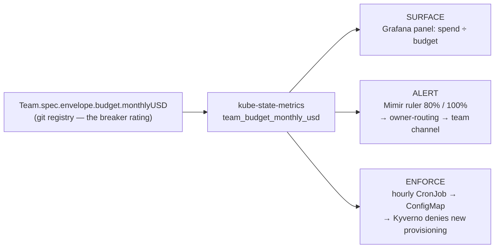

# Learn: Cost & FinOps — Operate: guardrails and the practice (deep dive)

Cost governance on this platform runs as a loop — Inform → Optimize → **Operate** — with two meters
(OpenCost plus the CUR odometer) and a set of levers (Karpenter, parking, the descheduler). The
[Cost & FinOps orientation](orientation.md) sketches Operate in a paragraph: a per-team budget with a
surface → alert → enforce guardrail, two bill-level tripwires, and a FinOps operating model. This deep
dive traces every wire — where each control actually runs, why it runs there, and the two independent
fail-open latches that keep a cost control from becoming an availability control.

One frame carries the whole thing. A budget is the breaker rating stamped on the panel: declared once,
read by every meter. Operate is the wiring that trips before a tenant blows it — plus a tripwire on the
fence and a smoke detector for the whole building's bill, plus the house rules for how it all runs.
Where the metaphor breaks: a real breaker cuts live current; ours deliberately does not. It refuses the
*next* draw — a new environment — and never interrupts what's already running. That restraint is the
design.

## The one idea: surface → alert → enforce, audit-first

Cost governance here is built in the same shape the platform uses for [policy](../policy/orientation.md):
**Audit before Enforce**. You make a limit visible first, then you alert on it, and only last do you
enforce it — and even then the enforcement ships in Audit mode (it records what it *would* have blocked)
until the record is clean. The three rungs — surface →
alert → enforce — hang off a single number in git.



Everything below is that diagram, verified hop by hop.

## The breaker rating: one number, projected everywhere

A team's cost budget lives in exactly one place — its envelope in the git registry:

```yaml
# gitops/teams/acme.yaml (admin-authored)
spec:
  envelope:
    budget:
      monthlyUSD: <demo budget>   # cost guardrails
```

The schema is deliberately tiny. In the env-API `Team` CRD, `budget` is an optional object with a single
field, `monthlyUSD: { type: number, minimum: 0 }`. Optional is meaningful: a team with no budget is
surfaced-but-unbounded — you still see its spend, there's just no line to trip. All three live teams
(`acme`, `globex`, `platform`) carry a demo budget; the exact dollar figures are private and don't matter
to the mechanism. What matters is that the number is authored once, by an admin, in git.

From there it's projected, never re-authored. [kube-state-metrics](https://kubernetes.io/docs/concepts/cluster-administration/system-metrics/)
runs a **CustomResourceState** config that reads the `Team` CR and emits a gauge —
`team_budget_monthly_usd{team="acme"}` — straight from `spec.envelope.budget.monthlyUSD`, with the team
label pulled from the CR's name. That one metric is the join key for all three rungs. There's no second
budget store to drift against — this is *decide-once-in-git, project-everywhere*, the same
coherence move the platform makes for roles and quotas.

### Surface — the meter reads the rating

The [`observability-opencost`](https://github.com/asanexample/platform/blob/main/infra/modules/observability-opencost)
cost dashboard has a **"Budget utilization by team (%)"** panel that does the obvious thing: per-team
spend (OpenCost allocation) divided by `team_budget_monthly_usd`, times 100. That's all of surface — the
breaker rating drawn next to the actual draw, so a human glancing at Grafana sees "acme is at 40%" without
doing arithmetic.

### Alert — a burn-rate rule where spend and budget coexist

Surface is passive. Alert pages someone. The alert is a [Mimir](https://grafana.com/docs/mimir/latest/)
**ruler** rule ([`cost-budget.yaml`](https://github.com/asanexample/platform/blob/main/infra/modules/observability-mimir/files/ruler/cost-budget.yaml)),
and where it evaluates is the subtle part. The rule needs both the spend series (from OpenCost) and the
budget series (from the `Team` CR via kube-state-metrics) in the same query — and those only coexist in
the preprod spoke tenant, not in the hub's local Prometheus. So the rule is synced into the spoke tenant
and evaluated there. Two rungs on one ladder:

- `TeamCostBudgetProjectedOverrun` — **≥ 80%** of budget on the current run rate → `severity: warning`.
- `TeamCostBudgetOverrun` — **≥ 100%** → `severity: critical`.

Both use `for: 1h` (cost is slow-moving; no point paging on a one-scrape blip) and both compute projected
month-end spend as current allocation × 730 hours. The `team` label rides through the query so the alert
lands in the right team's Slack/PagerDuty via the [owner-routing fabric](../identity/orientation.md) —
warnings to the team's channel, criticals escalated. Verified loaded and `health=ok`, correctly not firing
(no team is near budget).

One real inconsistency, flagged rather than papered over: the *alert* rule derives a team from the
namespace name prefix (`^([a-z0-9]+)-.*`), while the *enforcer* below derives it from the namespace
label. The label approach is the better one — the prefix would mint fake "teams" out of `kube-system`
and friends, and the enforcer's comment says as much.

## Enforce — and why it can't run where you'd expect

The natural home for "block an over-budget team from provisioning a new environment" is the **gitops
gate** — the check that already validates every `XEnvironment` claim in a PR. The gate can't do it, for
a security reason: it runs on GitHub-hosted `ubuntu-latest` by design, because it validates untrusted PR
content off-cluster, and an off-cluster GitHub runner has no network path to the private Mimir where the
live spend-vs-budget signal lives. You could punch a hole for it — a hole from untrusted CI into the
private observability plane, a worse trade than the problem it solves.

So enforcement is runtime, on the preprod env-API cluster, where the `XEnvironment` claims, the `Team`
CRs, and Kyverno all already live. It's a two-part bridge: a job that computes the over-budget set, and
a policy that reads it.

### Part 1 — the enforcer CronJob (computes the verdict)

[`budget-enforcer.tf`](https://github.com/asanexample/platform/blob/main/infra/modules/observability-opencost/budget-enforcer.tf)
defines an hourly CronJob (`schedule: "17 * * * *"`) in the preprod **observability** namespace — chosen
because that namespace already has working Mimir egress (the collection agents use it). Each run:

1. Queries Mimir for per-team **spend ÷ `team_budget_monthly_usd` × 100**. Spend is OpenCost's
   allocation metrics (`container_cpu_allocation × node_cpu_hourly_cost + …`). Team comes from the
   namespace's `platform.refplat.org/team` **label** — explicitly *not* the name prefix, so infra
   namespaces don't become fake teams; unlabelled namespaces roll up to `platform` (shared infra).
2. Writes each team as `ok` or `exceeded` (≥ 100) into the `cost-budget-status` ConfigMap, via
   `kubectl create configmap … --dry-run=client -o yaml | kubectl apply -f -`.

The **first fail-open latch** is one line: `curl -sf … || { echo "…fail-open…"; exit 0; }`. A failed
Mimir query exits 0 and leaves the ConfigMap untouched — an observability outage can never mark a team
`exceeded`. The job is hardened like any control-plane workload: `runAsNonRoot`, UID `65532`, read-only
root filesystem, `drop: [ALL]`, `seccompProfile: RuntimeDefault`, tight requests/limits.

Live, right now:

```console
$ kubectl --context preprod get cm cost-budget-status -n observability -o jsonpath='{.data}'
{"acme":"ok","globex":"ok","platform":"ok"}
```

### Part 2 — the Kyverno policy (reads the verdict)

[`cost-budget-enforce.yaml`](https://github.com/asanexample/platform/blob/main/infra/modules/policy/policies-chart/templates/cost-budget-enforce.yaml)
renders a [Kyverno](https://kyverno.io/docs/policy-types/cluster-policy/validate/) `ClusterPolicy`,
`restrict-over-budget-provisioning`, that matches **`XEnvironment` on `CREATE` only** — `background:
false`, so it fires at admission and never rescans running objects. It loads the `cost-budget-status`
ConfigMap as context, reads the claim's `spec.team` status, and denies when that status `== exceeded`
**and** the claim lacks the admin escape annotation `cost.refplat.org/budget-override: "true"`.

Two more safety properties are baked in:

- **`failureAction: Audit`** (the default) — it records what it would block, and only flips to Enforce
  once PolicyReports are clean. Live: `validate.failureAction = Audit`, `background = false`.
- **`failurePolicy: Ignore`** (the default) — the **second fail-open latch**. If Kyverno itself is down
  or errors, admission is allowed, not blocked. A down policy engine never wedges provisioning.

So the enforce rung is fail-open twice (bad query → `ok`; dead engine → allow) and, structurally, only
gates new provisioning — it matches `CREATE`, touches no running Deployment, evicts nothing. That's the
rule made concrete: a cost control must never become an availability control. The deny path is proven —
forcing `acme=exceeded` and flipping to Enforce, a dry-run create of an acme environment was blocked by
Kyverno, then reverted to Audit.

### Why this whole apparatus is preprod-only — and that's correct

Run the same check on the hub and you get nothing:

```console
$ kubectl --context platform get crd teams.platform.refplat.org
Error from server (NotFound): customresourcedefinitions … "teams.platform.refplat.org" not found
```

No `Team` CRD, no enforcer CronJob, no policy. That's not a gap — the env-API (`Team`, `XEnvironment`)
is enabled on preprod, not the platform hub,
so the tenant guardrail correctly lives only where tenants live. Its absence on the hub is the design,
not a hole to fill.

## The bill-level tripwires: Budgets + Anomaly Detection

The per-team guardrail watches tenants. The whole **bill** — including the big shared slice no team owns
— needs its own watch, and that's the
[`aws/cost-monitoring`](https://github.com/asanexample/platform/blob/main/infra/modules/aws/cost-monitoring)
module. It lives in the payer/management account, because Budgets, Cost Anomaly
Detection, and Cost Explorer are organization-level billing services that only exist there.

Why a separate delivery path? The owner of the bill is the platform team, not a tenant. So these alerts
deliberately do not ride the owner-routing fabric (which resolves which tenant owns a problem).
They fan out through a dedicated **SNS topic → AWS Chatbot (Slack) + email**. Two distinct instruments
hang off that topic:

- **AWS [Budgets](https://docs.aws.amazon.com/cost-management/latest/userguide/budgets-managing-costs.html)
  — the tripwire on the fence.** Two monthly `COST` budgets (a consolidated one and a platform-account
  one — the free tier is two), each wired with three notifications: **80% actual**, **100% actual**, and
  **100% forecasted** month-end. A threshold you set, crossed → alert.
- **AWS [Cost Anomaly Detection](https://docs.aws.amazon.com/cost-management/latest/userguide/getting-started-ad.html)
  — the smoke detector.** One **DIMENSIONAL / SERVICE** monitor with an **IMMEDIATE** SNS subscription
  above an absolute-impact threshold. It needs no pre-set number — it trips on an unexpected shape in the
  bill (the canonical catch: a control-plane-logging surprise spiking one service).

Both dollar thresholds are private; the mechanism is what matters — one tripwire you set, one detector
that learns the baseline.

**Honest status.** The email path works only after each recipient clicks Confirm on the AWS subscription
email (`aws sns list-subscriptions-by-topic` shows `PendingConfirmation` until then). The Slack/Chatbot
path is gated off: the live unit sets `slack_team_id = ""`, so `create_chatbot` evaluates false and no
Chatbot resources are created. Turning it on needs a one-time manual authorization of the AWS Chatbot app
in the Slack workspace.

## The practice above the mechanisms

The controls above are things. The practice that gives them a home: adopt the
[FinOps Foundation Framework](https://www.finops.org/framework/) wholesale — the Inform → Optimize →
Operate phases run iteratively, Domains/Capabilities tracked **Crawl → Walk → Run** rather than as a
one-off project, and the **Scopes** addition: **platform-shared** (a scope in its own right,
surfaced honestly and never socialized onto teams), **per-team/tenant** (above), and
**AI/GenAI** named as the emerging third (agent inference spend). These are the house rules and the
thermostat — how cost is run, not just measured.

The firm constraint: **free OSS + AWS-native tools only**, because this reference platform has no
spend budget. That splits "no" into two kinds. **Savings Plans/RIs** and **Infracost Cloud** are deferred
on budget (a real company should adopt them; the path is documented, just not bought), while a **vended
FinOps SaaS is rejected on principle** — a second cost control plane would contradict the whole
build-it-in-our-own-fabric demonstration, budget or not. The tool verdicts:

| Verdict | Tools |
|---|---|
| **Reaffirm** | OpenCost |
| **Adopt** | Infracost, AWS Budgets, Cost Anomaly Detection, Compute Optimizer, cost-allocation tags, CUR → Athena |
| **Trial** | kube-green (per-namespace off-hours), Cloud Custodian (account janitor) |
| **Hold** | Kubecost (OSS), Komiser, OptScale |
| **Reject** | Vended FinOps SaaS (CloudHealth / Cloudability / Vantage) |

One adopted piece is worth seeing, because it's the **shift-left** analogue of the tenant guardrail —
cost governance moved into the PR. [`infracost.yml`](https://github.com/asanexample/platform/blob/main/.github/workflows/infracost.yml)
prices an infrastructure change in the pull request with the free self-hosted
[Infracost](https://www.infracost.io/docs/) CLI. The as-built scope is narrower than you'd guess: it
prices the shared **modules** (`infra/modules/**`), not the live Terragrunt units — Infracost's own
Terragrunt evaluator can't parse this repo's unit hierarchy (the `env.hcl` conditional + SOPS
decryption). Acceptable, because the cost-bearing resources (NAT, EKS, node groups) are defined in the
modules; unit-level precision is a deferred follow-up. Until the free API key is set, the job is a clean
no-op — it never fails a PR.

**Status.** Budgets + Anomaly and Infracost are built. Still designed but not built: a platform-shared
cost view, Compute Optimizer, the kube-green and Cloud Custodian spikes, FinOps cadence/forecasting, and
Slack alert delivery. Crawl → Walk, honestly.

## Gotchas

- **You cannot enforce from the gitops gate.** The gate runs on untrusted-PR GitHub runners with no path
  to private Mimir — the reason enforcement is runtime Kyverno on preprod, not a PR check. Wanting it in
  the gate is the natural wrong instinct.
- **Two fail-open latches, on purpose.** Bad Mimir query → CronJob exits 0, ConfigMap unchanged; Kyverno
  down → `failurePolicy: Ignore` allows admission. A cost signal outage must never block provisioning,
  let alone touch running workloads. Harden either latch to fail-closed and you've built an availability
  control by accident.
- **Team-from-label, not name-prefix.** The enforcer derives the team from the namespace label precisely
  so `kube-system`/`external-dns` don't become fake budgeted teams; unlabelled → `platform`. The alert
  rule still uses the prefix — a real, flagged inconsistency, not a thing to copy.
- **Only one dimensional anomaly monitor per account.** AWS auto-creates a `Default-Services-Monitor` the
  first time Anomaly Detection is touched; creating a second **DIMENSIONAL/SERVICE** monitor 400s with
  *"Limit exceeded"*. The module subscribes to the existing one via `existing_monitor_arn` instead of
  creating its own.
- **The SNS topic is unencrypted, by design.** The AWS-managed `alias/aws/sns` key can't grant the
  `budgets.amazonaws.com` / `costalerts.amazonaws.com` principals publish access (its policy isn't
  editable) and Chatbot can't read a CMK-encrypted topic. Payloads are low-sensitivity (account ids +
  amounts); a customer-managed CMK admitting those principals is the upgrade path, not a defect.

## Go deeper

- Module source:
  [`observability-opencost/budget-enforcer.tf`](https://github.com/asanexample/platform/blob/main/infra/modules/observability-opencost/budget-enforcer.tf)
  (the CronJob),
  [`policy/policies-chart/templates/cost-budget-enforce.yaml`](https://github.com/asanexample/platform/blob/main/infra/modules/policy/policies-chart/templates/cost-budget-enforce.yaml)
  (the Kyverno policy),
  [`aws/cost-monitoring`](https://github.com/asanexample/platform/blob/main/infra/modules/aws/cost-monitoring)
  (Budgets + Anomaly), and the
  [Mimir cost-budget ruler](https://github.com/asanexample/platform/blob/main/infra/modules/observability-mimir/files/ruler/cost-budget.yaml).
- Runbooks: [cost-alerting](../../runbooks/cost-alerting.md) (AWS Budgets/Anomaly + Chatbot enablement)
  and [cost-shift-left](../../runbooks/cost-shift-left.md) (Infracost).
- External: the [FinOps Framework](https://www.finops.org/framework/) (the operating model — 20 min),
  [AWS Cost Anomaly Detection](https://docs.aws.amazon.com/cost-management/latest/userguide/getting-started-ad.html)
  and [AWS Budgets](https://docs.aws.amazon.com/cost-management/latest/userguide/budgets-managing-costs.html)
  (the native services), and [Kyverno validate policies](https://kyverno.io/docs/policy-types/cluster-policy/validate/)
  (the `failureAction` / `failurePolicy` semantics the enforce rung relies on).
- Related learning: [Operate's siblings — the two meters](deep-dive-inform-the-two-meters.md) and the
  [cost levers](deep-dive-optimize-the-cost-levers.md); [Policy](../policy/orientation.md) (the
  Audit→Enforce pattern this mirrors) and [Identity](../identity/orientation.md) (owner-routing).
