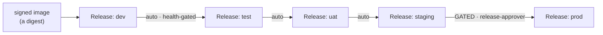

# Learn: Delivery — orientation

How a built image actually becomes a *running* workload on this platform — across every stage, safely, and
without anyone ever pressing "deploy." This is the depth-zoom on the middle of
[The Life of a Deployment](../spine/life-of-a-deployment.md): that spine doc traced one `git push` across
*all* the planes; this one slows down on the **delivery** plane and teaches how it actually works.

**Audience:** platform engineers who operate or extend delivery. Developers only need the *2-minute view* at
the end. Already fluent in ArgoCD + Argo Rollouts? The [Reference](reference.md) is the terse lookup.

**Before you start:** read the [domain model](../domain-model/orientation.md) (so *Product*, *Environment*,
and *Stage* mean something) and ideally [Life of a Deployment](../spine/life-of-a-deployment.md) (so you've
seen the whole flow once). You should know what a container image *digest* is.

## The question

You merged a fix to `alpha`'s `shop`. CI built and signed an image — you have a **digest**. Now the real
delivery questions:

- How does that digest get from "built" to "running in **dev**"? Then to test, staging, **prod**?
- Who decides *which stage runs which version*? There's no deploy button and no pipeline you trigger.
- How does it roll out without dropping traffic?

Answer these and you understand the platform's whole delivery model — which is, once again, *not* what most
people expect.

## The one idea: you don't deploy — you move a digest up a ladder

Here's the model. A service's deployed version, at each stage, is one line in a **`Release` record** in the
platform's git:

```yaml
# gitops/releases/alpha/shop/dev.yaml       # what runs in shop's DEV
kind: Release
spec:
  services:
    web:
      digest: sha256:f6b37d…
```

There's one of these per stage — `dev.yaml`, `test.yaml`, … `prod.yaml`. **The digest in that file *is* the
deployed version.** Look at `alpha-shop` right now and dev carries `sha256:f6b37d…` while prod carries an
older `sha256:42b927…` — a change has landed in dev and is partway up the ladder toward prod.

So "deploying" isn't an action you take. It's a **digest moving up a ladder of git files**, and a set of
independent reconcilers each notice their rung and converge reality to it:

> **You never push a deploy. You change a `Release` digest in git, and reconcilers make it so** — the same
> choreography from [How the Platform Fits](../spine/how-the-platform-fits.md), specialized for delivery.
> The digest *climbs*; the machinery *reacts*.



Two things to hold: **(1)** promotion up to staging is *automatic but health-gated*; **(2)** prod is the one
rung a *human* must approve. Now let's meet the reconcilers that make a single rung happen.

## The three reconcilers

Delivery isn't one system — it's three independent control loops, each watching one thing and converging
it. Follow `shop`'s new dev digest (`f6b37d…`) as it climbs.

### 1 · The auto-promoter — climbs the ladder

A cron job (`reconcile.sh`, on an in-VPC runner with ArgoCD API access) walks each Product's *adjacent*
stage pairs — `dev→test→uat→staging` (**prod is deliberately excluded**). For each Service it asks a sharp
question before promoting a rung: **is the version below actually healthy?** Specifically, the lower stage's
ArgoCD `Application` must be **`Synced` + `Healthy`** — proof the lower digest is *really running and
settled*, not just committed. Only then does it open a PR bumping the next rung's `Release` to that digest.

Two consequences worth internalizing:

- **It climbs one rung per run.** The digest can't leap from dev to staging in one go; it moves up a single
  step, *bakes* at that stage until the next reconcile sees it healthy, then advances. A real ladder, not a
  fan-out — a change *proves itself* at each stage before the next.
- **It's idempotent + honest about intent.** It skips a rung already carrying the digest, and it won't
  promote to a stage whose Environment doesn't even *declare* that Service.

> **Think of it as belt gradings that award themselves — but only on proof.** You don't jump to black belt;
> you earn each rank by *demonstrating* the current one is solid (Synced + Healthy), and the examiner for
> the lower ranks is an automated health check. Prod is the black-belt test, and *that* examiner is a human.

<!-- -->

> **Quick check:** why does the auto-promoter gate on ArgoCD `Synced + Healthy` rather than just "the
> Release PR merged"? *(Merging the Release only records intent; Synced+Healthy proves the previous stage is
> actually running the digest successfully. Promoting on intent alone would march a broken version up the
> whole ladder — the health gate is what makes it "bake at each stage.")*

### 2 · ArgoCD — turns each Release into a running Application

Nobody tells [ArgoCD](https://argo-cd.readthedocs.io/en/stable/) to deploy; it **watches git** and
reconciles the cluster to match — the [GitOps](https://opengitops.dev/) pattern. Concretely, a **per-Product
ApplicationSet** fans out over that Product's `Release` records: **one ArgoCD `Application` per Release** (=
per Environment that has a deployed digest). Each Application pulls the service's manifests from the app
repo's `k8s/overlays/<stage>` and **injects the promoted digest** over the `:placeholder` the overlay ships.

Its sync policy is **automated, self-healing, and pruning**: hand-edit a live resource and ArgoCD reverts it
to git; delete something git still declares and ArgoCD recreates it. The desired state is git, full stop.

> **Quick check:** you changed the `Release` digest but never touched the app's `k8s/` overlay — so where
> does the running version come from? *(The overlay ships a `:placeholder`; the ApplicationSet injects the
> digest from the `Release` record at sync time. The version lives in the Release, the *shape* lives in the
> overlay — cleanly separated.)*

### 3 · Argo Rollouts — lands the new version without dropping traffic

The workload ArgoCD applies isn't a plain Deployment — it's an
[**Argo Rollout**](https://argo-rollouts.readthedocs.io/en/stable/), on *every* stage. Instead of swapping
all pods at once, it brings up the new version alongside the old and shifts a **weighted slice** of traffic
to it — by editing the **HTTPRoute weights** through its Gateway-API plugin (the same HTTPRoute a
[user request](../spine/life-of-a-request.md) is routed by). Lower stages auto-promote through the steps to
dogfood the path; prod is where the cautious, **metric-gated** canary matters most.

*(Honest scope: the weighted-canary traffic-shifting is built and live; the fully **metric-gated**
`AnalysisTemplate` — auto-rollback on a Mimir query breaching an SLO — is a later phase, proven in mechanics,
not yet the default everywhere. The [Reference](reference.md) says exactly what's where.)*

## Putting it together — the climb, start to finish

`shop`'s `web` fix, from merge to prod:

1. CI signs the image → digest `f6b37d…`. A promote step writes it into `dev.yaml`.
2. The **ApplicationSet** notices the new dev Release → ArgoCD syncs `alpha-shop-dev` → the **Rollout**
   canaries `f6b37d…` in. Dev is now running the fix.
3. Next cron run, the **auto-promoter** sees `alpha-shop-dev` is `Synced + Healthy` → opens a Release PR
   bumping `test.yaml` to `f6b37d…` → the Gate auto-merges → ArgoCD + Rollout land it in test.
4. …the same, one rung per run, up through **staging**. The digest *bakes* at each stage.
5. At **prod**, the ladder stops. A **release-approver** must approve the prod Release PR — the one human
   gate — before ArgoCD + the Rollout put `f6b37d…` in front of real customers.

No pipeline ran the whole way. Each reconciler did its own small job when its cue appeared. That's why
delivery here is **resilient** — there's no single pipeline to fail, and "roll back" is just reverting the
`Release` digest and letting the same machinery converge.

## When it breaks — the two you'll actually hit

- **An Application stuck `OutOfSync` when nothing changed.** ArgoCD's default diff can mis-read a
  server-side-applied Rollout/HTTPRoute (two field managers) as drift. The fix is server-side diff, not
  `ignoreDifferences` — see the Reference.
- **A promotion that won't climb.** Almost always the health gate doing its job: the lower stage's
  Application isn't `Synced + Healthy` (a failing Rollout, a bad digest, a missing resource). The ladder is
  *supposed* to stall there — check *why* the lower stage is unhealthy, don't force the rung.

## Recap — say it back

Try it cold: *how does my merged code reach prod, and who decides?* If you can say —

> "The deployed version at each stage is a **digest in a `Release` file** in git. Three reconcilers converge
> it: an **auto-promoter** climbs the ladder one rung per run, *health-gated* on the lower stage being
> ArgoCD `Synced + Healthy` (so it bakes at each stage); a per-Product **ApplicationSet** turns each Release
> into an ArgoCD **Application** that injects the digest and self-heals; and an **Argo Rollout** canaries it
> in via weighted HTTPRoutes. Everything auto-promotes up to **staging**; **prod** needs a human
> release-approver. I never deploy — I move a digest, and the reconcilers make it real" —

— then you've got the delivery model, and every arrow in *Life of a Deployment* now has machinery behind it.

## The developer's 2-minute view

You don't operate any of the above. To ship: **merge your code** (CI signs it, it auto-lands in dev). To
promote: click **Request Promotion** in Backstage (or run your repo's `promote.yml`) for the stage you want
— it opens a Release PR. Everything up to staging flows automatically once each stage is healthy; **prod
asks a release-approver to approve.** That's the whole surface you touch.

## Go deeper

- The full mechanism, gotchas, and configs: the [Reference](reference.md).
- The end-to-end flow this zooms into: [The Life of a Deployment](../spine/life-of-a-deployment.md); the
  runtime side of a Rollout's traffic split: [The Life of a Request](../spine/life-of-a-request.md).
- Source of truth (as-built): [Promotion & Release](../../architecture/promotion-and-release.md) ·
  [ADR-021 ArgoCD](../../adrs/021-argocd-for-gitops.md) ·
  [ADR-071 digest promotion](../../adrs/071-digest-promotion-via-control-plane.md) ·
  [ADR-056 progressive delivery](../../adrs/056-progressive-delivery-and-safe-rollback.md) ·
  [ADR-069 delivery source-of-truth](../../adrs/069-delivery-source-of-truth-product-environment.md).
- Learn the substrate: [ArgoCD](https://argo-cd.readthedocs.io/en/stable/) ·
  [Argo Rollouts](https://argo-rollouts.readthedocs.io/en/stable/) ·
  [ApplicationSets](https://argo-cd.readthedocs.io/en/stable/user-guide/application-set/) ·
  [GitOps](https://opengitops.dev/).
