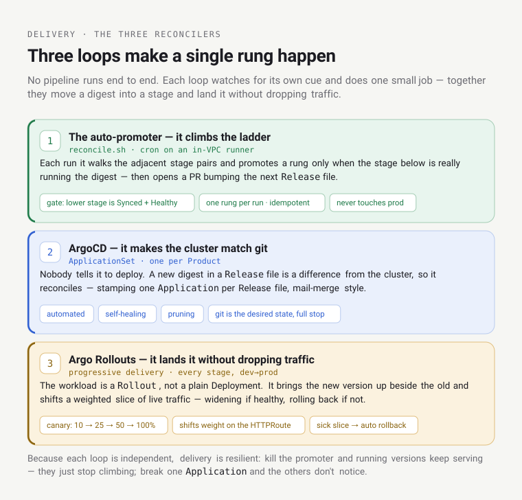
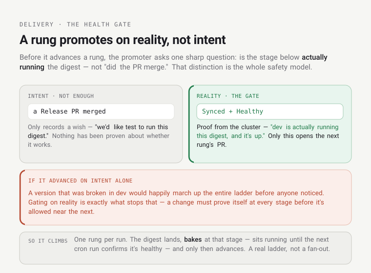
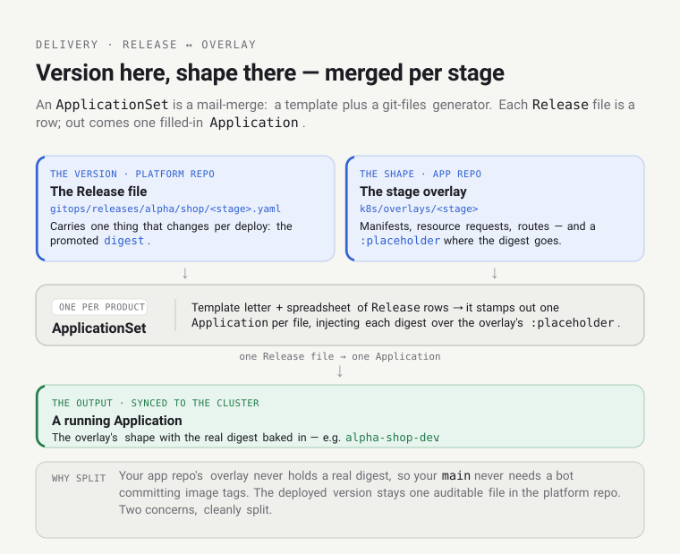
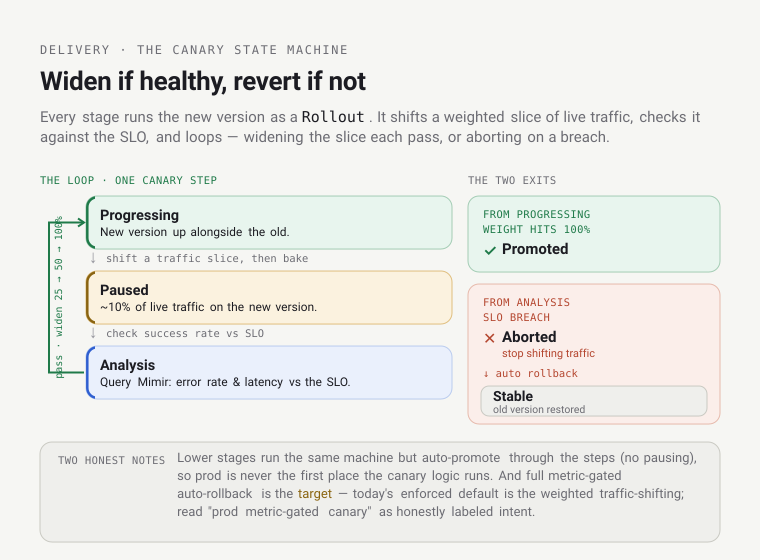
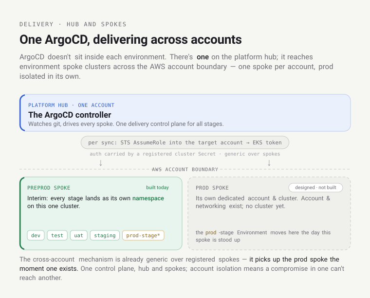
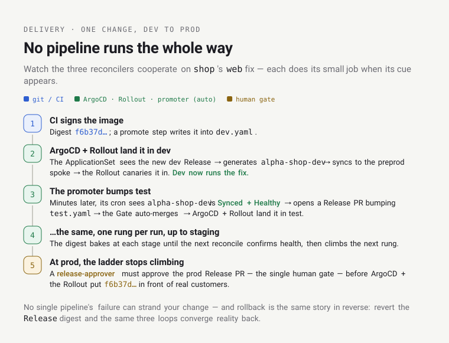

# Learn: Delivery — orientation

How a built, signed image becomes a *running* workload on this platform — across every stage, safely, and
without anyone pressing "deploy." [The Life of a Deployment](../spine/life-of-a-deployment.md) traced one
`git push` across all the planes in a few sentences each. This slows right down on the **delivery** plane and
builds the full model.

Audience: platform engineers who operate or extend delivery. Developers only need the developer surface at the
end. If you're already fluent in ArgoCD + Argo Rollouts, the [Reference](reference.md) is the terse lookup.

You'll get more out of this if the [domain model](../domain-model/orientation.md) already means something —
*Product*, *Environment*, *Stage* — and if you've seen the whole flow once in
[Life of a Deployment](../spine/life-of-a-deployment.md). You should know what a container image *digest* is.

## The question

You merged a fix to `acme`'s `shop`. CI built and signed an image, so you have a **digest**. Now the delivery
questions — the ones newcomers find genuinely mysterious here:

- How does that digest get from "built" to running in **dev**? Then to test, staging, **prod**?
- Who decides which stage runs which version? There's no deploy button and no pipeline you trigger.
- How does a new version replace the old one without dropping traffic mid-request?
- And if it's broken — how do you get back?

Answer these and you understand the platform's whole delivery model. Fair warning: the answer is not the
pipeline you're probably picturing.

## The one idea: you don't deploy — you move a digest up a ladder

Throw away the mental model of a deploy pipeline pushing your build to each environment.

A service's deployed version, at each stage, is one line in a **`Release` record** — a small YAML file in the
platform's git:

```yaml
# gitops/releases/acme/shop/dev.yaml       # what runs in shop's DEV
kind: Release
spec:
  services:
    web:
      digest: sha256:f6b37d…
```

There's one of these per stage — `dev.yaml`, `test.yaml`, `uat.yaml`, `staging.yaml`, `prod.yaml`. The digest
written in that file *is* the deployed version. Not a dashboard, not a pipeline's memory — a version-controlled
file. Look at `acme-shop` right now: dev carries `sha256:f6b37d…` while prod carries a different
`sha256:42b927…`. Read that difference like a photograph of the ladder mid-climb — a change has landed in dev
and hasn't yet made its way up to prod.

So "deploying" isn't an action you take. It's a digest moving up a ladder of git files, and a set of
independent control loops each notice their rung and drive reality to match it. You never push a deploy; you
change a `Release` digest in git, and reconcilers make it so. It's the same choreography from
[How the Platform Fits](../spine/how-the-platform-fits.md) — level-triggered control loops converging on a
declared state — specialized for delivery. The digest climbs; the machinery reacts.

Why build it this way instead of a normal pipeline? Because declaring-in-git buys you three things a pipeline
doesn't, for free:

- **Self-healing.** A pipeline runs once and forgets. A reconciler never stops watching — so if a pod dies, or
  someone hand-edits a live resource, it's driven back to what git says. The deployed state isn't an event that
  happened; it's a fact the platform continuously maintains.
- **An audit log you didn't build.** Every version change is a git commit — an author, a timestamp, a diff, a
  review. "What was running in prod last Tuesday?" is a `git log`, not an archaeology dig.
- **A boring rollback.** To go back, you revert the commit. The same machinery that shipped the change ships
  the revert. (For *stateless* change — a release that ran a database migration is the honest exception; see the
  data caveat in [Life of a Deployment](../spine/life-of-a-deployment.md).)


Two things to carry into the rest of this doc: promotion up to staging is automatic but health-gated, and prod
is the one rung a human must approve. Three reconcilers make a single rung actually happen. Each is worth
understanding on its own.



## Reconciler 1 — the auto-promoter: it climbs the ladder

Something has to move the digest up. That's a cron job — `reconcile.sh`, running on an in-VPC runner that reads
each ArgoCD `Application`'s status from the cluster (kubectl against the private EKS API), authenticating by
assuming PlatformDeployer — the runner's Pod Identity is only the base credential it assumes from. The
interesting thing is *how carefully* it climbs.

Each run, for every Product, it walks the adjacent stage pairs — `dev→test`, `test→uat`, `uat→staging` — and
asks one sharp question before promoting a rung: is the version below actually healthy? Not "did the Release PR
merge" — is it really running and settled? Concretely, the lower stage's ArgoCD `Application` must report
**`Synced` + `Healthy`**. Only then does it open a PR bumping the next rung's `Release` file to that digest.

That distinction — intent versus reality — is the whole point. Merging a Release PR only records intent: "we'd
like test to run this digest." `Synced + Healthy` is proof: "dev is actually running this digest, and it's up."
If the promoter advanced on intent alone, a version that was broken in dev would happily march up the entire
ladder before anyone noticed. Gating on reality is what stops that.



Two consequences fall out, and they're the heart of the model:

- **It climbs one rung per run.** The digest can't leap dev→staging in a single go; it moves up a single step,
  then bakes at that stage — sitting there running until the next cron run confirms it's healthy — and only then
  advances. A change literally has to prove itself at every stage before it's allowed near the next one. This is
  a real ladder, not a fan-out.
- **It's idempotent and honest about intent.** It skips a rung that already carries the digest (so re-runs are
  safe), and it refuses to promote a Service into a stage whose Environment doesn't even declare that Service.

And note what it won't touch: prod. The reconciler walks `dev→…→staging` and stops. Prod is never promoted
automatically — that rung is reserved for a human.

Think of it as belt gradings that award themselves, but only on proof. You don't jump to black belt; you earn
each rank by demonstrating the current one is solid, and for the lower ranks the examiner is an automated health
check that watches you actually perform. Prod is the black-belt test — and that examiner is a person. Where the
metaphor breaks: a belt, once earned, is yours; a digest can be rolled back down the ladder by reverting a
Release, so "rank" here is revocable state, not a permanent award.

## Reconciler 2 — ArgoCD: it turns each Release into a running Application

The promoter moved the digest into a git file. Now something has to notice that git changed and make the cluster
match. That's [**ArgoCD**](https://argo-cd.readthedocs.io/en/stable/), and nobody tells it to deploy. Its entire
job is to continuously compare the cluster to git and fix any difference; a new digest in a `Release` file is a
difference, so it reconciles. This is the [GitOps](https://opengitops.dev/) pattern, and ArgoCD is a thermostat
for "the cluster matches git" exactly like Crossplane — the control loop behind the platform's environment
provisioning — is a thermostat for "the environment matches its claim."

The mechanism that connects a `Release` file to a running workload is the part people find fiddly. It's an
**ApplicationSet** — a *generator*: a template plus a data source, from which ArgoCD stamps out one `Application`
per data item. Here there's one ApplicationSet per Product, and its data source is a git-files generator pointed
at that Product's `Release` files. So one `Release` file becomes one ArgoCD `Application`. Like a mail-merge: the
ApplicationSet is the template letter, each Release record is a row in the spreadsheet, and out comes one
addressed, filled-in Application per row.

Each generated `Application`:

- points its `source` at the app repo's `k8s/overlays/<stage>` folder — where the *shape* of the workload lives
  (the manifests, the resource requests, the routes);
- injects the promoted digest from the Release over the `:placeholder` the overlay ships with.

That separation is a genuinely nice piece of design: the version lives in the `Release`; the shape lives in the
overlay. Your app repo's overlay never contains a real digest (just `:placeholder`), so your `main` never needs
a bot committing image tags into it; and the deployed version is one auditable file in the platform repo. Two
concerns, cleanly split.



ArgoCD's sync policy here is automated, self-healing, and pruning. Automated: it syncs on its own when git
changes. Self-healing: hand-edit a live resource and it's reverted to match git — the thermostat won't let the
room drift from the set-point. Pruning: delete a resource that git still declares and it's recreated; remove
something from git and it's cleaned up. Git is the desired state, full stop — there is no "well, someone changed
it live" escape hatch.

## Reconciler 3 — Argo Rollouts: it lands the new version without dropping traffic

ArgoCD applied the new digest. But the workload it applied is *not* a plain Kubernetes Deployment — it's an
[**Argo Rollout**](https://argo-rollouts.readthedocs.io/en/stable/), on every stage, dev through prod. And that
changes *how* the new version replaces the old one.

A plain Deployment does a rolling update: swap old pods for new, all of them, and hope. A Rollout does
**progressive delivery** instead: it brings the new version up alongside the old and shifts only a weighted
slice of live traffic to it — say 10% — then, if that slice looks healthy, widens it (25%, 50%, 100%) step by
step. If it looks sick, it rolls back to the old version automatically.

That widen-or-revert loop *is* the canary state machine the Rollout runs, step by step, from the first traffic
slice to full promotion:



How does it move the traffic? It edits the weights on the HTTPRoute — through its Gateway-API plugin — and the
data plane routes each request by whatever weight it finds there. (This is the exact same HTTPRoute a
[user request](../spine/life-of-a-request.md) is routed by; the control plane sets the weight, the data plane
carries it out.) So a "canary" here is literally the same route, weighted.

It's the canary in the coal mine. A small slice of real traffic hits the new version first, so if it's toxic, a
fraction of requests notice before everyone does — an early, contained warning. Unlike the miners' canary,
though, ours isn't sacrificed: when the canary detects trouble, the whole rollout is reversed. The point is to
prevent the harm, not just to mark it.

Two honest details, because a mental model built on the aspirational version is a broken one:

- **Every stage is a Rollout.** Lower stages auto-promote through the canary steps (no pausing) to dogfood the
  delivery path itself, so prod is never the first place a Rollout's canary logic runs. It's rehearsed at dev,
  test, uat, staging before it ever performs in prod.
- **Metric-gating is the design, not yet the enforced default.** The intended shape is that prod pauses the
  canary on an `AnalysisTemplate` — a query against Mimir (error rate, latency vs. the SLO) that auto-rolls-back
  on a breach. Today the weighted traffic-shifting is live; the fully metric-gated auto-rollback is proven in
  mechanics, a later phase — not the enforced default on every service yet. The [Reference](reference.md) says
  exactly what's where. When you read "prod metric-gated canary," read it as the target, honestly labeled.

## One more piece — delivering across accounts

It's easy to picture ArgoCD sitting inside each environment. It doesn't. There's one ArgoCD, on the platform
hub, and it delivers to environment spoke clusters across the AWS account boundary. The design is one spoke per
account, with prod in its own dedicated account and cluster — the same account isolation the
[security model](../spine/the-security-model.md) leans on, so a compromise or outage in one account can't reach
another.



Today, one spoke is built — preprod. A dedicated prod-account spoke cluster is designed but not yet stood up
(the prod account exists, with networking, but no cluster). So as an interim step, every stage — dev through
prod — currently lands as its own namespace on the preprod spoke; the `prod`-stage Environment moves to its own
account the day that spoke is built. It reaches each spoke via a registered cluster `Secret` that carries AWS
IAM auth — the ArgoCD controller does an STS AssumeRole into the target account and gets an EKS token per sync.
That cross-account mechanism is real and already generic over registered spokes; it picks up the prod spoke the
moment one exists. One delivery control plane, hub and spokes — the shape from
[How the Platform Fits](../spine/how-the-platform-fits.md), seen from delivery.

## Putting it together — one change, dev to prod



Watch all three reconcilers cooperate on `shop`'s `web` fix (`f6b37d…`):

1. CI signs the image → digest `f6b37d…`. A promote step writes it into `dev.yaml`.
2. **ArgoCD's ApplicationSet** notices the new dev Release → generates/updates the `acme-shop-dev` Application →
   syncs it to the preprod spoke → the **Rollout** canaries `f6b37d…` in. Dev now runs the fix.
3. Some minutes later, the **auto-promoter**'s cron run sees `acme-shop-dev` is `Synced + Healthy` → opens a
   Release PR bumping `test.yaml` to `f6b37d…` → the gitops Gate auto-merges → ArgoCD + Rollout land it in test.
4. …the same, one rung per run, up through **staging** — the digest baking at each stage until the next
   reconcile confirms health.
5. At **prod**, the ladder stops climbing on its own. A **release-approver** must approve the prod Release PR —
   the single human gate — before ArgoCD + the Rollout put `f6b37d…` in front of real customers.

No pipeline ran the whole way. Each reconciler did its own small job when its cue appeared — which is exactly
why delivery here is resilient. There's no single pipeline whose failure strands your change; kill the promoter
and existing versions keep running (they just stop climbing); break one Application and the others don't notice.
And "roll back" is the same story in reverse: revert the `Release` digest, and the same three loops converge
reality back to the previous version.

## When it breaks — the two you'll actually hit

- **An Application stuck `OutOfSync` when nothing changed.** ArgoCD's default (client-side) diff can mis-read a
  server-side-applied `Rollout` or `HTTPRoute` — which carries two field managers (the argocd-controller and the
  rollouts-controller) — as if it had drifted. The fix is to turn on server-side diff, not to paper over it with
  `ignoreDifferences` (which can't fix it). The Reference has the exact setting.
- **A promotion that simply won't climb.** Nine times in ten this is the health gate doing its job: the lower
  stage's Application isn't `Synced + Healthy` — a failing Rollout, a bad digest, a missing resource. The ladder
  is supposed to stall there. Don't force the rung; go find out why the lower stage is unhealthy, because that's
  the actual problem.

## The developer surface

You operate none of the above. To ship: merge your code — CI signs it and it auto-lands in dev. To promote:
click **Request Promotion** in Backstage (or run your repo's `promote.yml`) for the stage you want; it opens a
Release PR. Everything up to staging then flows automatically, one healthy stage at a time; prod asks a
release-approver to approve. To roll back: revert the Release. That's the whole surface you ever touch — the
ladder, the canaries, and the reconcilers happen for you.

## Go deeper

- The full mechanism, gotchas, and configs: the [Reference](reference.md).
- The end-to-end flow this zooms into: [The Life of a Deployment](../spine/life-of-a-deployment.md); the
  runtime side of a Rollout's traffic split: [The Life of a Request](../spine/life-of-a-request.md).
- Source of truth (as-built): [Promotion & Release](../../architecture/promotion-and-release.md) ·
  [ADR-021 ArgoCD](../../adrs/021-argocd-for-gitops.md) ·
  [ADR-071 digest promotion](../../adrs/071-digest-promotion-via-control-plane.md) ·
  [ADR-056 progressive delivery](../../adrs/056-progressive-delivery-and-safe-rollback.md) ·
  [ADR-069 delivery source-of-truth](../../adrs/069-delivery-source-of-truth-product-environment.md).
- Learn the substrate: [ArgoCD](https://argo-cd.readthedocs.io/en/stable/) ·
  [Argo Rollouts](https://argo-rollouts.readthedocs.io/en/stable/) ·
  [ApplicationSets](https://argo-cd.readthedocs.io/en/stable/user-guide/application-set/) ·
  [GitOps](https://opengitops.dev/).
