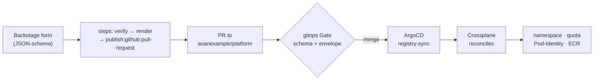

# Learn: Developer Experience — the scaffolder golden paths (deep dive)

The developer-facing front door to this platform is a form. This deep dive opens the hood on one of the two front-door surfaces — the scaffolder — to show what a template actually is, how a form becomes a PR becomes real infrastructure, and why self-service here can hand a developer real power without real blast radius. If you already know your way around, the [Reference](reference.md) is the terse lookup.

## The idea: encode the paved road, don't pave each request by hand

Without a paved road, standing up a Product means a platform engineer hand-writing a `Product` file and an `XEnvironment` claim, wiring the IAM, and running `terragrunt apply` — a point-in-time, human-mediated act with no drift correction and no developer front door. Every new service is a ticket to the platform team. That doesn't scale, and it isn't Vercel-like DX.

The scaffolder makes that a form. Instead of writing a `Product` file, an `XEnvironment` claim, and wiring IAM, a developer ticks boxes on a catalog card; the template renders the right YAML and opens a pull request to the git registries (`asanexample/platform`). From there nothing is special — the PR flows the normal GitOps path: the gitops Gate validates it, a merge lands it, an ArgoCD registry-sync app projects the claim, and [Crossplane](https://docs.crossplane.io/) reconciles the namespace, quota, [Pod Identity](https://docs.aws.amazon.com/eks/latest/userguide/pod-identities.html), and [ECR](https://docs.aws.amazon.com/AmazonECR/latest/userguide/what-is-ecr.html). The portal provisions nothing imperatively; it only writes intent into git.

That's the whole trick — a mail-order form made literal. You order infra by filling in a form, never grabbing it off the shelf. The template *is* the paved road, encoded. The form's JSON-schema constrains what you can even ask for (enums, regex, envelope-bounded stages and tiers); the PR keeps a human or a gate in the loop; and the platform derives everything security-sensitive — the ECR repo, the namespace, the Kyverno image-scope, the OIDC role, the IAM. The BACK stack is this pipeline read left to right: **B**ackstage form → **A**rgoCD delivery → **C**rossplane control plane → **K**ubernetes. Templates live under [`scaffolder/templates/`](https://github.com/asanexample/platform/blob/main/scaffolder/templates) and are registered as one Backstage `Location` ([`location.yaml`](https://github.com/asanexample/platform/blob/main/scaffolder/templates/location.yaml)) that the portal image loads via `catalog.locations`. They're CODEOWNERS-protected: a template defines what a self-service run can do, so a change gets the same review bar as sensitive infra.

## The template catalog — ten paved routes

All ten are registered in `location.yaml`, each a `kind: Template` on `scaffolder.backstage.io/v1beta3`, mapping to the lifecycle: create, promote, grant, wind down.

| Template | Scope | What it writes | Gate posture |
|---|---|---|---|
| **hello-world** | admin-only | nothing — `debug:log` only (no GitHub/AWS) | n/a (no PR) — proves discovery + form + RBAC |
| **new-team** | **admin-only** | `gitops/teams/<name>.yaml` (a `Team`: `ssoGroup` + envelope) | reviewer, **never auto** — grants an envelope |
| **new-product** | team-scoped | new app repo `<team>-<product>` **+** `gitops/products/<team>/<product>.yaml` + `.../environments/<team>/<product>/dev.yaml` | reviewer-merged (auto not armed) |
| **new-environment** | team-scoped | `gitops/environments/<team>/<product>/<stem>.yaml` (an `XEnvironment`) | reviewer-merged |
| **new-resource** | team-scoped | patches `spec.services.<svc>.resources.<name>` into the claim | **auto-merges** — a resource edit classifies as an *environment* change; the gate's prod approval keys on prod *Release* files, not env claims |
| **onboard-person** | team-scoped | `gitops/people/<name>.yaml` (a `Person`) | People Gate: team grant → team lead, platform grant → access-admin |
| **offboard-person** | team-scoped | **deletes** `gitops/people/<name>.yaml` (via `platform:offboard-person`) | access-admin, never auto |
| **request-promotion** | team-scoped | `gitops/releases/<team>/<product>/<to-stem>.yaml` (a `Release`) | ≤ staging **auto**; prod gated (author ≠ approver) |
| **deprovision-environment** | team-scoped | edits `spec.lifecycle.phase` (decommission → quota 0 / reactivate) — **never deletes** | reviewer, drain excluded from auto-merge |
| **deprovision-product** | team-scoped | fans the above over **all** the Product's Environments; purge authors one deletion PR | decommission → reviewer; **purge → admin** (+ release-approver if a prod env) |

Two things to notice. The grants and drains are never auto-merged — a `Team` grants an envelope, a decommission drains workloads (including prod), so both wait for a human. And three templates do something the additive publish action can't: read live digest state (`request-promotion`), patch into an existing claim (`new-resource`), and delete a file (`offboard-person`, `deprovision-product` purge). Those are exactly the custom `platform:*` actions — more below.

## Three paths traced: form → PR → registry → provision

### new-product — repo-on-demand + registry PR

The form ([`new-product/template.yaml`](https://github.com/asanexample/platform/blob/main/scaffolder/templates/new-product/template.yaml)) asks for **team** (an `EntityPicker` over `kind: Group`, `spec.type: team`), **product** (regex `^[a-z][a-z0-9-]{1,30}$`), **first service** (default `web`), **language** (`go`/`nodejs`/`python`/`java`/`rust`/`ruby`), and **deployStrategy** (`canary`/`bluegreen`, shaping only the prod Rollout). Six steps run in order:

1. `platform:verify-team-membership` — server-side, binds the run to the requester's own team.
2. `fetch:template ./skeleton` → `./app` — the shared app scaffold (k8s overlays + supply-chain CI); `language` drives the resource tier, Semgrep ruleset, and dependabot ecosystem, `deployStrategy` the prod Rollout strategy.
3. `fetch:template ./skeleton-<language>` → `./app` — the language starter (a minimal `/healthz` on `:8080`, plus a Dockerfile).
4. `publish:github` — creates the new repo `asanexample/<team>-<product>` from `./app`.
5. `fetch:template ./platform-skeleton` → `./platform` — renders the two registry files.
6. `publish:github:pull-request` — opens a PR to `asanexample/platform` (branch `product/<team>-<product>`) adding them.

The app scaffold it renders into `./app` (step 2) is more than source + CI: its `k8s/base/` ships a default HPA (`k8s/base/hpa.yaml`, `autoscaling/v2`, targeting the Argo **Rollout**, CPU 70% utilization, `minReplicas: 1`/`maxReplicas: 10` — the prod overlay patches it to **min 2 / max 20** to satisfy the prod replica-floor policy; metrics-server, an EKS add-on, is the CPU source). Every new Service is elastic by construction — you opt *out* (delete the file), not in.

The PR lands two files from [`new-product/platform-skeleton/`](https://github.com/asanexample/platform/blob/main/scaffolder/templates/new-product/platform-skeleton): a `kind: Product` (`spec.repo: asanexample/<team>-<product>`, `tenancy: pooled`, `domains: []`) and a `kind: XEnvironment` for `<team>-<product>-dev` with one service (`serviceAccount: app-<team>`) and the image omitted. That `Product` entry does a lot of work: under registries-as-single-source, `argocd-apps`, `policy`, and `github-oidc` all derive the per-Product image-scope (`team-<team>/<product>-*`), delivery, and OIDC from it — one truth, no drift.

Then the provision chain, spelled out in the PR body: on merge the `environments` registry-sync ArgoCD app projects the claim → Crossplane provisions namespace/quota/Pod-Identity/ECR → the new repo's first CI build pins the first signed `@sha256:` digest into `k8s/overlays/dev` → first deploy. The empty image is deliberate: the per-Product ApplicationSet skips the (Environment × Service) pair until a digest exists.

One live gap here, stated in the template's own PREREQUISITES block rather than guessed: the scaffolder GitHub App is currently installed on `asanexample/platform` only. Step 4 (`publish:github`, repo creation) needs org-wide `Administration: write`, so it 403s until the App is broadened. The registry-PR half (steps 5–6) works today; the repo-creation half is the gap.

### new-environment — a Product at a Stage

The form ([`new-environment/template.yaml`](https://github.com/asanexample/platform/blob/main/scaffolder/templates/new-environment/template.yaml)) asks: **team**, **product** (a custom `ProductPicker` that auto-populates with only the Systems that team owns), **stage** (`dev`/`test`/`uat`/`staging`/`prod`, which must fall inside the Team envelope's `allowedStages`), an optional **customer** (per-customer prod/uat only), **service**, and optional `serviceAccount`/`preview`/`tier`/`cpu`/`memory`/`pods`. Steps: `platform:verify-team-membership` → `fetch:template ./skeleton` → `publish:github:pull-request` to branch `environment/<team>-<product>[-<customer>]-<stage>`.

The interesting detail is in the render step: `envName` and `fileStem` are computed in the template (`<team>-<product>[-<customer>]-<stage>` and `[<customer>-]<stage>.yaml`) so the skeleton stays declarative — the customer segment has to land in both the cluster-scoped XR name and the filename, or two customers' prod Environments of one Product would collide on a single name.

It lands `gitops/environments/<team>/<product>/<fileStem>.yaml` — a `kind: XEnvironment` whose `spec.team` is validated `== Product.team` at both the gate and admission, whose `spec.stage` must be in the envelope, and whose optional `quota:` override is validated `<=` the Team's `quotaCap`. On merge: same registry-sync → Crossplane. And Kyverno re-enforces the envelope at admission as a second layer (`restrict-environment-envelope`).

### request-promotion — the same artifact moves up

This is the `dev → test → uat → staging → prod` ladder ([`request-promotion/template.yaml`](https://github.com/asanexample/platform/blob/main/scaffolder/templates/request-promotion/template.yaml)). The form asks **team**, **product**, **service** (default `web`), **fromStage** (`dev`/`test`/`uat`/`staging`), **toStage** (`test`/`uat`/`staging`/`prod`), optional **customer**. The steps use the custom actions that make promotion *not* a rebuild:

1. `platform:verify-team-membership`.
2. `fetch:plain:file` — pulls the *source-stage* Release into a scratch `_src/` (never published).
3. `platform:resolve-release-digest` — reads the digest the Service is already running at `fromStage`.
4. `fetch:template ./skeleton` → `out/` — renders the *target* Release carrying that same digest.
5. `publish:github:pull-request` to branch `promote/...`.

It lands `gitops/releases/<team>/<product>/<to-stem>.yaml` — a control-plane `kind: Release` with `spec.environmentRef` + `spec.services.<svc>.digest`. The same signed artifact moves up; there is no rebuild and CI never touches the app repo's `main`. The gate posture is branched right in the PR body with a Nunjucks conditional: `toStage == 'prod'` prints the gated-prod banner (release-approver, author ≠ approver); otherwise it auto-merges (≤ staging), then the per-Product ApplicationSet injects the digest and ArgoCD delivers.

`request-promotion` needs a custom `resolve-release-digest` action where `new-environment` gets by with only standard ones, and that's the whole point of the custom actions: promotion has to read live state — the digest already deployed at the source stage — which the additive publish action can't do.

## How a template executes — the scaffolder engine

A [Backstage software template](https://backstage.io/docs/features/software-templates/) has two halves.

`parameters` is a JSON-schema array of form sections that Backstage renders as the `/create` form. Validation is schema-level — `enum`, `pattern`, `maxLength`, `required` — and custom widgets are selected with `ui:field`: the stock `EntityPicker`, and the custom `ProductPicker` (shipped in the separate `asanexample/backstage` app repo) that scopes the product dropdown to the team's owned Systems. This is the first guardrail — you can't even express an illegal request.

`steps` is an ordered list of actions. Templating is [Nunjucks](https://mozilla.github.io/nunjucks/templating.html): `${{ parameters.x }}`, `${{ steps.<id>.output.<y> }}`, `${{ user.ref }}`, with filters and conditionals — e.g. `${{ parameters.team | replace('group:default/', '') }}` and `` blocks inside PR bodies. The actions used across all ten templates, verified by grep:

- **Standard Backstage:** `fetch:template` (7×, Nunjucks-renders a `skeleton/` dir), `fetch:plain:file` (3×), `publish:github` (1×, creates the app repo), `publish:github:pull-request` (7× — the standard PR-to-registry action, not a custom one), `debug:log` (1×).
- **Custom `platform:*`** (backend plugins in the portal image): `platform:verify-team-membership` (8× — the server-side authz spine), plus `resolve-release-digest`, `add-service-resource`, `set-lifecycle-phase`, `offboard-person`, and `deprovision-product`. Six custom actions, and they exist precisely for what the additive publish action cannot do: read live digest state, patch/merge into an existing claim, delete a file, or fan out across many files.

`output` returns `links:` (the PR URL from `steps.pr.output.remoteUrl` + catalog `entityRef`s that resolve once projection catches up) and sometimes `text:` next-step instructions — e.g. `new-resource` tells you to `kubectl rollout restart` your Service to pick up the new env var from its `<svc>-resources` ConfigMap.

## Self-service with guardrails — the why

Why a PR and not a direct write? Because the PR is where the Gate and human review live — the seam that keeps the platform a control plane, not a button. The gate posture is calibrated to blast radius, the toll-booth-on-a-paved-road idea:

- **Low-risk, already-proven → auto-merge.** A ≤ staging promotion of an already-signed digest; a non-prod resource request.
- **Privilege grants + drains → reviewer-merged, never auto.** `new-team` grants an envelope; a decommission drains workloads (including prod).
- **Irreversible + high-stakes → named approval.** Prod promotion → release-approver, author ≠ approver; a product purge → admin (+ release-approver if a prod env is in the bundle); offboarding → access-admin.

Why derive rather than specify? The developer names intent — team, product, stage, service, access level — and the platform derives everything security-sensitive: the ECR repo `team-<team>/<product>-<svc>`, the namespace `<team>-<product>-<stage>`, the Kyverno image-scope, the OIDC role, and the IAM. Registries-as-single-source means `argocd-apps`, `policy`, and `github-oidc` all read the same `Product` entry, so there is no drift between what you asked for and what got wired. This bites hardest in `new-resource`: a developer picks an engine (must be in the envelope's `allowedEngines`) and an access intent (`read`/`readwrite`); the platform derives a least-privilege policy on the Service's Pod-Identity role, and the claim's `policyStatements` are deny-set-validated. You name *what*; the platform decides *how much power*. A developer cannot grant themselves arbitrary IAM.

Behind all of it, four independent layers protect every team-scoped run:

1. the Backstage permission policy lets team members run templates at all;
2. `platform:verify-team-membership` is server-stored and binds the run to the requester's own team — a client cannot strip the step;
3. the gitops Gate validates the PR (schema + envelope shift-left: team-matches-product, stage/tier/quota within the envelope, plus a Composition render);
4. Kyverno re-enforces the envelope at admission.

No single bypass compromises it. That is why a developer can be handed real power safely — the guardrails aren't in the developer's hands.

## The honest status — live vs designed

- **Live.** The BACK stack and self-service provisioning are built and live (Phase 3). `hello-world`, `new-team`, `new-environment`, `new-product`, and `new-resource` are proven end-to-end — `alpha-shop` went the whole way, with all four engines S3/SQS/SNS/DynamoDB live. The promotion ladder is proven live (auto ≤ staging + gated prod). The `onboard`/`offboard-person` pair leans on the People Gate. The portal itself is verified running (`backstage-…` `1/1 Running`, serving `backstage.aws.refplat.org`).
- **Known live gaps — from the templates' own headers, not guesses.** `new-product`'s repo-creation step 403s until the scaffolder GitHub App is broadened from platform-only to org-wide `Administration: write`; the gitops Gate's auto-merge is not yet armed across `new-product`/`new-environment`/`deprovision-environment` (a reviewer merges even the low-risk cases today, as each PR body states). And there is no scaffolder template for platform agents — `XAgent` claims in `gitops/agents/` are still hand-authored (see the `authoring-platform-agents` house skill).

The shape to hold: the paved routes are built and exercised; what's maturing is the friction — arming auto-merge, broadening the App — not the model.

## Gotchas that teach

- **The empty image is a feature, not a bug.** A freshly-provisioned `dev` Environment carries no image; the per-Product ApplicationSet skips the (Environment × Service) pair until the first CI build promotes a signed digest. If you expect a workload the instant the PR merges, you'll misread the first-deploy state as broken.
- **`publish:github:pull-request` is a standard action — the custom ones are the tells.** When you see a `platform:*` step, ask what the additive publish can't do here — the answer is always read-live-state, patch-in-place, delete, or fan-out. That's why offboarding and product-purge need bespoke actions and a simple new-environment doesn't.
- **The picker is not the guard.** `EntityPicker` allows arbitrary values (a brand-new team isn't projected yet), so a team you don't belong to can be typed in. It doesn't matter — `verify-team-membership` and the gate's team-matches-product are the enforcement. Never reason about authorization from the form UI.
- **`onboard-person` re-sets, it doesn't add.** The form renders a fresh Person file, so running it for an existing person overwrites their grants with exactly what's ticked — an add-one-grant mutation needs a read-modify action (a follow-up), not this template.
- **A prod promotion needs author ≠ approver.** The gated-prod path isn't just "needs a review" — the release-approver must be someone other than the person who opened the PR, on the current head SHA. Open it and it will sit until a second admin signs off.

## Go deeper

- **The claim side, in depth:** the [Environment API orientation](../environment-api/orientation.md) and its [Composition-rendering deep dive](../environment-api/deep-dive-composition-rendering.md) — what Crossplane does after the PR merges.
- **The delivery side:** the [Delivery orientation](../delivery/orientation.md) — the registry-sync apps, the Release-keyed git generator, and digest injection.
- **The vocabulary:** the [domain model orientation](../domain-model/orientation.md) (Team → Product → Service → Environment) and [Onboarding a Product](../products/how-to-onboard-a-product.md).
- **Source of truth (code):** the templates themselves — [`scaffolder/templates/`](https://github.com/asanexample/platform/blob/main/scaffolder/templates) + [`location.yaml`](https://github.com/asanexample/platform/blob/main/scaffolder/templates/location.yaml). The hand-authored counterpart to every path here is the `environment-onboarding` house skill.
- **External substrate:** [Backstage software templates](https://backstage.io/docs/features/software-templates/) (the form + steps engine; ~15 min) and [writing templates](https://backstage.io/docs/features/software-templates/writing-templates) (the `v1beta3` schema, actions, `ui:field`); the [Nunjucks templating docs](https://mozilla.github.io/nunjucks/templating.html) (the `${{ }}` filters and `` conditionals; ~10 min).
