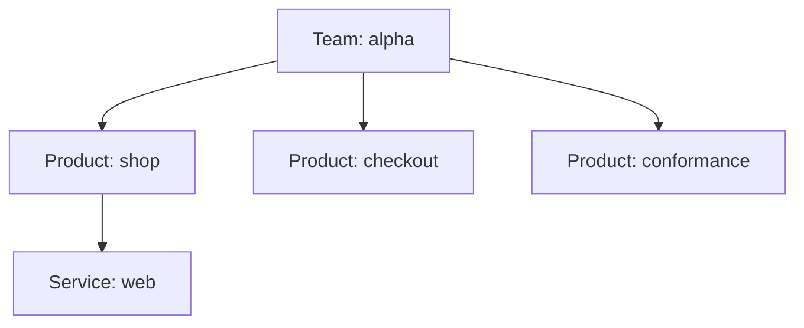

# The domain model — Team, Product, Service, Environment

> **Who this is for:** everyone on the platform. This is the shared vocabulary — a **developer** needs it
> to know where their code lives and what they own; a **platform engineer** needs it because provisioning,
> access, delivery, and cost all hang off it. **Before you start:** you only need to have seen software
> get built and shipped somewhere before.
>
> **Already know the model?** The [reference](reference.md) is the terse schema-and-naming lookup.

## The problem this solves

A platform runs *many* teams' *many* products, each in several environments, each with services that need
image registries, permissions, and access rules. Ask a simple question — "who owns this thing, and where
does it run?" — and without a shared model you get a different answer every time. Names drift, ownership
is folklore, and there's no consistent way to scope access or attribute cost.

So before the platform can provision anything, it needs a precise, shared answer to *who owns what, and
where does it run.* That answer is the **domain model**: a handful of nouns — **Team, Product, Service,
Environment** (and **Customer**) — and the exact relationships between them.

## Why this matters at all

It's tempting to see this as bureaucracy. It's the opposite — it's the thing that lets everything else be
*automatic*. Because the model is precise, the platform can *derive* almost everything from it: what your environment's
isolated space is called, where your service's builds are stored, what your app may access in the cloud,
who's allowed to deploy, and which budget your spend lands in. Get the model right and a nine-line request becomes a fully-wired environment (that's
the [Environment API](../environment-api/orientation.md)). Get it wrong — or leave it vague — and none of
that can be automated, because the platform can't agree with itself on what anything *is*. The domain
model is the shared vocabulary that makes a multi-tenant platform composable instead of chaotic.

## The one idea to leave with

Two shapes, and the whole model is the interplay of them:

> **Ownership is a tree. Deployment is a grid.**

- **Ownership is a tree:** a **Team** owns **Products**, and a Product owns **Services**. Straight
  hierarchy — every service has exactly one owner, traced up the tree.
- **Deployment is a grid:** picture a spreadsheet with **Products down the side and Stages across the
  top** (dev, test, staging, prod). Every filled-in cell is an **Environment** — one product at one stage.

That's the ownership **tree**:



And here's the deployment **grid** — products down the side, stages across the top. A product **promotes
up the ladder** (dev → test → staging → prod), filling a cell at each stage; every filled cell is an
Environment:

| Product ↓ · Stage → | dev | test | staging | prod |
| --- | --- | --- | --- | --- |
| **shop** | `alpha-shop-dev` | `alpha-shop-test` | `alpha-shop-staging` | `alpha-shop-prod` |
| **checkout** | `alpha-checkout-dev` | `alpha-checkout-test` | `alpha-checkout-staging` | `alpha-checkout-prod` |
| **conformance** | `alpha-conformance-dev` | `alpha-conformance-test` | — | — |

The story these cells tell is illustrative: **say `shop` calls `checkout`** — then the two must promote
**together**, since you wouldn't run `shop` in prod without the `checkout` it depends on. A standalone
product promotes on its own (here, `conformance` simply hasn't gone past test). **An Environment is just a
cell that's been filled in — and the grid grows as a product promotes.**

*(That's the typical shape. This reference platform is still young, so its live grid is currently sparser —
you'll see the actual environments a few sections down. Same shape, just less filled in.)*

Where the spreadsheet picture breaks — worth naming so you don't over-trust it: a cell in a real
spreadsheet is inert data, but an Environment is a **live, running namespace**. (A
[*namespace*](https://kubernetes.io/docs/concepts/overview/working-with-objects/namespaces/) is the
Kubernetes term for an isolated slice of a
[**cluster**](https://kubernetes.io/docs/concepts/overview/components/) — the pool of machines the platform
runs apps on. Kubernetes is the system doing that running. For our purposes: one Environment = one
namespace = your app's own walled-off space on the platform.) And the cells aren't
independent — a product promotes up its row *in order*, and related products move *together* (as in the
`shop`/`checkout` example above). The grid is a good map of *what exists*; it isn't a claim that any cell
can be filled in isolation.

The reason to keep these *separate* is the model's central move: **who owns a thing and where it runs are
different questions.** `shop` is owned by `alpha` (one place in the tree) but runs in several cells of the
grid (dev, prod, …). Everything else follows from holding those two shapes in your head.

> **Quick check:** in one sentence — what's the difference between a **Product** and an **Environment**?
> (If it's fuzzy: one is a row in the grid, the other is a cell.)

## Follow one for real: Team `alpha`

Let's walk a real team down the tree and across the grid. Everything below is live on the platform.

**The Team** — the root of the ownership tree, and the unit of governance:

```console
$ kubectl --context preprod get teams
NAME       SSO GROUP   STAGES                                  ENVIRONMENTS
alpha      Dev-alpha   ["dev","test","uat","staging","prod"]
bravo      Dev-bravo   ["dev","test","uat","staging","prod"]
platform   Platform    ["dev","prod"]
```

A **Team** is an owner: an **SSO group** (single sign-on — your company login; the group is who's *in* the
team) plus an envelope (what it's *allowed* to do — more in a moment). A team owns no infrastructure of
its own; it owns Products.

**The Products** — the middle of the tree. Here's every product on the platform; three of them are
`alpha`'s (the others belong to teams `bravo` and `platform`):

```console
$ kubectl --context preprod get products
NAME                      TEAM       REPO                                  TENANCY
alpha-checkout            alpha      asanexample/alpha-checkout            pooled
alpha-conformance         alpha      asanexample/alpha-conformance         pooled
alpha-shop                alpha      asanexample/alpha-shop                pooled
bravo-widgets             bravo      asanexample/bravo-widgets             pooled
platform-triage-copilot   platform   asanexample/platform-triage-copilot   pooled
```

A **Product** is a deployable thing a team builds — here, `shop`. It maps to exactly **one repository**
(`asanexample/alpha-shop`), and that's where its **Services** live. A Service is a single running
component (a web frontend, an API); `shop` has one, called `web`. One repo can hold several services (a
monorepo), but a repo always belongs to exactly one Product — which is why each service's **image** (its
packaged, runnable build — a *container image*) is named per-product (we'll see that in the naming).

**The Environments** — the grid. Each cell where a Product meets a Stage that actually exists:

```console
$ kubectl --context preprod get xenvironment   # AGE column elided — it drifts
NAME                    SYNCED   READY   COMPOSITION
alpha-checkout-dev      True     True    environment
alpha-conformance-dev   True     True    environment
alpha-shop-dev          True     True    environment
alpha-shop-prod         True     True    environment
bravo-widgets-dev       True     True    environment
```

There's the live list — the actual environments on the platform right now, across teams `alpha` and
`bravo`. It's sparser than the typical grid above (this reference platform is still young), but the shape
is identical: every row is a product, every filled cell an **Environment** — *a Product at a Stage*,
`(product × stage)`. (For products that serve external customers, prod environments add a third
coordinate — a **Customer** — but `shop` is pooled, so it's just product × stage.)

> **Quick check:** `alpha-shop-prod` — which Team owns it, which Product is it, and what stage? Read the
> name.

### The names are just coordinates

Once you hold the tree and the grid, the platform's naming stops looking cryptic — every name is just the
model's coordinates, in a fixed order:

| Name you'll see | Pattern | Reads as |
| --- | --- | --- |
| namespace `alpha-shop-dev` | `<team>-<product>-<stage>` | alpha's shop, in dev |
| image `team-alpha/shop-web` | `team-<team>/<product>-<service>` | alpha's shop's web service |
| host `shop-alpha-dev.preprod.aws.refplat.org` | `<product>-<team>-<stage>.<domain>` | shop, alpha, dev |

If you can read one, you can read all of them — they're the same coordinates in different orders.

Two things about that host trip people up. First, the `preprod` in it isn't a typo next to `dev`: **`dev`
is the *stage*; `preprod` is the *cluster* these run on.** Today both `shop-alpha-dev.preprod…` and
`shop-alpha-prod.preprod…` sit on the same preprod cluster — the stage (dev vs prod) changes, the cluster
(preprod) doesn't. *Stage* (where on the promotion ladder) and *placement* (which cluster) are separate
concerns; the platform decides placement. Second, the coordinate order flips — namespace is
`team-product-stage`, the host is `product-team-stage` — purely for subdomain readability; no meaning hides
in the order.

### Services run inside Environments

We've met the tree's leaf (**Service**) and the grid's cell (**Environment**) separately. Here's the piece
that connects them — and it's the one that makes the whole model click. A **Product has two kinds of
children**:

- its **Services** — what it's *made of* (the running components), the same list at every stage;
- its **Environments** — *where it runs* (one cell per stage).

And a **Service runs inside each Environment.** `shop`'s `web` service runs in `alpha-shop-dev` (a copy in
dev) *and* in `alpha-shop-prod` (a copy in prod) — one service, deployed into two environments.

That's the deeper reason the two names are shaped differently. The **image** `team-alpha/shop-web` is the
*service's identity* — product + service — and it doesn't change as the service climbs the stages. The
**namespace** `alpha-shop-dev` is the *environment* — product + stage — the place a copy of it runs.
Identity stays put; the place changes per stage.

> **Quick check:** if `shop` added a second service `api`, how many *new environments* would appear — and
> what would `api`'s image name be?

## The Team is an *envelope*

One more idea, because it's what makes self-service *safe*. A Team isn't just a label at the top of the
tree — it's a **boundary**. Its `envelope` sets the bounds on everything its Products and Environments may
do. Team `alpha`'s, from its registry file (`gitops/teams/alpha.yaml`):

```yaml
envelope:
  allowedTiers: ["standard"]
  allowedStages: ["dev", "test", "uat", "staging", "prod"]
  quotaCap: { cpu: "8", memory: 16Gi, pods: 40 }
  budget: { monthlyUSD: 2000 }
```

A couple of terms in there: a **tier** is the hardening/compliance level an environment runs at —
`standard` for ordinary apps; regulated ones like `pci` (payment-card data) or `hipaa` (health data) force
stronger isolation. And `pods` in the quota are just running instances of your app (Kubernetes runs your
containers in units called [*pods*](https://kubernetes.io/docs/concepts/workloads/pods/)).

Here's what that envelope *does*. When someone submits an environment, it passes through
[**admission**](https://kubernetes.io/docs/reference/access-authn-authz/admission-controllers/) — the
checkpoint every resource crosses on its way into the cluster. Before Kubernetes will accept your
environment, a **policy engine** (the platform uses one called [**Kyverno**](https://kyverno.io/docs/))
inspects it against the rules
and either lets it in or turns it away — think of a bouncer at the door, checking each guest against a
list. Nothing that fails ever gets inside. The Team's envelope is one of those rules: **an environment
that steps outside its Team's envelope is rejected at admission.**

That's *why* a team can create environments freely without a platform engineer reviewing each one — the
bounds are declared once, on the Team, and enforced automatically on everything below it. (The platform's
full set of admission rules — its *policy regime* — is a subsystem of its own; a future module will cover
it. For now, "admission = the bouncer at the cluster door" is all you need.)

### Try it yourself: what does the envelope let through?

No cluster needed — just the envelope above. For each request, decide whether admission **accepts** or
**rejects** it, and why:

1. A `shop` environment at the **`pci`** tier.
2. `alpha-shop-dev` asking for **12 CPUs**.
3. A `shop` environment in a stage called **`canary`**.
4. `alpha-shop-dev` at the **`standard`** tier, **4 CPUs**.

<details>
<summary>Answers</summary>

1. **Rejected** — `pci` isn't in alpha's `allowedTiers` (`["standard"]`).
2. **Rejected** — 12 CPUs exceeds the `quotaCap` of 8.
3. **Rejected** — `canary` isn't in `allowedStages` (and isn't a real stage at all).
4. **Accepted** — standard tier and 4 CPUs are both inside the envelope.

Every rejection is the *same* move: the bounds live on the Team, and the bouncer checks each request
against them at admission. That's the whole trick to safe self-service.

</details>

## One more deployment shape: agents

The grid — Products × Stages — covers *regular* workloads. But there's a second kind of thing this
platform runs: **agents** — long-running AI agents that watch the system and act on it. The first is a
**triage copilot** that helps diagnose incidents; it's the `platform-triage-copilot` you saw in the
products list. Here's how it fits:

- **Ownership is the same tree.** An agent's code is just a **Product**, owned by a Team like any other —
  here, `triage-copilot`, owned by team `platform`.
- **Deployment is a different shape.** A regular Product deploys as an **Environment** (a namespace at a
  stage — the grid). An agent deploys as an **`XAgent`** instead: it doesn't climb the dev→prod ladder,
  it runs on the platform's central **hub** cluster, with a language model, a strict **autonomy limit**
  (the triage copilot is *propose-only* — it can suggest a fix, never make one), and a **trigger** that
  wakes it up (an alert firing).

So there's one ownership tree, and — so far — **two deployment shapes** hanging off it: **Environments**
for workloads, **Agents** for AI agents. The full agent story (the runtime, the guardrails, the autonomy
ladder) is a subsystem of its own; a future module will cover it.

> **Quick check:** `platform-triage-copilot` — which Team owns it, and how does its *deployment* differ
> from `alpha-shop-dev`?

## How the model is represented

The model isn't an abstraction living in someone's head — it's **files in git**. Each noun is a small YAML
file in a registry:

- `gitops/teams/<team>.yaml` — the Team + its envelope
- `gitops/products/<team>/<product>.yaml` — the Product (repo, tenancy, domains) → [Onboarding a Product](../products/orientation.md)
- `gitops/environments/<team>/<product>/<stage>.yaml` — the Environment claim (what the
  [Environment API](../environment-api/orientation.md) turns into real infrastructure)

A controller then **projects** each file onto each cluster that runs the Environment API (today, the
preprod workload cluster) — reads it and creates a matching read-only
record called a [**custom resource**](https://kubernetes.io/docs/concepts/extend-kubernetes/api-extension/custom-resources/)
(a `Team`, a `Product`; Kubernetes lets the platform define its own kinds of record, and that's what you
were listing with `kubectl get teams`). So the bouncer at the door
and the provisioner (the machine that turns a claim into real infrastructure — the
[Environment API](../environment-api/orientation.md)) can read the model when they need it. Git is the
source of truth; the cluster holds a live mirror.

## Common mix-ups

- **"A Product is an app."** Close, but a Product can hold *several* Services (a monorepo), and the mapping
  is one **repo** per Product. "App" is fuzzy; Product / Service is precise.
- **"An Environment is a cluster, or a place."** No — an Environment is a `(product × stage)` cell, which
  becomes a **namespace**. A **Stage** (dev/prod) is a rung on a promotion ladder, *not* a location; where
  it physically runs is decided separately.
- **"The Team owns the environments directly."** Ownership flows Team → Product → Service. An Environment
  is a *Product realized at a stage* — it hangs off the Product, not straight off the Team.
- **"Access follows ownership."** No — and this is deliberate. Ownership is a tree (one owner each), but
  **access is many-to-many**: a developer on another team can be *granted* access to your Product without
  owning it. The model keeps "who owns it" and "who may touch it" on separate edges.

## The whole thing on one screen

- **The nouns:** **Team** (owner + envelope) → **Product** (a deployable, one repo) → **Service** (a
  running component). **Environment** = a Product at a **Stage**. **Customer** = an external consumer (adds
  a coordinate to per-customer prod).
- **The one idea:** ownership is a **tree** (Team→Product→Service); deployment is a **grid**
  (Environment = Product × Stage). Who-owns-it ≠ where-it-runs.
- **A Product's two kinds of children:** **Services** (what it's *made of*, same at every stage) and
  **Environments** (*where it runs*, one per stage) — and each Service runs in each Environment.
- **Two deployment shapes:** most Products deploy as **Environments** (the grid); some are **Agents**
  (`XAgent`) — AI agents on the hub, not stage-gridded — same ownership tree, different deployment.
- **The envelope:** the Team bounds tiers / stages / quota / budget for everything below it — enforced at
  admission, which is what makes self-service safe.
- **The naming:** every name is the model's coordinates — `<team>-<product>-<stage>` (namespace),
  `team-<team>/<product>-<service>` (image).
- **Where it lives:** YAML in `gitops/`, projected as `Team` / `Product` CRs the cluster can read.

## Explain it back

Close this and see if you can answer:

1. Draw the ownership tree and the deployment grid for Team `alpha`. Which is `shop` a node in, and which
   is `alpha-shop-dev` a cell in?
2. Why are ownership and access modeled as *different* relationships?
3. What is the Team's **envelope**, and why does it make self-service safe?
4. Given the name `bravo-widgets-dev`, name the team, product, and stage — and what the image path for a
   service `api` in it would be.

If those flow, you have the vocabulary the rest of the platform is built on — the
[Environment API](../environment-api/orientation.md) is the machine that turns one grid cell into real
infrastructure.

## Go deeper

- [Environment API](../environment-api/orientation.md) — how a single Environment (grid cell) gets
  provisioned.
- Reference (this module): the [full noun-by-noun schema, relationships, and naming](reference.md).
- Source of truth: [Platform Domain API](../../architecture/platform-domain-api.md) (the normative schema)
  and [ADR-067](../../adrs/067-idp-domain-model.md) (the decision + rationale).
