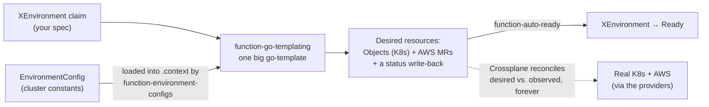

# Deep dive: how the Composition renders

> A **deep dive** — assumes [the orientation](orientation.md) (you know one claim becomes ~16 resources)
> and ideally its `crossplane render` exercise. This opens the machine the orientation called "a recipe"
> and shows, in real detail, how it turns one claim into the footprint. For platform engineers who
> **operate or extend** the Environment Composition. Longer than the orientation on purpose — this is the
> deep end.

## The question this answers

The orientation showed one claim → sixteen resources and called the Composition "the recipe." That's the
right *mental model*. But to change or debug it you need the guts: **how, mechanically, does the
Composition render sixteen specific resources from your nine-line claim — and how do those become real
things in AWS and the cluster?** It's one idea, a three-step pipeline, and a lot of go-template.

## The one idea: rendered footprint = f(your claim, this cluster's constants)

The Composition is a pure function of **two** inputs:

1. **Your claim** — what you asked for (`team`, `product`, `stage`, `services`, `quota`, …).
2. **This cluster's constants** — the ECR registry, the account IDs, the permissions-boundary ARN, the
   base domain, the cross-account pull accounts — things that differ per cluster and must *not* live in a
   portable claim.

It reads both and emits a **set of desired resources** — it's the *recipe* from the orientation, opened up.
Same recipe, different ingredients per cluster (your claim + this cluster's constants) → preprod-flavoured
resources on preprod, prod-flavoured on prod. Everything below is *how* it reads the ingredients and *what*
it emits.



## The pipeline: three functions

The Composition runs in `mode: Pipeline` — an ordered list of
[functions](https://docs.crossplane.io/latest/composition/composition-functions/), each handed the
previous one's output plus a shared **context**:

- **`load-environment` → [`function-environment-configs`](https://github.com/crossplane-contrib/function-environment-configs).**
  Finds the [`EnvironmentConfig`](https://docs.crossplane.io/latest/composition/environment-configs/) named
  `platform-cluster-config` and drops it into the pipeline `context` under a well-known key, so later steps
  can read the cluster constants without hard-coding them.
- **`render-resources` → [`function-go-templating`](https://github.com/crossplane-contrib/function-go-templating).**
  Runs *one* large inline go-template. Its output is a
  multi-document YAML stream — one YAML doc per desired resource. This is where almost all the logic lives.
- **`ready` → [`function-auto-ready`](https://github.com/crossplane-contrib/function-auto-ready).** Watches the composed resources and marks the `XEnvironment` `Ready`
  once they report ready. No logic of its own — it just closes the loop.

The middle step is the machine; the other two feed it and finish it.

## Input 1 — your claim (and the desired/observed model)

Crossplane hands the go-template the **observed** state — the live objects as they currently are — and the
template returns **desired** state — what should exist. It reads the claim off the observed composite:

```gotemplate
{{- $spec  := .observed.composite.resource.spec }}
{{- $xrName := .observed.composite.resource.metadata.name }}
{{- $team := $spec.team }}{{- $product := $spec.product }}{{- $stage := $spec.stage }}
```

That observed/desired split is the whole reason this is safe to re-run: the template is a *pure function of
the observed claim*, run every reconcile. It never mutates; it just re-declares what should exist, and
Crossplane diffs desired-vs-observed and closes the gap. This is the **thermostat from the orientation,
seen from the inside**: the template writes the *set-point* (desired), Crossplane reads the *thermometer*
(observed) and drives toward it — forever. This deep dive is the desired half; the thermostat never stops.

Almost everything is *derived*, not stored. The namespace name is computed as `<team>-<product>-<stage>`,
with a deterministic truncate-and-hash if it would blow the 63-char DNS limit:

```gotemplate
{{- $ns := printf "%s-%s-%s" $team $product $stage }}
{{- if gt (len $ns) 63 }}{{- $ns = printf "%s-%s" (substr 0 56 $ns) (substr 0 6 (sha256sum $ns)) }}{{- end }}
```

## Input 2 — the cluster's constants (an EnvironmentConfig)

The values that can't live in a portable claim come from an **EnvironmentConfig** named
`platform-cluster-config`. Step one loaded it into `context`; the template reads it back:

```gotemplate
{{- $cfg := index .context "apiextensions.crossplane.io/environment" }}
{{- $ecrCfg := $cfg.providerConfigEcr | default "default" }}
{{- $pullAccts := $cfg.pullAccountIds | fromJson }}          {{/* stored as a JSON-array string */}}
{{- $ecrPrincipals := list }}
{{- range $a := $pullAccts }}{{- $ecrPrincipals = append $ecrPrincipals (printf "arn:aws:iam::%s:root" $a) }}{{- end }}
```

That EnvironmentConfig is **[Helm](https://helm.sh/docs/)-templated per cluster** from the module's inputs:

```yaml
data:
  ecrRegistry: "<platform-acct>.dkr.ecr.us-east-1.amazonaws.com"
  workloadAccountId: "…"
  permissionsBoundaryArn: "arn:aws:iam::…:policy/environment-permissions-boundary-…"
  providerConfigEcr: "platform-ecr"     # which credentials the ECR resources use
  pullAccountIds: "[\"620…\",\"554…\"]" # JSON-array string → the cross-account pull principals above
```

So the claim stays clean *because* the constants are injected here — and notice `$ecrPrincipals` is already
being built from `pullAccountIds`. Hold that; it's about to matter for the cross-account ECR repo.

## Worked resource A — the namespace (a Kubernetes `Object`)

Kubernetes-side resources are emitted as an **`Object`** — a provider-kubernetes
[managed resource](https://docs.crossplane.io/latest/managed-resources/) (MR) that *wraps a plain
Kubernetes manifest*. Each carries a `composition-resource-name` annotation so Crossplane
can track it across reconciles:

```gotemplate
kind: Object
metadata:
  annotations:
    gotemplating.fn.crossplane.io/composition-resource-name: namespace
spec:
  providerConfigRef: { name: default }        # in-cluster
  forProvider:
    manifest:
      apiVersion: v1
      kind: Namespace
      metadata:
        name: {{ $ns }}
        labels:
          platform.refplat.org/team: {{ $team }}
          platform.refplat.org/product: {{ $product }}
          platform.refplat.org/stage: {{ $stage }}
```

Render it offline and that's exactly what falls out — a real `crossplane render` of the `demo-dev` fixture
(from the module's `.environment-api-tests/`):

```console
crossplane render environments/demo-dev.yaml ../charts/environment-api/files/composition.yaml \
  render/functions.yaml --extra-resources render/environmentconfig.yaml
```

```yaml
kind: Object
# ...
spec:
  forProvider:
    manifest:
      apiVersion: v1
      kind: Namespace
      metadata:
        labels:
          app.kubernetes.io/managed-by: crossplane
          platform.refplat.org/product: demo
          platform.refplat.org/stage: dev
          platform.refplat.org/team: alpha
          platform.refplat.org/tier: standard
```

Input → template → output.

## Worked resource B — the ECR repository (an AWS MR, and the cross-account hop)

The AWS side is more interesting, and it's where the orientation's "one cross-account hop" becomes
concrete. Inside the service loop, the template emits an `ecr.aws.upbound.io` **`Repository`** — a real AWS
resource this time, not a wrapped manifest:

```gotemplate
{{- range $svc, $svccfg := $spec.services }}
{{- $repo := printf "team-%s/%s-%s" $team $product $svc }}
kind: Repository
metadata:
  annotations:
    gotemplating.fn.crossplane.io/composition-resource-name: ecr-repo-{{ $svc }}
    crossplane.io/external-name: {{ $repo }}
spec:
  deletionPolicy: Orphan                       # product-scoped + shared across stages — never delete on teardown
  providerConfigRef: { name: {{ $ecrCfg }} }   # ← "platform-ecr": assume-role into the PLATFORM account
  forProvider:
    region: {{ $cfg.region }}
    imageTagMutability: IMMUTABLE_WITH_EXCLUSION
    ...
{{- end }}
```

Two things make this the cross-account hop:

1. **`providerConfigRef: platform-ecr`** — every *other* resource used `default` (Pod Identity in the
   *workload* account); this one uses `platform-ecr`, a ProviderConfig that
   *assume-role-chains* (hops into a role in another account) into the **platform** account. So the repo is
   created *there*, centrally.
2. **The `RepositoryPolicy`** grants pull to `$ecrPrincipals` — the `arn:aws:iam::<acct>:root` list we
   built from the EnvironmentConfig's `pullAccountIds` — so the workload accounts can pull the image back.

Render the fixture and the `ecr-repo-web` resource shows the tell-tale pair — a product-scoped external
name, and the `platform-ecr` ProviderConfig (every *other* resource in that render uses `default`):

```yaml
# the ECR Repository, straight out of `crossplane render` of demo-dev:
metadata:
  annotations:
    crossplane.io/composition-resource-name: ecr-repo-web
    crossplane.io/external-name: team-alpha/demo-web
spec:
  providerConfigRef:
    name: platform-ecr
```

One template, reading one set of cluster constants, produces a resource in a *different* AWS account with a
policy back to the workload accounts. That's the whole cross-account story, in ~15 lines of go-template.

## Where "sixteen" comes from — a fixed set + the service loop

Some resources render **once** per environment (namespace, quota, limit-range, network policies,
rolebinding, the two Kyverno policies). The rest render **per service**, inside that
`range $svc, $svccfg := $spec.services` loop — for each service: an ECR `Repository`, its
`RepositoryPolicy` and `LifecyclePolicy`, an IAM `Role`, a `PodIdentityAssociation`, and (if declared)
self-service S3/SQS/… resources. So:

> **footprint size = the fixed set + (per-service resources × number of services)**

`shop` has one service (`web`), which is exactly why its footprint is the size it is; a two-service product
renders a second stack of ECR + IAM + Pod-Identity resources.

> **Try it — prove the formula.** Render `demo-dev`, then add a second service to the claim
> (`services: { web: { … }, api: {} }`) and re-render. Count the resources: the fixed set is unchanged, and
> a full per-service stack — ECR `Repository` + policies, IAM `Role`, `PodIdentityAssociation` — appears for
> `api` (even with no image; a no-image service is *provisioned-but-not-yet-deployed*). Formula proven.

## The status write-back — one derivation, two outputs

The Composition doesn't only create *child* resources — it also writes the composite's **own status**. Near
the end, the template builds the environment's host list (the generated
`<product>-<team>-<stage>.<baseDomain>` plus any bound `spec.domains`) and emits a *bare* `XEnvironment`
carrying just `status.domains`:

```gotemplate
{{- $gen := printf "%s-%s-%s.%s" $product $team $stage $base }}
kind: XEnvironment
metadata: { name: {{ $xrName }} }
status:
  domains:
    - host: {{ $gen }}
      state: Active
      reason: GeneratedHost
```

And here's the elegant part: **that same host list feeds two outputs** — the `status.domains` above *and*
the Kyverno `restrict-route-hostnames` policy's allow-list (rendered right after, from the same `$allowed`
variable). One derivation, two consumers: the status you read and the guardrail that enforces it can't
drift apart, because they're computed from the same list in the same pass.

## From render to reconcile — how "desired" becomes real

The template's whole output is *desired state* — a pile of Objects and AWS MRs. It doesn't create anything
itself. What happens next is the reconciliation from the orientation:

1. Crossplane takes the desired resources and **diffs them against observed** (what already exists).
2. For anything missing or drifted, the relevant **provider** (provider-kubernetes, provider-aws) makes the
   real thing — the actual namespace, the actual ECR repo in the platform account, the actual IAM role.
3. `function-auto-ready` marks the `XEnvironment` `Ready` once they're all healthy.
4. And it **never stops** — every reconcile re-runs this exact template and re-closes the gap. That's why
   deleting the ECR repo by hand just brings it back: the next render still *desires* it.

So "render" (compose the desired set) and "reconcile" (drive reality to it) are the two halves — this deep
dive is the first half; the orientation's self-heal is the second.

## The go-template toolbox

The template isn't string substitution — it's [Go templates](https://pkg.go.dev/text/template) plus
[Sprig](https://masterminds.github.io/sprig/) functions, so you have a real little language: `printf`, `index`, `range`, `default`, `dict`/`list`,
`append`, `set`, `uniq`, `sortAlpha`, `fromJson`/`toJson`, `sha256sum`, `substr`. That's how it derives
names, parses the JSON-string constants, builds principal lists, and de-dupes hosts — all at render time,
before anything touches a cluster.

## A few things that will bite you

- **The Composition ships *raw*; the EnvironmentConfig does not.** The Composition file is emitted verbatim
  by its Helm wrapper — `{{ .Files.Get "files/composition.yaml" }}` — so Helm leaves its `{{ }}` untouched.
  Those braces are a **go-template run by `function-go-templating` on the cluster**, *not* Helm. The
  `EnvironmentConfig` next to it **is** an ordinary Helm template (its `{{ .Values… }}` are filled at
  install time). Same braces, opposite processors — edit accordingly.
- **`composition-resource-name` is a resource's identity across reconciles.** Think of it as the
  resource's **name tag**: each reconcile, Crossplane matches this render's resources to the last render's
  by the tag. Rename the tag and it sees a stranger — it seats the new resource and evicts the old. A quiet
  way to churn a live environment (and the ECR repo's `deletionPolicy: Orphan` is precisely the guard
  against that costing you images).

(A third, for completeness: a `suspended`/`decommissioning` lifecycle *zeroes the ResourceQuota* in the
template — a reversible grace state — while retaining everything else.)

## Working on it safely

- **Render before you apply — always.** `crossplane render` runs the *real* pipeline functions offline, no
  cluster; the harness's `render.sh` renders the fixtures **and** asserts the footprint. You see exactly
  what your change produces before it touches a live environment. Change a line, re-render, diff.
- **Treat XRD / Composition edits as high-risk.** A breaking change can cascade to *live* `XEnvironment`s.
  The render harness is your safety net; never blind-apply.

## Go deeper

- The `crossplane-composition-authoring` house skill — the authoring how-to (producer side).
- [Crossplane Environment API](../../architecture/crossplane-environment-api.md) — the as-built reference.
- Back to [the orientation](orientation.md) · the [reference](reference.md).
