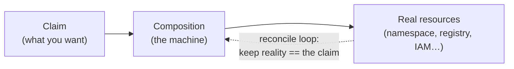
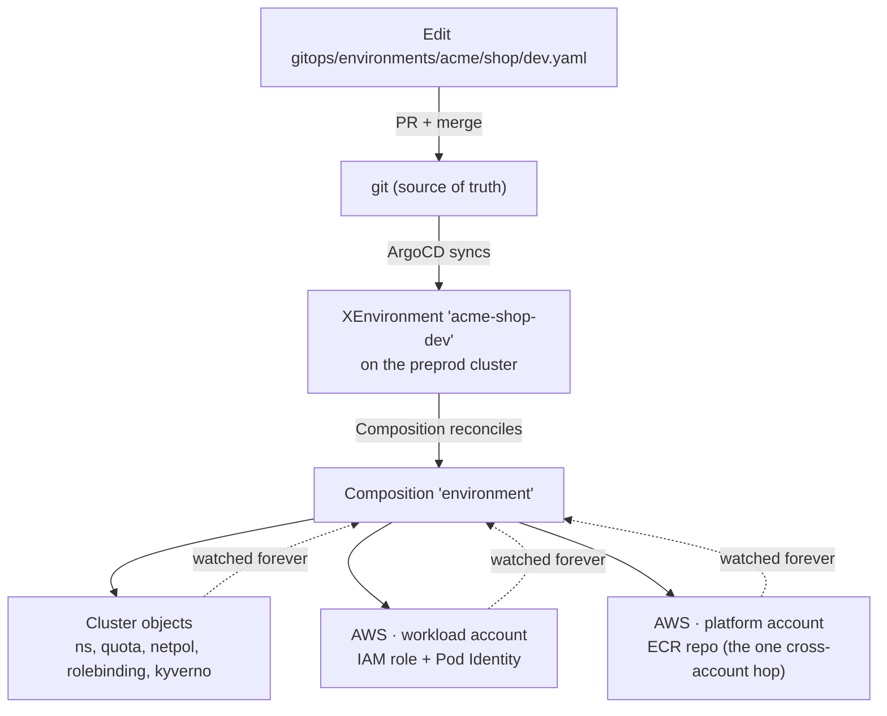

# The Environment API — how a new environment gets built

> This is for platform engineers who want to understand, operate, or extend the machine that
> provisions environments. Developers don't need it — jump to
> [the 2-minute version](#developers-the-2-minute-version) at the bottom. It assumes only that you
> know roughly what a container is and that Kubernetes has resources — a Deployment, a Namespace —
> that you describe in YAML and it makes real. Everything else is built up here.
>
> Already fluent in Crossplane? Skip the walkthrough — the [Reference](reference.md) is the terse
> lookup: schema, commands, gotchas.

## The problem this solves

A team wants somewhere to run a new service. Not just a namespace — they need the *whole* footprint: a
namespace with sensible limits, an image registry scoped to them, AWS permissions for the app, network
rules, the policy guardrails. The old way to get all that is a pile of tickets and a week of waiting.

On this platform you write one short YAML file, open a pull request, and a few minutes after it merges
the whole footprint exists — and stays correct afterward. The machine that makes that true is the
**Environment API**.

## Why not just do it by hand?

You could give every team an account and let them make a namespace, an IAM role, and a registry
themselves. Plenty of places do. By hand, though, four things go wrong at once:

- **It's slow.** Every environment becomes a little project; the platform team turns into a ticket queue.
- **It's inconsistent.** Everyone wires it up differently, so nothing is predictable, auditable, or
  reproducible — and six months on, no one remembers how any of it was built.
- **It's unsafe by accident.** Someone forgets the network policy, over-scopes the IAM role, ships
  `:latest`. Security becomes "did everyone remember to do the right thing?" — which, at scale, means no.
- **It drifts.** Hand-built things rot; reality and intent quietly diverge.

The bet this platform makes: make the safe, correct, compliant setup the *easy* one. A team writes a
compact request and gets a fully-wired, guardrailed environment in minutes, correct by default.
Developers get autonomy without becoming infra experts, the org gets consistency and compliance by
construction rather than by everyone remembering, and the platform team maintains one machine instead of
fulfilling a thousand tickets.

You don't scale a platform by adding people to a queue; you scale it by encoding the golden path as an
API, so the right way *is* the default way. The Environment API is that idea made concrete — one instance
of the larger case for why the whole platform exists.

## The one idea to leave with

The whole thing in one sentence:

> **You write down what you want; a machine builds it, and then spends the rest of its life keeping
> reality matching what you asked for.**

That's it. The "what you want" is a file called a **claim**. The machine is a **Composition**. And
"keeping reality matching" — continuously, not once — is the part that makes this different from a script.

The last part is easiest to feel as a **thermostat**. You never tell a thermostat "run the heater for ten
minutes" — you tell it the temperature you *want*, and it spends all day quietly closing the gap: heat
clicks on when the room drifts cold, off when it's warm. It never "finishes." Crossplane is a thermostat
pointed at infrastructure — you set the desired state, and it continuously drives reality toward it. (Hold
that thought; near the end you'll see that deleting a resource by hand just makes it come back — the
thermostat noticed the room went cold.)

Where the picture breaks — a metaphor you don't bound will mislead you: a thermostat chases *one number*
toward a *dial* you turn. A control plane reconciles *many* resources toward a whole *declarative spec* —
the "setting" is a file describing desired state, not a temperature. What carries over is the *loop* (never
finishes, always closing the gap); what doesn't is "one dial, one number."



Hold onto that picture. Now watch a real one get built.

## Watch one get built: `acme-shop-dev`

There is a real environment on the platform called `acme-shop-dev`. That name isn't arbitrary — it's three
coordinates from the platform's ownership model: a **Team** (`acme` — who owns it), a **Product** (`shop` —
the thing they're building), and a **Stage** (`dev` — where on the dev → prod ladder this copy sits). An
*environment* is exactly that: one Product at one Stage, and its name is always `<team>-<product>-<stage>`.
So `acme-shop-dev` reads as "Team acme's `shop` product, in dev."

That Team → Product → Stage model stands on its own — the
[domain model](../domain-model/orientation.md) covers it; here we just need the coordinates so the name
makes sense. This environment has run untouched for weeks; we'll follow it end to end.

### 1. The claim — what someone wrote

This is the meaningful spec of the file that asks for the environment (its header comments, the
`requested-by` annotation, and a `preview: true` flag are elided for clarity). It lives in git, at
[`gitops/environments/acme/shop/dev.yaml`](https://github.com/asanexample/platform/tree/main/gitops/environments):

```yaml
apiVersion: platform.refplat.org/v1beta1
kind: XEnvironment
metadata:
  name: acme-shop-dev
spec:
  team: acme
  product: shop
  stage: dev
  tier: standard
  services:
    web:
      serviceAccount: app-acme
```

That's the **claim** — a statement of desired state. Note what's *not* in it: no account IDs, no registry
URLs, no IAM ARNs, no network CIDRs. The claim is the environment-facing contract; all the
platform-specific plumbing is filled in for you (we'll see where from). `XEnvironment` is the **kind** of
thing this is — a custom Kubernetes resource type the platform defines, the same way Kubernetes defines
`Pod` or `Namespace`. The definition of that type is an **XRD** (a Composite Resource Definition) — the
schema that says an `XEnvironment` must have a `team`, a `product`, a `stage`, and may have the rest.

Here's the whole cast in one picture: a **restaurant**. The XRD is the *menu* — what you're allowed to
order. Your claim (the file above) is the *order ticket* you hand in. And the thing that reads your ticket
and actually cooks the meal — coming up in step 3 — is the *kitchen*: the **Composition**. You never tell
the kitchen *how* to cook; you order, and a full plated meal comes out. (The restaurant has one flaw as a
picture: a real kitchen forgets your order the moment it's served — this one never does. That's the
thermostat half: it keeps the meal on your table, forever.)

Hold the two pictures together, with the right one on top. The thermostat is the *idea* — what the system
*does*, and the thing to remember if you remember nothing else. The restaurant just names the *players* —
who's involved. Verb first, cast second.

### 2. The claim reaches the cluster

Nobody runs `kubectl apply` by hand. The file is merged via a pull request, and
[**ArgoCD**](https://argo-cd.readthedocs.io/en/stable/) — the platform's GitOps engine — notices the change
and syncs it onto the cluster. (GitOps just means: git is the source of truth, and a controller
continuously makes the cluster match git.) After the sync, the `XEnvironment` object exists on the
**preprod** cluster:

```console
$ kubectl --context preprod get xenvironment acme-shop-dev
NAME             SYNCED   READY   COMPOSITION   AGE
acme-shop-dev    True     True    environment   15d
```

`SYNCED=True` means Crossplane accepted the claim. `READY=True` means everything it built is healthy.
`COMPOSITION=environment` is the name of the machine that built it — which is what we look at next.

> 📸 **Screenshot:** ArgoCD showing the `environments` Application with the `acme-shop-dev`
> `XEnvironment` synced and healthy — the "nothing is applied by hand" picture. Spec in
> [_screenshots.md](_screenshots.md).

### 3. The Composition fires — one claim becomes seventeen real things

The moment the claim lands, the **Composition** (the machine) reads it and creates the footprint. Every
real thing it makes is a **managed resource** — an object Crossplane creates *and then watches*. Inspect
the cluster and the footprint shows up as a tree — the claim at the root, everything it created hanging off
it:

```console
$ crossplane resource trace xenvironment acme-shop-dev --context preprod
NAME                                       SYNCED  READY  STATUS
XEnvironment/acme-shop-dev                 True    True   Available
├─ Repository/acme-shop-dev-…              True    True   Available
├─ RepositoryPolicy/acme-shop-dev-…        True    True   Available
├─ LifecyclePolicy/acme-shop-dev-…         True    True   Available
├─ Role/acme-shop-dev-…                    True    True   Available
├─ PodIdentityAssociation/acme-shop-dev-…  True    True   Available
├─ Object/acme-shop-dev-…                  True    True   Available
│    …(12 Object rows total — the in-cluster resources)…
└─ Object/acme-shop-dev-…                  True    True   Available
```

(That tree view is `crossplane resource trace`; the [reference](reference.md) has the exact command and a
plain-`kubectl` way to list the same resources.)

You wrote a dozen lines of YAML. The platform created **seventeen real things** across the Kubernetes
cluster *and* two different AWS accounts — and every one of them still reads `True True` weeks later.
Grouped:

**In the cluster** (the twelve `Object/…` rows):

- the [**Namespace**](https://kubernetes.io/docs/concepts/overview/working-with-objects/namespaces/)
  `acme-shop-dev` itself,
- a [**ResourceQuota**](https://kubernetes.io/docs/concepts/policy/resource-quotas/) and
  [**LimitRange**](https://kubernetes.io/docs/concepts/policy/limit-range/) (the cost/blast-radius
  guardrails),
- **NetworkPolicies and CiliumNetworkPolicies** — and yes, those are *two different kinds*. The standard
  Kubernetes [`NetworkPolicy`](https://kubernetes.io/docs/concepts/services-networking/network-policies/)
  carries the portable rules (`default-deny-ingress`, `allow-dns-egress`,
  `allow-gateway-ingress`). The `CiliumNetworkPolicy` carries what the standard API *can't* express —
  because the CNI is [Cilium](https://docs.cilium.io/en/stable/overview/intro/): letting the gateway's
  [Envoy](https://www.envoyproxy.io/docs/envoy/latest/intro/what_is_envoy) reach your app (Cilium tags it
  with a reserved
  `ingress` identity, not a pod or IP the standard policy could match), the host egress that EKS Pod
  Identity needs, and an egress *deny* (`deny-imds-egress`) that blocks pods from reaching the EC2
  instance metadata service (IMDS, `169.254.169.254`) so they can't steal the node's credentials,
- a [**RoleBinding**](https://kubernetes.io/docs/reference/access-authn-authz/rbac/) granting the team's
  developers access in that namespace,
- two **Kyverno ClusterPolicies** — the per-environment admission guardrails (more below).

**In AWS** — the app's identity and its image registry:

- an [**IAM Role**](https://docs.aws.amazon.com/IAM/latest/UserGuide/id_roles.html)
  `Pod-acme-shop-dev-web` and a
  [**PodIdentityAssociation**](https://docs.aws.amazon.com/eks/latest/userguide/pod-identities.html) —
  together, how the app's pod gets AWS permissions without any static keys,
- an [**ECR Repository**](https://docs.aws.amazon.com/AmazonECR/latest/userguide/what-is-ecr.html)
  `team-acme/shop-web` (plus its lifecycle + cross-account pull policy) — the image registry, scoped to
  exactly this team and product.

Here are three of those, live, so you can see they're real and not diagrams:

```console
$ kubectl --context preprod get ns acme-shop-dev --show-labels
NAME             STATUS   AGE   LABELS
acme-shop-dev    Active   15d   platform.refplat.org/team=acme,platform.refplat.org/product=shop,
                                platform.refplat.org/stage=dev,platform.refplat.org/tier=standard,
                                pod-security.kubernetes.io/enforce=baseline, ...

$ kubectl --context preprod get resourcequota -n acme-shop-dev
NAME                REQUEST                                          LIMIT
environment-quota   requests.cpu: 50m/4, requests.memory: 64Mi/8Gi  limits.cpu: 250m/4, ...

$ kubectl --context preprod get clusterpolicy | grep acme-shop-dev
restrict-images-acme-shop-dev             Ready
restrict-route-hostnames-acme-shop-dev    Ready
```

Those two policies are worth a pause. [**Kyverno**](https://kyverno.io/docs/) is the platform's *policy
engine* — the bouncer at the
cluster door that inspects every resource at
[**admission**](https://kubernetes.io/docs/reference/access-authn-authz/admission-controllers/) (the
instant it's submitted) and turns away anything that breaks the rules; the
[domain model](../domain-model/orientation.md) grounds it more.
`restrict-images-acme-shop-dev` is one such rule: a
[pod](https://kubernetes.io/docs/concepts/workloads/pods/) in this namespace can *only* run images from
`team-acme/shop-*`. The environment doesn't just *get* a registry — it comes with an admission rule that
says "you may only run your own images." The footprint includes its own guardrails.

### 4. The whole flow, in one picture



One thing to notice: the ECR repo lives in a **different AWS account** (the platform account) from
everything else (the workload account). That single cross-account reach is deliberate — image registries
are centralized so every environment's images live in one place. It's the *only* boundary the machine
crosses.

> **See the code:** the machine you just watched is two files in the `crossplane` module — the
> [Composition](https://github.com/asanexample/platform/blob/main/infra/modules/crossplane/charts/environment-api/files/composition.yaml)
> (the recipe that renders those seventeen resources) and the
> [XRD](https://github.com/asanexample/platform/blob/main/infra/modules/crossplane/charts/environment-api/templates/xenvironment-xrd.yaml)
> (the schema that defines what an `XEnvironment` may contain). Everything above is rendered by those two.

## What's actually doing the work: Crossplane, briefly

We've been saying "the machine." It's **Crossplane**, and it's worth understanding at a high level because
it explains *why* the environment stays correct.

Crossplane is a **control plane** — the thermostat from earlier, made real. A control plane is a program
with one obsession: make *actual state* match *desired state*, over and over, forever. It never runs once
and stops; it keeps closing the gap. That continuous compare-and-fix is called **reconciliation**.

The property that makes reconciliation *robust* has a name borrowed from electronics — **level-triggered**
— and it's clearest against its opposite:

- **Edge-triggered** = react to the *event*, the moment of change. A motion-sensor light flips on when it
  *detects movement*; stand still, or let it miss the movement, and you're left in the dark. Miss the
  event, miss your chance.
- **Level-triggered** = react to the *current state*, continuously, as long as it holds. A thermostat
  doesn't care *when* or *why* the room got cold — it just keeps asking "is it cold right now?" and acts.
  It can't "miss an event," because it isn't watching for events at all.

Crossplane is level-triggered: it never depends on catching the *event* that your ECR repo was deleted —
every loop just re-compares desired-against-actual and closes whatever gap it finds. That's why a dropped
message, a crash, or a manual `kubectl delete` can't knock the environment out of shape for long — the
next pass still sees the discrepancy and fixes it. (If you know Kubernetes, it's the same reason asking
for "3 replicas" quietly heals a dead pod — here, pointed at AWS.)

Crossplane takes that same idea and points it at things *outside* Kubernetes — AWS, in our case. It
does this through **providers** (plugins that know how to talk to AWS's IAM, ECR, EKS APIs) and it
represents each external thing as a managed resource *inside* the cluster. So the `Repository` and
`Role` rows in that trace are Kubernetes objects that are really an ECR repo and an IAM role in AWS.

Why does this matter in practice? Because it's *level-triggered*, the environment **self-heals**. If
someone deleted that ECR repository in the AWS console right now, Crossplane would notice reality no
longer matches the claim and recreate it. That's the difference between this and a provisioning
*script*: a script runs once and walks away; a control plane never stops caring. That's why every row
above still says `True True` weeks later.

Two more terms and you have the whole vocabulary:

- The **Composition** we keep naming is the *recipe* the control plane follows to turn one `XEnvironment`
  into those seventeen resources. It runs as a small **pipeline** of three steps: load the cluster's
  constants, render all the resources from your claim, then mark everything ready.
- The cluster's constants — the account IDs, the registry URL, the base domain, the permissions boundary
  — are **not** in your claim (that's why the claim stayed clean). They're injected from a per-cluster
  object called an **EnvironmentConfig**. This is how the *same* Composition produces preprod-flavored
  environments on preprod and would produce prod-flavored ones on prod: same recipe, different constants.

## When it breaks — and rights itself

The `True True` you keep seeing isn't decoration — it's the loop reporting in. Every managed resource
carries two conditions you'll learn to read at a glance:

```console
$ kubectl --context preprod get role.iam.aws.upbound.io acme-shop-dev-... \
    -o jsonpath='{range .status.conditions[*]}{.type}={.status} ({.reason}){"\n"}{end}'
Ready=True (Available)
Synced=True (ReconcileSuccess)
LastAsyncOperation=True (Success)
```

- **`Synced`** — *did the control plane manage to apply my intent to AWS?* `Synced=False` with reason
  `ReconcileError` means the last attempt failed, and the condition's **message** carries the real cause
  (a denied IAM permission, an invalid field, a name collision). That message is where you debug —
  `kubectl describe` the stuck resource and read it.
- **`Ready`** — *is the actual AWS thing up and usable yet?*
- (There's usually a third line, `LastAsyncOperation` — the provider's *last API call* to AWS; you can
  ignore it for reading health.)

Here's the part that trips people coming from scripts: a resource stuck at `Synced=False` is not dead —
it's a gap the loop is still trying to close. Crossplane keeps retrying, backing off, every reconcile.
Fix the *cause* (grant the permission, correct the field) and it goes green on its own. There is no
"re-run the provisioner" button, because the provisioner never stopped running.

The self-heal is the same mechanism from the other side — and you can watch it. In a throwaway
environment you own (never a shared one), delete a managed resource and the next reconcile recreates it:

```console
kubectl --context <your-cluster> delete <one of your env's managed resources>
crossplane resource trace xenvironment <your-env> --context <your-cluster>   # watch it reappear, Ready
```

That's the thermostat, live: you didn't re-issue the order, you knocked something out of place and the
loop noticed the room went cold.

## Try it yourself — no cluster needed

You've watched; now run it. Crossplane can render a claim **offline** — no cluster, no AWS — so you can
see the exact resources a claim produces, on your laptop. You need the `crossplane` CLI and Docker (the
Pipeline functions run in containers). The module ships a render harness at
`infra/modules/crossplane/.environment-api-tests/`; render one of its example claims and read the raw
YAML top to bottom:

```console
cd infra/modules/crossplane/.environment-api-tests
crossplane render environments/demo-dev.yaml \
  ../charts/environment-api/files/composition.yaml \
  render/functions.yaml --extra-resources render/environmentconfig.yaml
```

(The offline fixtures use a `demo` product — same shape as `shop`.) You'll get the same kind of footprint
you saw above: a namespace `acme-demo-dev`, an ECR repo `team-acme/demo-web`, a role
`Pod-acme-demo-dev-web`, and the rest. (Its sibling `./render.sh` renders the fixtures *and* asserts the
footprint.)

Now the real exercise — **predict, then check.** Open `environments/demo-dev.yaml`, change `stage: dev` to
`stage: test`, and re-render. *Before you look:* which resources change, and how?

<details>
<summary>Answer</summary>

The *shape* is identical — the same footprint — but every name that embeds the stage shifts: the
namespace becomes `acme-demo-test`, the IAM role `Pod-acme-demo-test-web`. One thing pointedly does
**not** change: the ECR repo path stays `team-acme/demo-web` — it's keyed on product + service, not
stage, because images are *promoted* between stages, not rebuilt per stage. If you predicted that, you've
got the model: the claim is a template of intent, and the Composition is a pure function of it.

</details>

## One thing that surprises people: it runs on preprod, not the hub

The platform has a central "hub" cluster, and your instinct will be that something this important runs
there. It doesn't. The Environment API runs on the **preprod** cluster (and would run on each workload
cluster), **not** the hub. The design is *federated* — each cluster provisions its **own** environments
locally, using its own identity to talk to AWS. The hub runs a *different* control plane (for platform
agents), not this one. If you ever go looking for `XEnvironment`s on the hub, you won't find them — and
that's correct, not a bug.

## Common mix-ups

If something feels off, it's probably one of these — the wrong models people most often build:

- **"ArgoCD creates the namespace."** No — ArgoCD only *delivers* the claim onto the cluster (the
  courier). The Composition creates the namespace, the IAM role, the ECR repo, all of it (the
  builder). Easy to conflate because they run back-to-back.
- **"Editing the XRD is safe, like editing a doc."** No — the XRD is the *live schema* for every existing
  environment. A breaking change can invalidate live claims and tear their footprints down. Treat an XRD
  edit as a high-risk operation, never a routine one.
- **"`status.domains: Active` is what lets traffic reach my app."** No — that field is just a rendered
  list. The real gate is the `restrict-route-hostnames` Kyverno policy; a hostname reaches your app
  only if it's in that allow-list.
- **"The claim provisions AWS directly and instantly."** No — it's *declarative and asynchronous*: you
  declare intent, and the loop reconciles it over the next moments. `READY=True` is how you know reality
  has caught up.

> 📸 **Screenshot:** Backstage's catalog view of `acme-shop-dev` — the platform's *own* picture of the
> environment, listing the namespace, the `team-acme/shop-web` registry, the `Pod-acme-shop-dev-web`
> role, and its policies as owned resources. A nice "the system sees what you built" capstone. Spec in
> [_screenshots.md](_screenshots.md).

## Developers: the 2-minute version

You will almost never touch any of the above. To get an environment you either click **New Product** in
Backstage or add one short YAML file like the claim in step 1, and open a PR. A few minutes later your
namespace, your image registry, and your app's AWS permissions all exist. You get an environment; the
machine in this doc is what the platform team maintains so that you don't have to. If you want to know
what you *can* put in a claim (extra services, AWS permissions, cloud resources like an S3 bucket), see
the [environment onboarding runbook](../../runbooks/environment-onboarding.md).

## Go deeper

- [Reference](reference.md) — full mechanism, glossary, gotchas, and curated Crossplane learning links.
- [Crossplane Environment API](../../architecture/crossplane-environment-api.md) — the as-built
  architecture doc.
- [ADR-067](../../adrs/067-idp-domain-model.md) (the Team/Product/Service/Environment model) and
  [ADR-048](../../adrs/048-federated-per-cluster-crossplane.md) (why it's federated per cluster).
