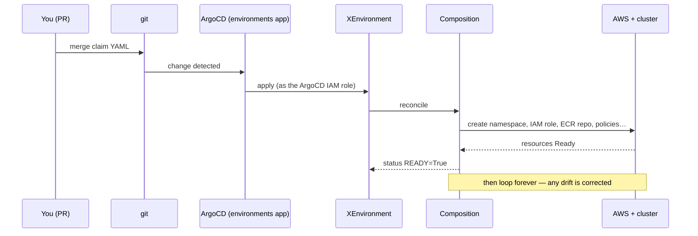
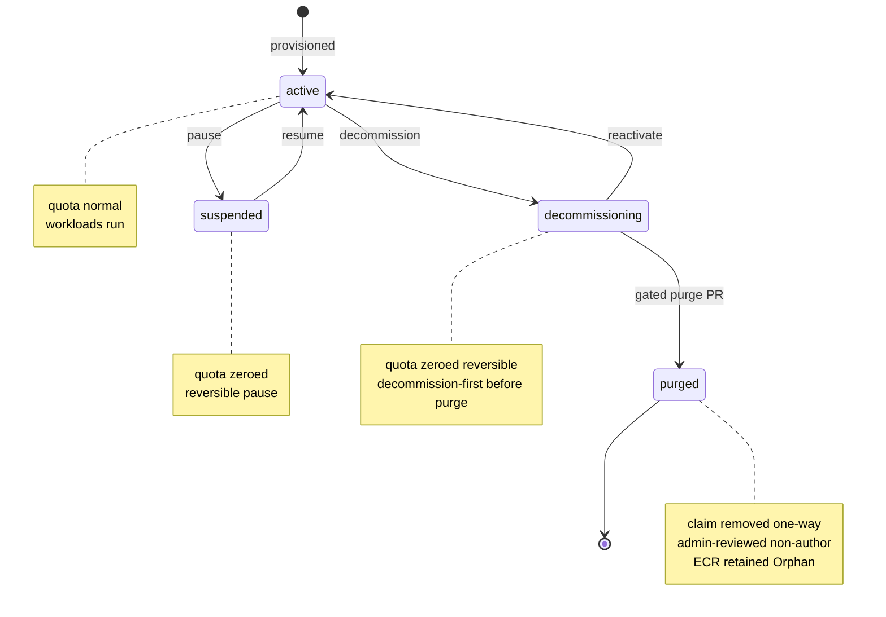

# Environment API — reference

A field-by-field lookup for the `XEnvironment` claim, what the Composition builds from it, and the
lifecycle it runs. For the mental model behind it, see [the orientation](orientation.md).

## The `XEnvironment` claim — spec fields

`apiVersion: platform.refplat.org/v1beta1`, `kind: XEnvironment`, **cluster-scoped** (a Crossplane v2
XR). Defined by the [XRD](https://github.com/asanexample/platform/blob/main/infra/modules/crossplane/charts/environment-api/templates/xenvironment-xrd.yaml)
(the XRD is authoritative — trust it over prose).

| Field | Required | Notes |
| --- | --- | --- |
| `team` | yes | Team key. Must equal the Product's team (checked by Kyverno, not the XRD). |
| `product` | yes | Owning Product; drives the namespace + per-product names. |
| `stage` | yes | `dev` \| `test` \| `uat` \| `staging` \| `prod`. |
| `customer` | conditional | Required only for per-customer Products at prod/uat; appended to the namespace. |
| `tier` | — (`standard`) | `standard` \| `elevated` \| `pci` \| `hipaa` — the hardening profile. |
| `preview` | — (`false`) | Opt into PR-preview delivery. |
| `isolation.compute` | — | `shared-namespace` … `dedicated-account`; resolved from Product/tier if unset. |
| `residency.allowedLocations` | — (`["*"]`) | Must be a subset of the Team's allowed locations. |
| `quota` | — (defaults) | `cpu`, `memory`, `pods`, `services`, `loadbalancers`, `pvcs`, `storage`. |
| `domains` | — (`[]`) | **An array of plain host strings** (see the gotcha below). |
| `services.<svc>` | — | Per-service: `serviceAccount`, `image`, `preview`, `permissions.aws.policyStatements[]`, and `resources.<name>` (self-service cloud deps). |
| `lifecycle.phase` | — (`active`) | `active` \| `suspended` \| `decommissioning`. Suspend zeroes the ResourceQuota (reversible). |
| `platformTrust.clusterRoles` | — (`[]`) | Extra platform ClusterRoles to bind in the namespace. |
| `encryption.keyCustody` | — (`platform-managed`) | `platform-managed` \| `customer-managed` \| `customer-hosted`. |

## What the Composition provisions

The [Composition](https://github.com/asanexample/platform/blob/main/infra/modules/crossplane/charts/environment-api/files/composition.yaml)
runs in **Pipeline** mode, three functions:

1. `function-environment-configs` — merges the `platform-cluster-config` **EnvironmentConfig** (the
   per-cluster constants) into the pipeline context.
2. `function-go-templating` — renders every resource below from the claim + those constants.
3. `function-auto-ready` — marks the XR `READY` once its resources are ready.

Let `$ns = <team>-<product>-<stage>` (or `…-<customer>-<stage>`), hashed if it exceeds 63 chars.

**Kubernetes** (via `provider-kubernetes` `Object`s):

- `Namespace $ns` — labelled `platform.refplat.org/{team,product,stage,tier,mode}` + PodSecurity
  (`enforce: baseline`, `warn`/`audit: restricted`).
- `ResourceQuota environment-quota`, `LimitRange environment-limits`.
- `NetworkPolicy` default-deny-ingress / allow-gateway / allow-dns-egress, plus `CiliumNetworkPolicy`
  for gateway (Envoy `ingress` identity) and Pod-Identity egress.
- `RoleBinding environment-developers` → ClusterRole `environment-developer`, subject group
  `$ns:developers`.
- Per-namespace Kyverno `ClusterPolicy` `restrict-images-$ns` (only `team-<team>/<product>-*` images) and
  `restrict-route-hostnames-$ns`.

**AWS — workload account** (`provider-aws`, ProviderConfig `default` = Pod Identity), per service:

- [IAM](https://docs.aws.amazon.com/IAM/latest/UserGuide/id_roles.html) `Role Pod-<team>-<product>-<stage>-<svc>` (trust `pods.eks.amazonaws.com`, capped by the
  environment permissions boundary) + its `RolePolicy` (the service's `policyStatements`,
  deny-set-validated).
- `PodIdentityAssociation` binding `(cluster, $ns, serviceAccount) → the role`.

**AWS — platform account** (`provider-aws` `ecr`, ProviderConfig `platform-ecr` = assumeRoleChain), per
service:

- [ECR](https://docs.aws.amazon.com/AmazonECR/latest/userguide/what-is-ecr.html) `Repository team-<team>/<product>-<svc>` (`IMMUTABLE_WITH_EXCLUSION` for [cosign](https://docs.sigstore.dev/cosign/signing/overview/) `sha256-*` tags,
  scan-on-push, `deletionPolicy: Orphan`), a cross-account `RepositoryPolicy` (pull for preprod/prod),
  and a `LifecyclePolicy`.

**Self-service cloud resources** (`services.<svc>.resources` — its own
[module](../self-service-resources/orientation.md)):
[S3](https://docs.aws.amazon.com/AmazonS3/latest/userguide/Welcome.html) /
[SQS](https://docs.aws.amazon.com/AWSSimpleQueueService/latest/SQSDeveloperGuide/welcome.html) /
[SNS](https://docs.aws.amazon.com/sns/latest/dg/welcome.html) /
[DynamoDB](https://docs.aws.amazon.com/amazondynamodb/latest/developerguide/Introduction.html) as
namespaced `*.aws.m.upbound.io` managed resources, each with derived least-privilege IAM onto the Pod
role and a `<svc>-resources` ConfigMap. Exercised by `gitops/environments/acme/conformance/dev.yaml`.

## Delivery, topology, lifecycle

The life of a claim, over time:

- **Delivery:** claims are YAML in `gitops/environments/**`, merged via CODEOWNERS-gated PR; the ArgoCD
  `environments` app syncs them (`selfHeal` + `prune` + ServerSideApply). ArgoCD applies as a platform
  IAM role — the only principal allowed to create `XEnvironment`s.
- **Topology:** federated — one Crossplane per cluster; the Environment API runs on **preprod**
  (`enable_environment_api = true` there only), not the hub. The single cross-account hop is
  ECR.
- **Lifecycle:** `lifecycle.phase: suspended` zeroes the quota (reversible pause); `decommissioning`
  begins teardown; removing the YAML (a gated, decommission-first PR) prunes the `XEnvironment` and the
  Composition tears down every managed resource. ECR is retained (`Orphan`).

The `phase` machine — reversible right up to the one-way exit:

`suspended` and `decommissioning` are both **reversible** grace states — the Composition zeroes the
`ResourceQuota` (cpu/memory/pods → `0`, so workloads drain) while everything else is retained; editing
`phase` back to `active` restores it. Only **purge** — deleting the claim YAML — is one-way, and it's gated:
decommission-first, and the gitops Gate demands a current-SHA
admin approval that isn't the author (plus the release-approver for a `prod` bundle). ECR survives it
(`deletionPolicy: Orphan`).

## Glossary

*Shared substrate terms (namespace, Composition, admission, managed resource, …) live in the
[portal glossary](../glossary.md); the entries below are Environment-API-specific.*

- **Claim / XR** — the `XEnvironment` object; your statement of desired state.
- **XRD** — Composite Resource Definition; the schema that defines what an `XEnvironment` is.
- **Composition** — the recipe that turns one claim into its resources.
- **Managed resource (MR)** — one real thing Crossplane creates *and continuously watches* (an IAM role,
  an ECR repo, a Kubernetes `Object`).
- **Provider** — the plugin that lets Crossplane talk to an external API (AWS, Kubernetes).
- **ProviderConfig** — which credentials/role a provider uses (`default` = Pod Identity; `platform-ecr`
  = assume the platform account's ECR role).
- **EnvironmentConfig** — the per-cluster constants (account IDs, registry, base domain, boundary ARN)
  injected into the Composition so the claim stays clean.
- **Reconcile / level-triggered** — continuously driving actual state toward desired state by
  *re-comparing the two*, not by reacting to change *events* (that would be **edge-triggered**, like a
  motion-sensor light). Reacting to current state rather than events is exactly what makes it self-heal:
  a missed event, crash, or manual delete can't leave it broken, because the next loop still sees the gap.
- [**Pod Identity**](https://docs.aws.amazon.com/eks/latest/userguide/pod-identities.html) — the
  [EKS](https://docs.aws.amazon.com/eks/latest/userguide/what-is-eks.html) mechanism that gives a pod an
  AWS role via its [ServiceAccount](https://kubernetes.io/docs/concepts/security/service-accounts/), no
  static keys.

## Gotchas

- **Cluster-scoped is a security boundary, not a detail.** Because an `XEnvironment` is cluster-scoped,
  creating one needs cluster RBAC — which developers don't have. Claims only reach the cluster through
  the ArgoCD `environments` app (a reviewed, gated PR). That's *why* self-service can be safe: the git
  gate is the control point, and a Kyverno backstop denies `XEnvironment` creation by anyone but the
  platform ArgoCD principal.
- **Editing the XRD in place can cascade-delete live environments.** The XRD is the schema *for existing
  objects*; a breaking in-place change can make Crossplane treat live `XEnvironment`s as invalid and tear
  down their footprints. Follow the safe-apply procedure in the `crossplane-composition-authoring` skill —
  never treat an XRD edit as routine.
- **`domains` is a list of strings.** The XRD defines plain host strings, and the Composition ranges
  over them as hosts. Trust the XRD.
- **`status.domains` doesn't have a live state machine.** Every bound host is written `Active`
  immediately; the `Pending → Active` transition is designed but not built. The *real* ingress gate is
  the `restrict-route-hostnames-$ns` Kyverno policy, not the status.
- **Developer cluster access is only the in-cluster RoleBinding today.** The Composition renders a
  `PodIdentityAssociation` but **no** `AccessEntry` / `DeveloperAccess-<team>` IAM role. Use
  `platctl kubeconfig` / PlatformAdmin for cluster access until the OIDC-native path is built.
- **The Composition ships raw.** It's delivered via `.Files.Get` so Helm doesn't try to process its
  inline `{{ }}` go-template. If you edit it, you're editing the go-template the *cluster's*
  `function-go-templating` runs, not a Helm template.
- **Seeing a claim's footprint.** If you have the **crossplane CLI**, `crossplane resource trace
  xenvironment <name> --context <cluster>` prints the claim plus its composed tree (SYNCED/READY/STATUS)
  in a second or two — the clearest view. **With only `kubectl`:** `kubectl get managed` lists them but is
  slow (~20s — it queries *every* provider CRD and can look hung); narrow the output with the composite
  label, `-l crossplane.io/composite=<name>`. Either way, target the **workload cluster** (`--context
  preprod`), not the hub — the Environment API doesn't run there, so the default context shows nothing.

## Learn Crossplane itself (optional)

Background on the substrate, for going deeper — none of it is a prerequisite for the above. **We run
Crossplane v2 with cluster-scoped XRs.** Anything older describes a v1 "claim vs XR / namespaced Claim"
model that does **not** match this platform; read it for concepts, not for our shape.

- **[Crossplane docs — Compositions](https://docs.crossplane.io/latest/composition/compositions/)** (official, ~30 min).
  Composite Resources, Compositions, managed resources, providers. The canonical mental model. Make sure
  you're on the **latest / v2** docs.
- **[Crossplane docs — Composition Functions](https://docs.crossplane.io/latest/composition/composition-functions/)**
  (official, ~15 min). We use Pipeline-mode Compositions with functions (`function-go-templating`,
  `function-environment-configs`); most older tutorials predate functions — flag that when you read
  them.
- **[Kubernetes controllers & the reconciliation model](https://kubernetes.io/docs/concepts/architecture/controller/)**
  (official, ~10 min). Level-triggered reconciliation — the one idea that explains why the environment
  self-heals. Substrate-agnostic; ages well.
- **[Upbound provider-aws docs](https://marketplace.upbound.io/providers/upbound/provider-family-aws)**
  (maintainer). Reference for the AWS managed-resource kinds (`ecr`, `iam`, `eks`) the Composition
  renders.

## Source of truth

Source links are absolute (they point at `main`) so they survive the move to Backstage TechDocs, which
won't publish the `infra/`/`gitops/` trees. Doc-to-doc links stay relative.

- The module: [`infra/modules/crossplane/charts/environment-api/`](https://github.com/asanexample/platform/tree/main/infra/modules/crossplane/charts/environment-api)
  — [XRD](https://github.com/asanexample/platform/blob/main/infra/modules/crossplane/charts/environment-api/templates/xenvironment-xrd.yaml),
  [Composition](https://github.com/asanexample/platform/blob/main/infra/modules/crossplane/charts/environment-api/files/composition.yaml),
  [EnvironmentConfig](https://github.com/asanexample/platform/blob/main/infra/modules/crossplane/charts/environment-api/templates/environmentconfig.yaml).
- Which cluster enables it: [`…/preprod/…/crossplane/terragrunt.hcl`](https://github.com/asanexample/platform/blob/main/infra/live/aws/preprod/us-east-1/platform/crossplane/terragrunt.hcl).
- Real examples: [`acme/shop/dev.yaml`](https://github.com/asanexample/platform/blob/main/gitops/environments/acme/shop/dev.yaml),
  [`products/acme/shop.yaml`](https://github.com/asanexample/platform/blob/main/gitops/products/acme/shop.yaml),
  [`acme/conformance/dev.yaml`](https://github.com/asanexample/platform/blob/main/gitops/environments/acme/conformance/dev.yaml)
  (self-service resources).
- Authoring the Composition: the `crossplane-composition-authoring` skill. Onboarding an environment:
  the `environment-onboarding` skill + [runbook](../../runbooks/environment-onboarding.md).
