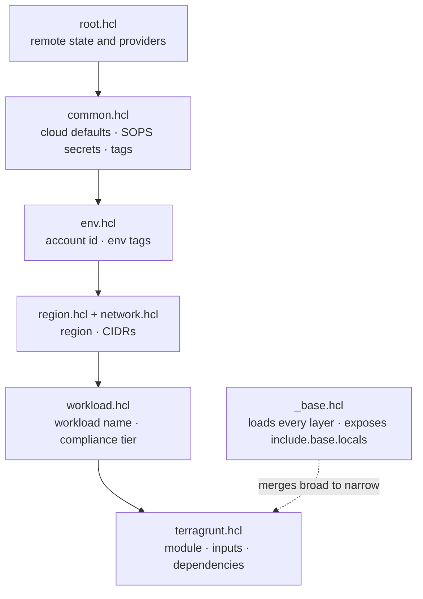

# Learn: Foundations — infrastructure as code (deep dive)

Two tools stand between this platform's code and the cloud: [OpenTofu](https://opentofu.org/docs/) provisions,
[Terragrunt](https://terragrunt.gruntwork.io/docs/) orchestrates. This traces the mechanism — how a single
leaf unit actually gets its settings, how the two safety asserts fire, where state lives, and how a public
repo carries its own secrets. One hard machine, followed end to end. If you're already fluent in Terragrunt,
the [Reference](reference.md) is the terse lookup.

## The oven and the sous-chef, precisely

OpenTofu is the provisioning *engine*; Terragrunt is the *orchestrator* wrapped around it — the oven and the
sous-chef. The versions both run at are pinned in one place, the single source of truth the whole estate reads
from:

```text
# /.tool-versions  (read by mise/asdf locally, by CI, and baked into the runner image)
opentofu 1.12.1
terragrunt 1.0.7
kubectl 1.35.5
helm 3.21.0
awscli 2.35.1
```

`root.hcl` sets `terraform_binary = "tofu"`, so every `terragrunt` invocation shells out to OpenTofu 1.12.1 —
never HashiCorp Terraform ([ADR-016](../../adrs/016-opentofu-over-terraform.md)). Bump a version *here* and
your laptop, CI, and the self-hosted runner can't drift apart. That's the whole point of a canonical pin.

The sous-chef never cooks. Terragrunt generates the backend and provider config, wires units in dependency
order, and assembles each unit's inputs from a layered cascade so no fact is written twice — the cascade the
rest of this walks through.

## Class and instance: modules vs live units

The code splits two ways, and the split is the class-vs-instance distinction made literal:

- **`infra/modules/`** — reusable, environment-agnostic OpenTofu modules. *How to build an IAM role set, in
  the abstract.* The class.
- **`infra/live/aws/`** — the specific instantiations. *The platform account's IAM roles in us-east-1.* The
  instance.

A live unit never hardcodes a path to its module. There's one layer of indirection through
`infra/live/aws/_versions.hcl`, which maps a logical name to a source:

```hcl
# infra/live/aws/_versions.hcl
locals {
  source_base = "${get_repo_root()}/infra/modules"
  module_source = {
    iam_roles = "${local.source_base}/aws//iam_roles"
    eks       = "${local.source_base}/aws//eks"
    # …one entry per module
  }
  helm_versions = { cilium = "1.19.4", argocd = "9.5.14", /* … */ }
}
```

Today `source_base` points at the local checkout at HEAD (a monorepo), so every environment runs the same
module code. The comment in that file spells out the future seam: flip `source_base` to a Terraform-registry
URL and pin each module to a semver tag, and environments can promote module versions independently — without
touching a single unit. The units already ask for `module_source.iam_roles`; only the map behind the name
would change. Helm chart versions ride the same single-source pattern (`helm_versions`), so a chart bump is
one edit, not a grep across dozens of units.

## The cascade — each fact in exactly one layer

The mechanism, drawn as a CSS cascade: configuration layered by *scope*, broad to narrow, and **each fact
lives in exactly one layer**.

```text
root.hcl        remote state, provider generation, terraform_binary   (the whole estate)
 └─ common.hcl  cloud-wide defaults, SOPS secrets, org_name, cost_profile   (all of AWS)
     └─ env.hcl        which account, env tags, per-env overrides       (one account)
         └─ region.hcl / network.hcl   region + abbrev, CIDRs, subnets  (one region)
             └─ workload.hcl   workload name, compliance_tier           (one workload)
                 └─ terragrunt.hcl   the module + its inputs            (one unit)
```

The same layering as a tree — each arrow is one inheritance step, broad scope down to narrow, and `_base.hcl` is the reader that merges them for the leaf unit:



What matters isn't the nesting — it's the discipline that each value appears once. A tour of the real files
for the platform hub's `iam-roles` unit:

```hcl
# region.hcl — a region fact, written once
region = "us-east-1"; region_abbv = "use1"

# network.hcl — the CIDR plan, written once (see the Networking deep dive)
vpc_cidr = "10.100.0.0/16"
pod_cidr = "10.240.0.0/16"   # Cilium overlay, non-routable

# workload.hcl — the compliance posture, written once
workload = "platform"; compliance_tier = "standard"

# env.hcl — the account binding, written once
env = "platform"
account_id = local._secrets.account_ids["platform"]   # decrypted, not literal
```

Change `vpc_cidr` in that one `network.hcl` and every unit in the region sees the new value — no
grep-and-replace across directories. That's the payoff of "each fact in one layer": there's exactly one place
to change it, and exactly one place it can be wrong.

## How `_base.hcl` *loads* the cascade

The reader that walks the tree is `infra/live/aws/_base.hcl`. It doesn't rely on being told where the layers
are — it *searches upward* for each one with `find_in_parent_folders`, then reads it with
`read_terragrunt_config`:

```hcl
# infra/live/aws/_base.hcl
env_vars      = read_terragrunt_config(find_in_parent_folders("env.hcl"))
region_vars   = read_terragrunt_config(find_in_parent_folders("region.hcl"))
network_vars  = read_terragrunt_config(find_in_parent_folders("network.hcl"))
workload_vars = read_terragrunt_config(find_in_parent_folders("workload.hcl"))
common_vars   = read_terragrunt_config(find_in_parent_folders("common.hcl"))
version_vars  = read_terragrunt_config(find_in_parent_folders("aws/_versions.hcl"))
```

`find_in_parent_folders("env.hcl")` starts in the unit's directory and climbs until it finds `env.hcl` — so a
unit deep under `platform/us-east-1/platform/iam-roles/` resolves the `platform` env file, while a preprod
unit resolves preprod's. Same code, different answer, decided purely by *where the unit sits*.

Then it does the merge that makes the cascade a cascade — **narrowest layer wins**:

```hcl
all_vars = merge(
  local.common_vars.locals,     # broadest
  local.env_vars.locals,
  local.region_vars.locals,
  local.network_vars.locals,
  local.workload_vars.locals,   # narrowest
)
```

`merge()` is last-key-wins, and the arguments run broad→narrow, so an `env.hcl` value overrides a
`common.hcl` default for the same key. That's why `common.hcl` can set `cost_profile = "dev"` as a
cloud-wide default while the platform hub's `env.hcl` overrides individual knobs (`enable_mimir = true`,
`enable_loki = true`) — the env layer wins. The tags follow the identical broad→narrow `merge`, so a
workload's `Team` tag can override the platform default.

## How a unit *consumes* it

A leaf unit doesn't re-read any of that. It includes `_base.hcl` with `expose = true` and reads the
pre-assembled values off `include.base.locals.*`. Here is the top of the platform hub's IAM-roles unit — the
`include` and `terraform` blocks verbatim, the `inputs` abbreviated (the real `inputs` opens with `create =
true`, and `PlatformAdmin` also sets `description`/`max_session_duration`):

```hcl
# infra/live/aws/platform/us-east-1/platform/iam-roles/terragrunt.hcl
include "base" {
  path   = find_in_parent_folders("aws/_base.hcl")
  expose = true
}
include "root" {
  path = find_in_parent_folders("root.hcl")
}

terraform {
  source = include.base.locals.module_source.iam_roles   # the indirection, resolved
}

inputs = {
  roles = {
    PlatformAdmin = {
      trust_principals = { aws = [
        "arn:aws:iam::${include.base.locals.account_ids["mgmt"]}:root",
        "arn:aws:iam::${include.base.locals.account_ids["platform"]}:root",
      ] }
      # …
    }
  }
  tags = include.base.locals.tags
}
```

`source` comes from the resolved `module_source` map. The trust-policy account numbers come from
`include.base.locals.account_ids`, which chained all the way back through `common.hcl` to the *decrypted* SOPS
file (next section). `tags` is the four-layer composed map. The unit declares *intent* — "give PlatformAdmin
these roles" — and inherits every environmental fact. Two `include` blocks, and the whole cascade is present.

## The two SAFETY asserts — refusal by construction

Loading the cascade by directory position is powerful and therefore dangerous: copy a unit into the wrong
folder, or fat-finger an account ID, and you'd apply the wrong config to the wrong account. `_base.hcl` closes
that hole with two assertions that run on *every* plan, using the classic HCL trick of failing a `tobool()`
cast with a message when a condition is false:

```hcl
# 1. the directory you're in must match the env it declares
_path_parts = split("/", path_relative_to_include())
_path_env   = local._path_parts[0]
_assert_env_path = (
  local._path_env == local.env ? true
  : tobool("SAFETY: directory '${local._path_env}' does not match env.hcl environment '${local.env}'")
)

# 2. that env's account ID must match the expected one from the map
_expected_account = lookup(local.common_vars.locals.environment_account_map, local.env, null)
_assert_account = (
  local._expected_account == null || local._expected_account == local.env_vars.locals.account_id
  ? true
  : tobool("SAFETY: env '${local.env}' expects account '${local._expected_account}' but env.hcl has '…'")
)
```

Assert 1 catches *directory/env mismatch* — the leaf's path (`platform/us-east-1/platform/iam-roles`) starts
with `platform`, which must equal `env.hcl`'s declared `env`. Assert 2 catches an *account typo*: the
`environment_account_map` (itself the decrypted `account_ids`) must agree with the `account_id` the env file
resolved. Fail either and Terragrunt refuses to run, printing a `SAFETY:` error. A whole class of
catastrophic copy-paste — the "I applied prod's config from the preprod folder" mistake — is impossible by
construction, not by discipline. If you ever *see* a `SAFETY:` error, that's the rail working. Fix the
directory or the account map; never delete the assert.

## Remote state — where the truth is kept

Every unit's state is stored remotely, configured once in `root.hcl` and generated into each unit as a
`backend.tf`:

```hcl
# infra/root.hcl
remote_state {
  backend = "s3"
  config = {
    bucket         = local._secrets.state_bucket
    key            = "${path_relative_to_include()}/terraform.tfstate"
    region         = "us-east-1"
    encrypt        = true
    dynamodb_table = "terraform-locks"
    role_arn       = local._secrets.state_role_arn   # TerraformStateAccess, in the management account
  }
}
```

Three things worth understanding. **The key is the unit's path** — `path_relative_to_include()` yields the
unit's directory within the repo, so the state layout on S3 mirrors the `infra/live/` tree one-to-one; each
unit owns an isolated state object. **The lock lives in DynamoDB** — a single table, `terraform-locks`, whose
`LockID` item a plan/apply grabs so two runs can't corrupt the same state. Verified live in the management
account:

```console
$ AWS_PROFILE=management aws dynamodb describe-table --table-name terraform-locks \
    --query 'Table.{Name:TableName,Status:TableStatus,Keys:KeySchema[].AttributeName}'
{ "Name": "terraform-locks", "Status": "ACTIVE", "Keys": [ "LockID" ] }
```

And **state access is its own cross-account role** — `role_arn` assumes `TerraformStateAccess` in the
management account, so reaching state is a separate, auditable identity from the `PlatformDeployer` role the
providers assume to actually touch AWS. State is the crown jewels (it holds resource metadata and any
sensitive outputs); putting it in the governance account behind its own role keeps a runaway apply in a spoke
from ever rewriting another environment's state.

## SOPS — the locked glass case in the public square

The trick: this is a **public repository**, yet the account IDs, emails, SSO URLs, state-bucket name, and
state-role ARN are committed *right in git*. They live in `infra/live/aws/secrets.enc.yaml`, encrypted
per-value with [SOPS](https://github.com/getsops/sops) against a dedicated
[AWS KMS](https://docs.aws.amazon.com/kms/latest/developerguide/overview.html) key
([ADR-066](../../adrs/066-sops-encrypted-config-secrets.md)). A raw line looks like this:

```yaml
account_ids:
    platform: ENC[AES256_GCM,data:8buQRHB7pLkwakxM,iv:gAu8bJ/…,tag:…,type:str]
```

`common.hcl` decrypts the whole file *inline, in memory* at config-eval time — using Terragrunt's built-in
`sops_decrypt_file`, which calls KMS with your **ambient** AWS identity (before any provider assume-role):

```hcl
# infra/live/aws/common.hcl
_secrets = get_env("TG_SOPS_BOOTSTRAP", "") == "1"
  ? read_terragrunt_config("${get_repo_root()}/infra/live/aws/secrets.hcl").locals
  : yamldecode(sops_decrypt_file("${get_repo_root()}/infra/live/aws/secrets.enc.yaml"))
```

Which KMS key is pinned by `.sops.yaml` at the repo root (account ID and key UUID redacted here):

```yaml
creation_rules:
  - path_regex: infra/live/aws/secrets\.enc\.yaml$
    kms: "arn:aws:kms:us-east-1:<mgmt-account-id>:key/<sops-key-uuid>"
```

That key exists — verified live, resolved through its human-readable alias:

```console
$ AWS_PROFILE=management aws kms list-aliases \
    --query "Aliases[?AliasName=='alias/platform-sops'].AliasName" --output text
alias/platform-sops
```

*This is the locked glass case in the public square.* Anyone can clone the repo and see the ciphertext; only a
principal the KMS key policy trusts — the SSO `AdministratorAccess` roles, and the ARC runner role — can
decrypt it, and **every decrypt is a CloudTrail event**. The *why* is worth stating plainly, because ADR-066
weighed and rejected the tempting alternatives:

- **Single source of truth, zero drift.** The config is *in git*. There is no second copy in a secrets store
  to fall out of sync with each operator's laptop — the drift problem that disqualified the "materialize it in
  CI" option.
- **No plaintext on disk, ever.** `sops_decrypt_file` decrypts to memory; nothing is written on a laptop or a
  runner. Compare the old gitignored `secrets.hcl`, which lived in cleartext on every machine.
- **IAM-gated + audited, KMS not `age`.** Access is a KMS key policy, so every principal that needs to decrypt
  *already has an AWS identity* — no key material to distribute (the exact problem `age` reintroduces).
  Revoking an operator is a policy edit.

One nuance: `secrets.enc.yaml` holds **no actual credentials** — no passwords or tokens. Real runtime secrets
live in AWS Secrets Manager and are pulled by External Secrets. This file holds only *environment-identifying*
values that are merely sensitive-in-a-public-repo (account numbers, emails, SSO endpoints). It's an
identity-config file, encrypted; not a vault.

## The bootstrap chicken-and-eggs

Both pillars above have the same circularity, and it's the thing that most surprises people. *Every* unit's
config load now (a) writes state to the S3 bucket and (b) decrypts `secrets.enc.yaml` with the KMS key. So how
do you create the bucket and the key, when creating them would itself require… the bucket and the key?

You can't — from a normal unit. So both are **bootstrap-tier**: created once, outside the secrets-reading
flow, before anything else exists ([ADR-006](../../adrs/006-state-bootstrap-pattern.md) for state; ADR-066 §6
for the SOPS key). Two escape hatches make this work:

- **Local state for the bootstrap unit.** `root.hcl`'s comment notes the `state-bootstrap` module overrides
  the S3 backend with a *local* backend — it can't store its state in the bucket it's busy creating.
- **`TG_SOPS_BOOTSTRAP=1`.** Set this env var and every `_secrets` load falls back to a plaintext, gitignored
  `secrets.hcl` instead of calling KMS — the only way to run before `alias/platform-sops` exists. Terragrunt
  short-circuits the conditional, so the un-taken branch's file is never even read. This is a true-from-zero
  greenfield escape only; in steady state it's off, and the encrypted file is authoritative.

After bootstrap, the bucket and the key are *standing prerequisites*, like foundations poured before the
walls. The teardown/rebuild runbook treats them specially for exactly this reason: destroy them and you've
locked yourself out of everything above.

## Gotchas that teach

- **A `SAFETY:` refusal is the rail working, not a bug.** It means the directory doesn't match `env.hcl`, or
  an account ID in the map disagrees with the env file. Fix the directory or the account binding — disabling
  the assert is disabling the one check that stops a cross-account apply.
- **The `versions` fallback in `root.hcl` is dead code on purpose.** Its generated `versions.tf` is set to
  `if_exists = "skip"`, because every shared module now ships its own `versions.tf`
  ([ADR-083](../../adrs/083-provider-version-constraint-standardization.md)). An earlier version pinned
  `aws = "6.47.0"` *exactly* here and it was silently ignored — units resolved the module's looser bound
  instead. Lesson: a generated file that "looks" authoritative may be skipped; the module's own `versions.tf`
  wins.
- **`role_arn` on state is not the deployer role.** Reaching state assumes `TerraformStateAccess` (management);
  touching AWS assumes `PlatformDeployer` (per-env). Two different identities in the same run — by design, so
  state lives behind a separate wall.
- **The provider assume is conditional.** `root.hcl` only injects the `PlatformDeployer` assume-role when the
  caller's account differs from the target — which is true for an operator running from `management`, but *not*
  for the in-VPC ARC runner (it lives in the platform account). `TG_FORCE_DEPLOYER=1` forces the assume so the
  runner faithfully stands in for the operator's cross-account identity.
- **Editing secrets means editing with `sops`.** You can't just open `secrets.enc.yaml` — run
  `sops infra/live/aws/secrets.enc.yaml`, which decrypts to your `$EDITOR` and re-encrypts on save. A malformed
  edit fails the re-encrypt rather than committing broken ciphertext.

## Go deeper

- [ADR-001 — multi-cloud Terragrunt structure](../../adrs/001-multi-cloud-terragrunt-structure.md) · the
  original cascade decision.
- [ADR-002 — AWS state storage](../../adrs/002-aws-state-storage.md) and
  [ADR-006 — state bootstrap pattern](../../adrs/006-state-bootstrap-pattern.md) · the S3+DynamoDB backend and
  its chicken-and-egg.
- [ADR-016 — OpenTofu over Terraform](../../adrs/016-opentofu-over-terraform.md) · why `terraform_binary = "tofu"`.
- [ADR-066 — SOPS-encrypted config secrets](../../adrs/066-sops-encrypted-config-secrets.md) · the full
  design, alternatives, and KMS-vs-`age` rationale.
- [ADR-083 — provider version constraint standardization](../../adrs/083-provider-version-constraint-standardization.md)
  · why the `root.hcl` version fallback is skipped.
- Source: `infra/root.hcl`, `infra/live/aws/{common,_base,_versions}.hcl`, `infra/live/aws/secrets.enc.yaml`,
  `.sops.yaml`, and any leaf `infra/live/aws/**/terragrunt.hcl`.
- House skills: **terragrunt-units** (authoring units), **terraform-style** (module `.tf`), **apply-and-destroy**
  (running plans/applies), **platctl** (bootstrap/teardown orchestration).
- Back to the [Foundations orientation](orientation.md) · sideways to the
  [Account model deep dive](deep-dive-the-account-model.md) (the `TerraformStateAccess`/`PlatformDeployer` role
  model in full).
