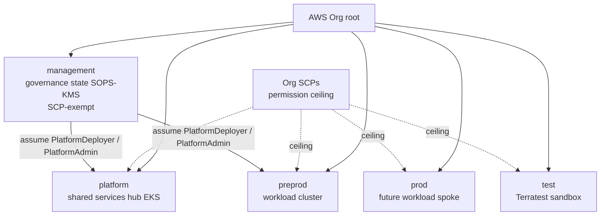

# Learn: Foundations — the account model & SCPs (deep dive)

An AWS account is the platform's hard isolation boundary, and Service Control Policies are the law
above it. This deep dive opens that box: how the boundary is actually enforced by AWS, how an SCP
differs from every IAM policy you've written, why a brand-new automation mysteriously `403`s on its
first apply, and the role chain that lets a single operator reach across the walls without tearing
them down. One hard idea, traced through the real policy code and the live org.

Everything else rests on this being true. The Environment API isolates tenants with Kubernetes
namespaces; Kyverno rejects bad manifests at admission; IAM scopes a pod's cloud access. Every one of
those is a **soft** boundary — enforced by software, inside one trust domain, defeatable by one
misconfiguration. This layer is the one **hard** boundary underneath them, the thing that still holds
when a soft one fails.

## The mechanism in one sentence

> **An AWS account is a separate security principal that AWS itself enforces; an SCP is a permission
> *ceiling* the AWS Organization pins above that account; your effective permission is the *intersection* of
> the ceiling and your IAM grant — and a narrow, auditable role-assumption is the only bridge across.**

Principal, ceiling, intersection, bridge. The rest of this is those four words made concrete.

## Start from the live estate

Everything below is checkable. Here is the whole account estate, live:

```console
$ AWS_PROFILE=management aws organizations list-accounts --query 'Accounts[].Name'
[
    "Test",
    "<the management account>",
    "Preprod",
    "Prod",
    "Platform"
]
```

Five accounts, and each is a distinct role in the design ([ADR-004](../../adrs/004-account-management-strategy.md)):

- **The management account** — governance only. It owns the AWS Organization, holds the org-wide SCPs,
  and runs the [Terraform state backend](deep-dive-infrastructure-as-code.md) (the S3 state bucket +
  `terraform-locks` DynamoDB table). Almost no workloads. And SCPs do not apply to the management
  account — so it deliberately holds as little as possible.
- **The platform account** — the hub: the platform EKS cluster, ArgoCD, the Transit Gateway hub, DNS,
  ECR, observability, CI runners. Everything the environments consume.
- **preprod and prod** — the spokes, running the environment clusters and tenant workloads.
- **Test** — a Terratest sandbox, where CI creates and destroys *real* infrastructure without touching
  anything real.

The estate as a tree: the Org root, the accounts by role, the SCP ceiling over the *member* accounts
(never the management account), and the role bridge an operator crosses:



The accounts hang off a deliberate two-branch tree ([ADR-005](../../adrs/005-ou-hierarchy-design.md)). Live:

```console
$ aws organizations list-organizational-units-for-parent --parent-id <root>
[ "Workloads", "Platform" ]

$ aws organizations list-organizational-units-for-parent --parent-id <workloads-ou>
[ "Prod", "Preprod", "Regulated" ]
```

So the tree is a Platform OU holding `{Platform, Test}`, and a Workloads OU holding
`{Preprod, Prod, Regulated}` — where `Regulated` is an empty OU held open for future HIPAA/PCI
workloads (it exists so that turning on a compliance regime later is an *attach*, not a restructure).
The management account sits at the root, in no OU at all — both because SCPs can't govern it anyway,
and because putting it in an OU would only confuse which policies apply.

## Why the account is the *hard* boundary

The metaphor: namespaces are locked rooms in one house — the homeowner holds every key; accounts are
separate buildings on separate plots. Here's the enforcement reason under it.

An AWS account is a separate security and billing principal enforced by AWS itself. A credential minted
in `preprod` names `preprod`'s account number in every ARN it can address. It cannot address a resource
in `prod` — not "shouldn't," **can't** — because the resource ARN carries a different account number and
AWS's own authorization refuses it unless an explicit, logged cross-account role trust says otherwise.
There is no "the wildcard matched the neighbour" failure, because there is no shared namespace to
wildcard across. Blast radius is capped by construction: a runaway automation or a fat-fingered
`destroy` in preprod physically cannot reach prod's state, secrets, or data. Compare a namespace, where
a single `cluster-admin` slip crosses every namespace in the cluster at once.

That is the whole reason the estate is split five ways instead of run as one big account with careful
IAM: IAM is a soft wall you maintain; the account boundary is a hard wall AWS maintains for you.

## SCPs: the ceiling, dissected

SCPs operate *above* the account. An IAM policy **grants**, and is enforced inside an account by that
account's own admins (who can rewrite it). A [Service Control
Policy](https://docs.aws.amazon.com/organizations/latest/userguide/orgs_manage_policies_scps.html) is
the opposite in three ways ([ADR-003](../../adrs/003-scp-design-philosophy.md)):

1. **It's a ceiling, not a grant.** An SCP never *gives* a permission — it only *removes* one from the
   maximum. The actual granting is the implicit `FullAWSAccess` policy AWS attaches everywhere (it
   shows up in the live list below, next to our seven). SCPs carve that maximum down.
2. **It's enforced from above the account,** by the AWS Organization from the management account — so
   even the member account's root user can't escape it.
3. **Your effective permission is the intersection** of every SCP in the chain from root to your account
   *and* your IAM policy. Every layer can only subtract. This is why SCPs are "deny-only in practice":
   there is no allow-override lower down.

Here is one real statement, verbatim from
[`scps.tf`](https://github.com/asanexample/platform/blob/main/infra/modules/aws/organizations/scps.tf), the
S3-encryption rule inside `enforce-encryption`:

```hcl
statement {
  sid       = "DenyUnencryptedS3Uploads"
  effect    = "Deny"
  actions   = ["s3:PutObject"]
  resources = ["*"]
  condition {
    # Null test with "true" = deny when the SSE header is ABSENT (forces explicit encryption)
    test     = "Null"
    variable = "s3:x-amz-server-side-encryption"
    values   = ["true"]
  }
}
```

The `Null`/`"true"` inversion looks backwards, so read it carefully: *deny `PutObject` whenever the
server-side-encryption header is null (absent).* Not "encrypt for you" — refuse the upload unless the
caller explicitly asked for encryption. This is the exact rule that bit a real app in the
[self-service resources](../self-service-resources/orientation.md) work: an SDK client that didn't set
the SSE header got a flat `AccessDenied`, and no amount of IAM inside the account could fix it, because
the deny lives above the account. Encryption here isn't a best practice you remember; it's a law you
can't break.

The org carries seven of these (plus an optional eighth), verified live:

```console
$ aws organizations list-policies --filter SERVICE_CONTROL_POLICY --query 'Policies[].Name'
[ "protect-security-services", "enforce-encryption", "FullAWSAccess",
  "baseline-guardrails", "restrict-iam-users", "protect-data-and-network",
  "deny-regions", "require-tagging" ]
```

Their jobs, briefly: **`baseline-guardrails`** (can't leave the org, root-user lockdown, protect
`OrganizationAccountAccessRole`, no region/password-policy changes); **`protect-security-services`** (nobody
can stop CloudTrail, Config, GuardDuty, Security Hub, Access Analyzer, or delete VPC Flow Logs — you can't
blind the auditors); **`enforce-encryption`** (EBS/RDS/S3 encryption, protect KMS keys, force IMDSv2);
**`deny-regions`** (only `us-east-1` / `us-west-2`, with global-service and Bedrock-inference exemptions);
**`protect-data-and-network`** (block S3 public-access changes, default-VPC creation, external RAM sharing,
backup deletion — and `DenyTeamTagTampering`); **`require-tagging`** (`Environment`/`ManagedBy`/`Owner` must
be set at creation); **`restrict-iam-users`** (no IAM users or access keys — force federation). The eighth,
`hipaa-eligible-services`, is an off-by-default service allowlist waiting for the `Regulated` OU.

Two of the eight enforce the platform's ownership model, and they're worth calling out because they seem
minor and aren't:

```hcl
statement {
  sid    = "DenyTeamTagTampering"
  effect = "Deny"
  actions = ["ec2:CreateTags", "ec2:DeleteTags", "ecr:TagResource", "ecr:UntagResource",
             "iam:TagRole", "iam:UntagRole", "secretsmanager:TagResource", "secretsmanager:UntagResource"]
  resources = ["*"]
  condition {
    test     = "ForAnyValue:StringEquals"
    variable = "aws:TagKeys"
    values   = ["Team"]
  }
  condition {
    test     = "ArnNotLike"
    variable = "aws:PrincipalArn"
    values   = concat(local.exempt_role_arns, ["arn:aws:iam::*:role/aws-service-role/*"])
  }
}
```

The `Team` tag is how the whole [domain model](../domain-model/orientation.md) attributes a resource to
its owning team. If anyone could rewrite that tag, per-team attribution — and the ABAC that rides on it —
would be forgeable. `DenyTeamTagTampering` makes the tag immutable except for a short list of trusted
principals. That's the deep reason ownership on this platform is un-spoofable, not merely conventional.

## The exempt-role pattern — and why new automation `403`s

Look again at the last condition in every deny statement above:

```hcl
condition {
  test     = "ArnNotLike"
  variable = "aws:PrincipalArn"
  values   = local.exempt_role_arns
}
```

Each deny says "…*unless* the calling principal is on the exempt list." That list is the escape valve for
the handful of roles that legitimately must do the forbidden thing — the ones that *set* governance tags on
resources they create, or run the applies that build the estate. Live, the exempt set is
([the org unit](https://github.com/asanexample/platform/blob/main/infra/live/aws/mgmt/global/organizations/terragrunt.hcl)):

```hcl
exempt_roles = [
  "OrganizationAccountAccessRole", "github-actions-terratest", "PlatformDeployer",
  "crossplane-ecr-provisioner", "crossplane-provisioner-*",
  "platform-use1-eks-karpenter-*", "preprod-use1-eks-karpenter-*",
]
```

`PlatformDeployer` must be here or every Terragrunt apply would trip `require-tagging` on the first
resource it creates. Karpenter is here because it tags the nodes it launches (via the launch template);
Crossplane is here because it `Team`-tags the ECR repos and IAM roles it provisions. Note the deliberately
anchored names — `platform-use1-eks-karpenter-*`, not a leading-wildcard `*-karpenter-*` — so an unrelated
role that merely *contains* "karpenter" can't inherit the exemption. That precision was a security-audit
finding, not an accident.

This is the single most common way the account model surprises a platform engineer:

> **A brand-new automation role gets a mysterious `AccessDenied` on a tagging, region, or `RunInstances`
> action on its very first run.** It is almost never an IAM gap. It is hitting an SCP from above the
> account, and the role isn't on `exempt_roles`. No IAM policy you add inside the account can fix it —
> the fix is an explicit exemption at the org level (a one-line addition to that list, applied from the
> management account).

This is the *mall fire-code vs. store rules* metaphor made operational: the store manager (an in-account
admin) can write any staff rule she likes, but she cannot vote to disable the sprinklers, because the fire
marshal (the management account) enforces the fire code from outside. Where the metaphor breaks: a real
fire code is uniform for everyone; an SCP has a named exemption list, so it's more like a fire code *with a
short roster of licensed pyrotechnicians* who are permitted, on file, to light the controlled flames.

## The IAM role model — who may do what, and the bridge across accounts

SCPs set the ceiling; IAM roles are the *grants* that operate underneath it. Four purpose-built roles carry
the whole platform ([ADR-007](../../adrs/007-iam-role-model.md), refined by
[ADR-040](../../adrs/040-platform-engineer-access-model.md)):

| Role | Lives in | Grants | The point |
| --- | --- | --- | --- |
| **PlatformDeployer** | platform, preprod, test | `AdministratorAccess` | The **apply** identity. Terragrunt providers assume it; it's SCP-exempt. Machine, never a human's interactive role. |
| **PlatformAdmin** | platform, preprod | `ReadOnlyAccess` + explicit Denies on secret/data exfil + SSM-bastion scope | **Operate, not author** (ADR-040). `kubectl` uses it: debug/exec/drain/restart, but no `create`, no cluster-admin, no secret *values*. |
| **TerraformStateAccess** | management | inline S3 (state bucket) + DynamoDB (`terraform-locks`) only | The **state** identity. Assumed by the operator's management SSO session (in parallel with `PlatformDeployer`, not chained under it) to read/write S3 state + the DynamoDB lock — matching the bridge diagram below. |
| **OrganizationAccountAccessRole** | all accounts | full admin | **Break-glass only.** SCP-exempt, and itself protected by the `ProtectOrganizationRole` SCP statement. |
| **DeveloperAccess-\<team\>** | preprod (design) | namespace-scoped kubectl | **Designed, not built** (ADR-039 / [#647](https://github.com/asanexample/platform/issues/647)). The v3 Environment Composition emits only the in-cluster RoleBinding; the per-team IAM role + EKS access entry aren't provisioned. Use `platctl kubeconfig` / `PlatformAdmin` today. (A grep will turn up a *generic* `DeveloperAccess` role live in the **platform** account — assumable by SSO PowerUser/Admin holders — but that's a legacy/v2 role, distinct from the per-team paved path described here; preprod has no `DeveloperAccess` role live.) |

The key split is `PlatformDeployer` vs. `PlatformAdmin`. The role a human's `kubectl` uses carries no
standing authoring power — you can operate the running platform all day and still not be able to create a
resource by hand. Authoring flows only through the pipelines (Terragrunt via `PlatformDeployer`, Kubernetes
via [ArgoCD](../delivery/orientation.md)). Even the people who run the platform hold no standing power to
rewrite it; that's the [security model's](../spine/the-security-model.md) whole posture in one pair of roles.

The bridge across the hard walls: an operator never has standing credentials *in* a spoke account. The
chain, on a routine apply, is:

```text
aws sso login --profile management          (a human SSO session in the management account)
        │
        ├─ assume TerraformStateAccess       → read/write S3 state + DynamoDB lock  (in management)
        │
        └─ assume PlatformDeployer @ target  → make every AWS API call in preprod/prod/platform
```

You can see the second hop generated right in
[`root.hcl`](https://github.com/asanexample/platform/blob/main/infra/root.hcl) — every unit's AWS provider is
written with `assume_role { role_arn = "arn:aws:iam::${account}:role/PlatformDeployer" }`, and Terragrunt only
performs the assume when the caller's account differs from the target (so an in-VPC CI runner already *in* the
platform account doesn't needlessly hop — unless `TG_FORCE_DEPLOYER=1` makes it a faithful stand-in). Each
hop is a distinct, logged `sts:AssumeRole`. That's the well-guarded bridge: the only way across the account
wall, auditable every single time it's used.

## The rail that stops the catastrophe: `_base.hcl` asserts

One more mechanism, the guardrail on top of all of the above, and it fires on every plan. The account
boundary stops a credential from crossing accounts — but it can't stop you from pointing the *right*
credentials at the *wrong* config (applying the `platform` unit while your account is really `preprod`, or
mis-mapping an env to the wrong account number). Two assertions in
[`_base.hcl`](https://github.com/asanexample/platform/blob/main/infra/live/aws/_base.hcl) close that gap:

```hcl
_assert_env_path = (
  local._path_env == local.env
  ? true
  : tobool("SAFETY: directory '${local._path_env}' does not match env.hcl environment '${local.env}'")
)

_assert_account = (
  local._expected_account == null || local._expected_account == local.env_vars.locals.account_id
  ? true
  : tobool("SAFETY: env '${local.env}' expects account '${local._expected_account}' ...")
)
```

The trick is `tobool()` on a non-boolean string: a passing check yields `true`, a failing one tries to coerce
a sentence starting with `SAFETY:` into a bool — which *can't* be done, so OpenTofu aborts the plan and prints
that sentence as the error. The first assert demands the directory you're in matches the environment the
config declares; the second demands that environment's account ID matches the expected one (from the
`environment_account_map` in the SOPS-encrypted secrets). Get either wrong and it refuses to run before it
touches a thing. A whole class of copy-paste catastrophe — apply prod's blueprint against preprod's account —
is made impossible by construction, not by care.

## Gotchas

- **A new automation `403`s on tagging/region/`RunInstances` on day one.** It's an SCP from above the
  account, and the role isn't on `exempt_roles`. Not an IAM problem — no in-account grant fixes a ceiling.
  Add the role to the org's exempt list (anchored, not leading-wildcard) and apply from management. This is
  *the* recurring account-model surprise.
- **`AccessDenied` on `s3:PutObject` despite a permissive IAM policy.** `enforce-encryption`'s `Null`-test
  deny — the client didn't send `x-amz-server-side-encryption`. Fix the client, not the IAM.
- **The management account looks under-used — is that a mistake?** No. SCPs *don't apply* to it, so it's kept
  deliberately empty (just the org + state backend). Workloads there would run *without* the guardrails.
- **`Regulated` OU is empty.** By design — it's a pre-cut attachment point so enabling HIPAA later
  (`enable_hipaa_scp = true` + attach) is a flip, not a restructure. Empty OUs are cheap; restructures under
  running workloads are not.
- **Inherited SCPs feel like they should count against the 5-per-target limit.** They don't — only *directly
  attached* policies count. That's why every leaf OU (Preprod/Prod/Regulated) still has four of the five slots
  free (the fifth holds the default `FullAWSAccess`) while inheriting all seven parent controls.
- **`DenyTeamTagTampering` also exempts `aws-service-role/*`.** Not laxity — EKS and Auto Scaling
  service-linked roles must propagate tags onto the nodes they create, and excluding them would break node
  provisioning. The exemption is scoped to *service* roles, not widened for convenience.
- **A `SAFETY:` error on plan.** The `_base.hcl` asserts — you're in the wrong directory or the env→account
  map is stale. That's the rail working; fix the mismatch, never disable the check.

## Go deeper

- **ADRs (source of truth):** [ADR-003 SCP design philosophy](../../adrs/003-scp-design-philosophy.md) ·
  [ADR-004 account management](../../adrs/004-account-management-strategy.md) ·
  [ADR-005 OU hierarchy](../../adrs/005-ou-hierarchy-design.md) ·
  [ADR-007 IAM role model](../../adrs/007-iam-role-model.md) ·
  [ADR-040 operate-not-author access](../../adrs/040-platform-engineer-access-model.md).
- **The code:** the `organizations` module
  ([`scps.tf`](https://github.com/asanexample/platform/blob/main/infra/modules/aws/organizations/scps.tf),
  [`main.tf`](https://github.com/asanexample/platform/blob/main/infra/modules/aws/organizations/main.tf)),
  the [`iam_roles` module](https://github.com/asanexample/platform/blob/main/infra/modules/aws/iam_roles/main.tf),
  the live [org unit](https://github.com/asanexample/platform/blob/main/infra/live/aws/mgmt/global/organizations/terragrunt.hcl)
  and [state-access unit](https://github.com/asanexample/platform/blob/main/infra/live/aws/mgmt/global/state-access/terragrunt.hcl),
  and the [`_base.hcl`](https://github.com/asanexample/platform/blob/main/infra/live/aws/_base.hcl) asserts.
- **AWS substrate:** [Organizations](https://docs.aws.amazon.com/organizations/latest/userguide/orgs_introduction.html)
  · [SCPs](https://docs.aws.amazon.com/organizations/latest/userguide/orgs_manage_policies_scps.html)
  · [IAM roles](https://docs.aws.amazon.com/IAM/latest/UserGuide/id_roles.html)
  · [policy evaluation logic](https://docs.aws.amazon.com/IAM/latest/UserGuide/reference_policies_evaluation-logic.html)
  (how SCP × IAM intersection is actually computed).
- **Related:** the [Foundations orientation](orientation.md) ·
  [Infrastructure as code](deep-dive-infrastructure-as-code.md) (the state backend + SOPS this leans on) ·
  the [security model](../spine/the-security-model.md) (where the account wall is the strongest line).
