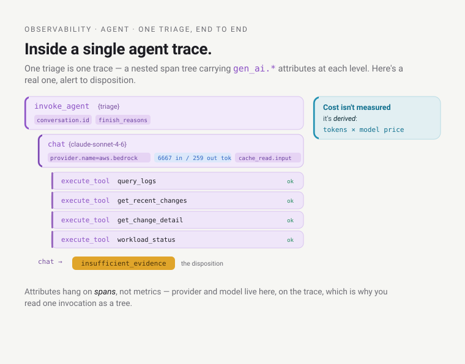
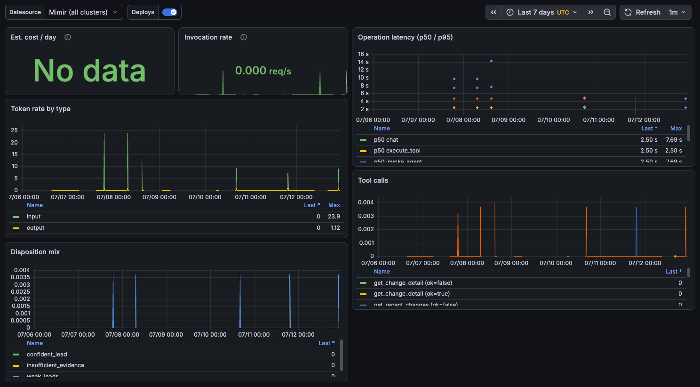
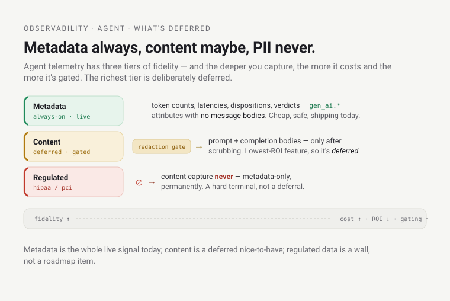

# Learn: Observability — Agent observability (deep dive)

This is how the platform observes its own AI agents — the triage copilot first — using OpenTelemetry's
GenAI semantic conventions. For the terse one-paragraph version, see the
[Reference](reference.md#agent-observability-adr-076--live).

Think of a hospital patient monitor: wire the patient up the moment they're admitted and read the vitals
without them lifting a finger. An AI agent is a new *kind* of patient. The vitals you'd take for a web
service — rate, errors, duration — tell you almost nothing about whether the agent is doing its job. That
gap is the whole subject here.

## The new problem: a non-deterministic worker

A `Deployment` is deterministic-ish: same request, same code path, same answer. You watch it with RED
metrics (Rate, Errors, Duration) and you know roughly how it's doing. An agent — here, the triage copilot,
which wakes on a critical alert, gathers evidence, and proposes *"here's the likely culprit change and
team"* — is a non-deterministic, LLM-driven worker. The
same alert can take a different path each time: a different number of model turns, a different set of tool
calls, a different confidence. "HTTP 200, p95 = 1.2s" is true and useless. The questions that matter are
new:

- **What did it cost?** Every model turn burns tokens, and tokens are money. A runaway loop isn't a 500 —
  it's a bill.
- **How long did the *whole decision* take**, across all its model and tool calls — not just one HTTP hop?
- **What did it actually do?** Which tools did it call, in what order, and did they succeed?
- **Was it any *good*?** Did a human accept its call, correct it, or throw it away? A deterministic service
  is up or down; an agent can be up and confidently wrong, which no uptime probe will ever catch.

None of those fall out of Beyla's eBPF RED metrics. They need the agent to describe its own reasoning loop
in a vocabulary built for that shape. Start there.

## The vocabulary: the GenAI semantic conventions

OpenTelemetry has a set of semantic conventions — agreed names for common attributes, so "duration" or
"http.method" means the same thing everywhere. In 2023–2025 the community added
[GenAI conventions](https://opentelemetry.io/docs/specs/semconv/gen-ai/): standard names for LLM/agent
telemetry — operations (`invoke_agent`, `chat`, `execute_tool`), token counts, model names, tool names, an
eval result. Adopting them means the platform's agents speak the industry's language, not a bespoke one.

The catch drives a design choice worth holding onto: this semconv is still `Development`-tier (OTel's
pre-stable status) and actively shifting — it has even graduated into its own repo. So the platform wraps
it. All convention-specific attribute mapping lives behind a single thin platform-owned instrumentation
helper, so when the spec renames a field that's one edit in the wrapper, not a fleet-wide rewrite. The
agent's own code emits plain "input tokens"; the wrapper decides what OTel calls that this month.

## The agent loop is a span tree

An agent's work is a tree of nested operations, and OTel's three GenAI operation names map onto that tree
exactly:



`invoke_agent` is the parent span over the whole invocation; `chat` spans are the individual model turns,
each carrying its token counts; `execute_tool` spans are the tool calls the model decided to make. This
isn't aspirational — it's live. Querying Mimir in-cluster for the operation-duration histogram's series
shows all three, from a real triage:

```text
$ wget -qO- --header 'X-Scope-OrgID: platform' \
    '<mimir-gateway>/prometheus/api/v1/query?query=count(gen_ai_client_operation_duration_seconds_count) by (gen_ai_operation_name)'
{"gen_ai_operation_name":"chat"} 1
{"gen_ai_operation_name":"execute_tool"} 1
{"gen_ai_operation_name":"invoke_agent"} 1
```

> This is the flight recorder for a decision-maker. A plane's flight-data recorder captures every input and
> control action so you can reconstruct *why* the aircraft did what it did — not just that it crashed. The
> `invoke_agent → chat → execute_tool` tree is that same reconstructable causal chain for one decision.
> Where it breaks: a plane's outcome is objective — it landed or it didn't. An agent's outcome — *was the
> triage good?* — is a human judgment. A flight recorder has no field for "the captain made a reasonable
> call." The agent's telemetry needs one, and that's the eval signal below.

## The attributes, and why there's no cost metric

On the spans hang the `gen_ai.*` attributes: the provider
(`gen_ai.provider.name = "aws.bedrock"`), the request/response model, token usage
(`gen_ai.usage.input_tokens` / `output_tokens`), and — because this agent runs on a prompt-cached model —
the cache-aware counts `cache_read.input_tokens` / `cache_creation.input_tokens`. Tool spans carry
`gen_ai.tool.name` and `tool.call.id`; the loop carries `gen_ai.conversation.id`,
`gen_ai.response.finish_reasons`, and `error.type`.

Notice what's absent: there's no cost metric in the spec. That's deliberate. Cost is derived —
`tokens × price(model@version)` — because the price isn't the agent's to know and changes without the agent
changing. That derivation is the platform metering seam: the same tokens feed cost attribution. The
dashboard's "Est. cost / day" panel does the arithmetic in
PromQL, pricing Sonnet 4.6 at $3 / $15 / $0.30 per million input / output / cache-read tokens.

> The bill and the doctor's notes. The metadata — tokens, latency, tool names, disposition — is the
> itemised bill and the vitals chart: cheap to keep, carries no patient data, kept for everything, always.
> The prompt and response content is the doctor's private notes: kept only behind a privacy gate, never
> sold to an outside service. That split is load-bearing — metadata-first is the default, and it's why
> cost, quality, and latency all work without ever storing a prompt. Where it breaks: a bill
> still implies what happened; token metadata genuinely can't reconstruct the reasoning. For that you'd
> need the content, which is exactly the gated, deferred part.

## Instrument once, fan out per consumer — the three paths

The kernel: instrument the agent once, then fan the signal out to consumers that each want a *different
substrate* — metrics (Mimir), traces (Tempo), and a durable eval/audit record (S3). Four consumers
collapse to three substrates because two of them — audit and eval — both want the same thing, a complete
and durable record, so they share the single write-once S3 path; metrics and traces keep their own stores.
And this is the reassuring part: none of those stores are new. It's the *same four-signal machine* from the
rest of this stack, pointed at a new kind of workload — not a second observability system.

**Path 1 — metrics, by Prometheus scrape (not OTLP push).** The agent exposes a `/metrics` endpoint and is
a plain scrape target — a Kubernetes `Service` on port `http` (container port 8080) plus a `ServiceMonitor`
the platform's Prometheus picks up. The `ServiceMonitor` itself ships from the app repo's manifests and is
delivered by the per-agent ArgoCD ApplicationSet (declared as a managed kind — see the go-deeper links); its
exact name and port aren't sourced from this repo, but the scrape-via-`ServiceMonitor` shape is:

```text
$ kubectl -n platform-agent-triage-copilot get servicemonitor triage-copilot-server -o yaml
spec:
  endpoints:
  - interval: 30s
    path: /metrics
    port: http
  selector:
    matchLabels:
      app.kubernetes.io/name: triage-copilot-server
```

Why scrape rather than push the metrics through the OTLP trace pipeline? To isolate the two. Metrics are
cheap, aggregatable, and want to keep flowing even if the trace collector is saturated or down; pulling
them on a separate scrape path means a metrics spike never rides — or stalls behind — the trace gateway.
From here they land in the *same* Mimir every other metric on the platform does — agent metrics are just a
new kind of series in the store the reader already met.

**Path 2 — traces, by OTLP → OTel Collector → Tempo.** The `invoke_agent`/`chat`/`execute_tool` span tree,
enriched with the `gen_ai.*` attributes, flows over OTLP to the platform's OpenTelemetry Collector and into
the *same* Tempo that holds every other workload's traces — the debug consumer, where you open one triage
and read its whole reasoning waterfall.

**Path 3 — durable eval / audit, by structured log → S3.** Audit gets its own durable, write-once record;
the sampled Tempo trace is not the audit record, because a sampled, retention-bounded trace can silently
drop or expire the very evidence you'd audit on. So audit/eval writes to a write-once S3 corpus
(`platform-agent-eval-corpus`), where the agent writes forward-capture eval records. The bucket and its
write-once IAM are provisioned by the agent's own XAgent claim, which grants it `s3:PutObject`/`GetObject`
but no `s3:DeleteObject` (write-once integrity); the record-writing itself lives in the agent's app code.

## The three slices — and the live token data behind them

Agent observability comes in three slices, all live.



*The real **Triage Agent** dashboard: token rate, operation latency (p50/p95 ≈ 2.5s/7.7s), tool calls, and disposition mix from actual triages. The eval/calibration panels below (not shown) stay empty until a human renders the first Accept/Correct/Dismiss verdict — the cold-start state described later.*

**Slice 1 — the meter + the "Triage Agent" dashboard.** Before this there was no agent meter at
all. Slice 1 added the token/latency/disposition/tool counters and the Grafana dashboard
(`agent-triage.json`, uid `agent-triage`) that renders them (see the go-deeper links for the source). Real
token counts flow today — a point-in-time snapshot:

```text
$ ... 'query=sum(gen_ai_client_token_usage_sum) by (gen_ai_token_type)'
{"gen_ai_token_type":"input"}  6667
{"gen_ai_token_type":"output"}  259
```

(`cache_read` and `cache_creation` are in the schema and the cost panel; they simply have no series in this
small sample yet — designed-for, not yet exercised.) The disposition and tool-call counters are live too,
and they're concrete about what the agent actually did:

```text
$ ... 'query=sum(triage_disposition_total) by (triage_disposition)'
{"triage_disposition":"insufficient_evidence"}  1

$ ... 'query=count(triage_tool_calls_total) by (gen_ai_tool_name)'
{"gen_ai_tool_name":"get_change_detail"}   1
{"gen_ai_tool_name":"get_recent_changes"}  1
{"gen_ai_tool_name":"query_logs"}          1
{"gen_ai_tool_name":"workload_status"}     1
```

**Slice 2 — span enrichment.** The span tree already existed — the agent exports
`invoke_agent`/`chat`/`execute_tool` spans on its own. Slice 2 enriches those spans with the `gen_ai.*`
attributes so Tempo carries provider, model, tokens, and tool names. An enrichment, not a greenfield build.
The split shows up in practice: on the *metric* series, provider/model aren't labels — that dimension lives
on the *spans*, keeping metric cardinality low. Query the metric and the provider/model labels come back
empty; open the trace and they're there.

**Slice 3 — the eval online-signal.** This is the "was it good?" answer, and it's the part that makes agent
observability different from every other kind. When a human reacts to a triage in Slack — Accept, Correct,
or Dismiss — that verdict is recorded as a counter, `triage_feedback_total`, dimensioned by `verdict` and
by the agent's own `triage_disposition`. Two dashboard panels turn that into a calibration signal: "Human
verdicts" (volume over time) and, more sharply, "Accept-rate by disposition" — `accept ÷ all verdicts`, per
disposition. The point is in that ratio. If the agent's `confident_lead` triages get a low human-accept
rate, the agent is over-confident — its confidence isn't calibrated to reality. No token count or latency
graph can tell you that; only the loop back to a human can.


**One invocation, end to end.** Put the three slices on a single timeline and every number on this page comes
from one real triage. A critical alert fires; the agent wakes and opens an `invoke_agent` span over the whole
triage. Inside it, a `chat` turn burns **6667 input / 259 output tokens** deciding what to look at, then four
`execute_tool` spans run — `query_logs`, `get_recent_changes`, `get_change_detail`, `workload_status` — each
gathering evidence. The model weighs what came back, finds it thin, and records a disposition of
`insufficient_evidence` (the value in `triage_disposition_total`). Later a human reads the proposal in Slack
and clicks a verdict, which lands in `triage_feedback_total`. Tokens (Slice 1), the span tree (Slice 2), and
the verdict (Slice 3) are the same thread seen through three lenses — not three separate agents.

## When it looks broken but isn't: the cold agent

Here's a failure mode you'll hit, and it teaches the whole model. Open the agent dashboard right after a
deploy — or query the feedback counter — and it's empty:

```text
$ ... 'query=sum(triage_feedback_total) by (verdict)'
{"status":"success","data":{"result":[]}}
```

No series at all. Is the eval signal broken? No — this is verified-live right now, and it's working exactly
as designed. These are zero-recording instruments: an OTel counter emits no time series until it is first
incremented. `triage_feedback_total` has no series because no human has rendered a verdict yet — the agent
has triaged, but nobody has clicked Accept/Correct/Dismiss. Likewise the token and disposition counters
were empty until the agent's first triage. A genuinely cold agent shows only `target_info` (the
scrape-target heartbeat, which is present):

```text
$ ... 'query=count(target_info{namespace="platform-agent-triage-copilot"})'
{} 1
```

The self-heal isn't a fix — it's use. The first triage lights up the token/disposition/tool panels; the
first human verdict lights up the eval panels. An empty agent dashboard means quiet, not broken — the most
common false alarm in this whole area. So when the disposition panel is flat, check first that the agent
has actually run a triage since the last scrape reset, before you suspect the ServiceMonitor or the scrape.

## What's deliberately deferred — the honest edges

This area is easy to oversell, so here's what isn't built.



- **Content capture with per-tier redaction** — *deferred; metadata-only today.* Prompts/responses would
  only ever be stored behind a per-compliance-tier redaction gate and never shipped to a SaaS backend. And
  a hard invariant: regulated tiers (hipaa/pci) are metadata-only *permanently* — because reliable
  secret/PII redaction of free-form text is itself an unsolved problem, so the platform refuses to depend
  on it as a guarantee.
- **Langfuse (self-hosted LLM lens)** — *deferred.* A dedicated trace-tree/eval UX for LLMs is deferred;
  today, OTel spans in Tempo, viewed in Grafana, are enough.
- **A2A (agent-to-agent) causality** — *designed, unexercised.* The plumbing propagates
  [W3C trace context](https://www.w3.org/TR/trace-context/) so a future multi-agent chain would be one
  correlated tree — but there's one agent today, so it's never been exercised.

## Gotchas that teach

- **Zero-recording instruments (the big one).** No series until first use. A cold agent = `target_info`
  only. Not broken — quiet. This is the single most common "the dashboard is empty" confusion.
- **No cost metric — cost is derived.** Don't hunt for `gen_ai_cost_total`; it doesn't exist by design.
  Cost = `tokens × model@version price`, computed in the dashboard's PromQL. Change the price, edit the
  panel.
- **Metrics scrape, traces push — on purpose.** Metrics come off a `/metrics` scrape (`:8080` +
  `ServiceMonitor`), not the OTLP trace pipeline, so a metrics load never stalls behind the trace gateway.
  Two paths, one instrumentation point.
- **A sampled trace is not an audit record.** Audit/eval needs a complete, durable, write-once path
  (structured log → S3), because a retention-bounded, sampled Tempo trace can silently lose the very
  record you need.
- **Calibration lives in a ratio, not a count.** "Accept-rate by disposition" is where over-confidence
  shows up; raw token and latency graphs will look perfectly healthy while the agent is confidently wrong.
- **The convention will move under you.** GenAI semconv is `Development`-tier — that's why the mapping is
  wrapped. If an attribute name changes upstream, fix the wrapper, not fifty call sites.

## Go deeper

- **ADRs:** [ADR-076](../../adrs/076-agent-observability.md) (agent observability) ·
  [ADR-074](../../adrs/074-agentic-workloads-platform.md) (data boundary + metering seam) ·
  [ADR-080](../../adrs/080-triage-copilot.md) (the agent being observed) ·
  [ADR-082](../../adrs/082-platform-agent-runtime-xagent.md) (the XAgent runtime).
- **The code:** the dashboard
  [`agent-triage.json`](https://github.com/asanexample/platform/blob/main/infra/modules/observability/dashboards/agent-triage.json)
  · the agent claim
  [`gitops/agents/triage-copilot.yaml`](https://github.com/asanexample/platform/blob/main/gitops/agents/triage-copilot.yaml)
  · the Agent
  [Composition](https://github.com/asanexample/platform/blob/main/infra/modules/crossplane/charts/agent-api/files/composition.yaml)
  · the per-agent ArgoCD ApplicationSet
  [`argocd-apps/agents.tf`](https://github.com/asanexample/platform/blob/main/infra/modules/argocd-apps/agents.tf).
- **Substrate:** [OpenTelemetry GenAI semantic conventions](https://opentelemetry.io/docs/specs/semconv/gen-ai/)
  · [GenAI metrics spec](https://opentelemetry.io/docs/specs/semconv/gen-ai/gen-ai-metrics/) ·
  [W3C Trace Context](https://www.w3.org/TR/trace-context/).
- **The whole machine:** the [Observability orientation](orientation.md); to author obs or an agent, the
  `observability-authoring` and `authoring-platform-agents` house skills.
