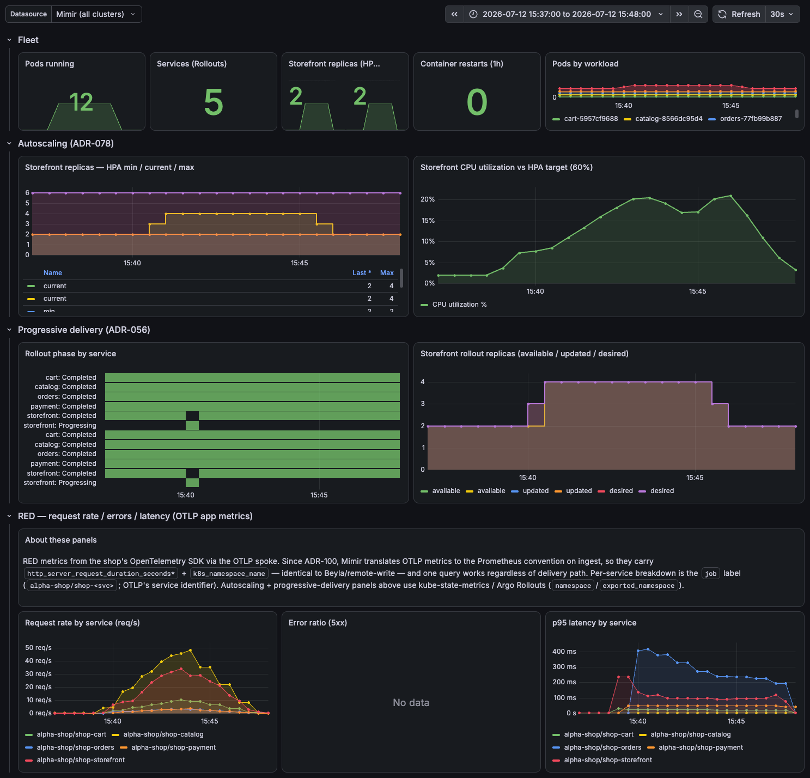
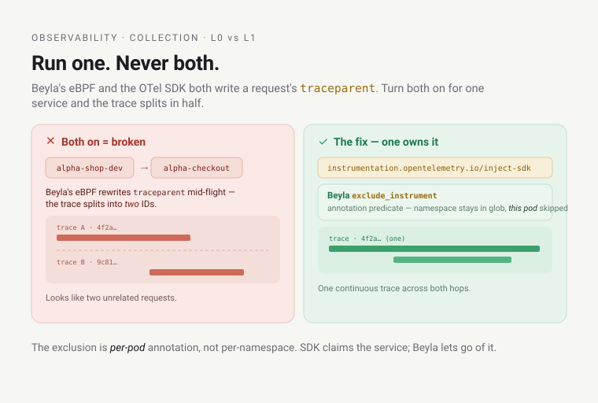

# Learn: Observability — collection & the instrumentation ladder (deep dive)

This picks up where the [orientation](orientation.md) left off. There, the headline was that
observability here is **platform-injected**: your workload is watched from the moment it runs — four
signals, mostly zero-code — and the `alpha` team did almost nothing to make its `shop` product's 3 a.m. slowdown
findable. This deep dive is the machinery behind that claim: the fleet of collectors that do the
watching, how each one is wired, and the instrumentation ladder you climb only as far as you need. It
assumes the orientation's mental model — the four signals, LGTM+P, hub-and-spoke, `X-Scope-OrgID` as a
trust header.

One question to hold onto: for a given signal, what runs on the node, what did the app have to add, and
where does the data go? By the end you should be able to draw the whole pipeline from kernel to store
without looking.

## Platform-injection: the contract

Everything below follows from one rule: **apps carry zero telemetry
config.** The same paved-road rule that injects your `securityContext` (Kyverno `mutate`) and your AWS
creds (Pod Identity) applies to telemetry — the platform stands up the collectors and instruments your
workload; the app doesn't link a metrics library, wire a tracing SDK, or hardcode a collector address.
The platform makes three commitments, and the rest of this doc is just those three in detail:

1. **Zero-code eBPF (Beyla) is the universal floor** — RED metrics, a service graph, and request-level
   traces for every workload, any language, no manifest change.
2. **The OTLP endpoint is platform-managed, never app-wired** — an app never knows the collector's
   address, so the platform can move it without touching a single app.
3. **SDK-level detail is opt-in enrichment** for workloads that want it.

The first is the surprising one, and it gets the most attention below.

> **L0 and L1 are mutually exclusive per workload.** Run Beyla (the L0 floor) *or* the OTel SDK (L1) on
> a given workload, never both — their trace-context propagation fights: Beyla's eBPF context-propagation
> overwrites the SDK's `traceparent` on egress and fragments the trace (a real incident, not a
> theoretical risk). A pod that opts into the SDK is auto-excluded from Beyla; the full mechanism is the
> **L0/L1 landmine** in [Gotchas that teach](#gotchas-that-teach) below.

## The collector fleet — every one, verified running

"Collectors" isn't one thing; it's a fleet of purpose-built agents, each specialized for one signal and
one topology. Here's the platform (hub) cluster's `observability` namespace, live:

```text
$ kubectl -n observability get ds,deploy    # platform (hub), abridged to the collectors
NAME                            DESIRED   CURRENT   READY   AGE
daemonset.apps/alloy            3         3         3       …    # logs → Loki (node-local)
daemonset.apps/alloy-profiles   3         3         3       …    # eBPF CPU profiles → Pyroscope
daemonset.apps/beyla            3         3         3       …    # eBPF RED + traces
…node-exporter…

NAME                                   READY   AGE
deployment.apps/alloy-events           1/1     …    # K8s events → Loki (singleton)
deployment.apps/blackbox-exporter      1/1     …    # synthetic probes
deployment.apps/cloudwatch-exporter    1/1     …    # AWS-side metrics (YACE)
deployment.apps/otel-collector         1/1     …    # OTLP trace gateway → Tempo
deployment.apps/policy-reporter        1/1     …    # Kyverno PolicyReports → metrics
…stores: mimir-*, tempo-*, loki-*, opencost, sloth…
```

Plus a `k6-synthetics` CronJob (`*/5 * * * *`, verified `LAST SCHEDULE` under two minutes ago). Note the
shape: three DaemonSets (one pod per node — 3 here), singletons as Deployments, and a CronJob for
periodic work. That per-topology split is deliberate, and the three Alloys are the sharpest example.

## The three narrow Alloys — one tool, three jobs, three topologies

[Grafana Alloy](https://grafana.com/docs/loki/latest/send-data/alloy/) is a general-purpose collector,
but this platform runs it as three separate, deliberately narrow deployments rather than one fat agent.
The reason is topology and privilege, not preference.


| Alloy instance | Module | Controller | Why *this* shape |
| --- | --- | --- | --- |
| **Logs** (`alloy`) | `observability-alloy` | **DaemonSet** | Each pod tails **only its own node's** `/var/log/pods` (a `spec.nodeName`-filtered `discovery.kubernetes`). Node-local = no duplicate ingestion. |
| **K8s events** (`alloy-events`) | `observability-events` | **singleton Deployment** (`replicas = 1`) | Watches the cluster-wide Events API. A *second* replica would watch the same API and **duplicate every event** into Loki. |
| **Profiles** (`alloy-profiles`) | `observability-pyroscope-ebpf` | **privileged DaemonSet** (`hostPID: true`, `runAsUser: 0`) | eBPF CPU-profiles every process on its node. Needs kernel privilege + host PID visibility — isolated in its own DaemonSet so only *it* runs privileged, not the log collector. |

The gotcha worth internalizing: the same binary demands opposite deployment shapes depending on what it
collects. Logs are per-node (tail local files → DaemonSet). Events are cluster-global (watch one API →
exactly one watcher, or you double-count). Profiles need root — so you quarantine the privilege in a
dedicated DaemonSet instead of granting it to the log collector that reads untrusted app output.
Collapsing these into one agent would either duplicate events, over-privilege the log path, or both.

The log Alloy's node-local trick is worth one line of River, because it makes "no duplicate ingestion"
concrete:

```text
discovery.kubernetes "pods" {
  role = "pod"
  selectors {
    role  = "pod"
    field = format("spec.nodeName=%s", sys.env("NODE_NAME"))   // only THIS node's pods
  }
}
```

`NODE_NAME` comes from the Downward API — Kubernetes' mechanism for surfacing a pod's own metadata (here
its scheduled node name, `spec.nodeName`) into the container as an env var — so each of the three pods
sees a disjoint third of the cluster's logs. The profiles Alloy uses the same DaemonSet pattern but with
[`pyroscope.ebpf`](https://grafana.com/docs/alloy/latest/reference/components/pyroscope/pyroscope.ebpf/)
instead of file-tailing.

## Beyla — the smart meter on the main pipe

[**Beyla**](https://grafana.com/docs/beyla/latest/) (`observability-beyla`, chart `1.16.8`, app
`3.20.0`) is an [eBPF](https://ebpf.io/what-is-ebpf/) DaemonSet — verified 3 pods on the hub, 2 on
preprod. eBPF lets a sandboxed program run inside the Linux kernel; Beyla hooks the kernel's networking
and HTTP/gRPC/SQL paths and watches request boundaries at the syscall level. From that vantage it
auto-generates RED metrics (Rate, Errors, Duration), a service graph, and request-level traces — for
every workload, any language, existing or future, with zero code and zero manifest change.

> The orientation called Beyla a traffic camera, not a GPS unit you install in each car — it sees every
> vehicle's speed and route from the outside, so a Go binary, a Python service, and a vendored appliance
> you can't recompile all light up identically. Here's the second half of that metaphor, for why it's
> cheap: it's a smart meter clamped on the building's main water pipe, not a flow sensor plumbed into
> every faucet. One device, installed once by the utility, measures everyone's usage — versus a sensor
> each tenant has to buy, fit, and maintain. Where both break: the meter on the main sees total flow,
> not which tap is dripping inside apartment 4B; the camera sees the road, not the conversation inside
> the car. Beyla sees request *boundaries* — rate, status, latency, the call graph — but **not your
> in-process function spans or custom attributes.** That exact gap is what the opt-in SDK layer (below)
> fills.

Beyla is unusual among the collectors because it feeds two pipelines at once, and the module wiring
shows both:

- **RED + service-graph metrics** go to Beyla's own `/metrics` endpoint (`prometheus_export`, port 9090,
  `features = ["application", "application_service_graph"]`), which the hub Prometheus **scrapes** via a
  `ServiceMonitor` → Mimir. This is a pull.
- **Request traces** are **pushed** as OTLP/gRPC to the OTel Collector gateway (`otel_traces_export`) →
  Tempo.

What Beyla instruments is a config glob, and it differs hub vs spoke — the clearest illustration of
dogfood-first:

| Cluster | `instrument_namespaces` | Meaning |
| --- | --- | --- |
| **platform** (hub) | `{backstage,keycloak,argocd,observability}` | The human-facing platform HTTP services — real traffic → a non-empty service graph immediately, before any tenant app exists. |
| **preprod** (spoke) | `{alpha-*}` | The tenant app namespaces (`alpha-shop-dev`, `alpha-checkout-dev`, …) — the real workloads. |

Beyla tags every span/metric with Kubernetes metadata (`attributes.kubernetes.enable = true`), and —
this is the correlation seam — its trace `service.name` is deliberately aligned with the eBPF profiler's
`service_name` (both derive from the `app.kubernetes.io/name` label, falling back to namespace). That
alignment is why the orientation's "span → flame graph" jump resolves; it's set here, in collection, not
in Grafana.

### Beyla vs the Tempo metrics-generator — the honest version

**The takeaway first:** Beyla is the RED source the per-app SLOs read; the Tempo metrics-generator *also*
runs — for Grafana's Traces Drilldown — but nobody consumes its RED. The rest of this section is the
nuance behind that one line.

Beyla is the RED source, not Tempo's metrics-generator: the generator derives RED from ingested spans,
which is useless while nothing emits spans, whereas Beyla produces RED directly from live traffic. This
is verifiable — the per-app SLOs read Beyla's `http_server_request_duration_seconds_count`, not the
generator's `traces_spanmetrics_*`.

The nuance: today a `tempo-metrics-generator` Deployment **is** running on the hub. Once Beyla started
emitting traces into Tempo, the generator had input, and it was turned on — with all three processors
(`service-graphs`, `span-metrics`, `local-blocks`). So it does emit its own RED span-metrics
(`traces_spanmetrics_*`) and service-graph series into Mimir; the `local-blocks` processor is what powers
Grafana's **Traces Drilldown** (TraceQL-metrics over spans). The distinction that matters: the generator
isn't the RED source the platform *consumes* — the per-app SLOs and dashboards read Beyla, not the
generator. RED and SLOs come from Beyla, even though the generator is running and producing its own
span-metrics alongside.

## The instrumentation ladder — climb only as far as you need

The payoff of platform-injection is a ladder: every workload gets the free baseline, and you opt into
more only where you need depth.

| Layer | What you get | What you do | Status (verified) |
| --- | --- | --- | --- |
| **L0 — Beyla eBPF** | RED metrics + service graph + request traces | **Nothing** | **Live**, both clusters (3 hub / 2 preprod DaemonSet pods) |
| **L1 — OTel SDK auto-inject** | code-level spans, metrics, profiles, trace-stamped logs | Wire the SDK + add one annotation | **Live** — `alpha-shop`, `alpha-checkout` (preprod), both opted in |
| **L2 — agent observability** | GenAI semconv for AI agents | (agent-side instrumentation) | Live for the triage agent — see the agent-observability dive |



*The `alpha-shop` L1 (OTLP SDK) RED under a real load test (2026-07-12, ~3,264 requests / 901 checkouts / 0 errors): request rate ~50 req/s, p95 ~400ms on `orders`, zero 5xx — and, because it's the same dashboard, the storefront HPA scaling 2→4 on CPU and the progressive-delivery rollout phases. The "About these panels" note is the OTLP→Prometheus convergence, live.*

L1 is live. The [OpenTelemetry
Operator](https://opentelemetry.io/docs/kubernetes/operator/automatic/) (`observability-otel-operator`,
chart `0.116.0`) runs as `opentelemetry-operator` in the `opentelemetry-operator-system` namespace on
**both** clusters — the CRD is present on each, not hub-only. The mechanism is a mutating admission webhook:
annotate a pod `instrumentation.opentelemetry.io/inject-sdk` and the operator injects the
platform-managed OTLP endpoint at admission — the app still links its own OTel SDK (that's what makes
this L1, not L0), but never hardcodes a collector address.

> **One pod, walked end to end.** `storefront` in `alpha-shop-dev` carries
> `instrumentation.opentelemetry.io/inject-sdk`. At admission the OTel operator's webhook injects the
> platform OTLP endpoint (read from that namespace's `Instrumentation` CR); *the same* annotation trips
> Beyla's `exclude_instrument` predicate, so Beyla skips the pod. `storefront`'s own SDK then emits the
> traces, which land in Tempo under job `alpha-shop/storefront`. One annotation flips that pod from L0 to
> L1 *and* keeps the two collectors from fighting over its `traceparent`.



The endpoint config lives in a namespace-scoped `Instrumentation` **CR**, and today twelve exist — one per
environment namespace, verified live:

```text
$ kubectl --context preprod get instrumentation.opentelemetry.io -A
NAMESPACE                NAME       ENDPOINT
alpha-shop-dev           platform   http://otel-collector.observability.svc.cluster.local:4318
alpha-shop-prod          platform   http://otel-collector.observability.svc.cluster.local:4318
alpha-shop-staging       platform   http://otel-collector.observability.svc.cluster.local:4318
alpha-shop-test          platform   http://otel-collector.observability.svc.cluster.local:4318
alpha-shop-uat           platform   http://otel-collector.observability.svc.cluster.local:4318
bravo-dispatch-dev       platform   http://otel-collector.observability.svc.cluster.local:4318
bravo-dispatch-prod      platform   http://otel-collector.observability.svc.cluster.local:4318
bravo-dispatch-staging   platform   http://otel-collector.observability.svc.cluster.local:4318
bravo-dispatch-test      platform   http://otel-collector.observability.svc.cluster.local:4318
bravo-dispatch-uat       platform   http://otel-collector.observability.svc.cluster.local:4318
platform-flagship-dev    platform   http://otel-collector.observability.svc.cluster.local:4318
platform-pulse-dev       platform   http://otel-collector.observability.svc.cluster.local:4318
```

(`alpha-checkout` is a registered Product but currently has no live Environment claim, so it has no
`Instrumentation` CR right now — not a gap, just nothing deployed there at the moment.)

The CR existing per namespace doesn't mean every pod in it climbed the ladder, though — the CR just
*makes L1 available*; a pod still has to carry the `inject-sdk` annotation to use it. Spot-checked:
`alpha-shop`'s services (`cart`, `catalog`, `orders`, `payment`, `storefront`) and `bravo-dispatch`'s
`tracker`/`shipments`/`intake`/`dispatch-worker` carry the annotation and are SDK'd, as does
`platform-pulse`'s `generator` (a continuous synthetic-traffic generator that drives demo traffic against
alpha-shop and bravo-dispatch; it reuses `alpha-shop`'s own `internal/telemetry` package verbatim, so its
outbound calls propagate `traceparent` into the very services it's calling); `bravo-dispatch`'s `notify`
(Node/TS, deliberately un-instrumented — the fleet's Beyla-only L0 reference) and `platform-flagship`
don't — they ride the L0 Beyla baseline like everyone else. That's the ladder working as designed: opt-in,
per workload, not all-or-nothing per namespace.

## The rest of the fleet — traces, metrics, cloud, synthetics

**OTel Collector gateway** (`observability-otel-collector`, chart `0.158.2`). A deployment-mode gateway:
apps (and Beyla) send OTLP to its service; it runs `otlp → memory_limiter → batch → tempo` and forwards
traces to Tempo's distributor. On the hub it exports OTLP/gRPC to the in-cluster Tempo; a spoke exports
OTLP/HTTP to the hub Tempo edge over the Gateway and stamps `cluster=<spoke>` via a `resource` processor.
It can also carry an OTLP-metrics pipeline to Mimir's native OTLP ingest (`/otlp/v1/metrics`) for
OTEL-native workloads (e.g. the activation operator) — only wired when a `mimir_endpoint` is set.

**Prometheus — agent on the spoke, full stack on the hub.** This is the sharpest hub-vs-spoke
difference.

- **Hub:** the full `kube-prometheus-stack` — Prometheus *scrapes* targets, keeps ~15d local history,
  serves queries, evaluates alert rules, and `remote_write`s every sample to Mimir.
- **Spoke** (`observability-prometheus-agent`): the *same chart* in **agent mode** (`agentMode: true`) —
  WAL + `remote_write` only. No Grafana (`grafana.enabled = false`), no Alertmanager, no rules
  (`defaultRules.create = false`), no local query TSDB. It scrapes preprod's
  KSM/node-exporter/ServiceMonitors and ships to the hub Mimir, tagging `externalLabels.cluster =
  preprod` so the hub isolates it under the `preprod` tenant. Dropping the UI, alerting, and query path
  is what makes a spoke "lightweight" despite reusing the full chart.

**CloudWatch exporter** (`observability-cloudwatch-exporter`,
[YACE](https://github.com/prometheus-community/yet-another-cloudwatch-exporter), chart `0.46.0`). The
four signals stop at the cluster edge; this reaches outside it. YACE does tag-based discovery
(`tag:GetResources`) of the platform's always-on AWS network resources — **NLB** (`AWS/NetworkELB`),
**NAT** (`AWS/NATGateway`), **Transit Gateway** (`AWS/TransitGateway`) — pulls their CloudWatch metrics
on a 5-minute period, exports them as Prometheus series (with resource tags as labels), and the hub
Prometheus scrapes them → Mimir. AWS creds come from **EKS Pod Identity** — no static keys, no
IRSA annotation; the read role trusts `pods.eks.amazonaws.com` and grants
`cloudwatch:GetMetricData`/`ListMetrics` + `tag:GetResources` at `Resource = "*"` (those APIs don't
support resource scoping). It's a hub-only exporter — AWS metrics are account/region-wide, so one scraper
suffices.

**Blackbox + k6 — synthetics (is it up *from outside*?).** RED metrics tell you how real traffic fared;
synthetics generate synthetic traffic so you notice breakage even with no users.

- **blackbox-exporter** (`observability-blackbox`, chart `11.13.0`) probes the platform HTTPRoutes
  (grafana/argocd/backstage/keycloak) over HTTP with TLS verification on (`insecure_skip_verify: false`,
  `fail_if_not_ssl: true`) — so it catches cert expiry and chain breaks, emitting `probe_success` and
  `probe_ssl_earliest_cert_expiry`. It's driven by a `Probe` CR the hub Prometheus discovers. The gotcha
  baked in: a pod can't reliably reach an internal NLB that targets its own cluster (the hairpin), so the
  exporter `hostAlias`es the probe hostnames to the Cilium Gateway Envoy **ClusterIP** — testing Gateway
  routing + TLS directly while keeping the real SNI/Host.
- **k6** (`observability-k6`) is a CronJob (`*/5 * * * *`) running a scripted check; a breached threshold
  makes the run exit non-zero (a visible, alertable failed Job). It ships results to Mimir via k6's
  `experimental-prometheus-rw` output, stamping the tenant header. Failed Jobs auto-delete after 1h
  (`ttl_seconds_after_finished`) so a transient failure during a parked cluster doesn't fire
  `KubeJobFailed` for days.

**policy-reporter** (`observability-policy-reporter`, chart `3.7.4`). Not a "signal" collector in the
LGTM sense — it watches Kyverno's `PolicyReport`/`ClusterPolicyReport` CRs and turns admission outcomes
into `policy_report_result` metrics (`detailed` mode → full labels) + bundled Grafana dashboards. It runs
on **both** clusters, but only the hub renders the dashboards; the spoke just emits metrics for the hub's
federated Mimir view.

**Cilium + Hubble — the network plane.** The four signals watch the application; the CNI watches the
network underneath it. Cilium (the eBPF CNI — see
[Foundations](../foundations/deep-dive-the-cluster.md)) and its Hubble layer expose Prometheus metrics,
scraped into Mimir by a dedicated `hubble` + `cilium-agent` `ServiceMonitor` in the observability module
(the Cilium chart's own ServiceMonitors are deliberately off — Cilium installs before the Prometheus
operator exists, so nothing would be there to honor them). Live in Mimir today:
`cilium_drop_count_total` (packet drops by reason and identity), `hubble_flows_processed_total` (L3–L7
flow counts), plus agent/operator health. Those feed real alerts — `CiliumHighDropRate`, `HubbleDown`,
`CiliumAgentDown`/`CiliumOperatorDown`, `CiliumUnreachableNodes` — which is what turns the house debug
habit ("monitor drops first") into a paging signal rather than a manual `cilium monitor` session.
Hubble's own **UI** (`hubble-relay` + `hubble-ui`) runs for live L3–L7 flow visualization + a service
map — a standalone pane, not folded into Grafana. Honest status: the flow metrics + the UI are live; the
detailed per-flow log export into Loki and dedicated Cilium/Hubble Grafana dashboards are
designed-not-built — so today the network plane is counted and alerted, and you drop to the Hubble UI for
per-flow forensics.

## End-to-end flow, per signal

Draw this from memory and you own the pipeline:


| Signal | Collector (topology) | Transport | Store |
| --- | --- | --- | --- |
| **Logs** (pod) | Alloy `alloy` (DaemonSet, node-local) | file-tail → `loki.write` | Loki |
| **Logs** (K8s events) | Alloy `alloy-events` (singleton) | `loki.source.kubernetes_events` | Loki |
| **Metrics** (RED) | **Beyla** (eBPF DaemonSet) | `/metrics` **scraped** by Prometheus | Mimir |
| **Metrics** (infra) | Prometheus (hub) / agent (spoke) | scrape → `remote_write` | Mimir |
| **Metrics** (AWS) | cloudwatch-exporter / YACE (singleton) | scrape (5m) | Mimir |
| **Metrics** (synthetic) | blackbox `Probe` + k6 CronJob | scrape / `prometheus-rw` | Mimir |
| **Network flows** | Cilium + Hubble (`ServiceMonitor`) | scrape → Prometheus | Mimir (+ Hubble UI) |
| **Traces** | **Beyla** (push) + apps (OTLP) | OTLP → OTel Collector | Tempo |
| **Profiles** | Alloy `alloy-profiles` (privileged eBPF DaemonSet) | `pyroscope.ebpf` push | Pyroscope |

Two collectors, Beyla and the eBPF profiler, are the zero-code pillars — everything a developer sees for
free traces back to those two DaemonSets and the `service.name`/`service_name` alignment between them.
Two rows here — **network flows** (Cilium/Hubble) and **synthetics** (blackbox/k6) — are *adjacent
planes, not part of the four signals*: they watch the network underneath the app and the service from
outside, respectively, rather than the app's own logs/metrics/traces/profiles.

## Hub vs spoke — what moves, what's cut

The hub runs everything; a spoke runs only the collectors and cuts the query/alert/UI weight. Verified
from the two clusters:

| | Hub (platform) | Spoke (preprod) |
| --- | --- | --- |
| Beyla, log Alloy, events Alloy, profiles Alloy, OTel collector, policy-reporter | ✅ | ✅ (log/traces via spoke edges) |
| Prometheus | full `kube-prometheus-stack` (query + rules + Alertmanager) | **agent mode** (WAL + remote_write only) |
| cloudwatch-exporter, blackbox, k6, Alertmanager, Grafana, Sloth | ✅ | ❌ (hub-only) |
| OTel **operator** + `Instrumentation` CRD | ✅ (CRD present, 0 CRs — no env namespaces on the hub) | ✅ (operator + CRD live; 5 CRs) |
| Where signals land | local stores (tenant `platform`) | shipped to hub over TGW, tenant `preprod` (edge force-stamps) |

The rule: a spoke collects and ships; it never stores, queries, or alerts. That's the whole weight
difference.

## Gotchas that teach

- **The three-Alloys split is topology, not taste.** Logs → per-node DaemonSet (tail local files).
  Events → singleton (one cluster API; a second replica double-counts). Profiles → privileged DaemonSet
  (root/eBPF, quarantined so the untrusted-log path stays unprivileged). One binary, three shapes —
  merging them breaks one of the three.
- **Beyla feeds two pipelines with two different transports.** RED/service-graph metrics are pulled
  (Prometheus scrapes Beyla's `/metrics`); traces are pushed (OTLP to the collector). Both `service = {
  enabled }` *and* `serviceMonitor = { enabled }` must be on — `service` creates the `/metrics` Service,
  `serviceMonitor` the object the operator discovers — or the metrics half silently isn't scraped. The
  hub Prometheus then honors it because it runs with `serviceMonitorSelectorNilUsesHelmValues = false` —
  a kube-prometheus-stack knob that (left at its default `true`) would make the operator ignore any
  ServiceMonitor not stamped with its own Helm-release label; set `false`, it scrapes all ServiceMonitors
  cluster-wide.
- **Beyla is the RED source, not the metrics-generator.** "Beyla is the RED source the SLOs read" is
  verified (they read Beyla's `http_server_*`, not the generator's `traces_spanmetrics_*`). But the
  generator *is* running — with all three processors, so it still emits its own span-metrics + service
  graph into Mimir and powers Traces Drilldown via `local-blocks`; it's just not what the SLOs/dashboards
  consume.
- **L1 and L0 are mutually exclusive per workload, not layered.** Beyla's eBPF
  context-propagation overwrites an SDK's `traceparent` on egress if both run on the same pod — that's
  a real incident (fragmented `storefront`→`alpha-checkout` traces), not a theoretical risk. The fix is
  exclusion, not coordination: a *separate* Beyla `exclude_instrument` annotation predicate matches any
  pod carrying `instrumentation.opentelemetry.io/inject-sdk` and **skips** it. Note the mechanism — the
  pod's namespace *stays* in the `instrument_namespaces` glob; that one pod is simply skipped and left to
  its SDK, not dropped from the namespace set. Don't tell a developer "SDK spans add detail on top of
  Beyla" — for their workload, SDK spans *replace* Beyla's.
- **`service.name` == `service_name` is a collection-time contract.** The span→flame-graph jump only
  works because Beyla and the eBPF profiler both derive their identity from `app.kubernetes.io/name`. Set
  that label on your workload or you fragment your own correlation — Grafana can't fix a mismatch made at
  ingest.
- **The internal-NLB hairpin bites synthetics.** blackbox can't dial the internal NLB that points back
  at its own cluster; it `hostAlias`es the probe hostnames to the Gateway Envoy ClusterIP instead. Same
  class of problem as the Grafana→Keycloak OIDC host-alias.

## Go deeper

- [Collection & instrumentation — orientation recap](orientation.md) · the whole-subsystem model this assumes.
- [Correlation & the team experience](deep-dive-correlation-and-the-team-experience.md) — where the
  `service.name`/`service_name` alignment set here *pays off* (the metric→trace→log→profile jumps).
- [The stack & storage](deep-dive-the-stack-and-storage.md) — where these collectors' output lands (LGTM+P,
  S3, tenancy).
- [ADR-077](../../adrs/077-application-instrumentation-strategy.md) — the platform-injection instrumentation
  strategy and the ladder.
- [ADR-100](../../adrs/100-observability-instrumentation-and-otlp-convention.md) — the SDK-first golden
  path, Beyla fallback, and the OTLP↔Prometheus metric convergence at Mimir ingest.
- [ADR-079](../../adrs/079-cloud-resource-monitoring-scope.md) — the cloud-resource (YACE) monitoring scope.
- [ADR-047](../../adrs/047-pod-identity-as-aws-identity-standard.md) — Pod Identity, how YACE gets AWS creds
  with no static keys.
- Module source: `infra/modules/observability-beyla` · `-alloy` · `-events` · `-pyroscope-ebpf` ·
  `-otel-collector` · `-otel-operator` · `-prometheus-agent` · `-cloudwatch-exporter` · `-blackbox` · `-k6` ·
  `-policy-reporter` — each a ~1-file `main.tf`.
- External (curl-verified): [Grafana Beyla docs](https://grafana.com/docs/beyla/latest/) ·
  [what is eBPF](https://ebpf.io/what-is-ebpf/) ·
  [OTel Operator auto-inject](https://opentelemetry.io/docs/kubernetes/operator/automatic/) ·
  [Alloy `pyroscope.ebpf`](https://grafana.com/docs/alloy/latest/reference/components/pyroscope/pyroscope.ebpf/)
  · [YACE](https://github.com/prometheus-community/yet-another-cloudwatch-exporter).
