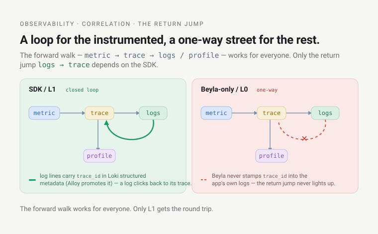
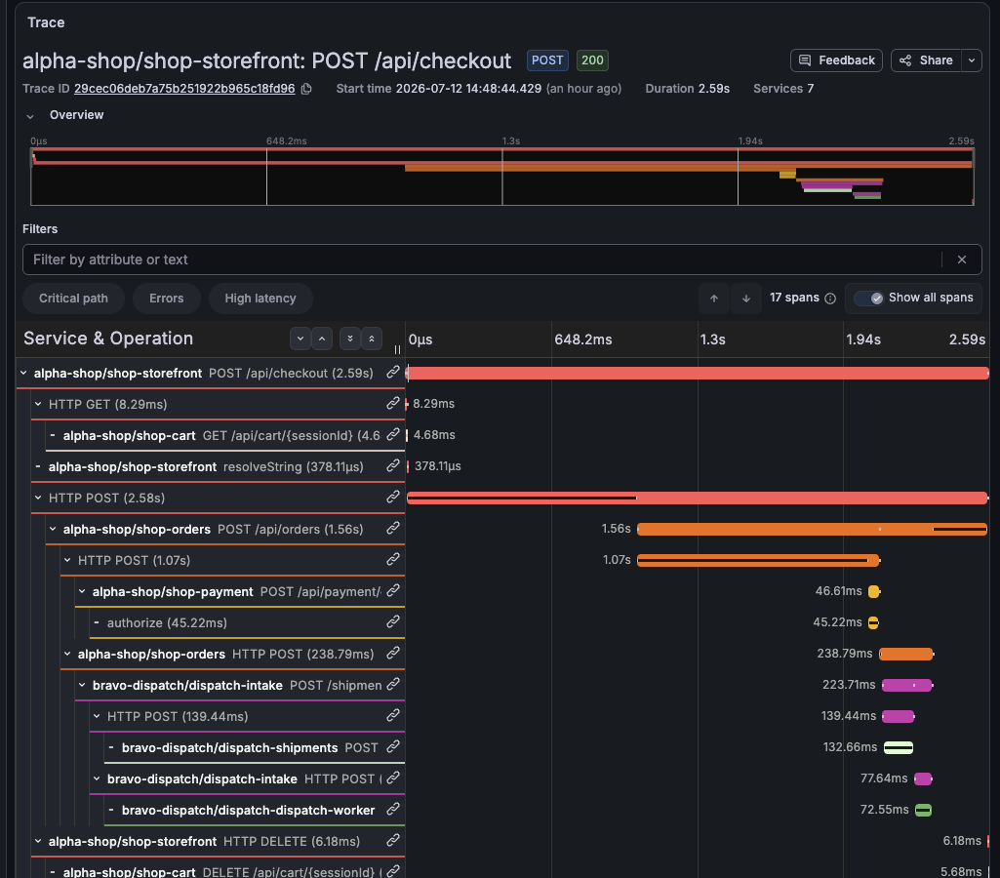
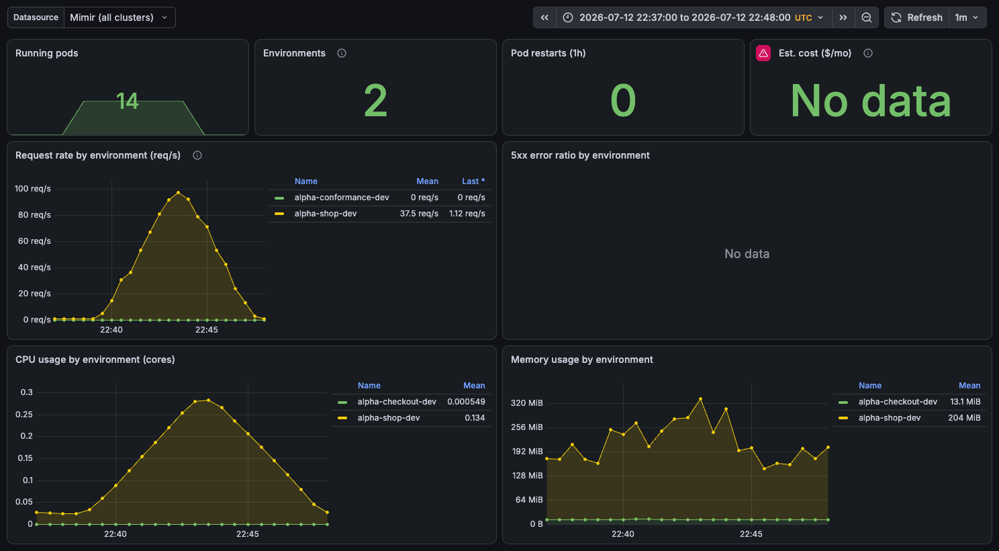

# Learn: Observability — correlation & the team experience (deep dive)

Two ideas share this file because they're both the *consuming* side of observability — what an
engineer does with the stack once the signals are flowing. First, correlation: the machinery that
turns five stores into one investigation. Second, the per-team experience, where the subtle
build-vs-live nuance lives.

---

## Part 1 — correlation: the detective's case-file hyperlinks

Correlation works like a detective's case file where every clue hyperlinks to the next. The vitals
blip links to the ECG strip, which links to the lab result, which links to the tissue sample —
four stores, one click each, no re-typing a query into a different tool. That's the whole payoff of
running one Grafana over five backends instead of five vendor consoles.

Those hyperlinks aren't a Grafana feature you turn on — they're config you write into each
datasource. Grafana correlation is a set of directed links: on *this* datasource, a value shaped
like *that* opens *this other* datasource. Here's the 4-click investigation, and the exact wiring
behind each click — four of the jumps we'll walk; the module wires a couple more
(`tracesToMetrics`, the service graph) we'll note in passing.

### Click 1: a RED spike → the exact trace (metric → trace, via exemplars)

You're staring at a latency panel. A p99 spike. On most stacks that's a dead end — the metric is an
*aggregate*, it averaged away the one slow request you care about. The fix is an **exemplar**: alongside
the aggregated histogram, the metric store keeps a handful of *sample* data points, each tagged with the
**trace ID** of one real request that landed in that bucket. The spike carries clickable dots.

Two halves make this real. The **producer** is Tempo's metrics-generator — it derives the RED
span-metrics from traces and stamps each exemplar with a `traceID` label. The **consumer** is the Mimir
datasource, told where that trace ID can be opened. From
[`observability-mimir/main.tf`](https://github.com/asanexample/platform/blob/main/infra/modules/observability-mimir/main.tf):

```hcl
exemplarTraceIdDestinations = [{
  name          = "traceID"                        # the exemplar label the generator emits (camelCase)
  datasourceUid = replace(ds.uid, "mimir", "tempo")
}]
```

That `replace(ds.uid, "mimir", "tempo")` is what makes the correlation web scale to any number of
tenants. Datasource UIDs follow a **convention** — `mimir`, `mimir-preprod`, `mimir-all` — and every
jump is a *string swap*, not a hard-coded target. The `platform` tenant's Mimir links to the `platform`
tenant's Tempo (`mimir`→`tempo`); the `preprod` tenant's Mimir links to `preprod`'s Tempo
(`mimir-preprod`→`tempo-preprod`); neither line of config names the other. The wiring is a *rule*, not a
table. (Exemplar storage is opt-in on Mimir — `max_global_exemplars_per_user` — because by default Mimir
keeps zero.)

### Click 2: that trace → its logs (trace → logs, `tracesToLogsV2`)

You clicked the dot; now you're looking at a trace waterfall, and one span is fat. You want the log lines
that span emitted. The Tempo datasource carries a `tracesToLogsV2` link, from
[`observability-tempo/main.tf`](https://github.com/asanexample/platform/blob/main/infra/modules/observability-tempo/main.tf):

```hcl
tempo_traces_to_logs = {
  datasourceUid      = var.loki_datasource_uid
  spanStartTimeShift = "-1h"
  spanEndTimeShift   = "1h"
  filterByTraceID    = true
  tags               = [{ key = "service.name", value = "service_name" }]
}
```

Each field earns its place:

- `filterByTraceID = true` — the Loki query it opens is scoped to *this trace's* ID, not "all logs from
  that service." You land on the exact request's log lines.
- `spanStartTimeShift`/`spanEndTimeShift = -1h / 1h` — Grafana widens the log search window an hour each
  side of the span. Without the pad: a span timestamped by the app and a log line timestamped by the
  node's clock never match to the millisecond, so a zero-width window would silently return nothing. The
  pad trades a little query cost for a link that actually resolves.
- `tags` — how a span *attribute* becomes a *log label*: the span's `service.name` maps to Loki's
  `service_name`. The same name-alignment trick returns in Click 3.

### Click 2b: and back again (logs → trace, Loki derived field)

The case-file hyperlinks run *both* directions. If you started in the logs — grepping an error, no trace
in hand — a `trace_id` in the log line is itself clickable back to the trace. That's a Loki **derived
field**. It used to be a regex that scraped raw log text; now it matches on **Loki structured
metadata** instead — first-class and robust, not a text scan. From
[`observability-loki/main.tf`](https://github.com/asanexample/platform/blob/main/infra/modules/observability-loki/main.tf):

```hcl
loki_derived_fields = [{
  name          = "trace_id"
  matcherType   = "label"     # matches structured metadata, not the log line's text
  matcherRegex  = "trace_id"  # the FIELD NAME now, not a pattern
  url           = "$$${__value.raw}" # THREE `$`: Grafana blanks `${...}` during provisioning env-var substitution, so the sequence must be escaped
  datasourceUid = "tempo-all"
}]
```

**Metric→trace→logs→trace is a *loop* for the workloads that opted into L1, a one-way street otherwise** —
and that asymmetry is exactly what this jump adds. The `trace_id` value has to *get into* structured
metadata before this can match anything — that's `observability-alloy`'s per-team pipeline, which promotes
`trace_id`/`span_id` out of the JSON log body into Loki structured metadata for SDK'd apps. So this jump
only resolves for **SDK-instrumented services** (alpha-shop, alpha-checkout — see
[collection & instrumentation](deep-dive-collection-and-instrumentation.md)): Beyla doesn't stamp a
`trace_id` into an app's own log lines, so a Beyla-only workload has no field to promote and the derived
field never lights up for it — you still get metric→trace and trace→logs (`tracesToLogsV2`) for those,
just not the reverse jump.



### Click 3: that span → its flame graph (trace → profile, `tracesToProfiles`)

The span is slow *inside the process* — not waiting on a downstream call, just burning CPU. You want to
know *which function*. The Tempo datasource links to Pyroscope:

```hcl
# gated on var.enable_traces_to_profiles
tracesToProfiles = {
  # tempo→pyroscope, but Pyroscope has no `-all`: special-case `tempo-all`
  # → `pyroscope-<federated_profiles_cluster>` (the plain replace would point nowhere)
  datasourceUid = ds.uid == "tempo-all" ? "pyroscope-${var.federated_profiles_cluster}" : replace(ds.uid, "tempo", "pyroscope")
  profileTypeId = "process_cpu:cpu:nanoseconds:cpu:nanoseconds"
  tags          = [{ key = "service.name", value = "service_name" }]
}
```

The field name is the gotcha that teaches: it's `tracesToProfiles`, **not** `tracesToProfilesV2` — unlike
logs (which really does have a `tracesToLogsV2`) there is no V2 variant for profiles, and Grafana silently
ignores the V2 name, so the "Related profiles" link just never renders. Same `replace` convention (`tempo`→`pyroscope`),
same `service.name`→`service_name` tag mapping. And here
is the subtle thing that makes this jump possible at all: the trace and the profile have to agree on the
service's name, and nobody set that name by hand. Beyla labels a trace's `service.name` from the
workload's `app.kubernetes.io/name` label (falling back to namespace); the eBPF profiler (an Alloy
`pyroscope.ebpf` DaemonSet) labels each profile's `service_name` the *same* way. Two independent zero-code
agents, watching the same process from the kernel, arrive at the same identity — by deliberate convention,
not coincidence. Break that alignment (rename one label source) and the trace→flame-graph link silently
opens an empty profile. It's the single most fragile seam in the correlation web, and the only one with no
config that names both sides — it's an *agreement*.

> Honest scope: this link resolves for any traced service that actually **burns CPU**. The platform's
> trivial echo demo apps don't burn enough to flame-graph under light load — so the jump is wired and
> correct, but you need a real workload (or load) to see a populated graph. Wiring live; interesting data
> is workload-dependent.

### The overlays: service graph + deploy annotations

Two more pieces aren't "clicks" but frame the whole investigation.

The **service graph** answers "which hop" *before* you open a single trace. Tempo's metrics-generator
also emits `traces_service_graph_*` metrics (request counts and latencies *between* services), and the
Tempo datasource's `serviceMap = { datasourceUid = replace(ds.uid, "tempo", "mimir") }` tells Grafana to
render them as a node graph — `storefront → alpha-checkout → …`. Same swap convention, pointed back at Mimir
because the graph *is* metrics.

**Deploy annotations** answer "…and it got slow *because of what?*" The APM dashboard
([`dashboards/platform-apm.json`](https://github.com/asanexample/platform/blob/main/infra/modules/observability/dashboards/platform-apm.json))
carries a dashboard-level annotation query:

```json
"expr": "changes(kube_deployment_metadata_generation[2m]) > 0",
"name": "Deploys",
"tagKeys": "namespace,deployment"
```

Every deploy draws a vertical line across the time series. So "latency spiked at 03:00" sits directly
under "…because of the 02:58 deploy of `storefront`" — the metric blip and its likely cause on one axis.
(`kube_deployment_metadata_generation` bumps on every spec change; `changes() > 0` marks the moment.)



*A real `POST /api/checkout` in Tempo (preprod), 2026-07-12 — 7 services, 2.59s, the exact structure the four clicks above walk. Watch it **cross the team boundary**: `alpha-shop` (storefront → cart → orders → payment) calls into `bravo-dispatch` (intake → shipments → dispatch-worker) at the ServiceGrant-governed hop — one trace spanning two teams.*


---

## Part 2 — the per-team experience

Correlation is what an *engineer mid-incident* does. The other consuming question is quieter and more
political: when a team opens Grafana, what do they see, and can they see *only* their own stuff?

There are **two separate efforts** here — a *default view* and a *real boundary* — and conflating them
is the mistake to avoid.

### Effort 1 (the soft need, LIVE and actually used): per-team overview dashboards

What a team actually needs day-to-day isn't a security boundary — it's a *default view*: "show me my
services' health without me building a dashboard." The platform delivers that the simple way, with one
dashboard per team, auto-generated from the team registry.

The mechanism is deliberately unclever. There's **one template**,
[`dashboards/team-overview.json.tmpl`](https://github.com/asanexample/platform/blob/main/infra/modules/observability/dashboards/team-overview.json.tmpl),
with a literal `__TEAM__` placeholder everywhere a team name goes. The observability module renders it
once per team ([`observability/main.tf`](https://github.com/asanexample/platform/blob/main/infra/modules/observability/main.tf)):

```hcl
resource "kubernetes_config_map_v1" "team_dashboards" {
  for_each = local.create ? toset(var.team_overview_teams) : toset([])
  metadata {
    name        = "obs-dashboard-team-overview-${each.value}"
    labels      = merge(local.k8s_labels, { grafana_dashboard = "1" })
    annotations = { grafana_folder = "Teams" }
  }
  data = {
    "team-overview-${each.value}.json" = replace(
      file("${path.module}/dashboards/team-overview.json.tmpl"), "__TEAM__", each.value)
  }
}
```

And the team list is **registry-derived** — not a hand-maintained variable. The observability unit reads
it straight off the `gitops/teams/` directory
([`…/platform/observability/terragrunt.hcl`](https://github.com/asanexample/platform/blob/main/infra/live/aws/platform/us-east-1/platform/observability/terragrunt.hcl)):

```hcl
team_overview_teams = [for f in fileset("${get_repo_root()}/gitops/teams", "*.yaml") : trimsuffix(basename(f), ".yaml")]
```

Add a `Team` to the registry and they get an overview dashboard on the next apply. No dashboard authoring,
ever. Live today, one per registered team:

```text
$ kubectl --context platform -n observability get cm | grep team-overview
obs-dashboard-team-overview-alpha       1   …
obs-dashboard-team-overview-bravo       1   …
obs-dashboard-team-overview-platform    1   …
```

Those three match the three files in `gitops/teams/` (`alpha.yaml`, `bravo.yaml`, `platform.yaml`) exactly
— the `fileset` in action.

What's *on* the dashboard, and where the numbers come from — it's a RED + USE view scoped to the team:

- **Pre-filtered to the team.** Each panel scopes to the team's environment namespaces
  (`<team>-<product>-<stage>`, e.g. `alpha-shop-dev`) with a single regex — but on *two* labels, because the
  metrics come from different producers: the RED panels filter `k8s_namespace_name=~"__TEAM__-.*"` (the label
  the HTTP metric carries), the USE/cost panels filter `namespace=~"__TEAM__-.*"` (the label
  cAdvisor/kube-state carry). Same intent, two labels.
- **RED** — request rate and 5xx ratio per environment off `http_server_request_duration_seconds_count`,
  the same metric the SLOs use. It's emitted by **Beyla** (zero-code) *or* an app's **OTel SDK**; both
  converge on the same name and `k8s_namespace_name` label, so one query works regardless of delivery
  path. Exemplars ride the
  metrics-generator's span-metrics, per Click 1.
- **USE**, from cAdvisor/kube-state-metrics — CPU (`container_cpu_usage_seconds_total`), memory
  (`container_memory_working_set_bytes`), running pods, restarts.
- **Cost**, from OpenCost — an estimated `$/mo` panel (`container_cpu_allocation × node_cpu_hourly_cost`,
  plus the memory equivalent, × 730h).



*The real **Team Overview — alpha** dashboard during the 2026-07-12 load test: request rate per environment (`alpha-shop-dev` peaking ~100 req/s), the 5xx ratio (empty — the run had zero errors), and CPU/memory per environment. Note the two-label split in action — the RED panels filter `k8s_namespace_name` (the label the HTTP metric carries), the USE/cost panels filter `namespace`.*

Crucially, it **queries the federated `Mimir (all clusters)` datasource** (uid `mimir-all`), not a
per-team-isolated one — the template's default datasource is literally `"Mimir (all clusters)"`.

> **This filter is a *default view*, not a boundary.** The team regex (`k8s_namespace_name=~"alpha-.*"` on the
> RED panels, `namespace=~"alpha-.*"` on USE) is baked into the panels,
> but nothing *stops* an `alpha` engineer from editing the query to `bravo-.*` — the dashboard reads the
> all-clusters datasource, which can see every tenant. It's the convenient lane, not a wall. That
> distinction is the whole point of Effort 2.

### Effort 2 — the real per-team boundary: hard write-split, soft reads

The *harder* goal — making `alpha`'s data genuinely separate from `bravo`'s — has two layers, and they are
not equally hard. The **write side** is a real data-plane split; the **read side** is an organizational
boundary; and the fail-closed wall around a team's data is the **network**.

**Write isolation is real (live).** A write-path router, `cortex-tenant`, sits in front of Mimir ingest: it
reads each series' namespace label and stamps the matching per-team `X-Scope-OrgID`, so each environment
namespace's series lands in its own Mimir tenant (Loki does the same for logs). `alpha` and `bravo` are real,
separate tenants — not one bucket with a label:

```text
$ kubectl --context platform -n observability get pods | grep cortex
cortex-tenant-…   1/1   Running
cortex-tenant-…   1/1   Running
```

The genuinely per-team tenants (`alpha`, `bravo`, …) are populated by the **preprod spoke's dual-write** —
preprod, where the team apps run, ships each namespace's series into its own tenant (additive to `preprod`).
The hub carries no environment namespaces, so the hub's own metrics stay the `platform` tenant (see the
footnote below). The separation of the *data* is real and live end-to-end.

**Read scoping is soft (organizational).** Each team reads through a `Mimir (<team>)` / `Loki (<team>)`
datasource pinned to its tenant, and per-team isolation on the read path is enforced by **Grafana
dashboard-folder permissions** plus the **namespace-filtered per-team overview dashboards** — an organizational
boundary, *not* a fail-closed data-plane gate. Cross-team *sharing* is soft the same way: share the dashboard
or grant folder access. The `AccessGrant` model (`gitops/grants/`) governs cross-team access in general.
Per-team **traces**/**profiles** read scoping is a follow-up.

> **The read scoping is not a security boundary.** Folder permissions and per-tenant datasources shape what a
> team *conveniently* sees; they don't fail closed the way an authenticated proxy would. The hard, fail-closed
> wall around a team's data is the **network** — default-deny NetworkPolicy plus ClusterIP-only services — not
> the Grafana read path.

An architectural footnote worth keeping: the re-tenant splits metrics by *environment namespace* → team, and
the **hub cluster has no environment namespaces** (tenant workloads run on **preprod**, the spoke), so the
hub's *own* metrics resolve to the `platform` tenant. The genuinely per-team `alpha`/`bravo` tenants are fed
from the preprod path. The [platform
`env.hcl`](https://github.com/asanexample/platform/blob/main/infra/live/aws/platform/env.hcl) records this
directly:

```hcl
enable_per_team_tenants = true # …HUB flip first: hub metrics still resolve to the `platform`
# tenant (no env namespaces here), proving the path before the spoke.
```

So the per-team data separation is real where it matters: it flows through the preprod path, where the
environment namespaces actually live.

### Net for a team, today

Open **your Team Overview dashboard** for a namespace-filtered RED/USE/cost view of your environments — the
convenient default self-view, driven off the team registry. Underneath it, your writes land in a real,
separate per-team tenant, while your reads are scoped by Grafana folder permissions and per-tenant
datasources — an organizational boundary, not a fail-closed gate. That's the current picture: real per-team
*data* separation on the write path, soft per-team *read* scoping on top, with traces/profiles read scoping
still deferred. The fail-closed wall around a team's data is the network (default-deny + ClusterIP-only).

---

## Dashboards-as-code — the substrate under both parts

Both the correlation dashboards and the team-overview dashboards ride the same delivery mechanism. Grafana
dashboards here are **[ConfigMaps](https://kubernetes.io/docs/concepts/configuration/configmap/),
not clicked-in-the-UI JSON**: a `kubernetes_config_map_v1` holding the dashboard JSON, labeled
`grafana_dashboard = "1"`. A **sidecar** container in the Grafana pod watches for that label
in the observability namespace (`searchNamespace` = the module's namespace) and loads any it finds within
seconds — so a dashboard ConfigMap must live in that namespace to be discovered, and a dashboard is a
reviewed, version-controlled file in `infra/modules/observability/dashboards/`, not tribal knowledge that
vanishes when someone edits it in the browser and forgets to export. (The team-overview ConfigMaps also set `annotations = { grafana_folder
= "Teams" }`, which the sidecar reads to file them in Grafana's *Teams* folder.)

**Vendored dashboards are pinned to an exact grafana.com revision** — downloaded and committed, never
imported-by-ID live — so an upstream dashboard change goes through PR review like any other code, rather
than silently reshaping your panels. Same discipline as pinning a chart version.

---

## Gotchas that teach

- **The correlation web is a naming convention, not a wiring diagram.** Every jump is
  `replace(uid, "mimir", "tempo")`-style string surgery over a UID naming scheme (`mimir` / `mimir-preprod`
  / `mimir-all`). Elegant — it scales to N tenants with zero per-target config — but it means a datasource
  named off-convention silently links nowhere. The convention *is* the contract.
- **The one link with no config on both sides is the fragile one.** trace→profile works only because
  Beyla's `service.name` and the eBPF profiler's `service_name` independently derive from
  `app.kubernetes.io/name`. No file declares "these two must match." Rename one label source and the jump
  opens an empty flame graph with no error. Agreements are harder to keep than declarations.


- **Time-shifts on trace→logs aren't sloppiness — they're clock-skew insurance.** `±1h` around a span
  looks huge until you remember app-stamped span times and node-stamped log times never agree exactly; a
  zero-width window returns nothing and reads as "correlation is broken."
- **"Namespace-filtered" ≠ "isolated".** The Team Overview filter is a baked-in default over the *all-clusters*
  datasource — convenience, not a boundary. The real separation is the **write-split** (each team's data in its
  own tenant); read scoping on top is **soft** (Grafana dashboard-folder permissions + the per-tenant
  datasources), not a fail-closed gate. So don't read the filter, or the soft read scoping, as a security
  control — the fail-closed wall is the network (default-deny + ClusterIP-only).
- **A flag being `true` is a claim about *intent*, not *effect*.** `enable_per_team_tenants` was flipped
  hub-first — but the hub carries no environment namespaces, so its own metrics still resolve to `platform`,
  and the genuinely per-team tenants are proven only where the data lands (the preprod spoke, now live and
  carrying data). Verify per-team data separation against where the data actually lands, not just the flag.
- **A team appears the instant it's in the registry.** `team_overview_teams` is a `fileset` over
  `gitops/teams/*.yaml`, so onboarding a `Team` yields its overview dashboard on the next apply — and,
  conversely, a dashboard with no matching registry file can't exist. Registry is the source of truth for
  the view, too.

## Go deeper

- **Architecture:** [`docs/architecture/observability-current-state.md`](../../architecture/observability-current-state.md)
  — APM-correlation, federated datasources, and the multi-tenancy model.
- **Related learn modules:** [The stack & storage](deep-dive-the-stack-and-storage.md) (the `X-Scope-OrgID`
  tenancy model) · [Collection & instrumentation](deep-dive-collection-and-instrumentation.md) (why Beyla and
  the eBPF profiler agree on `service.name`) · [SLOs, alerting & cost](deep-dive-slos-alerting-and-cost.md).
- **Code:** [`observability-mimir`](https://github.com/asanexample/platform/blob/main/infra/modules/observability-mimir/main.tf)
  (exemplar destinations) · [`observability-tempo`](https://github.com/asanexample/platform/blob/main/infra/modules/observability-tempo/main.tf)
  (`tracesToLogsV2` / `tracesToProfiles` / `serviceMap`) · [`observability-loki`](https://github.com/asanexample/platform/blob/main/infra/modules/observability-loki/main.tf)
  (the `trace_id` derived field) · [`team-overview.json.tmpl`](https://github.com/asanexample/platform/blob/main/infra/modules/observability/dashboards/team-overview.json.tmpl).
- **House skill:** `observability-authoring` — the dashboards-as-code ConfigMap pattern and vendored-revision pinning.
