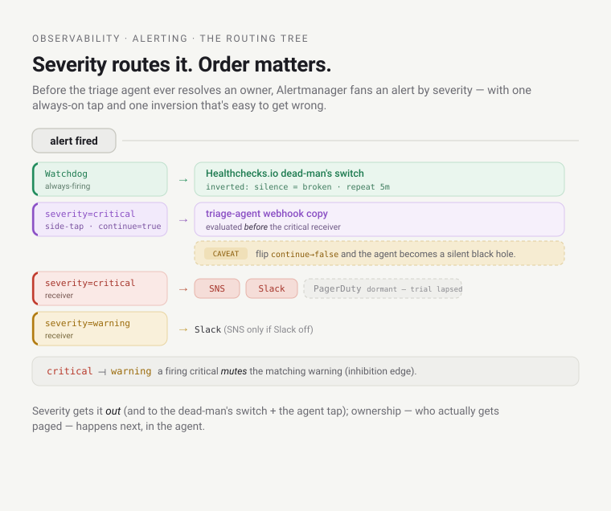

# Learn: Observability — SLOs, alerting & cost (deep dive)

Collection and storage answer *what happened?* This one answers the harder question: is it bad enough to
wake someone, who, and is it costing too much? Three machines sit on top of the same Mimir metrics — an SLO
engine, an alert router, and a pair of cost exporters — and each is a small, opinionated decision about when
a number becomes a human action. Everything below is verified against the live `platform` cluster; the
[reference](reference.md) is the terser lookup.

---

## 1. SLOs — judging "good enough" by how fast you're bleeding

An **SLO** (Service Level Objective) is three things bolted together:

- an **SLI** — a Service Level *Indicator*, the raw ratio you measure (here: non-5xx responses ÷ all
  responses);
- a **target** — the objective, e.g. `99.9`;
- an **error budget** — the arithmetic complement, `0.1%` of requests you're *allowed* to fail over the
  window. The budget is the whole point: it turns "be reliable" into a quantity you can spend, chart, and
  alert on.

### Why burn-rate, not a threshold

A threshold alert is a smoke detector that shrieks at burnt toast; a burn-rate alert is a fuel gauge with a
trip-computer. A naive alert fires when the error ratio crosses, say, 1% right now — so a 30-second blip
pages you, and a slow 0.2% leak that will blow your whole monthly budget by Friday *never* pages you. Burn
rate reframes it: **how fast am I spending the budget relative to the window?** A burn rate of `1` spends the
entire 30-day budget in exactly 30 days; a burn rate of `14.4` empties it in ~50 hours. To make that
concrete as an error rate a responder can eyeball: at a 99.9% objective the budget is 0.1%, so a 14.4× burn
is ≈ a 1.44% error rate sustained over the 5-minute window — that's what trips the page.

What kills the false positives is **multi-window, multi-burn-rate** (the [Google SRE
workbook](https://sre.google/workbook/alerting-on-slos/) pattern): require a *short* window AND a *long*
window to agree before firing. The short window makes it react fast; the long window makes sure it isn't a
transient spike. You can see both in the generated rule:

```yaml
# fast burn (page): both windows must exceed 14.4× budget, or both exceed 6×
(rate5m > 14.4*budget  and  rate1h > 14.4*budget)
or (rate30m > 6*budget  and  rate6h  > 6*budget)
# slow burn (ticket): slower windows, lower multipliers
(rate2h > 3*budget  and  rate1d > 3*budget)
or (rate6h > 1*budget  and  rate3d > 1*budget)
```

Fast burn → **page** (`severity: critical`); slow burn → **ticket** (`severity: warning`). Same SLO, two
alerts, wildly different urgency — that split is what lets one budget both page you at 3 a.m. *and* file a
Jira for a lazy leak, without a human tuning thresholds.

### Two generators, one shape

The platform generates these rules two ways, and they live on different tenants.


|  | **Path A — Sloth** (platform services) | **Path B — auto-derived** (every prod app) |
|--|--|--|
| **Who authors it** | A human hand-writes a `PrometheusServiceLevel` CR (objective + two queries) | No one — `fileset`+`yamldecode` over `gitops/environments/**/prod.yaml` synthesizes it |
| **Where it's evaluated** | The Sloth controller renders a `PrometheusRule`, evaluated on the **hub** | A template → `mimirtool rules sync` CronJob → the **Mimir ruler** against the **`preprod` tenant** |
| **Who consumes it** | Human dashboards + alerting (live: kubernetes-apiserver @ 99.9%) | The ADR-056 canary **freeze gate** (fixed 99.9%; live: alpha-shop-prod) |

**Path A — the Sloth controller, for platform SLOs.** [Sloth](https://sloth.dev/) (chart `0.16.0`) is a
controller that watches a `PrometheusServiceLevel` custom resource and *generates* the SLI recording rules +
the multi-window burn-rate `PrometheusRule` for you — you write the objective and the two queries, it writes
the ~30 lines of PromQL. The one live platform SLO is the **Kubernetes API server** at 99.9% (it's the one
control-plane signal EKS exposes that always has traffic). Verified on the hub:

```text
$ kubectl -n observability get prometheusservicelevel
NAME                   SERVICE                DESIRED SLOS   READY SLOS   GEN OK   AGE
kubernetes-apiserver   kubernetes-apiserver   1              1            true     14d

$ kubectl -n observability get prometheusrule kubernetes-apiserver \
    -o jsonpath='{range .spec.groups[*]}{.name}{"\n"}{end}'
sloth-slo-sli-recordings-kubernetes-apiserver-requests-availability
sloth-slo-meta-recordings-kubernetes-apiserver-requests-availability
sloth-slo-alerts-kubernetes-apiserver-requests-availability
```

One CR in, three rule groups out (recordings, metadata, alerts) — the controller did the burn-rate math.

**Path B — the Mimir ruler, for per-app SLOs.** Every product's **prod** environment gets a 99.9%
HTTP-success SLO *auto-derived* — no one writes it. The `mimir` Terragrunt unit `fileset`s over
`gitops/environments/**/prod.yaml`, and for each prod claim it synthesizes an SLO whose SLI is
`http_server_request_duration_seconds_count` filtered to the app's namespace (`k8s_namespace_name`). The
query doesn't care whether that metric came from **Beyla** (native Prometheus naming) or an app's **OTel
SDK** — since [ADR-100](../../adrs/100-observability-instrumentation-and-otlp-convention.md), Mimir's
OTLP ingest translates SDK metrics to the same `..._seconds` naming and promotes `k8s.namespace.name` to
the same label (`otel_metric_suffixes_enabled` + `promote_otel_resource_attributes`), so one query works
for both delivery paths — a Beyla-only app and an SDK'd app (e.g. alpha-shop) get the identical SLO
mechanism for free. This is registries-as-source (the same ADR-067 pattern the whole platform runs on):
add a prod environment, get an SLO free.

Two things differ from Path A. First, these rules are rendered from a template into a Mimir **ruler**
namespace and evaluated *in the Mimir ruler against the `preprod` tenant* — because that's where the app
metrics actually live (preprod is a spoke that remote-writes to the hub). Second, the consumer is not a human
at all: the rules emit `slo:current_burn_rate:ratio` per app, and **that metric is what the [ADR-056
progressive-delivery](../../adrs/056-progressive-delivery-and-safe-rollback.md) canary freeze gate queries**
— a one-shot **pre-flight** check (an AnalysisTemplate with `count: 1`) that runs before the rollout and
**freezes it if the service is *already* burning its budget faster than 2×** (successCondition
`len(result) == 0 || result[0] < 2`). It does *not* predict the canary's own burn, and it can *never* block a
first deploy (with no prior series there's nothing to be burning). The SLO stops being a dashboard and
becomes a deploy gate.

The same 99.9% objective comes from a controller in one case and a templated ruler rule in the other because
the data lives on different tenants: apiserver metrics are the hub's own; app metrics belong to the `preprod`
tenant, which the Mimir ruler evaluates.

---

## 2. Alerting — ~60 curated rules and a routing tree

Below the SLOs sits the everyday alert layer:
[`observability/alerts/curated.yaml`](https://github.com/asanexample/platform/blob/main/infra/modules/observability/alerts/curated.yaml)
— **61 alerts across 20 groups** (e.g. cert-manager, kyverno, policy-reporter, true-cost, argocd, loki,
tempo, external-secrets, cilium, cloudwatch, agent-eval, cloudnativepg, blackbox, karpenter, controllers,
keycloak, crossplane, mimir, tailscale, platform-services), one group per subsystem. Every rule
carries two things that make it actionable rather than just noisy: a `severity` label (which is what routes
it) and a `runbook_url` annotation (which is where the responder goes). A rule without a runbook is a rule
that pages you into a void.

### Severity is a decision, and it can be wrong

The severities aren't cosmetic — they encode a judgement about blast radius, and that judgement is
*revisable*. The clearest lesson is baked into the ArgoCD and External-Secrets groups after a **6-day silent
delivery outage** (2026-07-02): the repo-server lost read access to a repo, manifests silently stopped
generating, and nothing paged because the relevant alerts were `warning`. The fix upgraded three alerts to
`critical` and added one:

- `ArgoCDRepoServerGitErrors` — warning → **critical** (an unreadable repo blinds the whole delivery plane).
- `ArgoCDAppSyncUnknown` — **new critical** (a `ComparisonError` app is *neither* Synced nor OutOfSync and can
  stay Healthy, so the existing alerts missed it entirely; `for: 1h` filters normal transient Unknowns).
- `ExternalSecretNotReady` / `ClusterSecretStoreNotReady` — warning → **critical** (a stalled secret sync is a
  credential outage waiting for the next pod restart).

Severity is a claim about impact, and the audit gate applies to it like any other claim. "This is only a
warning" is exactly the assumption that hid a six-day outage.

### The routing tree



[Alertmanager](https://prometheus.io/docs/alerting/latest/configuration/) routes purely by the `severity`
label — it knows nothing about ownership (that's §3). The tree, built in
[`observability/main.tf`](https://github.com/asanexample/platform/blob/main/infra/modules/observability/main.tf)
and verified wired on the live hub:

- **`Watchdog`** (an always-firing synthetic alert) → the **dead-man's switch**: every ~5 minutes it POSTs to
  an external [Healthchecks.io](https://healthchecks.io) ping URL. If Prometheus or Alertmanager *dies*, the
  pings stop and Healthchecks pages you **from outside the cluster** — the one failure the in-cluster pipeline
  physically cannot alert on itself. Watchdog never reaches any other receiver (no `continue`).
- **`severity: critical`** → the `critical` receiver: **SNS + Slack + PagerDuty** all three. *(Status caveat:
  the PagerDuty leg is a real Events-API-v2 wire, keyed by the `pagerduty` unit's routing key, and was live —
  but the PagerDuty trial account lapsed (~2026-07-07), so the page half is momentarily offline: `critical`
  today lands on SNS + Slack + the `Watchdog` dead-man's switch, not a human page. The routing design is
  unchanged — critical→PagerDuty is the intended path; treat the PagerDuty leg as wired-but-dormant until the
  account is restored.)*
- **`severity: warning`** → the `warning` receiver: **Slack only** (SNS is a fallback used only when Slack is
  disabled), but *not* PagerDuty — warnings notify, they don't page.
- **Inhibition:** a firing `critical` **inhibits** a matching `warning` (same `namespace` + `alertname`) so one
  incident doesn't double-notify.
- **The triage fan-out:** a *separate* route matches `severity: critical` with **`continue = true`** and copies
  it to the triage agent's webhook — *additively*. That `continue` is what keeps the alert flowing on to the
  critical receiver. The agent is a copy on the wire, not an interceptor.

That last route is the hinge into ownership. Flip its `continue` to `false` and the alert would stop at the
agent and never reach SNS/Slack/PagerDuty — the agent would silently swallow every critical page.

---

## 3. Owner-routing — from severity to a name (ADR-084)

Alertmanager routed by severity. But *who owns the broken thing?* That's a different lookup, and mixing it
into Alertmanager would be a category error. Alertmanager is the fire panel — it lights up the zone.
Owner-routing is the dispatcher who looks up whose apartment that is and calls *them*.

The dispatcher is the **triage agent** consuming
[ADR-084](../../adrs/084-platform-identity-directory-and-owner-resolution.md)'s identity directory. Two things
are worth understanding.

**It reads git, not the cluster.** The directory is a CQRS **read model** — a cached projection of the git
`Team` and `Product` registries (`gitops/teams/`, `gitops/products/`), *not* live cluster CRs. Ownership is
declared in version control, so resolution is deterministic and reviewable, and it doesn't depend on the
portal or the cluster being healthy on the incident path.

**Resolution and mention-policy are deliberately split into two functions** — and that split is a safety
property, not tidiness:

- `resolveOwner({namespace, culpritGithubLogin?}) → {person?, team, on_call, tiers}` returns *facts*: the
  owning team (the resolution floor — every workload resolves to *at least* a team), the on-call, and
  identity links tiered by trust.
- `applyMentionPolicy(resolved, {severity, disposition})` walks those facts highest-trust-first and decides
  *who to @mention* — the culprit commit author if there's a real, linkable, in-org human (D12), else falling
  back to the team.

Why two functions? So a bug in the directory can't misfire a mention. If resolution and policy were one
blob, a wrong identity link could `@` the wrong person on a live incident. Keeping the *facts* (resolve) apart
from the *action* (mention) means the risky step — pinging a named human — is a small, auditable helper you can
reason about in isolation: the operator-quality principle that a dangerous control-plane action gets its own
gate.

**Honest status.** ADR-084 is formally **Proposed**, even though Phase 0 (the owner-resolution read model) is
**built and live** and has routed real pages. The paging structure it feeds — **per-team PagerDuty** — is
provisioned in IaC by the [`pagerduty`](https://github.com/asanexample/platform/blob/main/infra/modules/pagerduty/main.tf)
module: one schedule + escalation policy + service per team, escalating (re-notify after 15 min, loop twice).
It uses the **v1** `pagerduty_schedule` resource deliberately — the v3 "flexible schedules" (`schedulev2`) API
is blocked on a provider bug (#1127) that returns invalid objects on create. So: real per-team on-call,
seeded rosters, v1 schedules until the provider is fixed. *(One transient caveat: the PagerDuty **trial
account** itself lapsed ~2026-07-07, so these schedules exist in IaC but can't actually page until it's
restored — the wiring is intact, the subscription isn't.)*

---

## 4. Cost — the speedometer and the odometer

Cost is just another metric here, and one metaphor explains *why there are two exporters*: OpenCost is a
speedometer; the true-cost exporter is an odometer. You need both, and confusing them is the classic FinOps
mistake.


**[OpenCost](https://www.opencost.io/docs/) — the speedometer (in-cluster allocation).** It reads pod/node
resource usage from the cluster and multiplies by **AWS list prices** (public pricing API, no credentials) to
attribute compute cost per **team**, derived from the namespace's `platform.refplat.org/team` label. It's
*instantaneous and granular* — "you're burning $X/hour right now, and it's `alpha`'s doing" — but it's an
*estimate at list price*: it knows nothing about your Savings Plans, Reserved Instances, or committed-use
discounts.

**The true-cost exporter — the odometer (the real bill).** [#668](https://github.com/asanexample/platform/issues/668)
added a small Python exporter
([`true-cost-exporter.tf`](https://github.com/asanexample/platform/blob/main/infra/modules/observability-opencost/true-cost-exporter.tf))
that queries the **Cost & Usage Report** via **Athena** — cross-account into the management/payer account via
an `AssumeRole` onto a read-only `cost_reader` role — and emits the **actual unblended monthly spend**
(`platform_true_cost_monthly_usd{breakdown, label}`) broken down by team, service, and account. This is the
*real* number, discounts and all, but it lags ~24h (CUR latency), so it refreshes every 6 hours, not per
scrape. Both live on the hub:

```text
$ kubectl -n observability get pods | grep -E 'opencost|true-cost'
opencost-…                  2/2   Running
true-cost-exporter-…        1/1   Running
```

> **The `max`-not-`sum` gotcha ([#668](https://github.com/asanexample/platform/issues/668)).** The exporter
> re-emits an **absolute month-to-date gauge** on every scrape. So a dashboard panel that does `sum()` over
> time — the reflexive choice for a cost panel — **double-counts**: you're summing the same running total
> across scrapes. The true-cost panels aggregate with **`max`** instead (the latest month-to-date value *is*
> the month's total so far). Speedometer numbers you integrate; odometer numbers you read.

### The budget enforcer — cost that can say "no"

The last mile turns cost from a dashboard into a guardrail
([`budget-enforcer.tf`](https://github.com/asanexample/platform/blob/main/infra/modules/observability-opencost/budget-enforcer.tf),
ADR-091 Phase C):

1. an hourly **CronJob** queries Mimir for each team's spend ÷ budget;
2. it writes the over-budget teams into a **`cost-budget-status` ConfigMap**;
3. a **Kyverno** policy (`restrict-over-budget-provisioning`) reads that ConfigMap and **blocks a new
   `XEnvironment` from being provisioned** by an over-budget team.

Two design choices make this safe: **audit-first** (it reports before it enforces) and **fail-open** — a
missing or blank ConfigMap is treated as "everyone's fine", so an observability outage can *never* block
provisioning (`failurePolicy: Ignore`), and there's an admin override annotation
(`cost.refplat.org/budget-override`). It gates *new provisioning only* — it never touches running workloads.

> **Honest status.** [ADR-091](../../adrs/091-cost-guardrails.md) is **Accepted** and records Phases A/B/C
> built + live (2026-06-30). But the enforcer is **opt-in and off by default** (`enable_budget_enforcer =
> false`), designed to run on the **preprod spoke** (where OpenCost + the team budgets sit) — so on the
> `platform` hub I verified there is *no* enforcer CronJob and *no* `cost-budget-status` ConfigMap. The
> surface + alerting (A/B) run on the hub; the enforcement bridge (C) is fully built and wired end-to-end in
> code but is a spoke concern, not a hub one. [ADR-092](../../adrs/092-platform-finops-practice.md) (a formal
> FinOps practice) is still **Proposed / not built.**

### Synthetic signals — pre-empting the page

Three smaller machines generate signals *before* a real user hits the failure, all live on the hub:

- **blackbox-exporter** — an **outside-in probe**: it hits your public HTTPS endpoints through the Cilium
  Gateway and checks they answer with a valid cert. "Is it up *from the outside*?"
- **k6** — a scheduled **multi-step journey** (a CronJob remote-writing metrics to Mimir): not just "is it
  200?" but "can a user complete the *flow*?"
- **policy-reporter** — turns Kyverno `PolicyReport`s into `policy_report_result` **metrics**, so admission
  violations become dashboardable and alertable (the `policy-reporter.rules` group).

Outside-in probes and journeys page you *before* the SLO burns; policy-reporter makes governance itself an
observable signal.

---

## Gotchas

- **Two SLO paths, two tenants.** The apiserver SLO is a Sloth `PrometheusServiceLevel` evaluated on the hub;
  per-app SLOs are *templated* rules run in the **Mimir ruler against the `preprod` tenant**. If you go looking
  for a per-app burn-rate rule as a `PrometheusRule` on the hub, you won't find it — it's a ruler rule on the
  spoke tenant. Same math, different home.
- **`continue = true` is the whole triage design.** The agent is fanned a *copy* of critical alerts; the
  original still pages humans. Flip it to `false` and the agent silently becomes a black hole for every page.
- **Warnings don't page.** Only `critical` reaches PagerDuty (a severity-based design fact — though the
  PagerDuty leg is dormant while the trial account is lapsed, see §2). That's why the 6-day-outage fix was a
  *severity upgrade*, not a new alert — the alerts existed, they just didn't page.
- **The dead-man's switch is inverted logic.** `Watchdog` firing is *healthy*; the alert is its *silence*.
  Don't "fix" Watchdog by silencing it — you'd be disabling the only thing that catches a dead pipeline.
- **`max`, not `sum`, for true-cost panels.** The odometer re-emits a running total; summing it double-counts.
  This one shipped as a real bug fix (#668).
- **Fail-open is a feature, not a bug.** The budget enforcer and its Kyverno policy both default to *allow* on
  any doubt. A cost guardrail that blocked provisioning during an observability outage would be worse than the
  overspend it prevents.
- **`resolveOwner` ≠ `applyMentionPolicy`.** Resolution returns facts; policy decides who gets @-mentioned. The
  split exists so a directory bug can't ping the wrong human on a live incident.

## Go deeper

- **ADRs (source of truth):** [ADR-056 progressive
  delivery](../../adrs/056-progressive-delivery-and-safe-rollback.md) (the canary freeze gate that consumes
  per-app burn rate) · [ADR-084 identity directory &
  owner-resolution](../../adrs/084-platform-identity-directory-and-owner-resolution.md) ·
  [ADR-091 cost guardrails](../../adrs/091-cost-guardrails.md) ·
  [ADR-092 platform FinOps practice](../../adrs/092-platform-finops-practice.md) (Proposed).
- **Runbooks:**
  [observability-alerts.md](../../runbooks/observability-alerts.md) (the runbook every alert links to) ·
  [cost-true-spend.md](../../runbooks/cost-true-spend.md) (the CUR/Athena path).
- **The code:**
  [`observability-slo/`](https://github.com/asanexample/platform/blob/main/infra/modules/observability-slo/main.tf)
  (Sloth) ·
  [`observability-mimir` app-SLO template](https://github.com/asanexample/platform/blob/main/infra/modules/observability-mimir/templates/app-slo-rules.yaml.tftpl)
  (the per-app burn-rate rules) ·
  [`observability/alerts/curated.yaml`](https://github.com/asanexample/platform/blob/main/infra/modules/observability/alerts/curated.yaml) ·
  [`observability-opencost/`](https://github.com/asanexample/platform/blob/main/infra/modules/observability-opencost/main.tf) ·
  [`pagerduty/`](https://github.com/asanexample/platform/blob/main/infra/modules/pagerduty/main.tf).
- **External (verified July 2026):**
  [Google SRE Workbook — Alerting on SLOs](https://sre.google/workbook/alerting-on-slos/) (the multi-window
  multi-burn-rate source; ~20 min, the canonical reference) ·
  [Sloth](https://sloth.dev/) (the SLO generator; skim) ·
  [OpenCost docs](https://www.opencost.io/docs/) (the allocation model; CNCF) ·
  [Prometheus Alertmanager configuration](https://prometheus.io/docs/alerting/latest/configuration/)
  (routes, receivers, inhibition) ·
  [k6](https://grafana.com/docs/k6/latest/) and
  [blackbox_exporter](https://github.com/prometheus/blackbox_exporter) (the synthetic probes).
- Back to the [observability orientation](orientation.md) · the terse [reference](reference.md).
