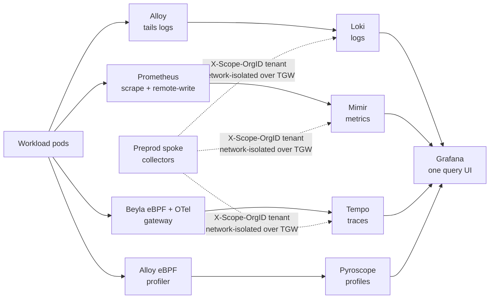

# Learn: Observability — the stack & storage (deep dive)

"Stored together in one correlated stack on the platform's own storage" is a short promise hiding a
lot: five separate databases, a bucket per signal, an SSO login, a tenancy model that's really a
network-security model in disguise, and a hub-and-spoke shape that lets a second cluster ship its
telemetry home. This doc walks all of it. Per-team isolation is the subtlest claim in the domain, so
it draws a sharp line between what carries data today (metrics + logs isolation, plus grant-based
cross-team sharing) and what's deferred (per-team traces + profiles isolation).

One shape does most of the work. Every signal is stored the same way: a purpose-built open-source
database keeps a small hot buffer on a local disk and flushes the durable truth to its own S3 bucket,
and all five are fronted by one Grafana. **The database is disposable; S3 is the source of truth.**
That shape repeats five times with small variations, so once you understand one store you understand
them all. Mimir (metrics) is the template; the others are variations on it.

## The five backends, and what each one holds

Here's the whole pipeline on one screen — who collects each signal, which store keeps it, how one
Grafana fronts them all, and how a spoke ships its telemetry home:



The stack is **LGTM+P**, and each letter is a separate database, pinned to a specific chart version
in the repo's single source of truth, [`infra/live/aws/_versions.hcl`](https://github.com/asanexample/platform/blob/main/infra/live/aws/_versions.hcl):

| Signal | Store | Helm chart (pin) | What it stores | Its S3 bucket |
| --- | --- | --- | --- | --- |
| the view | **Grafana** | `kube-prometheus-stack` **87.5.0** | nothing durable — dashboards/datasources as code | (its SQLite state is on a small PVC) |
| metrics | **Mimir** | `mimir-distributed` **6.0.6** | TSDB **blocks** (compacted time-series) | `…-mimir-blocks-…` |
| logs | **Loki** | `loki` **7.0.0** | log **chunks** + TSDB index | `…-loki-chunks-…` |
| traces | **Tempo** | `tempo-distributed` **2.25.5** | trace **blocks** | `…-tempo-traces-…` |
| profiles | **Pyroscope** | `pyroscope` **2.1.0** | profile blocks (flame-graph data) | `…-pyroscope-profiles-…` |

Grafana rides inside the `kube-prometheus-stack` bundle (which also brings Prometheus, Alertmanager,
node-exporter, kube-state-metrics). Mimir, Loki, Tempo, and Pyroscope are each their own Terragrunt unit and
their own module (`observability-mimir`, `-loki`, `-tempo`, `-pyroscope`). On the live hub they show up
exactly as you'd guess — the microservices fan out for Mimir and Tempo, single-binary for Loki and Pyroscope:

```text
$ kubectl -n observability get pods            # platform (hub), abridged
mimir-compactor-0                 1/1  Running
mimir-distributor-…               1/1  Running
mimir-gateway-…                   1/1  Running
mimir-ingester-0                  1/1  Running
mimir-querier-…                   1/1  Running
mimir-query-frontend-…            1/1  Running
mimir-query-scheduler-…           1/1  Running
mimir-store-gateway-0             1/1  Running
loki-0                            2/2  Running
loki-gateway-…                    1/1  Running
tempo-distributor-…               1/1  Running
tempo-ingester-0                  1/1  Running
tempo-metrics-generator-…         1/1  Running
pyroscope-0                       1/1  Running
kube-prometheus-stack-grafana-0   3/3  Running
```

If `mimir-ingester-0` crashes and its PVC is wiped, you lose a few minutes of metric history — only
the un-flushed working set. Everything already compacted to blocks is safe on S3. The store is
cattle; S3 is the herd.

## Storage: a small gp3 hot buffer, a big cheap S3 tail


Take Mimir as the template. Its
[`observability-mimir` module](https://github.com/asanexample/platform/blob/main/infra/modules/observability-mimir/main.tf)
gives the stateful components — `ingester`, `store-gateway`, `compactor` — a **gp3 PersistentVolume** each
(10Gi / 10Gi / 20Gi). That's the working set: the ingester's in-memory-plus-WAL window before a block is
cut, the store-gateway's local cache of block indexes, the compactor's scratch space. It's deliberately
tiny, because it isn't where the data lives.

The data lives in **S3**. Mimir's `blocks_storage` points at a dedicated bucket (`bucket_prefix =
"<cluster>-mimir-blocks-"`); Loki chunks, Tempo traces, and Pyroscope profiles each get their own
cluster-scoped bucket the same way. One bucket per signal, per cluster — so a blast radius, a lifecycle
policy, or an IAM scope is always about exactly one thing. Owning the generator, made concrete: the
durable tier is object storage you already pay pennies for, not a metered vendor.

### SSE-S3, spelled out on every write — and why

A gotcha that bites anyone who copies half of it. Every store's S3 config carries an explicit
line — Mimir's reads `sse = { type = "SSE-S3" }`, and Loki/Tempo/Pyroscope say the same. You might assume the
bucket's *default* encryption (also set, AES256) makes this redundant. It doesn't, and the reason is an **org
Service Control Policy**: `enforce-encryption` (`DenyUnencryptedS3Uploads`) rejects any `PutObject` whose
**request** omits the `x-amz-server-side-encryption` header. Default bucket encryption encrypts the object at
rest but doesn't add that header to the request — so without the explicit client-side `sse`, every write
is denied by the SCP and the store silently fails to persist. Belt (default encryption) and suspenders
(explicit request header), because the SCP checks the suspenders.

SSE-S3 (AES256) over SSE-KMS is also deliberate: AES256 needs no per-object KMS call and, crucially,
no KMS IAM permission on the store's role. An SSE-KMS bucket would force every store to carry
`kms:GenerateDataKey*`/`Decrypt` or its writes would `AccessDenied` — extra permission surface and
per-object cost on a high-churn store, for no benefit here.

### The auth: Pod Identity, no IRSA, no keys

How does the ingester get credentials to write that bucket? **[EKS Pod Identity](https://docs.aws.amazon.com/eks/latest/userguide/pod-identities.html)**,
the platform's standard AWS-identity mechanism. In the module the ServiceAccount is created with
`annotations = {}` — pointedly empty,
because the old IRSA way stamped an `eks.amazonaws.com/role-arn` annotation there. Instead an
`aws_eks_pod_identity_association` binds the tuple `(namespace, service-account) → IAM role`, and the role
trusts the service principal `pods.eks.amazonaws.com` (with `sts:AssumeRole` + `sts:TagSession`). The AWS SDK
inside the pod picks the credentials up from the container-credentials chain — no static keys, no OIDC
provider wiring, no annotation. The role's policy is scoped to exactly that one bucket
(`s3:GetObject`/`PutObject`/`DeleteObject` on `<bucket>/*`, `ListBucket` on the bucket) and — because AES256 —
carries **no KMS statement at all**.

## The metrics twist: Prometheus scrapes, Mimir keeps

Metrics have one extra move the other three signals don't. Prometheus is still the scraper — it
pulls `/metrics` off every target — but it keeps only **~15 days** of local TSDB (the module's
`prometheus_retention` default) and `remote_write`s every sample to Mimir, which holds the long tail on
S3. So Grafana's **default datasource is Mimir, not Prometheus**: the module provisions the Mimir datasource
with `isDefault = true`, and Prometheus stays selectable for recent/local queries. Lose Prometheus and you
lose nothing but the last few minutes of scrape buffer — the truth is in Mimir/S3.

Why Mimir and not Thanos? Both are OSS, object-store-backed, and mature — it's defensible
either way. Tenancy decided it. Mimir's multi-tenancy is native: a single `X-Scope-OrgID` header names
the tenant on both read and write, over one horizontally-scaled ingest path. Thanos bolts tenancy on via
a sidecar-per-Prometheus plus store-gateway federation — more moving parts to glue for a hub, and
multi-tenancy expressed through external labels rather than a native header. Since the whole point here is
centralized writes with a clean per-tenant spine (the spokes and, later, per-team), the native model won.
Amazon Managed Prometheus was rejected for the same reason as the SaaS options — per-sample ingest +
per-query billing, coarser IAM-shaped workspaces, AWS-only.

Mimir runs in its **classic microservices architecture** — distributor → ingester over gRPC — with
**replication factor 1** on the reference cluster. That RF1 isn't an accident to "fix": with a single
ingester the RF must be 1 or writes are rejected. The chart's newer default is a Kafka-based
ingest-storage path; the module turns that off (`ingest_storage.enabled = false`, `kafka.enabled =
false`) to keep the reference cluster lean. One toggle, `high_availability`, flips the whole stack up to
**RF3**, zone-aware replication, and the memcached caches when a cluster warrants it — and it scales
replicas *and* RF together on purpose, because a lone ingester at RF3 rejects every write.

## Grafana: the one remote for five TVs

Grafana is the central nurses' station, and mechanically it's a **universal TV remote** — one device,
and every store is a channel you flip to without learning five different remotes. That works because
datasources are code. Each store's module emits a ConfigMap labelled `grafana_datasource = 1`; a
sidecar in the Grafana pod watches for that label and provisions the datasource live. No datasource is
ever clicked into existence in the UI.

The naming is deliberate, because it's how tenancy surfaces to a human. Every datasource is named
`"<Store> (<tenant>)"`:

- `Mimir (platform)` — the hub's own metrics (the default datasource, `uid = mimir`).
- `Mimir (preprod)` — a read-only view of the preprod spoke's metrics.
- `Mimir (all clusters)` — a *federated* datasource whose header is `platform|preprod|alpha|bravo`, so one
  panel spans every tenant (Mimir's `tenant_federation` splits the `|`-joined header across tenants on read).
- `Mimir (alpha)` / `Mimir (bravo)` — a per-team datasource pinned to that tenant via a static
  `X-Scope-OrgID`, direct to the gateway.

Loki, Tempo, and Pyroscope follow the identical `(tenant)` scheme. The datasources are wired to each
other for the **correlation jump**: the Mimir datasource carries `exemplarTraceIdDestinations` pointing
`mimir → tempo` (click a latency exemplar — a sampled data point on the histogram carrying one real
request's `trace_id` — and land on the trace), and the Loki datasource carries a
`derivedFields` regex that turns a `trace_id` in a log line into a link to the same Tempo trace. (The
jumps themselves are the [collection & correlation](reference.md) story; here just note that the plumbing
is datasource config, provisioned as code.)

### Locked down, and SSO'd

Grafana is the only part of this stack a human logs into, so it's hardened in the
[`observability` module](https://github.com/asanexample/platform/blob/main/infra/modules/observability/main.tf):
anonymous access off, sign-up off, `viewers_can_edit` off, secure + `strict`-samesite cookies, CSP on. It's
reachable **Tailscale-only** — an internal-scheme NLB behind the Cilium Gateway, never a public endpoint
(the same private-by-default posture as the EKS API).

Login is **Keycloak OIDC** (a `generic_oauth` block; the client secret is synced by External Secrets and
injected as an env var, never written into `grafana.ini` or state). Authorization is a one-line JMESPath over
the token's `groups` claim:

```text
contains(groups[*], 'platform-admins') && 'Admin' || 'Viewer'
```

A member of `platform-admins` gets Grafana **Admin**; every other authenticated user gets **Viewer**. Note
the ceiling that sets: everyone-a-Viewer means everyone can see every dashboard and every cluster's data.
That's fine for a platform team, but it's exactly why per-team read scoping matters — which brings us to
tenancy, and an honest story about how far the platform took it.

## Tenancy: the apartment number is not a key


This is the subtle part, and the most important security fact in the stack. Every store has
multi-tenancy enabled (`multitenancy_enabled` on Mimir/Pyroscope, `auth_enabled = true` on Loki), and every
read and write carries an **`X-Scope-OrgID`** header naming a tenant. It's tempting to read "auth_enabled"
and think the header authenticates the caller. It does not.

`X-Scope-OrgID` is a trust header, not authentication — the apartment number written on a piece of mail.
The store delivers to whatever apartment the envelope names; it never checks whether the sender was
allowed to write that number. Where the metaphor breaks: unlike a real building, there's no doorman at
the store reading IDs. So if a tenant workload could *reach* Mimir, it could scribble any apartment
number and read or write any tenant's data.

So the real isolation boundary is **not the header — it's the network**, the single most important
operational invariant in the stack. Two rules enforce it:

1. The **`observability` namespace is default-deny ingress.** No pod outside it can open a connection in.
2. The **stores are `ClusterIP` only — never on the Gateway.** Verified live: `mimir-gateway`,
   `loki-gateway`, `tempo-*`, `pyroscope`, and the proxies all report `TYPE: ClusterIP`. There's no route
   from the internet, and no route from a tenant namespace, to a store.

The one thing allowed in is the Cilium Gateway's Envoy — and even that needs a special rule, because
Envoy connects with Cilium's reserved **`ingress` identity (8)**, which a standard Kubernetes
NetworkPolicy `from:` clause can't express. So the module admits it with a `CiliumNetworkPolicy`
(`fromEntities: ["ingress"]`, e.g. `allow-grafana-from-gateway`) — the same Gateway-identity gotcha you'll
meet all over this platform.

The cluster tenants are live and carrying data. Querying the hub's Mimir gateway directly:

```text
tenant=platform   distinct_metric_names=4274
tenant=preprod    distinct_metric_names=1670
```

`platform` is the hub's own metrics; `preprod` is the spoke's, shipped home — the next piece.

## Hub and spoke: one door that stamps the tenant

The `platform` cluster is the **hub** — it runs both the collectors and all five backends. `preprod` is a
**spoke**: it runs lightweight collectors only, and ships its signals to the hub. The hub is a regional
mail-sorting facility; the spoke is a neighborhood post office that bundles its outgoing mail and trucks
it to the hub over the **Transit Gateway** (the private inter-VPC backbone).

The clever bit is the door the spoke ships through. For each spoke tenant, the Mimir module renders an
**HTTPRoute** on the shared Cilium Gateway whose every rule force-stamps the tenant — so a spoke can only ever
touch its own tenant, read or write:

- **Force-*sets* `X-Scope-OrgID`** to the mapped tenant with a `RequestHeaderModifier`, *overwriting* any
  value the client sent — on **every** rule of the route.
- **Always matches the push path** (`/api/v1/push`), and — only for tenants opted into `query_tenants` — the
  Mimir read path (`/prometheus`) too. On the live hub the `preprod` spoke has `query_tenants = ["preprod"]`,
  so it reads its own metrics back from the hub; because the header is force-set, that read still can't
  reach any other tenant's data.

That overwrite is the anti-spoof guard: since the edge stamps the tenant, a spoke physically cannot touch
another tenant's data — it can only ever land in its own. Authentication of the spoke itself is
network isolation (the internal NLB is reachable only across the VPC/TGW); mTLS is a documented hardening
follow-up, not yet in place.

## Per-team isolation: hard write-split, soft reads


Per-team isolation is the place to be careful, so here's the precise version — a trust artifact that
over- or under-sells is worse than one with an honest gap.

**Per-team *write* split — LIVE, with real data.** Both environments set `enable_per_team_tenants = true`.
The mechanism is `cortex-tenant` (chart **0.8.1**, running with 2 replicas on the hub): Prometheus/Alloy
remote-write through it instead of straight to Mimir, and a two-step relabel derives a `route_tenant` label
from the pod's **namespace** — unconditionally `platform` first (so a pod can't spoof it), then overridden to
the team for environment namespaces matching `<team>-<product>-<stage>`. cortex-tenant reads that label, sets
`X-Scope-OrgID` per-series, and strips the label so it's never stored. The result is verifiable — the hub's
Mimir has genuinely separate per-team tenants carrying data:

```text
tenant=alpha   distinct_metric_names=136
tenant=bravo   distinct_metric_names=118
```

Those are real, isolated `alpha` and `bravo` tenants — the write split is running, not a diagram.

**Per-team *read* scoping — soft.** The write split gives you real separate tenants; read scoping is an
organizational boundary layered on top of them. Each team gets a datasource pinned to its own tenant
(`Mimir (<team>)` / `Loki (<team>)`, a static `X-Scope-OrgID`), and per-team reads are fenced by **Grafana
dashboard-folder permissions** plus the **namespace-filtered per-team overview dashboards**. It's an
RBAC-level boundary, not a fail-closed data gate — an organizational separation, not a security wall. The real
data-plane boundary underneath is the network (default-deny + ClusterIP-only stores). (The platform hub runs no
team workloads, so its own metrics are the `platform` tenant; the real per-team tenants come from the **preprod
spoke's dual-write**, where the team apps run.) Per-team **traces (Tempo)** and **profiles (Pyroscope)** read
scoping is likewise a follow-up.

Cross-team *sharing* is a soft act too — share the dashboard or grant folder access.

## Why self-host all of this at all?

The whole doc is downstream of one choice: run the stack yourself instead of shipping everything to Datadog
or Grafana Cloud. The trade is blunt — *"we operate it."* Three reasons it's worth that:

- **Cost.** A SaaS observability bill is a metered utility — the meter spins per host and per series, and
  at platform scale (many teams × many services × high cardinality) that meter becomes the *dominant*
  platform cost. Self-hosting is owning the generator: you pay compute you already run plus pennies of S3.
- **Residency.** The telemetry never leaves your AWS account — it sits in your own buckets under your own IAM.
- **Portability.** Dashboards, alerts, and datasources are code in the repo; the stack is OSS and moves across
  clouds. No vendor lock-in on the thing you stare at during every incident.

The modules keep a `metrics_backend`-style seam open, so if the ops burden ever outweighs the win on a given
cluster, switching to managed is a config change, not a rewrite.

## Gotchas that teach

- **Default bucket encryption is not enough — send `sse` explicitly.** The `enforce-encryption` SCP checks the
  *request header*, which bucket defaults don't add. Every store spells out `sse = { type = "SSE-S3" }`; omit
  it and writes silently `AccessDenied` at the SCP.
- **SSE-S3 over SSE-KMS is a permissions decision.** AES256 means the store's IAM role needs **zero KMS
  actions**. Switch a bucket to SSE-KMS and every store starts failing writes until you add
  `kms:GenerateDataKey*`/`Decrypt`.
- **The empty ServiceAccount annotation is intentional.** `annotations = {}` is the tell that this is Pod
  Identity, not IRSA — the association binds `(ns, SA) → role` out-of-band. Don't "helpfully" add an
  `eks.amazonaws.com/role-arn` back; on an environment namespace Kyverno would reject it anyway.
- **RF must match replica count.** RF1 with one ingester is correct; flipping `high_availability` scales
  replicas *and* RF together. A lone ingester at RF3 rejects every write.
- **`X-Scope-OrgID` isolates nothing on its own.** Isolation is the default-deny namespace + ClusterIP-only
  stores. A single over-broad NetworkPolicy or one store accidentally exposed on the Gateway would collapse
  the entire tenancy model — the network boundary is *the* invariant.
- **The Gateway needs a `CiliumNetworkPolicy`, not a NetworkPolicy.** Envoy's reserved `ingress` identity (8)
  is invisible to a standard `from:` clause. Every store that admits Gateway traffic uses `fromEntities:
  ["ingress"]`.
- **Grafana Viewer-for-everyone is by design — per-team reads are fenced *organizationally*, not by a data
  gate.** Grafana itself has no per-team RBAC (every authenticated non-admin is a Viewer). The per-team read
  boundary is **Grafana dashboard-folder permissions** plus the **namespace-filtered per-team overview
  dashboards** — an organizational separation, **not** a fail-closed data gate. The real data-plane boundary
  underneath is the **network** (default-deny + ClusterIP-only stores).

## Go deeper

- **ADRs:** [ADR-043](../../adrs/043-self-hosted-observability-stack.md) (self-hosted stack),
  [ADR-044](../../adrs/044-mimir-durable-multi-tenant-metrics.md) (Mimir + the tenancy invariant),
  [ADR-047](../../adrs/047-pod-identity-as-aws-identity-standard.md) (Pod Identity).
- **Module code:**
  [`observability`](https://github.com/asanexample/platform/blob/main/infra/modules/observability/main.tf),
  [`observability-mimir`](https://github.com/asanexample/platform/blob/main/infra/modules/observability-mimir/main.tf),
  [`observability-cortex-tenant`](https://github.com/asanexample/platform/blob/main/infra/modules/observability-cortex-tenant/main.tf)
  (`-loki`/`-tempo`/`-pyroscope` follow the same shape).
- **Back to the map:** the [Observability orientation](orientation.md) and the [Reference](reference.md).
