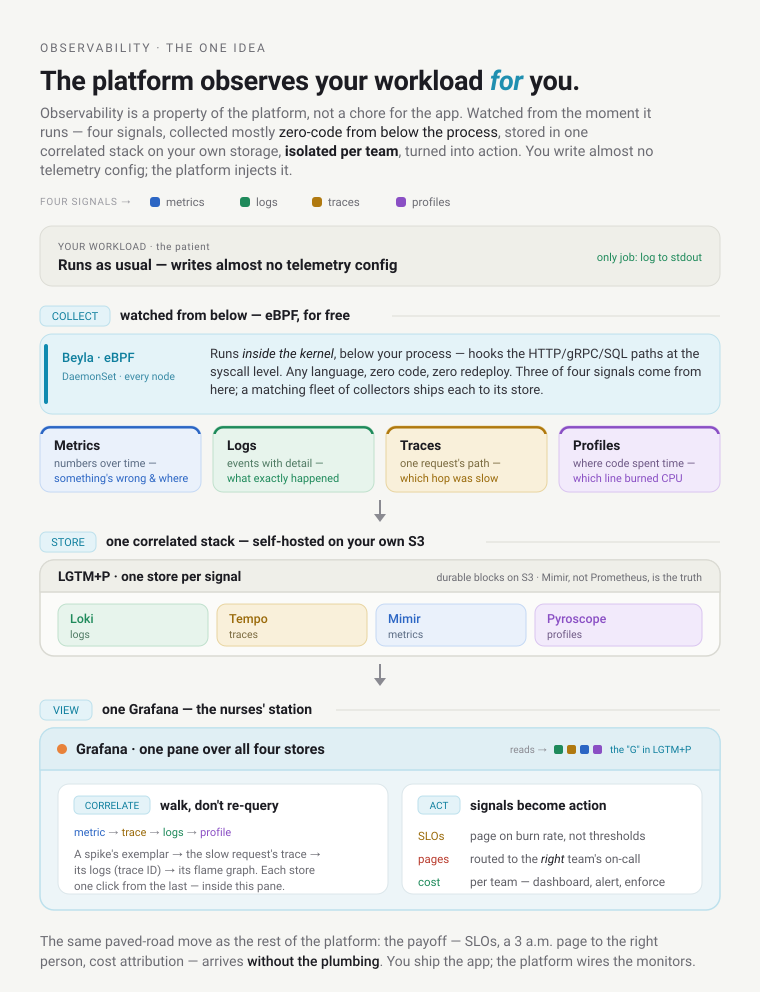
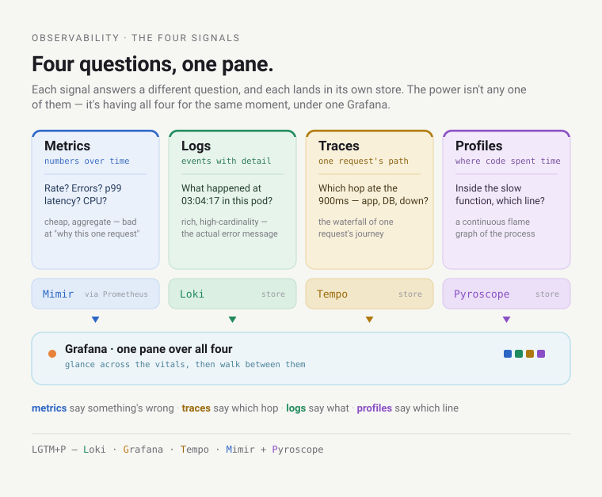
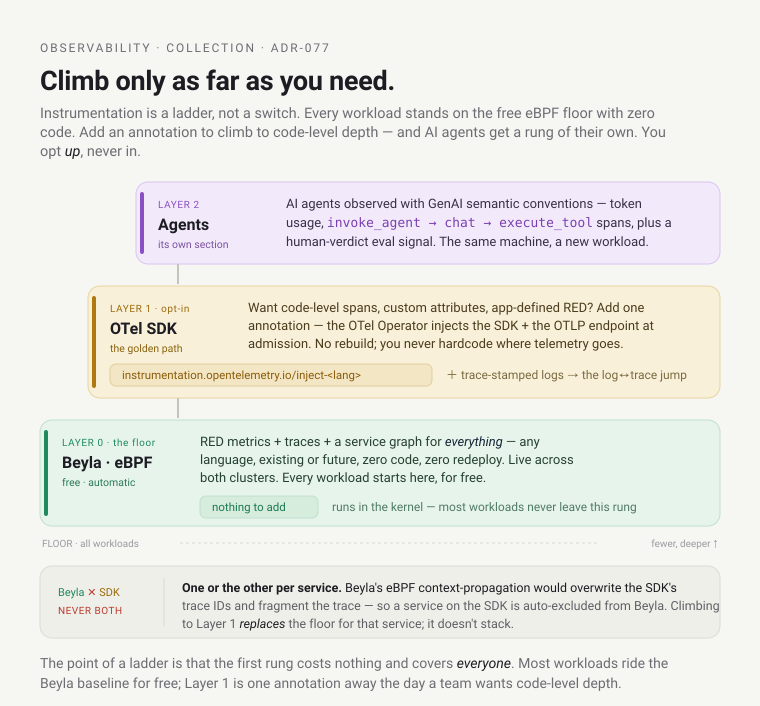
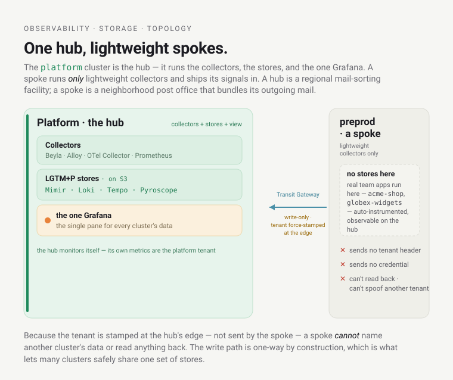
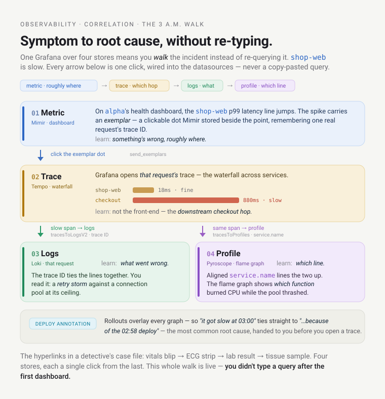
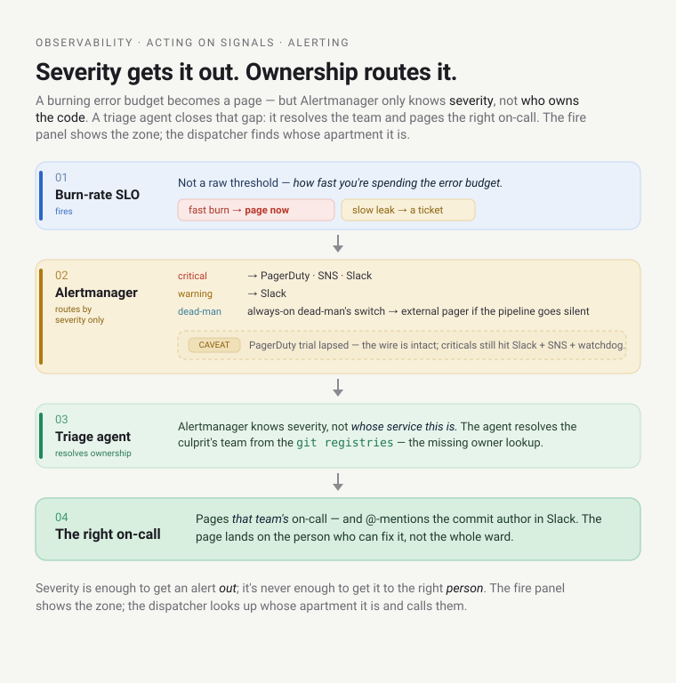

# Learn: Observability — orientation

How the platform *sees itself* — how a slow request, a crash loop, a memory leak, or a runaway LLM bill
becomes something you can find and fix, and how little you had to do to make that possible. This is the
platform's senses: what it observes, how the signals get collected, where they live, how one stack safely
holds every team's data, how you walk between the signals to a root cause, and how they turn into a page at
3 a.m. — to the *right* person.

Observability is one of the largest subsystems here — around twenty modules standing up a full self-hosted
telemetry stack — but almost all of it is platform-injected, so a developer gets the payoff without the
plumbing. Understanding the machine is what makes you fast in an incident. It helps to have seen
[Foundations](../foundations/orientation.md) (the cluster this runs on) and [Delivery](../delivery/orientation.md)
(what "a deploy" is). Know roughly what a metric, a log, and a trace are, and we'll build up the rest.

## The question

It's 3 a.m. `alpha`'s `shop-web` is slow. A user complained. You have a laptop and a login. What can you
actually find out — and what did the `shop` team have to do, ahead of time, to make it findable?

That second half is the surprising part. On most platforms the answer is "a lot": the team had to pick a
vendor, link a metrics library into their code, wire up a tracing SDK, ship logs somewhere, and hope they
instrumented the right thing *before* the incident. Here the answer is almost nothing — and that's the whole
design. By the end of this page we'll walk that 3 a.m. incident end to end — from a latency blip on a
dashboard to the exact line of code — clicking, never re-typing a query into a different tool.

## The one idea: the platform observes your workload *for* you

Everything else is a consequence of this:

> Observability here is a property of the platform, not a chore for the app. Your workload is watched from the
> moment it runs — four signals, collected mostly zero-code from below the process, stored together in one
> correlated stack on the platform's own storage, isolated per team, and turned into SLOs, pages, and cost
> attribution. You write almost no telemetry config; the platform injects it, the way it injects your
> securityContext and your AWS credentials.

The metaphor for the whole doc is a hospital's patient monitoring.

> The moment a patient (your workload) is admitted, they're wired to monitors — heart rate, oxygen, blood
> pressure, temperature (the four signals) — *without the patient doing anything*. Every monitor feeds one
> **central nurses' station** (Grafana), where a clinician can glance from a vitals blip to the chart to the
> meds in one place (correlation). Alarms are tuned to page the *right* doctor, not the whole ward (SLOs +
> owner-routing). Each patient's chart is private to their care team (per-team isolation). And the hospital
> owns its own monitors and records — it doesn't rent them from a company that keeps the data. **Where the
> metaphor breaks:** hospital sensors are external clip-ons; the platform's key sensor (eBPF, below) is wired
> *into the kernel underneath your process*, so it sees the inside of every request without touching your
> code. We'll flag the seams.

The tour follows the data: the **signals**, how they're **collected**, where they're **stored**, how the stack
keeps every team's data **separate**, how you **correlate** across them, how you **act** on them, and finally
how the platform even observes *its own AI agents*.

---

## The four signals — and the stack that holds them

Observability rests on four kinds of signal, and the trick to using them is knowing which question each one
answers:

- **Metrics** — *numbers over time.* "What's the request rate? The error ratio? CPU? The p99 latency?"
  Cheap, aggregate, great for dashboards and alerts. Bad at "why *this* one request."
- **Logs** — *events with detail.* "What exactly happened at 03:04:17 in this pod?" Rich, high-cardinality,
  the place you read the actual error message.
- **Traces** — *the path of one request across services.* "Where did those 900ms go — the app, the database,
  the downstream call?" A trace is the waterfall of one request's journey.
- **Profiles** — *where the code spent its time.* "*Inside* the slow function, which lines burned the CPU?" A
  continuous flame graph of the running process.

Metrics tell you *something* is wrong and roughly where; traces tell you *which hop*; logs tell you *what*;
profiles tell you *which line of code*. The power isn't any one of them — it's having all four for the same
moment and being able to walk between them (the correlation section). This platform runs the **LGTM+P** stack,
one store per signal, all self-hosted: **L**oki (logs), **G**rafana (the view), **T**empo (traces),
**M**imir (metrics), **+ P**yroscope (profiles).

---

## Collection — watched from below, for free

On most platforms, emitting these signals is the app's job — link a library, wire an SDK, per language, and
maintain it forever. Here it's **platform-injected**: the platform stands up the collectors and
instruments your workload without a line of app code, obeying the same paved-road rule as everything else.

The headline is **Beyla** — an **eBPF** agent running as a DaemonSet on every node. eBPF lets a program run
*inside the Linux kernel*, and Beyla hooks the kernel's networking and HTTP/gRPC/SQL paths. Watching request
*boundaries* down at the syscall level, it auto-generates RED metrics (Rate, Errors, Duration), a service
graph, and request-level traces — for every workload, in any language, existing or future, with zero code,
zero manifest change, zero redeploy.

> *Beyla is a traffic camera on the highway, not a GPS unit you install in each car.* It sees every vehicle's
> speed and route from the outside — so a Go binary, a Python service, and a vendored appliance you can't even
> recompile all light up identically, with nothing added. **Where it breaks:** a traffic camera sees the road,
> not the inside of the car — Beyla sees request boundaries, not your in-process function spans or custom
> attributes. That gap is exactly what the opt-in SDK layer fills.

That gives an **instrumentation ladder** you climb only as far as you need:

- **Layer 0 — Beyla (eBPF), free and automatic.** RED metrics + traces + service graph for everything, live
  across both clusters, no app change. This is the floor every workload stands on.
- **Layer 1 — the OpenTelemetry SDK, the golden path.** Want code-level spans,
  custom attributes, and RED metrics your app defines? Add one annotation
  (`instrumentation.opentelemetry.io/inject-<lang>`) and the OTel Operator injects the SDK plus the platform's
  OTLP endpoint at admission — no rebuild, and you never hardcode where telemetry goes. SDK-instrumented
  services additionally get **trace-stamped structured logs**, which unlocks the log↔trace jump below. (One
  rule: run the SDK *or* Beyla on a given service, never both — Beyla's eBPF context-propagation would
  overwrite the SDK's trace IDs and fragment traces.)
- **Layer 2 — agent observability**, for AI agents (its own section near the end).

Around Beyla sits a fleet of purpose-built collectors — one per signal, each shipping its stream to the
matching store (the [collection deep dive](deep-dive-collection-and-instrumentation.md) names them all, plus
the adjacent Cilium/Hubble *network* plane). The roster isn't the point; the payoff is: your workload does
*nothing* for three of the four signals — metrics, traces, and profiles come from eBPF — and for the fourth,
logs, its only job is the oldest rule in the book: *log to stdout*.

---

## Storage — self-hosted, on your own S3

The signals land in the LGTM+P backends, and two design choices define the platform's posture.

**First, it's self-hosted** — the platform
runs Grafana, Mimir, Loki, Tempo, and Pyroscope itself, on its own **S3** buckets, rather than shipping
everything to Datadog or Grafana Cloud. A SaaS observability bill is a metered utility — the meter spins on
every host and every series, and at platform scale (many teams × many services × high cardinality) that meter
becomes the dominant platform cost. Self-hosting is *owning the generator*: you pay compute you already run
plus cheap S3, your data never leaves your account (residency), and dashboards and alerts are code in the repo
(portability). The accepted trade is *"we operate it"* — which is the reference platform's whole thesis: own
your stack, and know how.

**Second, the durable store is Mimir, not Prometheus.** Prometheus stays the *scraper* with only ~15 days of
local history; it remote-writes every sample to **Mimir**, which keeps the long-range history on S3. So you can lose and rebuild Prometheus
without losing history — the truth is in Mimir/S3. Every store follows the same shape: a small hot buffer on
disk, the durable blocks on S3 (via Pod Identity, no static keys). A cluster-wide `cost_profile` gates the
expensive stores — `dev` runs Prometheus-only; the platform cluster flips the full LGTM+P bundle on
(single-replica), and `prod` scales it to HA (RF3, PDBs, ≥3 nodes).

**Topology: hub and spoke.** The `platform` cluster is the **hub** — it runs the collectors *and* the
backends *and* the one Grafana. `preprod` is a **spoke** — it runs only lightweight collectors that ship their
signals to the hub over the Transit Gateway. The hub is a regional mail-sorting facility; a spoke is a
neighborhood post office that bundles its outgoing mail and ships it in. Crucially, a spoke reaches the hub's
stores only through a **write-only Gateway route that force-stamps the tenant** at the edge — the spoke sends
no tenant header and no credential, and it *cannot* spoof another tenant or read anything back. The preprod
spoke is live for metrics, logs, and traces (plus profiles), and the real preprod apps
(`alpha-shop`, `alpha-checkout`, `bravo-dispatch`, …) are auto-instrumented and observable on the hub.

---

## Tenancy — how one stack safely holds every team

One Grafana, one set of stores, many teams — so the interesting question is *why can't `bravo` read `alpha`'s
metrics?* This is the most sophisticated part of the system, and it's a layered answer, because the obvious
mechanism isn't the real boundary.

Every signal carries an **`X-Scope-OrgID`** header naming a *tenant*, and the stores run
`multitenancy_enabled` — they deliver to whatever tenant the header names. But hold onto the security fact:
**`X-Scope-OrgID` is a trust header, not authentication.** Anything that can reach a store and set the header
could name any tenant — like an apartment number written on an envelope. So the header is *routing*, not a
lock. Isolation is layered on top of it:

- **The network is the floor.** The `observability` namespace is **default-deny ingress** and every store is
  **ClusterIP-only** — never on the Gateway. No tenant workload can even *reach* Mimir or Loki to try naming a
  tenant. This is the boundary that actually holds; everything else is defense in depth above it.
- **Writes are split per team.** `cortex-tenant` re-tenants each incoming series into its own Mimir tenant
  (Loki does the same via per-team Alloy re-tenanting), so `alpha` and `bravo` are *real, separate tenants*
  end to end — not one bucket with a label.
- **Reads are scoped by Grafana, softly.** Each team gets a datasource pinned to its own tenant
  (`Mimir (<team>)`, a static `X-Scope-OrgID`), and per-team read isolation is enforced by **Grafana
  dashboard-folder permissions** plus the **namespace-filtered per-team dashboards** — an RBAC-level boundary,
  not a data-layer gate. (Traces and profiles per-team read scoping is a follow-up.)

Be honest about that last bullet: read scoping is *soft*. It's an organizational boundary — Grafana folder
permissions and per-team dashboards — not a fail-closed security gate. The header (`X-Scope-OrgID`) is
routing, not auth, so the thing that actually keeps a team from reading another's data is the network floor
above: the stores are unreachable from any tenant namespace. (One subtlety regardless: the platform hub runs
*no* team workloads, so its own metrics are the `platform` tenant — the real per-team tenants come from the
**preprod spoke's live dual-write**, where the team apps actually run.)

> It's a shared apartment building with a locked mailroom. The `X-Scope-OrgID` on each envelope is just the
> unit number — anyone could *write* one. What keeps your mail yours is that the mailroom door is locked
> (network default-deny), the boxes are physically separate (per-team tenants), and your key opens only your
> own box (Grafana folder permissions). **Where it breaks:** that last lock is a *soft* one — building policy,
> not a bank vault — so the real boundary is the locked mailroom door, not the box key. Cross-*cluster* ingest
> likewise rests on network isolation rather than mTLS today.

---

## Correlation — the 3 a.m. walk, paid off

This is the *reason* to run four stores under one Grafana instead of four vendor tools: you can walk from a
symptom to its root cause without leaving the pane or re-typing a query. Here's the 3 a.m. incident from the
top, walked all the way down — every arrow below is a click wired into the Grafana datasources, not a
copy-paste:

1. **Metric → trace.** On `alpha`'s workload-health dashboard, the `shop-web` p99 latency line jumps. The spike
   isn't just a number — it carries an **exemplar**, a clickable dot that Mimir stored alongside the
   span-metric (Tempo's metrics-generator sets `send_exemplars`, so each RED point remembers a representative
   request's `traceID`). You click the dot.
2. **The trace waterfall.** Grafana opens *that request's* trace in Tempo — the waterfall of its journey across
   services. The bars show where the time went: a sliver in `shop-web`, then a long bar on the call to
   `checkout`. So it isn't the front-end — it's the downstream hop. Which hop is now obvious; *what went wrong*
   there isn't yet.
3. **Span → logs.** From the slow `checkout` span you jump to **that request's logs** in Loki — the trace ID
   ties them together (`tracesToLogsV2` one way; for SDK-instrumented services the log line's own `trace_id`
   field jumps straight back, no regex). You read the line — say, a retry storm against a connection pool at
   its ceiling. Now you know *what*.
4. **Span → profile.** And from the same span you jump to the **CPU flame graph** in Pyroscope
   (`tracesToProfiles`) — because the eBPF profiler labels each process with the same `service.name` Beyla
   stamps on traces, the two line up. The flame graph shows *which function* burned the CPU while the pool
   thrashed. Now you know *which line*.

> *It's the hyperlinks in a detective's case file.* Each clue links to the next — the vitals blip → the ECG
> strip → the lab result → the tissue sample — four stores, each a single click from the last. That whole walk
> — RED spike → exemplar trace → its logs → its flame graph — is live today; you didn't type a query after the
> first dashboard.

One more thing makes the walk land: **deploy annotations** overlay the graphs, so "it got slow at 03:00" ties
straight to "…because of the 02:58 deploy" — the single most common root cause, handed to you before you've
opened a trace.

---

## Acting on signals — SLOs, pages, and cost

Collecting signals is worthless if nothing *acts* on them. Three ways they turn into action, each with its
own [deep dive](deep-dive-slos-alerting-and-cost.md).

**SLOs — judging "good enough" by burn rate.** An SLO is a target (say 99.9% success) with an *error budget*
(the 0.1% you may spend). The platform alerts not on a raw threshold but on **how fast you're spending the
budget**: a fast burn (budget gone in ~2 days) pages someone *now*; a slow leak files a ticket for the week.
A threshold alert is a smoke detector that shrieks at burnt toast; burn-rate is a fuel gauge with a
trip-computer — it warns when your projected time-to-empty is short. The sharp part: every `prod` app gets a
99.9%-success SLO **auto-derived** from its Beyla RED metrics — no authoring step — and it does real work.
Before any canary shifts traffic, a **freeze gate** checks the environment isn't *already* burning through its
budget, so the platform won't stack a risky deploy on top of a live incident. (Platform services get
hand-authored SLOs too; the [deep dive](deep-dive-slos-alerting-and-cost.md) has both mechanisms.)

**Alerts that page the *right* person.** A curated alert set fires through
Alertmanager, routed by severity: `critical` → SNS + Slack + PagerDuty; `warning` → Slack; and an
always-firing **dead-man's switch** pages an external service if the whole pipeline ever goes silent.
*(Honest status: the `critical`→PagerDuty wire is real — an Events-API-v2 receiver fed by the `pagerduty`
unit's routing key — but the PagerDuty trial account lapsed (~2026-07-07), so paging is momentarily offline;
criticals today still reach Slack + SNS + the dead-man's switch, just not a human page. The design stands; the
account doesn't.)* But Alertmanager only knows *severity*, not *ownership* — so the **triage agent**
resolves the culprit's team
from the git registries and routes the alert to *that team's* on-call, @-mentioning the commit author in
Slack. The fire panel shows the zone; the dispatcher looks up whose apartment it is and calls *them*.

**Cost as an observable signal.** Cost is just another signal here — attributed per team in near-real-time and
reconciled against the *actual* AWS bill, so it's a metric you can dashboard, alert on, and even **enforce**:
an over-budget team can be blocked from provisioning. (The live
estimate vs the real billed spend — and why you want both — is in the
[deep dive](deep-dive-slos-alerting-and-cost.md).) It's exactly how the "runaway LLM bill" from the opening
becomes findable.

---

## Observing the observers — agent observability

The platform runs AI **agents** now (the triage copilot), and they get observed too — using OpenTelemetry's
**GenAI semantic conventions**. One
instrumentation seam in the agent fans out to three consumers: **metrics** (token usage, operation latency,
dispositions) into Mimir; **traces** (`invoke_agent` → `chat` → `execute_tool` spans, enriched with `gen_ai.*`
attributes) into Tempo; and a durable **eval** signal — the human's Accept/Correct/Dismiss verdict as a counter
— for measuring whether the agent is actually any good. Cost is *derived* (tokens × model price). This is live
— real token counts flow today; content-capture and a dedicated LLM lens (Langfuse) are deliberately deferred.
It's the same four-signal machine, pointed at a new kind of workload.

---

## The honest status — what's live, and where the edges are

Almost all of it is live and exercised. The full LGTM+P data plane, the preprod spoke across all signals, real
auto-instrumented apps, the correlation walk end to end, both SLO systems, alerting with owner-routing, cost
(OpenCost + true-cost), and agent observability are all running. The edges worth knowing:

- **Per-team isolation: write-split is real; reads are soft.** `cortex-tenant` splits each team's metrics/logs
  into its own real Mimir/Loki tenant (live). Read isolation is Grafana folder permissions + per-team
  dashboards — an organizational boundary, not a fail-closed security gate; the real data-plane boundary is the
  network floor. Traces/profiles per-team read scoping is a follow-up.
- **The OTel SDK golden path is real but not fleet-wide.** The operator, the inject annotation, and the
  log↔trace correlation for SDK'd services are live; most workloads still ride the Beyla Layer-0
  baseline, and rolling the SDK across the fleet is the ongoing golden-path work.
- **PagerDuty paging is offline** (trial account lapsed) — the wire is intact; only the account needs
  restoring.
- **Cross-cluster ingest rests on network isolation, not mTLS** — the tenant header is overwritten at the hub
  edge and spokes reach it only over the private VPC/TGW; mutual TLS between clusters is a planned hardening.

## When it breaks — the ones you'll actually hit

- **"My metrics/logs aren't showing up."** Isolation is by **network**, not the `X-Scope-OrgID` header — check
  your workload is in an instrumented namespace and the collector DaemonSet is healthy on its node; the stores
  are ClusterIP-only by design, so "I'll just curl Mimir" won't work from a tenant namespace (that's the point).
- **"Grafana can reach the app but a probe/backend can't."** The Cilium **`ingress` identity (8)** again — the
  `observability` namespace admits gateway traffic via a `CiliumNetworkPolicy` `fromEntities: ["ingress"]`
  (see [Foundations](../foundations/deep-dive-the-cluster.md)).
- **"I put the SDK annotation on but I'm getting no RED metrics."** For metrics specifically the app must create
  and globally set a `MeterProvider` alongside the tracer — `otelhttp` silently emits no RED metrics without it
  (tracing alone doesn't need it, which is why it's easy to forget). Also: SDK metrics break out by `job`
  (`<team>-<product>/<svc>`), not `service_name` — group by `job` in queries.
- **"The agent dashboard is empty."** Agent metrics are *zero-recording* instruments — they emit **no series
  until the agent's first action / first human verdict**. A cold agent shows only `target_info`. Not broken —
  just quiet.
- **"Per-team data isolation — how strong is it?"** Your writes land in a *real* separate tenant, but your
  reads are scoped *softly* — by Grafana folder permissions and your team-overview dashboard, not a fail-closed
  gate. Treat it as an organizational boundary, not a security wall (the real data-plane boundary is the
  network floor) — and use your team-overview dashboard as the ready-made view.

## Go deeper

The deep dives: [the stack & storage](deep-dive-the-stack-and-storage.md),
[collection & instrumentation](deep-dive-collection-and-instrumentation.md),
[correlation & the team experience](deep-dive-correlation-and-the-team-experience.md),
[SLOs, alerting & cost](deep-dive-slos-alerting-and-cost.md), and
[agent observability](deep-dive-agent-observability.md). The lookup: the [Reference](reference.md).

The decisions behind it, if you want them: instrumentation strategy (ADR-077), the OTLP convention
(ADR-100), self-hosting (ADR-043), and durable multi-tenant metrics (ADR-044).
