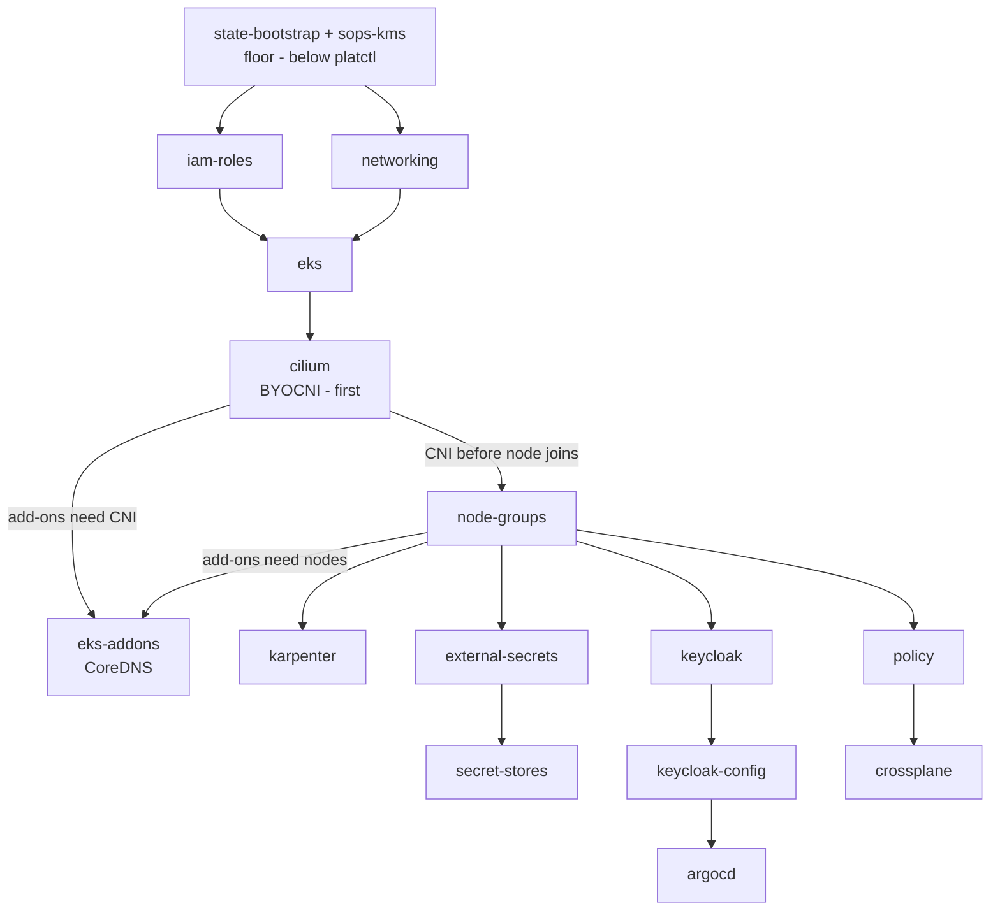

# Learn: Operations — platctl & the deployment DAG (deep dive)

One idea runs through `platctl`: the platform is a dependency graph, and `platctl` walks it — forward to
build, reverse to tear down, to-zero-and-back to park. Think of it as `make` or Bazel over a graph of
infrastructure units, plus three things `make` lacks: a pre-flight checklist, a safe reverse, and
resume-after-crash. A higher-altitude version of that frame lives in the
[Operations orientation](orientation.md). This page opens the machine: how it discovers the graph, how it
walks it in parallel without ever running a unit before its inputs, and why the ordering is what it is.

`platctl` is a Go [Cobra](https://cobra.dev/) CLI living in [`cmd/platctl/`](https://github.com/asanexample/platform/tree/main/cmd/platctl).
It is built and in daily use — `make build-platctl` compiles it to `./bin/platctl` (it is *not* on
`PATH`), and every package has unit tests (`graph_test`, `engine_test`, `runner_test`, `state_test`,
`discover_test`, `hooks_test`, `validate_test`). Eight verbs hang off the root command
([`main.go`](https://github.com/asanexample/platform/blob/main/cmd/platctl/main.go)): `bootstrap`,
`teardown`, `validate`, `kubeconfig`, `status`, `down`/`up` (park), and `access` (short-lived
elevation). This dive is about the first three and the engine underneath them.

## The graph is discovered, not hardcoded

The most important design fact: `platctl` does not contain the dependency graph. Nowhere in the Go is
there a list saying "cilium after eks, argocd after keycloak." If there were, the graph would rot the
first time someone added a unit. Instead `platctl` reads the graph off the filesystem every run
([`config/discover.go`](https://github.com/asanexample/platform/blob/main/cmd/platctl/internal/config/discover.go)),
in six steps:

1. Read [`.platctl.yaml`](https://github.com/asanexample/platform/blob/main/.platctl.yaml.example) for the
   environment definitions — each maps a name to a path + provider + auth. `platform` →
   `infra/live/aws/platform/us-east-1/platform`, `preprod` → the parallel preprod tree.
2. Scan each environment directory for subdirectories containing a `terragrunt.hcl`.
3. Parse each one with [`hashicorp/hcl/v2`](https://github.com/hashicorp/hcl) to pull out its
   [`dependency` blocks](https://terragrunt.gruntwork.io/docs/reference/config-blocks-and-attributes/#dependency).
4. Resolve each block's relative `config_path` to a qualified unit name. `"../networking"` →
   `platform/networking`; a long `"../../../../preprod/us-east-1/platform/eks"` resolves the absolute path,
   matches it against each environment's base path, and yields `preprod/eks`. This is how
   cross-environment edges — the platform hub's ArgoCD depending on the preprod cluster's API — get
   discovered at all.
5. Merge `implicit_deps` from `.platctl.yaml` overrides — orderings that are real but *not* expressed as a
   Terragrunt `dependency` (e.g. several units → `iam-roles`; `platform/tailscale` →
   `platform/tailscale-admin`, so it doesn't read a pending-deletion secret).
6. Build the DAG (`engine.NewGraph`, which rejects duplicates and dangling edges).

The payoff: adding a unit needs zero `platctl` changes. Drop a `terragrunt.hcl` with its `dependency`
blocks and it is discovered — with its edges — on the next run. There are ~110 real units under
`infra/live/aws`; `platctl` discovers the 98 in the two managed environments (65 `platform` + 33
`preprod`). The nine-unit management floor under `infra/live/aws/mgmt/global/` sits outside both trees, so
`platctl` never discovers, applies, or destroys it — a deliberate boundary we come back to.

## How the engine walks it

Once the graph exists, the engine
([`engine/engine.go`](https://github.com/asanexample/platform/blob/main/cmd/platctl/internal/engine/engine.go))
walks it with Kahn's algorithm — the textbook topological walk by in-degree counting:

1. Compute each unit's in-degree (number of dependencies).
2. Seed a ready set with every zero-dependency unit.
3. Launch ready units as goroutines, bounded by a semaphore (default concurrency 4 for
   bootstrap/teardown, 8 for validate).
4. As each unit completes, decrement its dependents' in-degrees; any that hit zero join the ready set.
5. On failure, mark the failed unit's transitive dependents `skipped`, let in-flight work finish, and stop.

The concurrency discipline is the part worth staring at. Worker goroutines do exactly one thing — run
terragrunt — and post their outcome back over a `results` channel to a single goroutine that owns all
state mutation. No two goroutines ever touch the state map; there is no mutex on `State` because there is
only ever one writer (`state.go` documents this as a hard invariant). That is how you get parallelism
without data races.

Sitting beside the engine,
[`graph.go`](https://github.com/asanexample/platform/blob/main/cmd/platctl/internal/engine/graph.go) is a
bag of pure functions — no side effects, trivially testable: `TopoSort` (deterministic order, ties broken
by sorted name), `Waves` (the parallel groups `--dry-run` prints), `Reverse` (flip every edge for
teardown), `FilterByEnv` (drop cross-env edges for a single-env run), and `Dependents` (the transitive
closure used for skip-on-failure).

Here is the real plan, straight from `platctl bootstrap --dry-run`:

```text
Execution plan: 98 units in 12 waves

Wave 1 (7 units in parallel)
  platform/iam-roles        aws  profile: platform
  platform/ecr              aws  profile: management
  preprod/iam-roles         aws  profile: preprod
  ...
Wave 3 (5 units in parallel)
  platform/eks              aws  ...  deps: [platform/iam-roles, platform/networking]
  preprod/eks               aws  ...  deps: [preprod/iam-roles, preprod/networking]
  ...
Wave 4 (9 units in parallel)
  platform/cilium           aws  ...  deps: [platform/eks]
  preprod/cilium            aws  ...  deps: [preprod/eks]
  ...
```

Read the waves as the platform deciding for you: nothing before its inputs (Cilium can't appear until its
EKS is an earlier wave), everything independent at once (both clusters' `eks` units share Wave 3). The 98
units are not a queue — they are a shape, and twelve waves is that shape's critical path.

## Bootstrap ordering — and why each thing comes before the next

`runBootstrap`
([`cli/bootstrap.go`](https://github.com/asanexample/platform/blob/main/cmd/platctl/internal/cli/bootstrap.go))
is a four-beat sequence: pre-flight → `engine.Run(Apply)` → lockdown → kubeconfig. The graph handles most
ordering itself; a few constraints carry real weight and are worth understanding.

The whole build is one DAG. Here is its spine — the floor `platctl` never touches, the cluster chain
(Cilium before nodes, add-ons after both), and the platform-services layer above it:



**The floor is below `platctl`.** The S3 state backend can't be created by something that uses
the S3 state backend — you can't store your state in a bucket that doesn't exist yet. So `state-bootstrap`
uses a local backend for its first apply, creating the bucket + the `terraform-locks` DynamoDB table that
every other unit then uses for remote state. (`state-bootstrap`'s own state stays local.)
This floor (`state-bootstrap` / `state-access` / `sops-kms`) lives under `infra/live/aws/mgmt/global/`,
outside both environment trees, precisely so `platctl` never discovers it — the seed vault that must
survive every fire; `sops-kms` carries `prevent_destroy` as a second belt. Two greenfield escapes exist
for the true from-zero case: `TG_SOPS_BOOTSTRAP=1` (a plaintext `secrets.hcl` before the KMS key exists)
and `TG_FORCE_DEPLOYER=1` (an in-VPC CI runner).

**The cluster spine — and why EKS is deliberately split.** The core chain is `iam-roles` + `networking` →
`eks` → `cilium` → `node-groups` → `eks-addons` (with `karpenter` off `node-groups`). It's a
subfloor-before-carpet rule made concrete. The cluster runs [Cilium](https://docs.cilium.io/) as
bring-your-own CNI instead of the AWS VPC CNI, and the ordering is brutal: the cluster must exist
before Cilium installs; Cilium must be running before a node group joins (a node with no CNI comes up
`NotReady`); [CoreDNS](https://coredns.io/) and the other add-ons can't schedule until both CNI and nodes
are ready. A single monolithic EKS module cannot express "create the cluster, wait for an external Helm
install, then add nodes" — so EKS is split into four units, and the ordering is structural
(separate units wired by `dependency` blocks), not a `depends_on` inside one module. The dry-run above
shows it: `eks` in Wave 3, `cilium` in Wave 4.

**Bootstrap-then-lockdown for the private endpoint.** The EKS API is private-only by design —
`endpoint_public_access` defaults to `false`. But during a from-scratch build there is no in-VPC path yet
(Tailscale isn't up), so `platctl` applies `eks` with a bootstrap override — `.platctl.yaml` sets
`bootstrap_args: ["-var", "endpoint_public_access=true"]` on both `platform/eks` and `preprod/eks` — brings
up the rest of the platform through the temporarily-public API, then the lockdown phase slams it shut. This
is the only time the public endpoint is ever on, and `platctl` owns the toggle end to end.

**The platform-services layer (~60 units).** Above the spine, the graph encodes the real service
dependencies: `external-secrets` → `secret-stores` (the `ClusterSecretStore` before any `ExternalSecret`
consumer); `keycloak` → `keycloak-config` → `argocd`, because ArgoCD brokers OIDC directly to Keycloak
so the client secret must land before anyone signs in; `policy` (Kyverno) before
`crossplane`, because Kyverno policies match on Crossplane CRDs. None of this is in the Go — it's all
`dependency` blocks the discovery step read off disk.

## Pre-flight and hooks — the parts `make` doesn't have

**Pre-flight** is the checklist. `manual_steps` in `.platctl.yaml` name the human prerequisites a machine
can't create — a Cloudflare API token before `cloudflare-dns`, a Tailscale API key before
`tailscale-admin` — each with a check (e.g. `secret_exists` in Secrets Manager) that auto-skips the step
when already satisfied. `--yes` skips the prompting, but a hard-failed check still aborts the run
(`bootstrap.go` returns an error rather than proceed). ArgoCD SSO needs no manual step — OIDC-via-Keycloak
is fully IaC.

**Hooks** are per-unit wrappers the engine invokes instead of a bare `terragrunt apply`
([`hooks/hooks.go`](https://github.com/asanexample/platform/blob/main/cmd/platctl/internal/hooks/hooks.go)).
Five are wired today:

- **`crd_two_stage`** (`tailscale`, `preprod/cert-manager`): apply `-target=<helm_release>` first to
  register the CRDs, then a full apply so custom resources can reference them — dodging the
  "CRD doesn't exist at plan time" failure. Idempotent (stage 1 is a no-op if the CRDs already exist).
- **`eni_ip_validation`** (`cross-vpc-dns`): warn if the PHZ records are stale versus the live preprod EKS
  API ENI IPs.
- **`argocd_account_token`** (post-apply on `argocd`): re-mint the read-only ArgoCD token Backstage uses.
  A from-scratch rebuild regenerates ArgoCD's server signing key, silently invalidating the token sitting
  in Secrets Manager. Idempotent (re-mints only when the current token fails validation), best-effort
  (warns, never fails bootstrap).
- **`secret_cleanup`** (`tailscale-admin`, pre-apply): before recreating the OAuth secrets, force-delete
  any leftover `PENDING_DELETION` secrets from a prior run so their 30-day recovery window doesn't block
  this bootstrap.
- **`state_purge`** (`keycloak-config` teardown): drop the `keycloak_*` realm/client resources from state
  before destroy — they'd otherwise time out being deleted one-by-one over a port-forward against a
  Keycloak that vanishes wholesale with its database in the next wave.

## The lockdown phase, step by step

After the apply, `platctl` runs `cfg.Lockdown` in order (`bootstrap.go`). The order is not cosmetic — each
step depends on the one before. Straight from the dry-run:

```text
Lockdown: platform/tailscale (Enable split DNS for private EKS resolution)
Lockdown: preprod/tailscale (Enable split DNS for preprod.aws.refplat.org resolution)
Lockdown: platform/eks       (Disable public EKS endpoint)
Lockdown: preprod/eks        (Disable public EKS endpoint)
Lockdown: platform/cross-vpc-dns (Refresh preprod EKS API PHZ records (ENIs churn on endpoint toggle))
```

1. **Enable Tailscale split-DNS first — on both clusters.** These units carry `kubernetes_manifest`
   resources whose GroupVersionResource discovery hits the live cluster API at plan time. Once the endpoint
   is private-only that discovery times out — the apply host isn't on the tailnet, and configuring
   Tailscale is exactly what would put it there: a chicken-and-egg. Split-DNS points at the static VPC
   resolver (`10.100.0.2`), independent of the endpoint toggle, so it's safe to enable while the endpoint
   is still public.
2. **Disable the public endpoint** on `platform/eks` then `preprod/eks` — re-apply with the default
   `endpoint_public_access=false` (the bootstrap override is dropped).
3. **Refresh the cross-VPC DNS records.** Disabling public access churns the cluster API ENIs, leaving the
   preprod-EKS-API PHZ A-record stale — after which the platform hub's ArgoCD can't reach preprod and every
   preprod Application degrades. Re-applying `cross-vpc-dns` re-looks-up the live ENIs.

The endpoint toggle serializes against any other in-flight EKS update, so it can hit a transient
`ResourceInUseException`. `applyLockdownWithRetry` retries up to 8 × 45s (~6 minutes) on
`IsTransientEKSUpdate`, and fails fast on anything else. Never toggle the endpoint by hand — `platctl` owns
it, and the split-DNS/refresh choreography around it is why.

## Resume and state

Every transition is persisted to `.platctl-state.json`
([`engine/state.go`](https://github.com/asanexample/platform/blob/main/cmd/platctl/internal/engine/state.go)):
`pending → running → completed | failed`, plus `skipped` for the transitive dependents of a failure. On
failure the engine marks the failed unit and its dependents, lets in-flight applies finish (it never kills
a running terragrunt mid-apply), saves, and prints `platctl bootstrap --resume`. Resume calls
`PrepareForResume()`, which resets `failed`/`skipped` back to `pending` and keeps `completed` — so a
resumed run re-attempts only what didn't finish and never re-applies what did. Per-unit terragrunt output
streams to `.platctl-logs/latest/<wave>_<unit>.log` (`latest` is a symlink; `/` in a name becomes `--`,
e.g. `002_platform--eks.log`).

## Teardown — the safe reverse

`platctl teardown`
([`cli/teardown.go`](https://github.com/asanexample/platform/blob/main/cmd/platctl/internal/cli/teardown.go))
is the mirror image, and its four beats are exactly what `make clean` can't do safely:

1. **Unlock first** — walk `cfg.Lockdown` in reverse, re-applying each unit's `bootstrap_args` to re-enable
   access. This puts the public EKS endpoint back on, because Tailscale (the only in-VPC path) is about to
   be destroyed — without the public endpoint there'd be no way to reach the API to delete the in-cluster
   resources.
2. **Pre-destroy apply** the `teardown_args` (`force_destroy`/`force_delete=true` on ECR, S3 buckets,
   Route53 zones) — providers read those flags from state, not the destroy plan, so they must be applied
   first.
3. **Reverse-DAG destroy** (`graph.Reverse()`): dependents die before their dependencies. Every
   `dependency` block carries `mock_outputs` (including `destroy` in its allowed commands), so a reverse
   destroy still plans even when an upstream unit's state is already gone.
4. **Floor exclusion.** Units marked `teardown_skip: true` are marked `completed` up front so the engine
   never destroys them. The teardown dry-run says it plainly: 96 units to destroy … 2 kept
   (`teardown_skip`) — those two are `platform/iam-roles` + `preprod/iam-roles`. Destroying
   `PlatformDeployer` would force the next bootstrap through the break-glass
   `OrganizationAccountAccessRole`. The management floor needs no skip (it's outside the discovered trees),
   and `sops-kms`'s `prevent_destroy` is a second belt.

## Validate — the post-build health check

`platctl validate`
([`cli/validate.go`](https://github.com/asanexample/platform/blob/main/cmd/platctl/internal/cli/validate.go))
is a two-phase checker (default concurrency 8). Phase 1 is IAM (`access.go`): SSO sessions valid, deployer
roles assumable, state-bucket reachable. If any IAM check fails, all of Phase 2 is skipped — fix
credentials first, so you don't drown in a cascade of misleading "cluster unreachable" failures that are
really just an expired token. Phase 2 resolves a checker per unit by convention from its short name
(`ResolveCheckers`): `eks` → `EKSClusterCheck` (cluster `ACTIVE`, nodes `Ready`), `cilium` →
`K8sWorkloadCheck` (the `cilium-agent` pods in `kube-system`), `secret-stores` → `SecretStoreCheck`,
`argocd` → `ArgoCDAppCheck` (Applications `Synced` + `Healthy`); anything unmapped gets a generic
`StateCheck` (`terragrunt state list`). Cross-cutting checks add Gateway, Tailscale (router online, CIDR
advertised, split-DNS), DNS delegation (discovered, since nameservers churn on rebuild), TGW attachments,
and HTTP endpoint reachability. `--check tailscale` prefix-matches both `tailscale/platform` and
`tailscale/preprod` for a sub-second targeted probe. Every checker takes an injectable `CommandRunner`, so
all 31 validate tests run with zero real AWS or kubectl calls.

## Gotchas that teach

- **Never run `platctl`/terragrunt from a git worktree.** The highest-stakes gotcha in the system.
  Several teardown/drain `null_resource`s (Crossplane orphan-sweeps; namespace-drain/CNPG-cleanup in
  `backstage`/`keycloak`/`platform-directory`/`tailscale`/`observability`) key their `triggers` off a
  `scripts/*.sh` path. A worktree's differing absolute path could make Terraform see a changed
  trigger → replace the resource → fire its `when = destroy` provisioner, force-deleting live environment
  IAM roles + ECR repos on what looks like a routine apply. The path is resolved at run
  time via `git rev-parse --show-toplevel`, never baked into `triggers` (see
  [`infra/modules/platform-directory/main.tf`](https://github.com/asanexample/platform/blob/main/infra/modules/platform-directory/main.tf)),
  so it's guarded — but the rule stays as defense-in-depth. Operate from the main checkout.
- **The graph won't warn you about an ordering it can't see.** If two units are related but neither
  declares a `dependency`, discovery finds no edge and the engine may run them in the same wave. That's what
  `implicit_deps` in `.platctl.yaml` is for — ordering that's real but not expressed as a Terragrunt
  dependency (a shared Secrets Manager secret, an IAM role assumed at plan time). When a race appears, the
  fix is a source-level edge, not a retry.
- **`--dry-run` is your cheapest correctness check.** It runs discovery + `Waves()` with zero side effects
  — no terragrunt, no AWS. Run it after adding a unit and confirm your new edge landed in the wave you
  expected before you ever apply.
- **Validate's two-phase skip is a feature, not a flake.** "47 checks skipped" almost always means Phase 1
  (IAM) failed — refresh your SSO session and re-run, don't chase the Phase 2 "failures."

## The honest status

Everything above is built and in daily use: bootstrap, teardown, validate, park (`down`/`up`), the hooks,
unlock/lockdown, resume, and the per-package test suites. The bootstrap floor's own state is local +
gitignored — orthogonal to `platctl`, which by design never manages that floor unit at all.

## Go deeper

- **Code:** [`cmd/platctl/ARCHITECTURE.md`](https://github.com/asanexample/platform/blob/main/cmd/platctl/ARCHITECTURE.md)
  (the contributor design doc) · [`internal/config/discover.go`](https://github.com/asanexample/platform/blob/main/cmd/platctl/internal/config/discover.go)
  · [`internal/engine/engine.go`](https://github.com/asanexample/platform/blob/main/cmd/platctl/internal/engine/engine.go)
  · [`internal/engine/graph.go`](https://github.com/asanexample/platform/blob/main/cmd/platctl/internal/engine/graph.go)
  · [`.platctl.yaml`](https://github.com/asanexample/platform/blob/main/.platctl.yaml.example) (the whole config surface).
- **House skills:** `platctl` and `apply-and-destroy` (the raw `terragrunt run --all` equivalents and the
  private-endpoint handling).
- **Runbook:** `docs/runbooks/platform-rebuild-from-scratch.md` — the full from-ash procedure this dive
  automates.
- **External:** [Kahn's algorithm](https://en.wikipedia.org/wiki/Topological_sorting#Kahn's_algorithm)
  (the topological walk, ~5 min) · [Terragrunt `dependency` blocks](https://terragrunt.gruntwork.io/docs/reference/config-blocks-and-attributes/#dependency)
  (what discovery parses, ~5 min).
- **Sibling deep dive:** [Parking & day-2 recovery](deep-dive-parking-and-day2.md) — the `down`/`up`
  choreography and the recovery sweeps.
