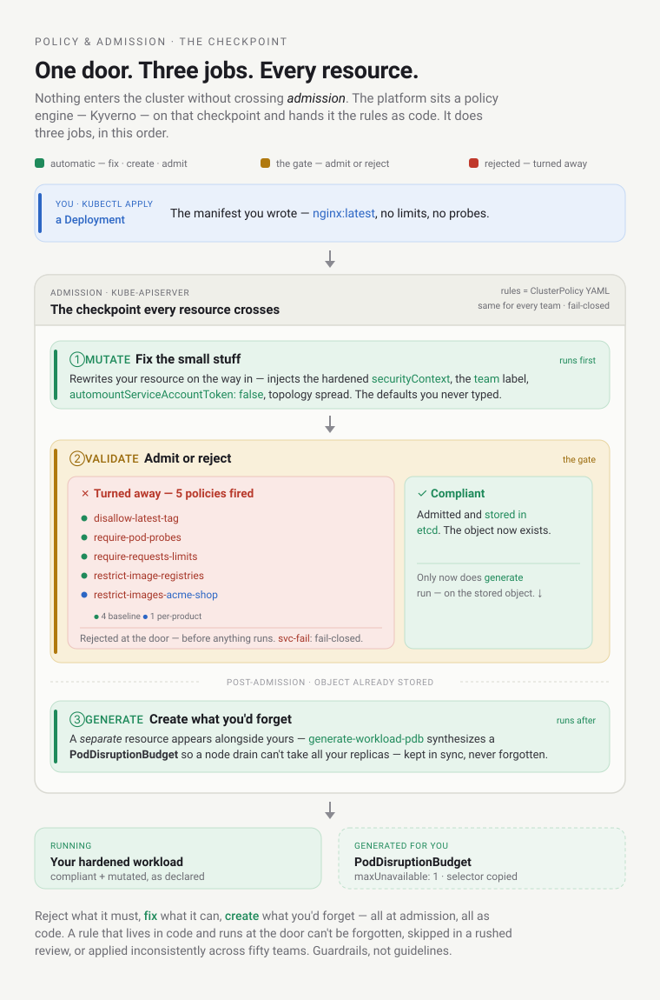
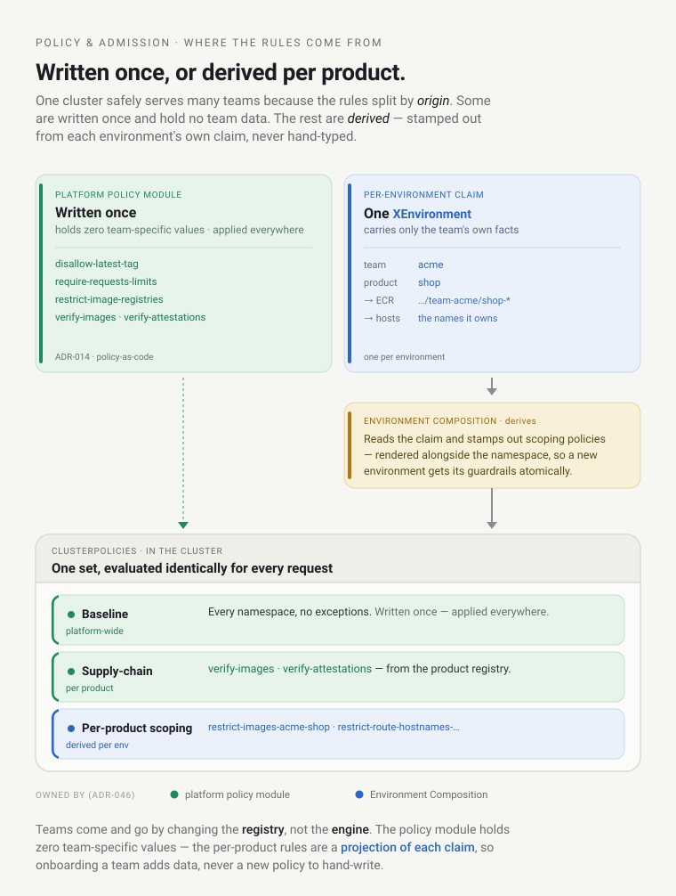
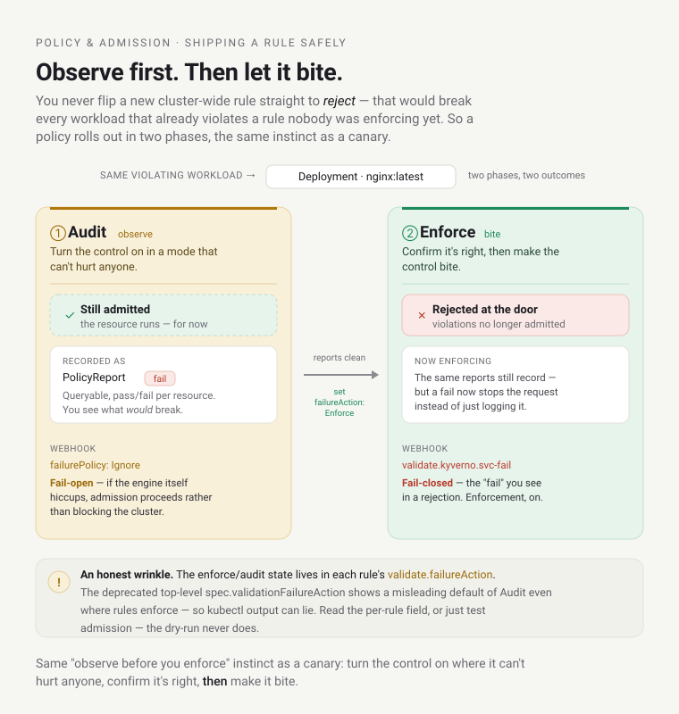

# Learn: Policy & Admission — orientation

How the platform enforces its rules — automatically, on *every* resource, at the moment it tries to enter
the cluster. "Admission" and "Kyverno" turn up throughout
[Life of a Deployment](../spine/life-of-a-deployment.md) and [The Security Model](../spine/the-security-model.md);
here they get concrete. This is also where you find out why a workload got rejected, and why half the fields
you never wrote showed up anyway.

Written for platform engineers who author or operate policy. Developers get most of their payoff from the
last section — it's the difference between "admission keeps rejecting my Deployment" and knowing exactly
what's required. Already fluent in Kyverno? The [Reference](reference.md) is the lookup. It helps to know
that Kubernetes stores YAML-described resources and that a *namespace* is an isolated slice of a cluster;
[the domain model](../domain-model/orientation.md) (Team / Product / Environment) is useful background.

## The question

Every platform has rules: images must be signed, containers can't run privileged, every workload needs
resource limits. Writing the rules isn't the hard part — enforcing them consistently is, on every team,
every time, without relying on someone remembering to check in code review.

So where do the platform's rules actually live, what happens when a workload breaks one, and who fills in
the safe defaults nobody wants to type by hand? Answer that and you understand the guardrail layer — the
thing that makes "safe self-service" more than a slogan.

## The one idea: a programmable checkpoint at the cluster door

Everything hangs on one mechanism. In Kubernetes, nothing enters the cluster without crossing *admission* —
a checkpoint the API server runs on every single resource before it's stored. The platform puts a policy
engine, **[Kyverno](https://kyverno.io/docs/)**, on that checkpoint and gives it the rules as policy-as-code:
YAML `ClusterPolicy` objects the cluster evaluates identically, every time.

> **It's the building inspector at the site gate.** Nothing gets built without passing inspection. But this
> inspector does *three* jobs, not one: it turns away work that violates code (*validate*), it quietly fixes
> the small stuff so you don't have to — adds the handrail, the right screws (*mutate*) — and it installs the
> smoke detector for you whether you asked or not (*generate*). Hold those three verbs; they're the whole model.

That's the shift worth internalizing. The platform's rules aren't a wiki page people are *supposed* to
follow. They're executable, enforced at the door, and identical for everyone — a rule that lives in code and
runs on admission can't be forgotten, skipped in a rushed review, or applied inconsistently across fifty
teams. Guardrails, not guidelines.

What that buys is the whole reason the platform can hand teams self-service without holding its breath. One
rule, evaluated identically, for every team — no gap between what the wiki says and what got merged. A
control in code applies whether or not the author ever heard of it. And Kyverno sits *above* Kubernetes' own
native Pod Security Admission `baseline` floor, so two independent layers must fail before, say, a privileged
pod slips through. It's the same declare-then-reconcile idea as everything else here: the rules are declared
as code, and the engine enforces them on every request, continuously.

Here's the whole admission path in one picture — mutate runs first, then validate decides admit-or-reject,
and generate creates companions like the PDB only *after* the resource is stored:



Watch all three verbs on a real workload, starting with the one you meet first when you get it wrong.

## Verb 1 — validate: watch a bad workload get turned away

A genuinely non-compliant Deployment — a stock `nginx:latest`, no resource limits, no probes — dry-run
against a real environment namespace (`acme-shop-dev`). Kyverno's answer, verbatim (lightly trimmed):

```text
Error from server: admission webhook "validate.kyverno.svc-fail" denied the request:

resource Deployment/acme-shop-dev/learn-policy-demo was blocked due to the following policies

disallow-latest-tag:
  … Using the ':latest' tag is not allowed; pin an immutable version.
require-pod-probes:
  … Liveness and readiness probes are required on every container.
require-requests-limits:
  … CPU and memory requests and limits are required on every container.
restrict-image-registries:
  … Image registry not allowed. Environment images must come from <platform-acct>.dkr.ecr.us-east-1.amazonaws.com
restrict-images-acme-shop-dev:
  … shop workloads may only run images under <platform-acct>.dkr.ecr.us-east-1.amazonaws.com/team-acme/shop-
```

There's a lot of the model in those few lines:

- Five policies fired at once, each naming exactly what's wrong. The workload never gets created; it's
  rejected at the door, before anything runs, with a clear reason. Compare that to a workload half-deploying
  and paging someone at 2 a.m.
- The rules stack from general to specific. `disallow-latest-tag`, `require-pod-probes`,
  `require-requests-limits`, and `restrict-image-registries` are **baseline** policies — platform-wide, every
  namespace. But `restrict-images-acme-shop-dev` is **per-product**: *shop* workloads may run only *shop's*
  images. That second layer is how one cluster safely holds many teams (more on where it comes from below).
- It's `validate.kyverno.svc-fail` — the webhook is *failing closed*. That word "fail" is doing real work;
  we'll come back to it.

## Verb 2 — mutate: the fields you didn't write

The flip side, and the reason developers are constantly surprised by their own manifests: Kyverno doesn't
only reject — it injects the safe defaults, so the compliant path is also the lazy path. A `mutate` policy
rewrites your resource *on the way in*.

Submit a bare container and later find it running with `allowPrivilegeEscalation: false`, all Linux
capabilities dropped, `seccompProfile: RuntimeDefault`, `automountServiceAccountToken: false`, and a `team`
label you never typed — that's `mutate-pod-defaults` and friends filling in the hardening you'd otherwise
have to remember on every container. You write the interesting part of the manifest; the platform stamps in
the boilerplate that keeps it safe.

This is a deliberate stance: make the secure configuration the default, not a checklist. A rule you have to
remember is a rule you'll eventually forget; a rule the platform applies for you is one you can't.

Two mechanics make mutate work in practice, and both are worth knowing:

- **Autogen.** You write a policy about *pods* — but your workload is a Deployment, which makes a ReplicaSet,
  which makes pods. Kyverno auto-generates the controller variants of a pod rule, so one pod policy covers
  Deployments, StatefulSets, Jobs (and Rollout pods) without you writing each variant. That's why the
  rejection above lists the *same* pod-policy names against a Deployment — autogen applies each pod rule at
  the Deployment level under a renamed inner rule (e.g. `autogen-require-pod-probes`), which the trimmed `…`
  lines here elide.
- **The GitOps drift gotcha you *will* hit.** Because mutate rewrites your resource on the way in, the object
  in the cluster no longer matches the manifest in git — so ArgoCD sees the injected securityContext as drift
  and tries to revert it, and now the policy engine and the GitOps engine are fighting over the same field.
  The fix is an ArgoCD `ignoreDifferences` for the mutated paths. (A concrete reason knowing both
  [delivery](../delivery/orientation.md) and policy matters — they touch the same resource.)

## Verb 3 — generate: companions created for you

The third verb is the least obvious and quietly important. A `generate` policy creates a *separate* resource
alongside yours. The headline example (from [zero-downtime](../spine/how-the-platform-fits.md)): deploy a
workload and a **PodDisruptionBudget** appears next to it — `generate-workload-pdb` synthesizes a
`maxUnavailable: 1` PDB, selector copied from your workload, so a node drain can't take all your replicas at
once. You didn't write it; you can't forget it; it's kept in sync and cleaned up with the workload.

Across the three verbs, the platform's posture is: reject what it must, fix what it can, and create what
you'd otherwise forget — all at admission, all as code.

## Where the rules come from — baseline, per-product, and the registry

You saw two layers in the rejection. Here's the structure, because it's how one cluster safely serves many
teams:



- **Baseline policies** are platform-wide and hold no team data — `disallow-latest-tag`,
  `require-requests-limits`, `restrict-image-registries`, the securityContext backstops. Written once,
  applied everywhere.
- **Per-product policies** are derived, not hand-written. `restrict-images-acme-shop-dev` ("shop may only run
  shop's images") and `restrict-route-hostnames-…` ("shop may only claim its own hostnames") are generated
  per environment by the [Environment Composition](../environment-api/orientation.md) — it reads each
  `XEnvironment` claim's team/product (the ECR path and its allowed hostnames) and stamps out the scoping
  policy. (The `Product`-registry `fileset`+`yamldecode` derivation applies to the platform-owned
  `verify-images`/`verify-attestations` policies below.) The policy module itself contains *zero*
  team-specific values; teams come and go by changing
  the registry, not the engine.
- There's also an **ownership split**: the
  per-product scoping policies (`restrict-images`, `restrict-route-hostnames`) are owned by the
  [Environment Composition](../environment-api/orientation.md) — it renders them alongside the namespace, so a
  new environment gets its guardrails atomically. The platform-owned supply-chain policies (`verify-images`,
  `verify-attestations`) live in the policy module for every product.

Below Kyverno sits one more layer worth knowing: the native **Pod Security Admission `baseline`** floor.
Kyverno is layered above it and expresses the controls PSA can't (registry scoping, hostname allow-lists,
per-product rules). Two independent tiers — a policy gap in one is backstopped by the other, the same
defense-in-depth from [the security model](../spine/the-security-model.md).

## Audit-first, then Enforce — how a rule ships safely

You don't flip a new cluster-wide rule straight to "reject." That would break every workload that happened
to violate a rule nobody was enforcing yet. So policies roll out **Audit-first**:



- **Audit** — a violation is recorded as a **`PolicyReport`** (queryable: pass/fail per resource) but the
  resource is still admitted, and the webhook is fail-*open* (`failurePolicy: Ignore` — if the engine itself
  hiccups, admission proceeds rather than blocking the cluster). You watch what would break.
- **Enforce** — once the reports are clean, you flip the rule: violations are now rejected, and the webhook
  fails closed (`Fail`). That's the `validate.kyverno.svc-fail` you saw — enforcement, on.

Same "observe before you enforce" instinct as a canary: turn the control on in a mode that can't hurt anyone,
confirm it's right, then make it bite.

> **An honest wrinkle.** On our Kyverno (v1.18.1) the enforce/audit state lives in each rule's
> `validate.failureAction` — the older top-level `spec.validationFailureAction` is deprecated and shows a
> misleading default of `Audit` even where rules are `Enforce`. Enforcement *is* real (the rejection above
> proves it), but that means our fail-*closed* posture rests on the per-rule field correctly overriding a
> deprecated default — read the per-rule field, not the deprecated spec default, when you check enforcement.

## When it breaks — the ones you'll actually hit

- **"ArgoCD keeps reverting my securityContext."** That's the mutate-vs-GitOps drift above — Kyverno injects
  a field, git doesn't have it, ArgoCD calls it drift. Add an `ignoreDifferences` for the mutated paths;
  don't fight it by hand.
- **"My new policy isn't matching anything."** Kyverno serves all policies through one aggregated webhook, so
  adding a per-policy `matchConditions` won't make it *skip* a resource — you need a global engine
  matchCondition. And an availability policy silently won't touch a `Rollout` unless `enable_rollout_kind` is
  enabled on that cluster (the CRD-absent trap).
- **"The `kubectl get clusterpolicy` output says Audit, but it's rejecting."** The deprecated
  `spec.validationFailureAction` again (the honest wrinkle above). Read the per-rule `failureAction`, or just
  test admission — the dry-run never lies.

## For developers: what admission checks

You won't author policies, but admission will judge your workloads, so this is the part that saves you hours.
In an environment namespace, your workload is rejected if you: use `:latest` or an untagged image; use an
image outside your product's ECR path (`…/team-<team>/<product>-<svc>`); omit resource requests+limits or
liveness+readiness probes; use a `LoadBalancer`/`NodePort` Service; claim a hostname your Environment doesn't
own; or run privileged. And the platform auto-injects (so don't bother typing): the locked-down
securityContext, the `team` label, `automountServiceAccountToken: false`, topology spread, and a
PodDisruptionBudget. Write the app; let the guardrails fill in the rest. Full authoring guidance: the
`authoring-k8s-workloads` house skill and [the compliant example](../../examples/compliant-deployment.yaml).

## Go deeper

- The full catalog, the mutate/generate specifics, and the gotchas: the [Reference](reference.md).
- Admission in the flow: [The Life of a Deployment](../spine/life-of-a-deployment.md); as a security wall:
  [The Security Model](../spine/the-security-model.md).
- Source of truth (as-built): [the Kyverno policy catalog](../../architecture/kyverno-policy-catalog.md).
- Author policies (producer side): the `kyverno-policy-authoring` skill. Write compliant workloads (consumer
  side): the `authoring-k8s-workloads` skill.
- Substrate: [Kyverno](https://kyverno.io/docs/) ·
  [Kubernetes admission control](https://kubernetes.io/docs/reference/access-authn-authz/admission-controllers/) ·
  [Pod Security Admission](https://kubernetes.io/docs/concepts/security/pod-security-admission/).
