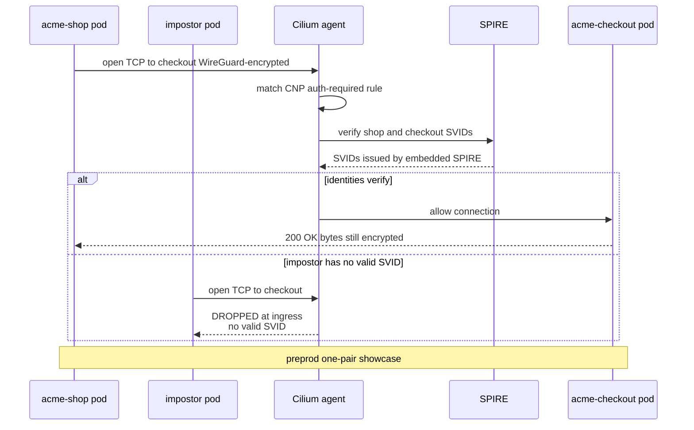

# Learn: Runtime Security — East-west zero-trust (deep dive)

Runtime security is the assume-breach layer — what protects a service once something is already past
the front door. It has three runtime moves; this page covers two of them, the *east-west* pair:
encryption and cryptographic identity. The [Runtime Security orientation](orientation.md) sets up the
full frame and metaphor. If you already know Cilium, the terse lookup is the [Reference](reference.md).

## East-west, and why the network floor isn't enough

*North-south* traffic crosses the cluster edge — a browser reaching your service through the Gateway,
TLS-terminated there. *East-west* is the
larger conversation happening inside the cluster: service to service, pod to pod, node to node —
`acme-shop` calling `acme-checkout`. It never touches the edge, so the edge's TLS does nothing for it.

The platform already has a strong east-west floor:
[Cilium](https://docs.cilium.io/en/stable/) L3/L4
[NetworkPolicy](https://kubernetes.io/docs/concepts/services-networking/network-policies/) +
CiliumNetworkPolicy, default-deny, identity-aware. But that identity is *network* identity:
who-may-talk-to-whom, decided by label, namespace, or IP. Two things it doesn't give you, and
zero-trust wants both:

- **(a) Encryption in transit.** Even inside the VPC, pod-to-pod bytes are plaintext on the wire; a
  tap on the underlay reads them.
- **(b) Cryptographic workload identity.** A policy admits a pod because it wears the right label. A
  rogue pod in another namespace that satisfies the same selector is admitted too. Nothing forces a
  service to *prove* who it is with an attestable credential.

The platform delivers both. The choice
that matters is *how*: Cilium-native, no sidecar mesh. The platform is already all-in on Cilium, and
Cilium covers L3/L4 + encryption + mTLS without an Istio/Linkerd control plane and a sidecar per pod.
The one thing that *would* justify a mesh — L7 east-west traffic management, like service-to-service
canary — isn't in scope here, so
the mesh's operational weight buys nothing. Two Cilium features do the whole job: transparent
encryption (Layer A) and mutual authentication (Layer B).

They **stack**; they don't replace each other. That's the point most people miss.

---

## Layer A — WireGuard transparent encryption (live, fleet-wide)

> *Sealed pneumatic tubes.* Every capsule between rooms is opaque; a tap on the pipe reads only
> ciphertext. **Where it breaks:** the tube doesn't check *who* sent the capsule — it makes the
> channel private, it doesn't authenticate the sender. That's exactly why Layer B has to exist.

Cilium transparent encryption with the WireGuard backend encrypts all pod-to-pod traffic between
nodes, with no application change. That's the whole pitch: the app opens a plain TCP socket and Cilium
turns the bytes to ciphertext underneath it.

What makes it cheap here is in-kernel [WireGuard](https://www.wireguard.com/). The nodes run Amazon
Linux 2023 on a 6.x kernel (6.12), which ships WireGuard in-tree — no userspace daemon, no key
management to run. Cilium creates a `cilium_wg0` device per node and stacks the WireGuard layer under
the existing VXLAN overlay tunnel, auto-adjusting the MTU for the added header overhead. That's why
it's clean on the platform's tunnel/cluster-pool datapath and sidesteps the WireGuard caveats that
bite in native-ENI mode.

Phase 1 scope is pod-to-pod only. `node_encryption` (host-to-host — which also covers host and
health-check traffic) stays off; it's a more invasive later step. And encryption is a fleet default,
not tier-gated: encryption-in-transit is a blanket good, so it runs cluster-wide rather than switching
per compliance tier.

### The module knobs

In [`infra/modules/cilium`](https://github.com/asanexample/platform/blob/main/infra/modules/cilium/variables.tf)
three variables gate it, all default-off:

| Variable | Default | Meaning |
| --- | --- | --- |
| `encryption_enabled` | `false` | Turn transparent encryption on |
| `encryption_type` | `"wireguard"` | Backend — `wireguard` or `ipsec` (validated to those two) |
| `node_encryption` | `false` | Also encrypt host-to-host (Phase 1: off) |

`main.tf` renders the Helm `encryption` block **only when enabled** — otherwise the key is absent and
the chart default (off) stands:

```hcl
var.encryption_enabled ? { encryption = { enabled = true, type = var.encryption_type, nodeEncryption = var.node_encryption } } : {},
```

Both live units set it on —
[`preprod/.../cilium/terragrunt.hcl`](https://github.com/asanexample/platform/blob/main/infra/live/aws/preprod/us-east-1/platform/cilium/terragrunt.hcl)
and
[`platform/.../cilium/terragrunt.hcl`](https://github.com/asanexample/platform/blob/main/infra/live/aws/platform/us-east-1/platform/cilium/terragrunt.hcl)
both carry `encryption_enabled = true`.

### Verify it's actually live

Every node advertises a WireGuard public key and the config flag is set. On the platform cluster,
all three nodes carry the key:

```console
$ AWS_PROFILE=platform kubectl --context platform get ciliumnodes \
    -o jsonpath='{range .items[*]}{.metadata.name}  wg={.metadata.annotations.network\.cilium\.io/wg-pub-key}{"\n"}{end}'
ip-10-100-2-20…  wg=<base64 public key>
ip-10-100-2-28…  wg=<base64 public key>
ip-10-100-2-38…  wg=<base64 public key>

$ AWS_PROFILE=platform kubectl --context platform -n kube-system get cm cilium-config \
    -o yaml | grep enable-wireguard
  enable-wireguard: "true"
```

(WireGuard *public* keys are safe to show — the private key never leaves the node's kernel.) The
authoritative in-agent check is `cilium-dbg status` → `Encryption: Wireguard [cilium_wg0 …
Peers: N]`, plus `spec.encryption.key` on each `CiliumNode`.

### The gotcha: enabling ≠ activating

**Turning encryption on does not activate it on running agents.** The Helm change sets
`enable-wireguard: "true"` in the `cilium-config` ConfigMap — but Cilium reads that value only at
agent startup, and a ConfigMap change does *not* roll the DaemonSet. Symptom: only the nodes whose
agent happened to (re)start after the change bring `cilium_wg0` up; every pre-existing agent logs

```text
Mismatch: enable-wireguard actual=false expectedValue=true
```

and keeps sending plaintext. Required after the apply:

```text
kubectl rollout restart ds/cilium -n kube-system
```

Then every agent re-reads the config and establishes the mesh. (Auto-triggering this roll on an
encryption-config change is a noted module follow-up — for now it's a manual step in the runbook.)

---

## Layer B — mTLS mutual auth with embedded SPIRE (live showcase, preprod only)

> *Showing your ID badge to enter each room.* Even inside the sealed-tube building, the receiving
> room checks a **cryptographically-attested badge** before it admits you. A stranger who tailgated
> in — even wearing the right-colored shirt (the right *label*) — is turned away at the door.
> **Where it breaks vs Layer A:** the badge proves *who*; it does nothing about *privacy on the
> wire*. That's still Layer A's job — the two run together.

Layer A made the wire private but says nothing about who is actually talking. Layer B is Cilium mutual
authentication backed by an embedded [SPIRE](https://spiffe.io/) — the
[SPIFFE](https://spiffe.io/docs/latest/spiffe-about/overview/) identity system that issues each
workload a signed, verifiable identity document (an **SVID**).

The moving parts:

1. `authentication.enabled: true` (top-level in the Helm values) turns on the mesh-auth machinery
   cluster-wide.
2. The embedded SPIRE server + agents run in the `cilium-spire` namespace. The agents attest each
   workload via Kubernetes PSAT (Projected Service Account Tokens) and the server issues it an SVID —
   a portable cryptographic identity, not a label.
3. A workload opts into enforcement per-path with a `CiliumNetworkPolicy` carrying
   `authentication.mode: required`. For a connection matched by that rule, Cilium runs a SPIRE-backed
   identity handshake before allowing it, and caches the result in a BPF auth-cache — visible as
   `cilium-dbg bpf auth list` → `AUTH TYPE: spire` for the authenticated identity pair.

Here is the full handshake on the showcase `acme-shop → acme-checkout` path — and what happens to an
impostor that wears the right label but holds no valid SVID:



The data-plane bytes are still WireGuard-encrypted — that's Layer A. mTLS adds the *identity
handshake*; it does not carry the payload or replace the encryption. Two layers, stacked.

### The module knobs

Same `cilium` module, four more gated variables (all default-off):

| Variable | Meaning |
| --- | --- |
| `mutual_auth_enabled` | Sets `authentication.enabled` **and** `authentication.mutual.spire.enabled` |
| `spire_install` | Install Cilium's **embedded** SPIRE (`cilium-spire` ns) vs point at an external one |
| `spire_persistence` | Back the SPIRE server datastore with a PVC (vs in-memory) |
| `spire_storage_class` | StorageClass for that PVC (`null` = cluster default = encrypted gp3 here) |

`main.tf` renders the `authentication.mutual.spire` block from these; when `mutual_auth_enabled` is
false the whole block is inert (matching chart defaults). The deliberate scope shows up in the units:
preprod sets `mutual_auth_enabled = true`; platform has no such input at all (WireGuard only) — the
preprod-only showcase boundary, by design.

### Verify the split is real

Preprod runs the identity plane; platform deliberately does not:

```console
$ AWS_PROFILE=preprod kubectl --context preprod get pods -n cilium-spire
NAME                READY   STATUS    RESTARTS   AGE
spire-agent-5nvs8   1/1     Running   0          3h48m
spire-agent-7c5p7   1/1     Running   0          3h48m
spire-server-0      2/2     Running   0          3h45m

$ AWS_PROFILE=preprod kubectl --context preprod -n kube-system get cm cilium-config \
    -o yaml | grep -E 'mesh-auth-enabled|mesh-auth-mutual-enabled|spiffe-trust-domain'
  mesh-auth-enabled: "true"
  mesh-auth-mutual-enabled: "true"
  mesh-auth-spiffe-trust-domain: spiffe.cilium

$ AWS_PROFILE=platform kubectl --context platform get ns cilium-spire
Error from server (NotFound): namespaces "cilium-spire" not found
```

Platform's `cilium-config` reads `mesh-auth-enabled: "false"` — exactly the intended posture.

### What it secures (the proof)

The showcase demo is the
payoff: the real `acme-shop → acme-checkout` east-west call succeeds and is
SPIRE-mutually-authenticated (`cilium-dbg bpf auth list` shows `AUTH TYPE: spire` for the
shop↔checkout identity pair), while a cross-team impostor pod in another namespace is dropped at
checkout's ingress — even though, label-wise, a plain NetworkPolicy might have let it through. That is
the zero-trust promise made concrete: label ≠ identity.

One subtlety: the `authentication.mode: required` `CiliumNetworkPolicy` lives in the `acme-shop`
application repo (external `asanexample/*`), *not* in this platform repo — so you won't find it under
`gitops/`. Tenants author their own east-west + auth posture, which is why the delivery AppProject
permits tenant `(Cilium)NetworkPolicy`.

**Embedded SPIRE, not standalone.** Cilium's embedded SPIRE attests via k8s PSAT
and issues SVIDs cleanly on the overlay + WireGuard stack; a standalone SPIRE deployment is
unnecessary overhead here. Revisit it *only* if identities are ever needed beyond Cilium — app-level
mTLS a service terminates itself, or cross-cluster SPIFFE federation.

---

## The runtime-security ledger — where these two layers sit

Defense-in-depth, in the order a packet/pod meets it. Each row answers a *different* question; that's
why you need all of them, not one:

| Layer | Question it answers | Mechanism | Status |
| --- | --- | --- | --- |
| Admission | Is this config allowed to run? | Kyverno ClusterPolicies | Live, Enforce (both) |
| Network identity | May A talk to B at all? | CiliumNetworkPolicy, default-deny | Live (both) |
| **Encryption in transit** | Is the wire private? | **WireGuard transparent encryption** | **Live, fleet-wide (both)** |
| **Cryptographic identity** | Is A *really* A? | **Cilium mTLS + embedded SPIRE** | **Live showcase (preprod, one pair)** |
| Behavioral detection | Is a running pod misbehaving? | Falco (eBPF syscall monitoring) | Live detecting, routing deferred |

The bottom row — Falco — is a different subject: it watches *behavior*, not the network. This deep
dive doesn't re-teach it. See the [Falco deep dive](deep-dive-falco.md).

Two more runtime-hardening facts, both owned by the [Policy](../policy/orientation.md) module rather
than this one: Kyverno auto-injects `securityContext` defaults on every pod
(`allowPrivilegeEscalation: false`, `capabilities.drop: [ALL]`, `seccompProfile: RuntimeDefault`,
`automountServiceAccountToken: false`) — live in Enforce; and regulated-tier pod hardening
(`runAsNonRoot`, `readOnlyRootFilesystem` for hipaa/pci) is live for the tier but unexercised, because
no regulated tenant exists yet.

## Gotchas

1. **`authentication.enabled: true` is mandatory — off *denies*, it doesn't bypass.** With mesh-auth
   off, an `authentication.mode: required` policy causes the chart to **drop** the traffic rather
   than wave it through. You can't half-enable this.
2. **Both layers are startup-read.** WireGuard *and* mesh-auth config are read only when a Cilium
   agent boots — enabling either needs a `kubectl rollout restart ds/cilium` to take effect on the
   running fleet (see the Layer A gotcha).
3. **Cross-namespace calls need BOTH netpol halves.** Environment namespaces default-deny egress as
   well as ingress, and a k8s `ipBlock` allow does not cover in-cluster identities. The
   `authentication.mode: required` requirement replaces the *ingress* half specifically — you can't
   substitute a plain allow, because Cilium **unions** allows and a plain allow would *bypass* the
   auth requirement.
4. **Tenants author their own auth posture.** The auth-required policy lives in the app repo, so the
   delivery AppProject must permit tenant `(Cilium)NetworkPolicy` — otherwise ArgoCD
   refuses to sync it.
5. **SPIRE persistence collides with the EBS-encryption SCP.** The SPIRE server datastore is a PVC.
   Where an SCP enforces EBS encryption, the StorageClass **must** be an encrypted one — resolved by
   making preprod's **encrypted-gp3 the default StorageClass**,
   which is why `spire_persistence` / `spire_storage_class` exist. Setting `spire_persistence = false`
   gives an in-memory datastore — fine for a throwaway spike, wrong for a showcase (registrations
   vanish on restart).

## Honest status — built vs designed

- **WireGuard encryption: genuinely done.** Live fleet-wide on both clusters — the real
  deployed posture.
- **mTLS identity: a live preprod showcase.** SPIRE is running, the
  `acme-shop → acme-checkout` pair is mutually authenticated, and the impostor is dropped — proven
  live. But it is one service pair on preprod only, *not* the platform cluster, *not* fleet-wide.
- **Fleet-wide / tier-gated enforcement: designed, not built.** Wiring `authentication.mode: required`
  into the Crossplane Environment Composition per compliance tier (the Composition already has `$tier`
  in scope; `regulated` is the trigger) is the follow-up — deliberately parked
  until a regulated tenant actually exists, and none does today.

## Go deeper

- The code: the [`cilium` module](https://github.com/asanexample/platform/blob/main/infra/modules/cilium/main.tf)
  (`variables.tf` for every knob) and the live units
  ([preprod](https://github.com/asanexample/platform/blob/main/infra/live/aws/preprod/us-east-1/platform/cilium/terragrunt.hcl),
  [platform](https://github.com/asanexample/platform/blob/main/infra/live/aws/platform/us-east-1/platform/cilium/terragrunt.hcl)).
- Substrate docs (verified current): [Cilium transparent encryption](https://docs.cilium.io/en/stable/security/network/encryption/)
  · [Cilium mutual authentication](https://docs.cilium.io/en/stable/network/servicemesh/mutual-authentication/mutual-authentication/)
  · [SPIFFE / SPIRE overview](https://spiffe.io/docs/latest/spiffe-about/overview/).
- Sideways in this module: [Runtime Security orientation](orientation.md) ·
  [Foundations → the cluster (Cilium)](../foundations/deep-dive-the-cluster.md) ·
  [Policy & admission](../policy/orientation.md).
