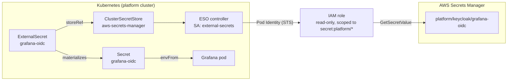

# Learn: Secrets & Config — runtime secrets (deep dive)

A running workload needs credentials it can't mint itself: an OIDC client secret, a database password, a
third-party API token. This page answers one question — how does a pod get one without ever holding a
long-lived key? The mechanism is AWS Secrets Manager plus the
[External Secrets Operator](https://external-secrets.io/latest/) (ESO), and it sits on one of two planes:
static config sealed in git, and rotating runtime secrets vaulted and synced. Everything here is the
second plane. If you already know ESO, the terse version is in the [Reference](reference.md).

## The security decision hiding in a Kubernetes Secret

A Kubernetes [`Secret`](https://kubernetes.io/docs/concepts/configuration/secret/) is not encrypted —
it's base64-encoded plaintext sitting in etcd. The object itself buys you almost nothing. The whole
security question is where the value came from and who could see it on the way in. That's what
[ADR-019](../../adrs/019-external-secrets-operator.md) exists to answer, and the homes it rejected are
worth seeing, because each fails in an instructive way:

- **Secrets in Terraform state** (a `kubernetes_secret` resource). Works, but it couples secret rotation
  to an infra apply — to change a password you run a plan — and every value lands in state, visible to
  anyone with state-read access whether or not they need that secret. Wrong blast radius.
- **Sealed Secrets** (encrypt client-side, commit the ciphertext, decrypt in-cluster). GitOps-friendly,
  but the encryption key is per-cluster: recreate the cluster and every secret must be re-encrypted, and
  there's no bridge to a cloud store, so you maintain values in two places.
- **HashiCorp Vault** — the gold standard, and exactly the problem. Vault is its own Tier-0 HA system
  with unseal procedures and operational weight. This platform just learned that cost with Keycloak and
  had no appetite for a second such system at this scale.

The decision: AWS
[Secrets Manager](https://docs.aws.amazon.com/secretsmanager/latest/userguide/intro.html) is the source
of truth, and ESO syncs a named secret out of it into an ordinary Kubernetes Secret that any pod mounts
unmodified. This is the opposite plane from
[ADR-066](../../adrs/066-sops-encrypted-config-secrets.md)'s SOPS-in-git: that plane holds static
bootstrap identifiers the IaC reads at plan-time; this one holds rotating runtime credentials a live pod
consumes. Never cross them.

The metaphor that holds throughout is a bank safe-deposit box and a courier. The credential lives once in
the access-controlled, audited box (Secrets Manager). ESO is the courier who fetches a copy on a schedule
and leaves it exactly where the pod expects it, so the pod never needs the vault key. Where it breaks: a
real courier carries a key to the box on their belt — the whole point below is that this courier carries
no key of its own.

## The two custom resources — and the IAM that makes the courier keyless



### (a) `ClusterSecretStore` — the connection to the vault

The [`secret-stores`](https://github.com/asanexample/platform/blob/main/infra/modules/secret-stores/main.tf)
module declares two stores, and both are live right now:

```text
$ kubectl --context platform get clustersecretstore
NAME                      AGE   STATUS   CAPABILITIES   READY
aws-secrets-manager       23d   Valid    ReadWrite      True
aws-secrets-manager-ssm   23d   Valid    ReadWrite      True
```

`aws-secrets-manager` targets Secrets Manager; `aws-secrets-manager-ssm` targets SSM Parameter Store
(cheaper, for lower-sensitivity values). The detail that matters is what the manifest doesn't contain:
there is no `auth` block. In the classic ESO tutorial the store carries an `auth.jwt.serviceAccountRef`
pointing at credentials. Here that stanza is gone — the store authenticates as ESO's own controller pod
identity (the `external-secrets` ServiceAccount bound to an IAM role via
[EKS Pod Identity](https://docs.aws.amazon.com/eks/latest/userguide/pod-identities.html),
[ADR-047](../../adrs/047-pod-identity-as-aws-identity-standard.md)). The bridge that hands out secrets
holds no secret of its own — the keyless-first posture applied to the secrets machinery itself.

It's a `ClusterSecretStore` (cluster-scoped — it can write a Secret into any namespace), not a namespaced
`SecretStore`. That's what lets a single store serve Grafana, ArgoCD, Backstage, and the rest from one
place.

### (b) `ExternalSecret` — one per workload

An [`ExternalSecret`](https://external-secrets.io/latest/api/externalsecret/) is the courier's delivery
slip: sync this remote key into a k8s Secret in my namespace, refreshed hourly. The fields that matter:

- `spec.secretStoreRef` — `{ name: aws-secrets-manager, kind: ClusterSecretStore }`, which store to read.
- `spec.refreshInterval` — `1h` everywhere on the platform today.
- `spec.target` — `{ name: <secret>, creationPolicy: Owner }`. `Owner` means ESO owns that Secret: it
  creates it, keeps it in sync, and garbage-collects it when the `ExternalSecret` is deleted.
- `spec.data[]` — a list of `{ secretKey ← remoteRef.key + property }` mappings (pull one JSON property
  into one Secret key), or `spec.dataFrom` to pull a whole blob.

ESO reads the remote as its Pod-Identity role, materializes the k8s Secret, and the pod consumes it via
`envFrom` or a volume mount like any other Secret.

### (c) The IAM — read-only, prefix-scoped, no static keys

The [`external-secrets`](https://github.com/asanexample/platform/blob/main/infra/modules/external-secrets/main.tf)
module wires the identity:

- A role trusted by `pods.eks.amazonaws.com` for `sts:AssumeRole` + `sts:TagSession` — the Pod Identity
  trust shape, no OIDC provider, no IRSA annotation on the ServiceAccount.
- A read-only policy: `secretsmanager:GetSecretValue`, `DescribeSecret`, `ListSecretVersionIds` scoped to
  `arn:aws:secretsmanager:*:<platform-acct>:secret:<prefix>/*`, plus the SSM
  `GetParameter`/`GetParameters`/`GetParametersByPath` equivalents. No write, no delete — a compromised
  ESO can read within its scope, never mutate the store.
- An `aws_eks_pod_identity_association` binding that role to the `external-secrets` ServiceAccount.

The Helm chart is pinned to 0.14.3. The only thing standing between the cluster and Secrets Manager is a
short-lived, per-pod STS credential with read-only reach into one path prefix. It comes from EKS Pod
Identity, minted per-pod from the ServiceAccount and auto-rotated — no static key to leak, so the secrets
bridge itself needs no secret.

## Worked example, traced end to end — Grafana's OIDC client secret

Follow one real credential across three systems. Grafana logs users in through Keycloak, so it needs its
OIDC client secret at runtime.

**The writer.** The `keycloak-config` unit creates the Grafana OIDC client in Keycloak and writes its
client secret to Secrets Manager at `platform/keycloak/grafana-oidc`. Terraform owns both sides of this
value — the archetype of a cleanly-rotatable secret.

**The delivery slip.** The
[`observability`](https://github.com/asanexample/platform/blob/main/infra/modules/observability/main.tf)
module declares the `ExternalSecret`:

```hcl
spec = {
  refreshInterval = "1h"
  secretStoreRef  = { name = var.secret_store_name, kind = "ClusterSecretStore" }
  target          = { name = local.grafana_oidc_secret, creationPolicy = "Owner" }
  data = [{
    secretKey = "client-secret"
    remoteRef = { key = var.grafana_oidc_secret_manager_key, property = "client-secret" }
  }]
}
```

It pulls the `client-secret` property of `platform/keycloak/grafana-oidc` into a Secret named
`grafana-oidc`, which the Helm values inject into the pod as `GF_AUTH_GENERIC_OAUTH_CLIENT_SECRET`.

**The running truth.** It's synced right now:

```text
$ kubectl --context platform -n observability get externalsecret grafana-oidc
NAME           STORE                 REFRESH INTERVAL   STATUS         READY
grafana-oidc   aws-secrets-manager   1h                 SecretSynced   True
```

Rotate the value in Secrets Manager and, within the refresh interval, the courier re-delivers — no
redeploy of Grafana's chart.

A self-generated variant lives in the
[`keycloak`](https://github.com/asanexample/platform/blob/main/infra/modules/keycloak/main.tf) module: it
generates a `random_password` (32 chars, alphanumeric), stores it as the source of truth at
`platform/keycloak/admin` as a `{username, password}` JSON blob, and its `keycloak-admin` `ExternalSecret`
maps both keys out — a two-key delivery slip. Same courier, but here Terraform mints the secret rather
than a third party.

## Naming and scoping — two layers of blast-radius control

Names are `<domain-prefix>/<subsystem>/<name>`; every platform secret sits under the `platform/` prefix
(`platform/keycloak/grafana-oidc`, `platform/keycloak/admin`). Live, 16 ExternalSecrets sync across 8
namespaces, all `SecretSynced`:

```text
$ kubectl --context platform get externalsecret -A
NAMESPACE                       NAME                              STATUS         READY
activation-system               activation-audit-db               SecretSynced   True
arc-runners                     arc-github-app                    SecretSynced   True
argo-rollouts                   rollouts-oauth2-proxy             SecretSynced   True
argocd                          argocd-keycloak-oidc              SecretSynced   True
argocd                          github-asanexample-app-creds      SecretSynced   True
backstage                       backstage-argocd-token            SecretSynced   True
backstage                       backstage-audit-db                SecretSynced   True
backstage                       backstage-github-app              SecretSynced   True
backstage                       backstage-oidc                    SecretSynced   True
backstage                       backstage-scaffolder-github-app   SecretSynced   True
keycloak                        keycloak-admin                    SecretSynced   True
observability                   alertmanager-healthchecks         SecretSynced   True
observability                   alertmanager-pagerduty            SecretSynced   True
observability                   alertmanager-slack-webhook        SecretSynced   True
observability                   grafana-oidc                      SecretSynced   True
platform-agent-triage-copilot   triage-copilot-slack              SecretSynced   True
```

Access is bounded in two layers:

1. **IAM prefix scope.** The module's `secret_path_prefix` variable defaults to `*` — wide open — and the
   [live platform unit](https://github.com/asanexample/platform/blob/main/infra/live/aws/platform/us-east-1/platform/external-secrets/terragrunt.hcl)
   narrows it to `platform` (and `/platform` for SSM). So ESO on the hub can read only `platform/*`. The
   module ships permissive and the unit tightens it — always read the unit, not just the module default.
2. **Per-tenant path + a Kyverno backstop.** The designed tenant layout paths secrets at
   `…/tenants/<team>/<product>/<stage>`, and a Kyverno policy would deny a team's `ExternalSecret` from
   targeting another team's path ([ADR-070](../../adrs/070-tenant-app-config-and-secrets.md)). This layer
   is designed, not built — see the caveat below.

## Keyless-first — ESO is the fallback, not the default

Most credentials don't exist, because they were eliminated rather than stored. ESO is only for the
irreducible remainder — a third-party token you didn't mint. The hierarchy:

| Need | Mechanism | Holds a stored secret? |
| --- | --- | --- |
| Pod → AWS | EKS Pod Identity | **No** — short-lived per-pod STS |
| CI → AWS | GitHub OIDC federation | **No** — exchanged per-run |
| Image signing | keyless cosign | **No** — ephemeral OIDC-bound key |
| Irreducible 3rd-party token | **Secrets Manager + ESO** | **Yes** — Slack, PagerDuty, GitHub App key, DB creds |

ESO itself proves the principle: it reads Secrets Manager via Pod Identity, so the secrets bridge has no
secret. Every row that reaches "No" is a credential you never store, leak, or rotate.

## Show it break — and why it self-heals gently

Two failure modes worth internalizing:

- **ESO is down.** Secrets already materialized keep working — they're plain Kubernetes Secrets, entirely
  independent of the controller once written. Only new syncs and rotations pause. The failure is soft: a
  Grafana pod already holding `grafana-oidc` keeps authenticating; you just won't pick up a rotated value
  until ESO recovers.
- **The webhook is unreachable.** ESO's validating webhook runs on `hostNetwork` (the EKS control plane
  can't route Cilium overlay pod IPs) and is set to `failurePolicy: Ignore` on purpose. A default `Fail`
  webhook would block deletion of every `ExternalSecret` when its backend is unavailable — stranding
  units on teardown with "no endpoints available." Fail-open here is a deliberate lifecycle-safety choice,
  not laziness.

## The tenant paved road — designed, not built (be honest)

Today a tenant app that needs a `DATABASE_URL` or an API key has no platform-provided way to get one.
Grep proves it: `ExternalSecret` appears zero times under `gitops/`, and the Crossplane Environment
Composition mints none. Tenants get no runtime secrets today; the platform's own services use ESO heavily.

The designed model ([ADR-070](../../adrs/070-tenant-app-config-and-secrets.md), Status: Proposed) is the
Vercel/Heroku shape — push code, set env vars, it runs:

- **Config vs secrets split.** Non-secret config → git, on the claim's `services.<svc>.config`, rendered
  to a ConfigMap. Secrets → the store; the claim holds only key names, and the Composition mints a
  per-environment `ExternalSecret`. The pod consumes both via `envFrom`.
- **One writer.** Backstage is the sole broker (its own Pod-Identity role scoped to tenant paths);
  `platctl secret set` calls the same Backstage API — one authz path, one audit trail. One secret per
  `(team, product, stage)` as a JSON blob, which avoids per-key cost cardinality.
- **Prod is gated.** Prod writes and reveals need `team-admin`/`release-approver`; reveal is per-key and
  audited, with no bulk export.

What actually landed is only the XRD schema reservation. The
[XenvironmentXRD](https://github.com/asanexample/platform/blob/main/infra/modules/crossplane/charts/environment-api/templates/xenvironment-xrd.yaml)
reserves `services.<svc>.config` (an object) and `services.<svc>.secrets` (an array of key names) — both
carrying the description "Inert until the secrets paved-road ships." The shape is complete; the
write-through API, ESO wiring, gating, and portal UI are a deferred phase.

## Gotchas

- **ADR-019 says IRSA; the code says Pod Identity.** [ADR-019](../../adrs/019-external-secrets-operator.md)
  (dated 2026-05) still describes auth as IRSA (ADR-018). The code has since moved to EKS Pod Identity
  ([ADR-047](../../adrs/047-pod-identity-as-aws-identity-standard.md), which supersedes ADR-018's
  rejection of Pod Identity). The ADR text is stale on that one point; the module and its README are
  correct. A reminder that ADRs are leads, not proof — verify against the code.
- **The module default is wide open (`*`).** `secret_path_prefix` defaults to `*` in the module; only the
  live unit narrows it to `platform`. Reuse the module elsewhere without setting it and you've granted
  read on every secret in the account. Always scope at the unit.
- **`creationPolicy: Owner` means ESO owns the Secret.** Delete the `ExternalSecret` and the target Secret
  is garbage-collected with it. Don't hand-edit an ESO-owned Secret — it'll be reconciled back.
- **A rotated secret doesn't reach a running pod by itself.** ESO re-syncs the Kubernetes Secret, but a
  pod that read the value into an env var at start still holds the old one until it restarts. (Rotation
  and the Reloader answer are the [rotation deep dive](deep-dive-rotation.md)'s territory.)
- **`SecretSyncedError`?** Usually the `remoteRef.key` doesn't exist in Secrets Manager, or it's outside
  the IAM prefix scope — check the path is under `platform/*`.

## Go deeper

- **ADRs (source of truth):** [ADR-019 External Secrets Operator](../../adrs/019-external-secrets-operator.md)
  · [ADR-070 Tenant app config & secrets](../../adrs/070-tenant-app-config-and-secrets.md) (Proposed) ·
  [ADR-047 Pod Identity as the AWS identity standard](../../adrs/047-pod-identity-as-aws-identity-standard.md).
- **The code:** [`secret-stores`](https://github.com/asanexample/platform/blob/main/infra/modules/secret-stores/main.tf)
  (the two stores) · [`external-secrets`](https://github.com/asanexample/platform/blob/main/infra/modules/external-secrets/main.tf)
  (IAM + Pod Identity + Helm) · the [external-secrets live unit](https://github.com/asanexample/platform/blob/main/infra/live/aws/platform/us-east-1/platform/external-secrets/terragrunt.hcl)
  (where the prefix is scoped).
- **External (verified):** [ESO docs](https://external-secrets.io/latest/) — the operator, maintainer
  docs, ~15 min to orient; the [`ExternalSecret`](https://external-secrets.io/latest/api/externalsecret/)
  and [`ClusterSecretStore`](https://external-secrets.io/latest/api/clustersecretstore/) API references —
  the exact field spec, keep open while authoring, ~5 min each.
  [AWS Secrets Manager overview](https://docs.aws.amazon.com/secretsmanager/latest/userguide/intro.html)
  and [EKS Pod Identity](https://docs.aws.amazon.com/eks/latest/userguide/pod-identities.html) — the two
  AWS halves, official, ~10 min each.
- **Related learning:** back to the [Secrets & Config orientation](orientation.md); the sibling
  [Config in git (SOPS)](deep-dive-config-in-git.md) and [Rotation & lifecycle](deep-dive-rotation.md)
  deep dives; [Identity & access](../identity/orientation.md) (why most secrets get eliminated).
