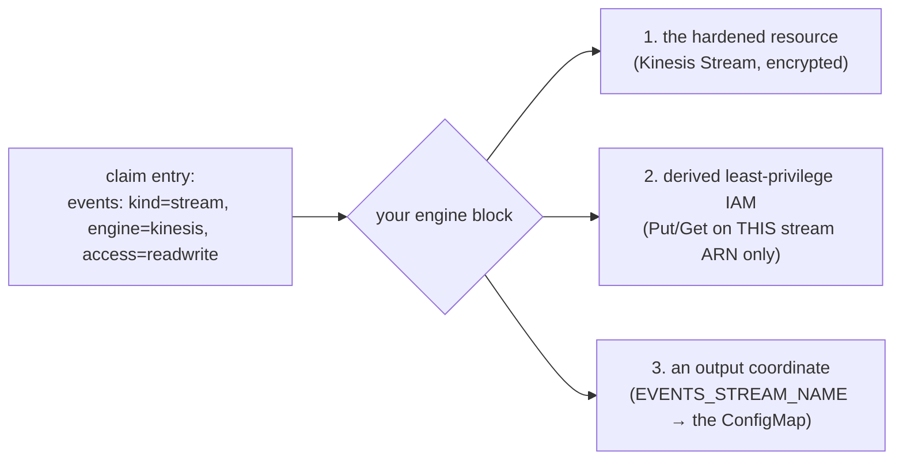

# How-to: add a new resource engine (a playbook)

**A platform-engineer playbook.** By the end you'll have added a brand-new engine to the self-service catalog
— so any team can declare it like they declare an S3 bucket. We'll add **Amazon Kinesis** (a data-streaming
service) as the running worked example, from nothing to a developer typing `engine: kinesis` and getting a
hardened, least-privilege stream.

This is written to be followable **even if you've never used Crossplane or written a Composition** — every
new concept is linked to where you can learn it, and every step names the exact file and shows real code.
Read the [orientation](orientation.md) first for the *why*; this is the *how*.

> **Working with an AI agent?** Most of this is mechanical pattern-matching against existing engines — a
> great fit for a coding agent. Skip to [Doing this with an AI agent](#doing-this-with-an-ai-agent) for a
> ready-to-use prompt and the guardrails to give it, then come back to the steps to review its work. The
> whole document is written to double as agent context.

## New to this stack? A 3-minute orientation

You'll touch five technologies. Here's what each *is* and where to go deep — skim now, click when a step
needs it:

- **Crossplane** — the engine that turns a Kubernetes object into real cloud infrastructure. You declare
  what you want; a controller makes it real and keeps it that way (like Terraform, but continuously
  reconciled). → [Crossplane: get started with composition](https://docs.crossplane.io/latest/get-started/get-started-with-composition/).
- **Managed Resource (MR)** — a Kubernetes object that maps 1:1 to one cloud resource (an S3 `Bucket`, a
  Kinesis `Stream`). Creating the MR creates the AWS thing. →
  [Managed resources](https://docs.crossplane.io/latest/managed-resources/).
- **Composition** — a template that, from one high-level claim, stamps out *many* MRs. Ours lives in
  `composition.yaml` and is where you'll add your engine. →
  [Compositions](https://docs.crossplane.io/latest/composition/compositions/).
- **`function-go-templating`** — the Composition is rendered by this
  [Crossplane composition function](https://docs.crossplane.io/latest/composition/composition-functions/),
  which is **Go templating with [Sprig](https://masterminds.github.io/sprig/) helpers — basically Helm
  chart syntax**. If you've written a Helm chart, you already know it. →
  [function-go-templating](https://github.com/crossplane-contrib/function-go-templating).
- **The Upbound AWS provider** — the library of MRs. Each AWS service is a separate provider package with a
  documented schema (the exact fields each MR takes). For Kinesis that's
  [`provider-aws-kinesis`](https://marketplace.upbound.io/providers/upbound/provider-aws-kinesis/v2.0.2) —
  **the Marketplace page is your CRD reference; keep it open the whole time.**

You do **not** need to understand all of it deeply. The trick to adding an engine is *pattern-matching*: an
existing engine (SQS) already does everything yours needs to do, so you'll mostly copy its block and change
the nouns.

## The mental model: an engine is a slot that produces three things

Every engine, given one `resources.<name>` entry in a claim, must produce exactly three outputs. Hold these
three and the rest is plumbing:



Everything else — the governance, the provider install, the catalog — is wiring you do *once* so those three
outputs flow to the right places. Now the steps.

---

## Step 0 — do your homework (15 minutes that save hours)

Before touching a file, gather three facts about your engine. For Kinesis:

1. **The provider package + MR kind.** Search the [Upbound Marketplace](https://marketplace.upbound.io/providers/upbound/provider-family-aws/latest).
   Kinesis → [`provider-aws-kinesis`](https://marketplace.upbound.io/providers/upbound/provider-aws-kinesis/v2.0.2),
   and the MR we want is `Stream`. **Open its CRD page and note the exact `spec.forProvider` fields** — this
   is the single most important step (see gotcha #1). For an on-demand encrypted stream you'll want
   `streamModeDetails.streamMode: ON_DEMAND`, `encryptionType: KMS`, `kmsKeyId`.
2. **The IAM actions,** split into read vs write.
   [Kinesis's IAM reference](https://docs.aws.amazon.com/streams/latest/dev/controlling-access.html) gives:
   read = `GetRecords`, `GetShardIterator`, `DescribeStream`, `DescribeStreamSummary`, `ListShards`; write
   adds `PutRecord`, `PutRecords`. The ARN shape is `arn:aws:kinesis:<region>:<acct>:stream/<name>`.
3. **The kind + name for the claim.** Kinesis is a `stream` (already in the XRD `kind` enum), so the
   developer-facing declaration will be `{ kind: stream, engine: kinesis, access: readwrite }`.

Write these down — every step below just plugs them in.

---

## Step 1 — render the resource, its IAM, and its output (the core)

**File:** `infra/modules/crossplane/charts/environment-api/files/composition.yaml`

This is 90% of the work, and you don't start from a blank page — **copy the SQS block** (`{{- if eq
$rescfg.engine "sqs" }}`, around line 650) and adapt it. Here's the shape you're aiming for, patterned on the
real SQS/S3 blocks (Go-template + Sprig, i.e. Helm syntax):

```yaml
{{- if eq ($rescfg.engine | default "") "kinesis" }}
{{- /* 1. deterministic, collision-safe name — same helper the other engines use */}}
{{- $stream := printf "%s-%s" $friendly $hash }}
{{- $arn := printf "arn:aws:kinesis:%s:%s:stream/%s" $cfg.region $cfg.workloadAccountId $stream }}
---
# --- the hardened Managed Resource ---
apiVersion: kinesis.aws.m.upbound.io/v1beta2      # ← VERIFY this group/version on the Marketplace CRD page
kind: Stream
metadata:
  annotations:
    crossplane.io/external-name: {{ $stream }}     # ← PIN the name (gotcha #3)
    gotemplating.fn.crossplane.io/composition-resource-name: {{ printf "%s-kinesis" $resName }}
  labels: { platform.refplat.org/team: {{ $team }}, platform.refplat.org/product: {{ $product }} }
spec:
  # orphan-equivalent: omit "Delete" so removing the claim never deletes data (gotcha #4)
  managementPolicies: ["Observe", "Create", "Update", "LateInitialize"]
  forProvider:
    region: {{ $cfg.region }}
    streamModeDetails: { streamMode: ON_DEMAND }
    encryptionType: KMS                            # encrypted by default — non-negotiable safety floor
    kmsKeyId: alias/aws/kinesis
{{- /* 2. DERIVED least-privilege IAM — scoped to THIS stream's ARN only */}}
{{- $act := list "kinesis:GetRecords" "kinesis:GetShardIterator" "kinesis:DescribeStream" "kinesis:DescribeStreamSummary" "kinesis:ListShards" }}
{{- if eq ($rescfg.access | default "read") "readwrite" }}
{{-   $act = concat $act (list "kinesis:PutRecord" "kinesis:PutRecords") }}
{{- end }}
{{- $stmts = append $stmts (dict "Effect" "Allow" "Action" $act "Resource" (list $arn)) }}
{{- /* 3. the output coordinate for the <svc>-resources ConfigMap */}}
{{- $_ := set $outputs (printf "%s_STREAM_NAME" (upper $resName)) $stream }}
{{- end }}
```

The three outputs map straight to the three-things model: the `Stream` MR, the `$stmts` IAM append (goes into
the service's Pod-Identity `RolePolicy` further down the file), and the `$outputs` entry (becomes an env var
in the ConfigMap). **Match the variable names to what the surrounding code actually uses** — open the SQS
block and mirror it exactly rather than trusting the names above.

**Learn more if a piece is unfamiliar:** the templating (`printf`, `dict`, `append`, `set`) is all
[Sprig](https://masterminds.github.io/sprig/); the MR fields are the
[Kinesis `Stream` CRD](https://marketplace.upbound.io/providers/upbound/provider-aws-kinesis/v2.0.2); the IAM
shape is a standard [resource-scoped IAM statement](https://docs.aws.amazon.com/IAM/latest/UserGuide/reference_policies_elements_resource.html).

---

## Step 2 — let teams opt into the engine (the schema)

**File:** `infra/modules/crossplane/charts/environment-api/templates/team-crd.yaml` (~line 109)

Add `kinesis` to the `allowedEngines` enum so a Team is *allowed* to declare it. Default-deny means this is
the gate — until an engine is in this enum, no team can request it:

```yaml
              allowedEngines:
                items:
                  enum: ["s3", "sqs", "sns", "dynamodb", "kinesis"]   # ← add yours
```

(The `kind` enum in `xenvironment-xrd.yaml` already covers `stream`, so no XRD change here. Only extend the
`kind` enum for a genuinely new *class* of thing.)

---

## Step 3 — allow it in the gitops gate (shift-left)

**File:** `.github/scripts/teams/gate.sh` (line 46)

The gate rejects an unknown engine on the pull request, before anything reaches the cluster. Add it:

```bash
VALID_ENGINES=" s3 sqs sns dynamodb kinesis "   # ← add yours (keep the surrounding spaces)
```

The **environment-claim** gate (`.github/scripts/gitops-gate/validate-environments.sh`) needs no edit — it
already validates each claim's engines against the Team's `allowedEngines` dynamically.

---

## Step 4 — Kyverno: nothing to do

The `restrict-environment-envelope` policy validates a claim's engines against the **Team's declared**
`allowedEngines` at admission — it's data-driven, so once Steps 2–3 are in, Kyverno enforces your engine
automatically. (Two independent gates — the CI gate *and* the admission policy — is
[defense in depth](../policy/orientation.md), on purpose.) Just confirm the existing
[Kyverno](https://kyverno.io/docs/) tests still pass.

---

## Step 5 — let the platform *create* the resource (the provisioner IAM)

**File:** `infra/modules/crossplane/main.tf`

Crossplane assumes a dedicated **provisioner role** to create tenant resources. It's least-privilege, so it
can't create a Kinesis stream until you grant it — scoped to `refplat-*` names, in-region, and gated on the
provider being enabled. Model it on the `EnvironmentSqsQueues` statement (~line 727):

```hcl
statement {
  sid       = "EnvironmentKinesisStreams"
  effect    = "Allow"
  actions   = ["kinesis:CreateStream", "kinesis:DescribeStream", "kinesis:DescribeStreamSummary",
               "kinesis:StartStreamEncryption", "kinesis:AddTagsToStream", "kinesis:DeleteStream",
               "kinesis:IncreaseStreamRetentionPeriod", "kinesis:UpdateStreamMode"]
  resources = ["arn:aws:kinesis:${var.region}:${local.workload_account_id}:stream/refplat-*"]
}
```

> ⚠️ **This role is a high-value target** — it can create infrastructure. Keep every statement
> **name-prefixed to `refplat-*`** and region-pinned. Never grant `*`. See
> [AWS IAM least-privilege](https://docs.aws.amazon.com/IAM/latest/UserGuide/best-practices.html).

---

## Step 6 — install the provider

**File:** `infra/live/aws/preprod/us-east-1/platform/crossplane/terragrunt.hcl` (line 75)

Add the engine so Crossplane installs `provider-aws-kinesis`:

```hcl
provider_services = ["ecr", "iam", "eks", "s3", "sqs", "sns", "dynamodb", "kinesis"]   # ← add yours
```

---

## Step 7 — show it in the developer portal

The Backstage `platform-projection` provider turns each declared resource into a catalog `Resource` entity.
Add your engine to its engine→type map (e.g. `kinesis → kinesis-stream`) so a developer sees their stream in
the portal, `dependencyOf` their service. The projection is otherwise cloud-neutral — one line.

## Step 8 — guard it with tests

Add cases so the next person can't regress it:

- **Render tests** — a claim *with* your engine renders the expected MRs/IAM/output, and a **resource-less
  claim still renders byte-identically** (proves you didn't break existing environments).
- **Gate test** — `.github/scripts/gitops-gate/test-validate-environments.sh`: a claim using your engine is
  allowed only when the Team opted in.
- **Kyverno fixtures** — the envelope policy admits/denies as expected.

---

## Gotchas that *will* bite you (they bit us on S3 → SQS → SNS → DynamoDB)

These are the failures a fresh reading of the code won't warn you about — the highest-value part of this
playbook.

1. **`crossplane render` cannot validate provider CRD schemas.** Your render tests pass, then a real `apply`
   fails because a field is wrong. **Always cross-check your MR against the provider's Marketplace CRD page
   before applying.** Real surprises we hit: an SNS `Topic` has **no `spec.forProvider.name`** (the name is
   the external-name); an SNS topic policy **rejects a bare `sns:*`** ("action out of service scope") — you
   must enumerate actions.
2. **The `.m.upbound.io` (v2 namespaced) family collapses `MaxItems=1` blocks** from Terraform-style lists
   into single objects. Example error at apply: `expected map, got []`. It bit us on s3
   `versioningConfiguration` and dynamodb `serverSideEncryption`. Some sibling fields *stay* lists (s3 SSE
   `rule`, dynamodb `attribute`) — **check each field on the CRD page**, don't assume.
3. **Pin `crossplane.io/external-name`.** Without it, a re-render calls Create and collides
   (`ResourceAlreadyExists`) instead of adopting the existing resource. Deterministic names are also what make
   "remove then re-add the claim" idempotent.
4. **v2 MRs have no `spec.deletionPolicy`** (strict decode rejects it). Use
   `managementPolicies: ["Observe","Create","Update","LateInitialize"]` (omit `Delete`) for the
   orphan-equivalent, data-safe behavior.
5. **Template-only edits silently don't apply.** The Helm provider only re-renders a local chart when a
   *value* changes — a Composition/CRD/RBAC-only edit is invisible to it. The `chart_checksum` mechanism in
   `crossplane/main.tf` forces a re-render; confirm your chart is in that loop.
6. **The teams gate runs from the trusted base (`main`), not your PR.** A PR that both adds
   `allowedEngines: [kinesis]` *and* uses it can't pass its own gate. **Land it in two PRs:** first the
   allowance (Steps 2–3), merged to `main`; then the realization + a team opting in.

---

## Doing this with an AI agent

Most of this work is disciplined pattern-matching, which is exactly what a coding agent is good at — *if* you
give it the guardrails. Here's a working setup.

**Context to attach:** this playbook, `composition.yaml`, `team-crd.yaml`, `.github/scripts/teams/gate.sh`,
`crossplane/main.tf`, the preprod crossplane `terragrunt.hcl`, and the **Marketplace CRD page** for your
engine's MR (paste the schema — the agent can't browse it, and this is where it will otherwise hallucinate).

**A starting prompt:**

> Add a new self-service resource engine `kinesis` (kind `stream`) to the platform, following
> `docs/learn/self-service-resources/extending-add-an-engine.md`. Work engine-by-engine from the existing
> **SQS** block — copy its structure in `composition.yaml` and adapt it to a Kinesis `Stream`. Produce the
> three outputs (hardened MR, derived least-privilege IAM scoped to the stream ARN split on `access`, and a
> `*_STREAM_NAME` ConfigMap output). Then wire Steps 2–8. **Do not invent MR fields** — use only the fields
> in the CRD schema I pasted; if a field is missing, stop and ask. Add render/gate/Kyverno tests. Output the
> changes as a two-PR plan (allowance first, then realization) per gotcha #6.

**Non-negotiable guardrails to give it (these are security rules, not style):**

- **Never author-supplied ARNs.** IAM `Resource` must be *derived* in-template from the resource's own name —
  never taken from developer input. Cross-tenant reach is the failure mode.
- **Verify every MR field against the pasted CRD schema.** If it's not in the schema, don't use it. This is
  gotcha #1, and it's the #1 way an agent breaks the apply.
- **Least-privilege only** — enumerated actions, `refplat-*`-scoped resources, no `*`.
- **Keep the safety floor** — encryption on, no public access, non-TLS denied. Never make it dev-configurable.
- **Run the offline suites** (`crossplane render` + gate/Kyverno tests) and show they're green before claiming
  done.

**Review its PR against this checklist** — the agent does the typing; *you* own the correctness:

- [ ] IAM `Resource` is the derived ARN, scoped to exactly this resource — no wildcards, no dev input.
- [ ] MR fields all exist in the provider CRD; external-name pinned; `managementPolicies` omit `Delete`.
- [ ] Resource-less claims still render byte-identically (existing envs untouched).
- [ ] Safety floor intact (encryption/TLS/no-public), not exposed as a knob.
- [ ] Two-PR split; tests added and green.

The pattern generalizes: an agent is excellent at *the mechanical spread* across eight files and terrible at
*knowing which fields are real* and *what must never be dev-controlled* — so you supply the CRD schema and the
security invariants, and you review those two things hardest.

---

## Advanced: stateful engines with credentials (RDS, ElastiCache)

The engines above are reached with *IAM* — no password. A database is different, and it changes two things:

- **Access isn't (only) IAM — it's a credential.** So instead of (or as well as) deriving IAM, you compose an
  explicit **Kubernetes `Secret`** with the connection details and surface it via
  [External Secrets](../../adrs/019-external-secrets-operator.md) rather than the plaintext ConfigMap. (In
  Crossplane v2 you compose the Secret yourself — the old auto connection-details path is gone; see
  [function-go-templating on v2 connection details](https://github.com/crossplane-contrib/function-go-templating).)
- **There's networking.** RDS/ElastiCache need a subnet group and security group, so the engine block emits
  more MRs. Model the safety floor accordingly (private subnets only, encryption, no public endpoint).

The eight-step shape is identical; the "resource" is just several MRs and the "output" is a Secret. Do the
first IAM-only engine before you attempt a stateful one.

---

## Verify end-to-end

1. **Offline (no cluster):** `crossplane render` the Composition against a claim using your engine *and* a
   resource-less claim (must stay byte-identical); run the gate + Kyverno test suites. →
   [Crossplane render](https://docs.crossplane.io/latest/composition/composition-functions/).
2. **Apply to preprod** (from the main checkout, over Tailscale — **never a worktree**, per the
   `apply-and-destroy` skill's discipline). This is where provider-schema bugs surface.
3. **End-to-end:** add `resources.<name>: { kind: stream, engine: kinesis, access: readwrite }` to a real
   env claim → the gate admits it (team opted in) → the MR reaches `READY` → the derived RolePolicy carries
   the new ARN → the `<svc>-resources` ConfigMap gains `<NAME>_STREAM_NAME` → prove real I/O from the
   workload (the `alpha/conformance` selftest is the reference harness). Then confirm the safety floor in AWS
   directly (encryption on).

## The bar

This is control-plane code that hands out AWS access, so it earns the control-plane quality bar: derived IAM
(never author-supplied ARNs), negative tests (a claim can't reach another env's resource), the CI gate **and**
Kyverno both enforcing, and safety **proven in AWS**, not assumed from the template. A sloppy engine here is a
security defect, not a cosmetic one — which is exactly why the AI-agent guardrails above are framed as
security rules.

## Go deeper

- The model this extends: the [orientation](orientation.md) · the mechanism: the [reference](reference.md) ·
  the Composition internals: the [Environment API deep dive](../environment-api/deep-dive-composition-rendering.md).
- **Crossplane:** [compositions](https://docs.crossplane.io/latest/composition/compositions/) ·
  [composition functions](https://docs.crossplane.io/latest/composition/composition-functions/) ·
  [managed resources](https://docs.crossplane.io/latest/managed-resources/) ·
  [get started (hands-on)](https://docs.crossplane.io/latest/get-started/get-started-with-composition/).
- **Templating:** [function-go-templating](https://github.com/crossplane-contrib/function-go-templating) ·
  [Sprig functions](https://masterminds.github.io/sprig/).
- **The provider:** [Upbound AWS family](https://marketplace.upbound.io/providers/upbound/provider-family-aws/latest)
  (find your service's package + CRD schema).
- **AWS:** [Kinesis](https://docs.aws.amazon.com/streams/latest/dev/introduction.html) +
  [its IAM](https://docs.aws.amazon.com/streams/latest/dev/controlling-access.html) ·
  [IAM resource scoping](https://docs.aws.amazon.com/IAM/latest/UserGuide/reference_policies_elements_resource.html).
- Why it's shaped this way: [ADR-073](../../adrs/073-self-service-cloud-resources.md) · authoring
  Compositions in-house: the `crossplane-composition-authoring` skill.
