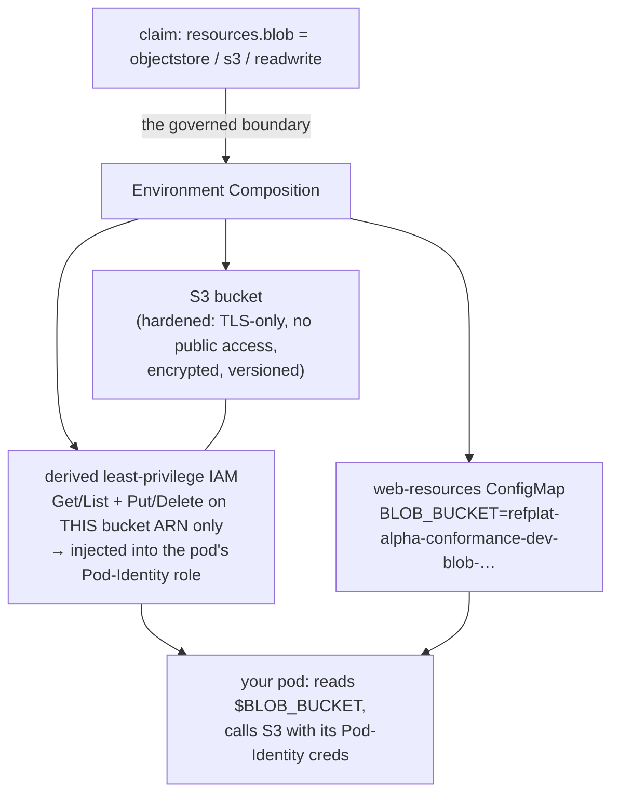

# Learn: Self-Service Cloud Resources — orientation

How a developer gets a real S3 bucket, SQS queue, SNS topic, or DynamoDB table — **without filing a ticket,
waiting on the platform team, or writing a line of IAM** — and how the platform hands it over *safe by
construction* and *least-privilege* every time. This is the paved road that turns "I need a bucket" from a
week-long request into a few lines in a file you already own.

**Audience:** this one is **developer-first** — if you build products on the platform, this is your
self-service. Platform engineers: the **2-minute view** at the end points at the Composition internals. It
builds directly on the [Environment API](../environment-api/orientation.md) (these resources are a field on
your Environment claim), so read that first if "claim / Composition" is new.

**Before you start:** the [Environment API](../environment-api/orientation.md) (the `XEnvironment` claim) and
ideally [Identity & Access](../identity/orientation.md) (Pod Identity — how your pod gets AWS credentials).

## The question

Your service needs to store uploads (a bucket), buffer background work (a queue), fan out events (a topic),
keep sessions (a table). The traditional path is grim: file a ticket, wait, and eventually someone hands you
a bucket — plus you now have to write an **IAM policy** to let your app reach it, which either takes hours to
get right or (far more often) ends up as `s3:*` on `*` because that's what makes the error go away.

So: **how do you get real cloud resources on demand, wired to your app, *without* becoming an IAM expert or a
security liability — and how does the platform keep "self-service" from meaning "self-inflicted breach"?**

## The one idea: declare intent above the claim; the platform derives safety below it

Here's the whole model, and it's the sentence ADR-073 is built around:

> **Abstraction lives *above* the claim; safety lives *below* it.** You declare the resource you want as
> **abstract intent** in your Environment claim — *what*, not *how*. The platform provisions it
> **safe-by-construction** and **derives the exact least-privilege IAM** to reach it. You never write IAM;
> you never harden a bucket; you never see an access key.**

That split is the trick. *Above* the claim, the front door can be anything — a Backstage form, a pull
request, a natural-language agent — because they all just produce the same **governed claim**. *Below* the
claim, one safe pipeline validates and realizes it. Make the front door as magical as you like; the safety
floor never moves.

> Think of a **restaurant order ticket**. You write "medium-rare, no onions" — your *intent*. You don't enter
> the kitchen, own the knives, or plate the dish; the kitchen turns your ticket into the meal *and* hands you
> exactly the right cutlery. Here, your claim is the ticket; the platform is the kitchen; the "cutlery" is
> the **precisely-scoped IAM** it hands your pod. **Where it breaks:** a kitchen trusts you to order
> sensibly; this one also *validates* the ticket against a safety floor and refuses anything unsafe — you
> can't order "raw chicken with root access."

Let's watch it on a real service.

## The worked example — four resources, one claim

Here's `alpha`'s `conformance` service asking for all four resource types, in its Environment claim
(`gitops/environments/alpha/conformance/dev.yaml`) — the *entire* ask:

```yaml
kind: XEnvironment
spec:
  team: alpha
  product: conformance
  stage: dev
  services:
    web:
      serviceAccount: app-alpha
      resources:
        blob:     { kind: objectstore, engine: s3,       access: readwrite }
        jobs:     { kind: stream,      engine: sqs,       access: readwrite }
        events:   { kind: stream,      engine: sns,       access: readwrite }
        sessions: { kind: keyvalue,    engine: dynamodb,  access: readwrite }
```

Read what a developer *actually* wrote: a logical **name** (`blob`, `jobs`, …), an abstract **kind**
(`objectstore`, `stream`, `keyvalue`), a concrete **engine**, and an **access** level. No ARNs. No IAM. No
encryption settings. No bucket policy. That's the whole intent.

And here's what's **live on preprod right now** — all four provisioned and *ready* (steady state, not a
throwaway demo):

```console
# one comma-joined, fully-qualified arg — the short form (`bucket.s3`) makes kubectl
# read the rest as resource *names* and fail; see the Reference for why.
$ kubectl -n alpha-conformance-dev get \
    bucket.s3.aws.m.upbound.io,queue.sqs.aws.m.upbound.io,topic.sns.aws.m.upbound.io,table.dynamodb.aws.m.upbound.io
NAME                             SYNCED  READY  EXTERNAL-NAME
…/alpha-conformance-dev-…(bucket)   True  True   refplat-alpha-conformance-dev-blob-7d258453
…/alpha-conformance-dev-…(queue)    True  True   https://sqs.us-east-1.amazonaws.com/<workload-acct>/refplat-alpha-conformance-dev-jobs-d5c2d549
…/alpha-conformance-dev-…(topic)    True  True   refplat-alpha-conformance-dev-events-51b1a7ce
…/alpha-conformance-dev-…(table)    True  True   refplat-alpha-conformance-dev-sessions-982701e1
# (kubectl prints one table per kind; collapsed here. A trailing AGE column is elided.)
```

Four real AWS resources, from four lines of intent. But the resources are only half of it — the *reach* is
the other half. Here's the fan-out from that one claim:



One line of intent became: a hardened resource, an IAM policy scoped to exactly it, and the wiring for your
app to find it — all derived, none hand-written.

## Above the claim — abstract intent

Notice the developer said `kind: objectstore`, not "an S3 bucket with these settings." The claim is
deliberately **abstract**:

- **`kind`** — the *class* of thing: `objectstore`, `stream`, `keyvalue` (and, in the schema,
  `relational` / `cache`). This is what you actually care about.
- **`engine`** — the concrete implementation (`s3`, `sqs`, `sns`, `dynamodb`). All four are **built and live
  today**.
- **`access`** — `read` or `readwrite`. Your *intent*, not a list of API actions.

Because the abstraction sits above the claim, the platform could later swap or add engines (a different queue
technology, a new database) **without churning your claim** — you asked for `stream`/`readwrite`, and that
stays true whatever backs it.

## Below the claim — safety you didn't have to know about

This is where "self-service" stops being scary. Everything below the claim is **safe-by-construction and
non-overridable** — you *can't* get it wrong because you don't configure it at all:

- **The resource is hardened by default.** For the S3 bucket: public access blocked, **TLS-only** (a bucket
  policy denies any non-HTTPS request), versioning on, region pinned, and **encrypted** — every engine uses
  service-managed encryption (SSE-S3 / SSE-SQS / SNS `alias/aws/sns` / DynamoDB default). (Per-team KMS CMKs
  for regulated tiers — cryptographic tenancy isolation — are *designed but not yet built*; the Composition
  comments mark that path deferred.) You didn't ask for any of that; you can't turn it off.
- **The IAM is *derived*, least-privilege, and resource-scoped.** This is the part that usually goes wrong by
  hand, and here you never touch it. From `access: readwrite`, the platform generates an IAM policy scoped to
  **exactly this one resource's ARN**, with exactly the verbs that level implies:

  | engine | `read` grants | `readwrite` adds |
  | --- | --- | --- |
  | S3 | `GetObject`, `ListBucket`, `GetBucketLocation` | `PutObject`, `DeleteObject`, `AbortMultipartUpload` |
  | SQS | `ReceiveMessage`, `DeleteMessage`, `GetQueueAttributes`, … | `SendMessage` |
  | SNS | `GetTopicAttributes`, `Subscribe`, `ListSubscriptionsByTopic` | `Publish` |

  That policy is injected straight into your service's **Pod-Identity role** (see
  [Identity & Access](../identity/orientation.md)) — so your pod can reach *its* bucket and **nothing else**.
  No `s3:*`, no `*` resource, no shared credentials. The lazy path and the least-privilege path are the same
  path.

It's worth dwelling on *why* that matters, because it's the whole security case for the paved road.
Hand-written IAM is where least-privilege goes to die — under a deadline, `s3:*` on `*` is what makes the red
error disappear, and it quietly hands a pod the keys to every bucket in the account. Then the day that pod is
compromised (a bad dependency, an SSRF, a deserialization bug), its **blast radius** is everything that
policy allowed — which is how an over-broad grant turns a small bug into a lateral-movement launchpad.
Derived IAM collapses that: every pod can reach *exactly* its own resources and nothing else, by
construction, with no tired human in the loop to overscope it. It's the same **least-privilege** and
**blast-radius** thinking from [the security model](../spine/the-security-model.md), made automatic.

So the developer expressed *what* (intent, abstract); the platform derived *how* (the hardening, the exact
IAM) — and the "how" is the part that's genuinely hard to get right, now impossible to get wrong.

> **Quick check:** the developer wrote `access: readwrite` and nothing about IAM — yet the pod ends up able
> to `PutObject` to its bucket and *nothing else*. Where did the policy come from, and why is that safer than
> writing it yourself? *(The platform **derived** it from the access level, scoped to that one ARN, and put
> it in the pod's Pod-Identity role. Safer because a hand-written policy tends toward `s3:*` on `*` under
> deadline pressure; a derived one is least-privilege by construction, every time.)*

## Bounded self-service — the team envelope

"Self-service" without a ceiling is how you wake up to 500 orphaned buckets and a surprise bill. So there's a
governed **middle** to the model — between your intent and its realization: every **Team** declares an
**envelope** (the ceiling on what its environments may ask for), and every claim is **validated against it**
before a single resource is provisioned. Here's `alpha`'s:

```yaml
# gitops/teams/alpha.yaml
envelope:
  resources:
    allowedEngines: [s3, sqs, sns, dynamodb]   # which engines this team may use at all
    maxPerEnvironment: 10                        # cap on resources per environment
    isolationFloor: shared                       # minimum isolation tier
```

The envelope is **default-deny**: a team that hasn't opted into an engine simply can't request it. And it's
enforced *twice*, independently — the **gitops gate** checks the claim on the pull request, and **Kyverno**
(`restrict-environment-envelope`) checks it again at admission — so a request for a disallowed engine, or an
eleventh resource, is rejected *before* any AWS resource exists. (Same [policy](../policy/orientation.md)
engine you've seen guard everything else — defense in depth.)

So the full shape has three parts, not two: **intent above the claim → validated against your team's
envelope in the middle → realized safely below.** Self-service, but inside guardrails your team lead set — a
*governed* claim, not a blank check.

## Getting the coordinates to your app — the resources ConfigMap

A bucket you can't find is useless, so the platform also injects a **`<service>-resources` ConfigMap** with
the real, computed coordinates — which is exactly what's live for `conformance`:

```text
web-resources ConfigMap:
  BLOB_BUCKET       = refplat-alpha-conformance-dev-blob-7d258453
  JOBS_QUEUE_URL    = https://sqs.us-east-1.amazonaws.com/<workload-acct>/refplat-alpha-conformance-dev-jobs-…
  EVENTS_TOPIC_ARN  = arn:aws:sns:us-east-1:<workload-acct>:refplat-alpha-conformance-dev-events-…
  SESSIONS_TABLE    = refplat-alpha-conformance-dev-sessions-982701e1
```

Your app reads `$BLOB_BUCKET` from its environment — it **never hardcodes a resource name**. The platform
owns the naming (`refplat-<team>-<product>-<stage>-<name>-<hash>` — deterministic and collision-safe), so
resources can be renamed or recreated without touching your code.

## Any front door, one claim

Remember "abstraction above the claim": because the *claim* is the governed boundary, the way you *author* it
is free. Today that's a **pull request** (the YAML above) or a **Backstage form**; a designed
**natural-language agent** ("I need somewhere to store user uploads") is a future front door — and it changes
*nothing* below the claim, because it still has to produce that same governed `resources:` block, which still
gets validated and realized the one safe way. New front doors are cheap; the safety floor is fixed.

## When it breaks — the ones you'll actually hit

- **"My claim was rejected — 'engine not allowed' or 'over cap'."** Your **Team envelope** bounds what you
  can request (allowed engines, `maxPerEnvironment`). It's default-deny by design, not a bug — widening it is
  a PR to `gitops/teams/<team>.yaml` by your team lead.
- **"My pod gets `AccessDenied` on the bucket."** Check the **`access`** level in your claim — `read` can't
  `PutObject`. And confirm your pod uses the service's named **ServiceAccount** (the derived IAM lands on
  *that* Pod-Identity role); a different SA won't have the policy.
- **"I don't know the bucket name."** Don't hardcode it — read it from the injected `<service>-resources`
  ConfigMap (`$BLOB_BUCKET`, etc.). The platform picks the name.
- **"Can I just tweak the bucket policy / turn on public access?"** No — the safety floor is non-overridable
  by design (TLS-only, no public access, encrypted). If you have a genuine need the abstraction doesn't
  cover, that's a platform conversation, not a setting.

## Recap — say it back

Try it cold: *how do you get a cloud resource here, safely?* If you can say —

> "I declare it as **abstract intent** in my Environment claim — a **name**, a **kind** (objectstore /
> stream / keyvalue), an **engine**, and an **access** level. **Abstraction lives above the claim, safety
> below it**: the platform provisions the resource **safe-by-construction** (TLS-only, no public access,
> encrypted) and **derives least-privilege IAM scoped to exactly that resource**, injected into my pod's
> **Pod-Identity** role — I never write IAM. It hands me the coordinates in a **ConfigMap** (`$BLOB_BUCKET`).
> Any front door — PR, Backstage, a future agent — works, because they all produce the same **governed
> claim**, which is validated against my **team's envelope** (allowed engines, a per-env cap) before anything
> is built" —

— then you've got it, and "I need a bucket" is four lines and a merge, not a ticket and an IAM review.

## The platform engineer's 2-minute view

Below the claim, the [Environment Composition](../environment-api/orientation.md) renders, per requested
resource: the managed resource itself (`s3.aws.m.upbound.io/Bucket`, `Queue`, `Topic`, `Table` — namespaced
Crossplane v2 MRs) with its hardening resources (BucketPolicy denying non-TLS, PublicAccessBlock, SSE,
Versioning), a **`RolePolicy`** with the derived least-privilege statements appended to the service's
Pod-Identity role, and the `<service>-resources` ConfigMap. Access → verbs is a lookup per engine; naming is
`refplat-<team>-<product>-<stage>-<name>-<hash>`. It's exercised end-to-end by `alpha/conformance/dev`.

**Adding a new engine** (RDS, ElastiCache, …) is a common platform-engineer task with its own recipe — the
catalog is a floor, not a ceiling. That's the producer side of this module: the how-to
[Extending: add a new resource engine](extending-add-an-engine.md).

## Go deeper

- The full schema, engines, and gotchas: the [Reference](reference.md).
- The claim this extends: [The Environment API](../environment-api/orientation.md); where the derived IAM
  lands: [Identity & Access](../identity/orientation.md); the safe-by-default framing:
  [The Security Model](../spine/the-security-model.md).
- Why it's shaped this way: [ADR-073 Self-Service Cloud Resources](../../adrs/073-self-service-cloud-resources.md).
- Provision one yourself: the `environment-onboarding` skill.
