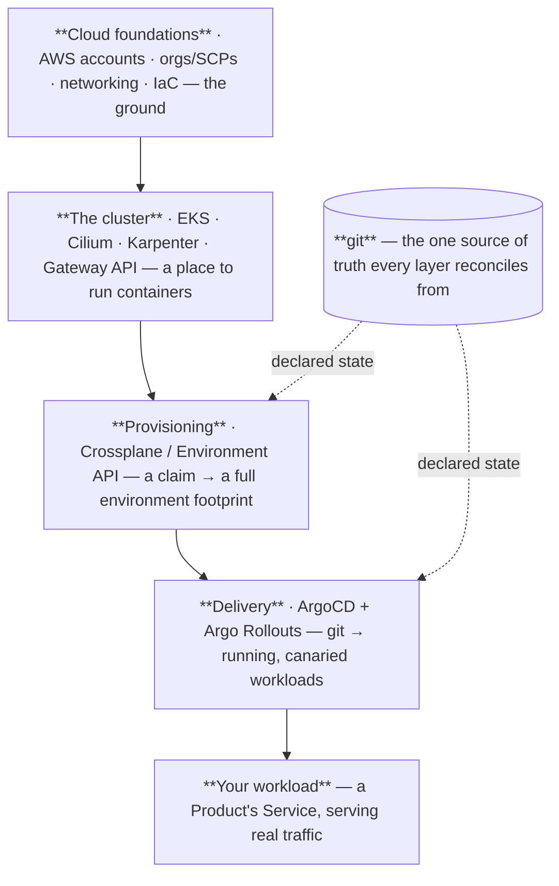
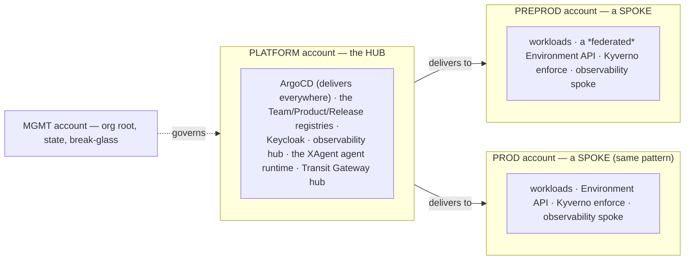

# How the Platform Fits Together

> **A spine doc — the map.** If [The Life of a Deployment](life-of-a-deployment.md) was the *journey*
> (one event, followed through the machinery), this is the *map* (the standing structure the journey moved
> through). Read that one first — it gives these pieces motion; this one gives them a shape and a place.
> Long on purpose, like all spine docs — take your time.

## The question

You've now watched one deployment thread its way across ten planes. But a map is more than a traced route.
Step back and ask the structural questions: **What *are* all these control planes? How are they arranged —
what sits on top of what? Where do they physically run? And who owns which parts?**

Answer those and something valuable happens: the platform stops being a bag of tools with cool names and
becomes a *structure you can hold in your head* — the kind you can navigate at 3 a.m. during an incident,
when the question isn't "how does this all work in theory" but "the shop is down, *which box do I even look
in*." A good map is what turns panic into a lookup. That's what this doc is for.

## The one idea: control planes all the way down

Here is the single realization that makes the whole platform legible. You already met it, twice — in
[the Environment API](../environment-api/orientation.md) as a thermostat, and in *Life of a Deployment* as
"no conductor." Now generalize it as hard as it will go:

> **Every layer of this platform is the same shape: you declare desired state in git, and a control plane
> reconciles reality to match it.** AWS accounts. The network. The cluster itself. Provisioned
> environments. Deployed workloads. Policy. Identity. Running agents. *All of it.* The same
> declare-then-reconcile loop, repeated at every altitude — from "which AWS accounts exist" at the bottom to
> "which AI agents are running" at the top.

Don't take that on faith — watch the *same* loop appear at three totally different altitudes:

| At this altitude… | you declare… | and this control plane reconciles reality to it |
| --- | --- | --- |
| **Cloud foundations** | AWS resources, in `.hcl` | Terragrunt / OpenTofu |
| **Provisioning** | an `XEnvironment` claim | Crossplane |
| **Delivery** | a Release digest | ArgoCD |

Three different nouns; one identical verb. *Declared state in git → a controller always watching → reality
driven to match, forever.* That self-similarity is the gift: you don't have to learn a dozen unrelated
systems. You learn **one pattern** — a control plane closing the gap between declared and actual — and then
recognize it, stacked, over and over. The planes differ in *what* they reconcile; they are identical in
*how*. Once the shape clicks for one, it has clicked for all of them.

> A useful way to hold the whole thing: **the platform is an operating system for shipping software.** Not
> loosely — the mapping is surprisingly exact:
>
> | In an operating system… | …on this platform |
> | --- | --- |
> | Hardware | AWS accounts + network |
> | The kernel (schedules, isolates) | the EKS cluster |
> | Device drivers | the providers (Crossplane's AWS/K8s providers, the CNI) |
> | System daemons | the control planes (ArgoCD, Kyverno, Karpenter, …) |
> | System calls — how you request work | **git** |
> | Processes / user space | your Product's running workloads |
> | The shell / desktop | Backstage |
> | syslog / dmesg | the observability stack |
> | Users & file permissions | identity & access (Keycloak, Pod Identity) |
>
> **Where the OS metaphor breaks** — and it's the important place: a real OS has a **kernel scheduler**, one
> central authority dispatching work. This platform has *no such center*. Its "daemons" are the autonomous,
> independent control loops from *Life of a Deployment* — they coordinate only through git, never through a
> conductor. So: an OS for its *layering*, choreography for its *control*. Hold both, and you can reason
> about almost anything on the platform by asking "which layer, and which loop?"

## The altitudes — what sits on what

Read this bottom to top. The organizing principle is the same one that makes an OS tractable: **each layer
takes the one below as a given, hides that complexity, and offers a simpler abstraction to the layer
above.** You use the cluster without thinking about EC2; you deploy a workload without thinking about the
cluster. Each rung raises the floor.

**Cloud foundations — the ground.** At the bottom: multiple AWS accounts under an organization, fenced by
guardrail SCPs (service control policies that make whole *categories* of action impossible, org-wide); the
network (VPCs, a Transit Gateway stitching accounts together, private DNS); and the IaC that builds it all
(OpenTofu + Terragrunt). *Its abstraction contract:* it takes raw AWS and offers "named, networked,
guardrailed accounts." *Its control plane:* Terragrunt, reconciling AWS to the `.hcl` you commit. *This is
the hardware layer — everything else runs on it and mostly ignores it.*

**The cluster — the kernel.** On an account's network sits an EKS cluster, and three planes make it usable:
[Cilium](https://docs.cilium.io/en/stable/overview/intro/) gives every pod an address and enforces who may
talk to whom (the network stack); [Karpenter](https://karpenter.sh/) watches for pods that can't be
scheduled and *conjures a right-sized node in seconds*, then removes it when idle (the memory manager,
sort of — capacity on demand); the [Gateway API](https://gateway-api.sigs.k8s.io/) is the doorway for
outside traffic. *Its abstraction contract:* takes "an AWS account with a network," offers "a place that
runs containers and connects them." *This is the kernel — it schedules work onto hardware and isolates
tenants from each other.*

**Provisioning — the environment factory.** [Crossplane](https://docs.crossplane.io/latest/composition/compositions/)
runs the [Environment API](../environment-api/orientation.md). A nine-line `XEnvironment` claim becomes a
namespace, an image registry, scoped AWS permissions, resource quotas, and admission guardrails — a whole
furnished, isolated home. *Its abstraction contract:* takes "a cluster," offers "isolated, governed homes
for Products, on request." *This is the layer that hands out address space and permissions* — the part of
the kernel that gives each program its own protected memory, raised to the level of a whole environment.

**Delivery — git to running.** [ArgoCD](https://argo-cd.readthedocs.io/en/stable/) plus
[Argo Rollouts](https://argo-rollouts.readthedocs.io/en/stable/) take the manifests and the promoted image
digest sitting in git and turn them into a *running, health-gated, automatically-canaried* workload inside
one of those homes. *Its abstraction contract:* takes "a home + a desired version in git," offers "that
version, safely running." *This is the loader and the process scheduler* — it takes a program off disk and
gets it executing, carefully.

**Your workload — user space.** Your Product's Service, finally running and serving customers. Everything
below exists so that *this* layer can be small: you write the app, not the platform. That is the entire
point of the stack — to make the interesting layer the *thin* one.

> **Quick check:** place each of these on the stack — Karpenter, an `XEnvironment` claim, an SCP, ArgoCD,
> a running `shop` pod. *(Karpenter → the cluster/kernel; XEnvironment → provisioning; SCP → cloud
> foundations; ArgoCD → delivery; the pod → user space. If you can place a tool you've never seen before on
> this stack, you already half-understand it.)*

## The bands that cut across every layer

The stack above is the *delivery path* — how code becomes a running service. But three planes refuse to sit
on any single rung. They cut **vertically through all of them**, which is precisely why they feel
omnipresent and why newcomers can't figure out "what layer is Kyverno?" — the answer is *all of them*.

- **Policy — [Kyverno](https://kyverno.io/docs/) (and its cousins).** Guardrails apply at every altitude:
  SCPs guard the *accounts*, admission policies guard the *workloads*, image policies guard the *registry*,
  network policies guard *traffic*. Policy is not a layer; it is *a rule every layer must answer to*. It
  cuts down through the whole stack, saying "no" at each floor.
- **Identity & access — Keycloak + [Pod Identity](https://docs.aws.amazon.com/eks/latest/userguide/pod-identities.html).**
  *Who* (humans, via Keycloak SSO) and *what* (workloads, via Pod Identity) may act — asked and answered at
  every layer, from "who may assume this AWS role" at the bottom to "who may merge this Release" in the
  middle to "what may this pod reach" at the top. One question — *are you allowed?* — posed on every floor.
- **Observability — the LGTM+P stack.** The nervous system. Every layer emits signals into it, and — as you
  saw in *Life of a Deployment* — the delivery layer even *reads back* from it to gate canaries.
  Observability watches the entire stack at once and, at the top, wires some of what it sees to *action*
  (alerts, on-call, the triage copilot).

> If the delivery stack is a *building*, these three are the *utilities* — plumbing, power, security — that
> run through **every floor** rather than occupying one. You never visit "the electricity floor"; it's in
> the walls, everywhere. That's why they're modeled as their own sub-curricula in
> [the inventory](../_inventory.md): each is big *because* it touches everything.

## Where it all runs — hub and spokes

That's the logical stack. Physically, it lives in a **hub-and-spoke** topology across a handful of AWS
accounts — and the shape is a deliberate answer to three pressures at once: *don't duplicate shared
services, contain blast radius, and use the AWS account as the hard isolation boundary.*

> Picture an **airline hub.** The expensive shared machinery — the big maintenance hangar, the operations
> center, the reservations system — lives *once*, at the hub. Flights (deliveries) radiate out to the spoke
> airports, which run their own local operations but rely on the hub's shared systems. You don't build a
> reservations system at every airport; you build it once and connect. **Where it breaks:** airline spokes
> are fairly independent; here the hub also holds the *governance* (identity, policy source, the
> registries), so the relationship is tighter than airports-and-HQ.

Concretely:

- **The hub is the `platform` account's cluster.** It runs the *shared* planes, provided once for everyone:
  a single ArgoCD that delivers to *every* cluster, the git-native Team/Product/Release registries,
  Keycloak, the observability hub, the Transit Gateway hub, and the
  [XAgent](../../adrs/082-platform-agent-runtime-xagent.md) agent runtime (the triage copilot lives here).
  Build these once, not once-per-environment.
- **The spokes are the environment clusters** — **preprod today; prod follows the identical pattern.** They
  run the actual workloads. And here's the subtle, important choice: the **Environment API is *federated* —
  it runs on each spoke, not on the hub** ([ADR-048](../../adrs/048-federated-per-cluster-crossplane.md)).
  Each environment cluster provisions its *own* footprint locally. Why not centralize provisioning on the
  hub? Two reasons: **blast radius** (a hub outage must not freeze every environment's ability to self-heal
  — a spoke keeps reconciling itself even if the hub is down), and **locality** (the thing that provisions a
  namespace should live next to the cluster that namespace is in). Federation, not centralization.
- **The `mgmt` account is the root** — the AWS organization itself, the Terraform state bucket, break-glass
  access. It *governs*; it runs no workloads. (A `test` account exists too, purely as the Terratest
  sandbox.) Keeping the org root workload-free is a blast-radius decision: the account that can do *anything*
  does as *little* as possible.
- **The account boundary is the real fence.** Why span accounts at all instead of one big account with
  namespaces? Because an AWS account is the strongest isolation AWS offers — separate billing, separate IAM,
  an SCP wall. Preprod genuinely *cannot* touch prod's resources; that's enforced by AWS, not by a policy we
  hope holds.
- **git ties it together.** Nothing in the hub *pushes* to a spoke imperatively. ArgoCD on the hub watches
  git and reconciles each target cluster toward it — the same choreography from *Life of a Deployment*, now
  spanning accounts. Cross-account, still no conductor.

> **Quick check:** the Environment API runs on the *spokes*, but ArgoCD runs on the *hub*. Why the
> difference? *(ArgoCD is a shared service — one of it, delivering everywhere, is cheaper and simpler.
> Provisioning is federated so a hub outage can't freeze a spoke's self-healing and so it lives next to the
> resources it manages. Shared-once vs. resilient-everywhere — different pressures, different placements.)*

## Why this shape at all?

Worth pausing on, because "layers of git-watching control planes" is a *choice*, not the only way to build
a platform. You could instead have a big pile of deploy scripts and a CI pipeline that pushes. Why this
instead?

- **Why control planes (not scripts)?** A script *runs once and forgets*. A control plane *never stops
  watching* — so the system **self-heals**: drift anything and it's corrected, no human, no runbook. It's
  the difference between "we ran the install" and "the install is a standing fact the platform maintains."
- **Why git as the interface (not a UI or an API to call)?** Because git gives you, for free, the three
  things operations most needs: a **single source of truth** ("what *should* be true" is one queryable
  place), a complete **audit log** (every change is a signed commit with an author and a diff), and a
  **rollback** (revert the commit — with the honest caveat about data we covered in *Life of a Deployment*).
  You didn't build those; git already had them.
- **Why layers (not one flat system)?** Separation of concerns, and separation of *ownership*. Each altitude
  can be understood, changed, and owned independently — the networking team need not understand Rollouts;
  an app team need not understand SCPs. The stack is also how the platform stays *comprehensible*: you can
  reason about one floor at a time.

Put together, that's the thesis of the whole platform in one line: **make every operational fact a declared,
reconciled, git-versioned thing — and layer those facts so each one is small.**

## This isn't just our opinion — where the model comes from

The shape above isn't a house style we invented; it's an assembly of patterns that the research literature
and the industry converged on independently. Worth knowing the provenance — both to *trust* the design and
to trace any part of it deeper:

- **Control planes · reconciliation · self-healing.** The declare-desired-state, reconcile-forever loop is
  the exact lesson Google distilled from a decade of running containers at scale across three systems, in
  [*Borg, Omega, and Kubernetes*](https://research.google/pubs/borg-omega-and-kubernetes/) (Burns, Grant,
  Oppenheimer, Brewer, Wilkes). In their words, reconciliation compares desired to observed state and
  converges them — and *because all action is based on observation rather than events, the loops are robust
  to failures and restarts.* That's our "thermostat," straight from the source. See also the
  [Kubernetes controller model](https://kubernetes.io/docs/concepts/architecture/controller/) and the
  reliability case in the [Google SRE Workbook](https://sre.google/workbook/alerting-on-slos/).
- **Git as the interface (GitOps).** The "desired state in git, agents reconcile reality to it" pattern is
  formally defined by the CNCF's [OpenGitOps](https://opengitops.dev/) working group. We didn't coin it; we
  adopted it whole.
- **Platform as a *product* · paved roads · self-service.** That a platform must be built *for its users*
  and *thinned to reduce their cognitive load* is the shared thesis of the
  [CNCF Platforms White Paper](https://tag-app-delivery.cncf.io/whitepapers/platforms/),
  [Team Topologies](https://teamtopologies.com/key-concepts) (Skelton & Pais — the "thinnest viable
  platform"), and Evan Bottcher's canonical essay
  [*What I Talk About When I Talk About Platforms*](https://martinfowler.com/articles/talk-about-platforms.html).
  The "paved road / golden path" idea — the *safe* path being the *easy* path — is
  [Spotify's Golden Paths](https://engineering.atspotify.com/2020/08/how-we-use-golden-paths-to-solve-fragmentation-in-our-software-ecosystem).
- **Multiple AWS accounts as the isolation fence.** That an *account* (not a namespace) is the real
  blast-radius / IAM / billing boundary is AWS's own guidance in
  [*Organizing Your AWS Environment Using Multiple Accounts*](https://docs.aws.amazon.com/whitepapers/latest/organizing-your-aws-environment/benefits-of-using-multiple-aws-accounts.html).
  Our hub-and-spoke-across-accounts is that recommendation, applied.
- **Progressive delivery.** The canary-plus-metrics-plus-auto-rollback discipline was named *progressive
  delivery* by RedMonk's James Governor (2018); the platform implements it with
  [Argo Rollouts](https://argo-rollouts.readthedocs.io/en/stable/).

The point of citing all this: **almost nothing here is bespoke.** The platform's value isn't a novel
architecture — it's the *disciplined assembly* of well-established patterns into one coherent, governed
whole. When someone asks "why is it built this way?", the honest answer is *"because Google, the CNCF, AWS,
and the platform-engineering field all point here — and we followed the signs."*

## Two boundaries worth burning in

A map is really about *boundaries*. Two of them explain most of "why is it done that way?", and both are
worth committing to memory.

**1 · Control plane vs. data plane.** The **control planes** *manage* — ArgoCD, Crossplane, Kyverno,
Karpenter. They decide what should exist and keep it healthy; they never personally serve a customer
request. The **data plane** is where real user traffic actually flows: your running pods, the Gateway
handing bytes to `shop-alpha-dev...`.

> It's **air traffic control vs. the aircraft.** ATC manages, sequences, and keeps everyone safe — but no
> passenger rides in the control tower. The planes carry the actual people. And the crucial property falls
> right out of the metaphor: if ATC goes dark, planes already in the air *don't fall* — they keep flying on
> their current heading; you just can't coordinate *new* movements. Likewise here: if a control plane is
> down, existing traffic often keeps flowing — the managers are out, but the workers are still at their
> posts. That's why "ArgoCD is down" is a *serious-but-not-outage* event, while "the Gateway is down" is an
> outage. Knowing which plane a component is in tells you how scared to be.

**2 · Platform-owned vs. tenant-owned.** The platform team owns the *planes* — every control plane, the
paved road, the guardrails. App teams own their *Products* — the code, the claims, the manifests. The
boundary between them is an **API**: a team *declares intent* (an `XEnvironment` claim, a `k8s/` folder),
and the platform's planes *turn it into reality* — without the team ever touching a control plane, and
without the platform ever touching the team's code. That's the domain model's ownership split
([Team → Product → …](../domain-model/orientation.md)), seen from the infrastructure side: **the claim is
the contract.** Everything above the API is a tenant's business; everything below is the platform's.

And a consequence worth stating: because a plane is just "a control loop reconciling git," **platform
services ride the exact same rails as tenant products.** The triage agent is delivered by the same ArgoCD,
from the same kind of registry, as `alpha`'s `shop` — "one road" for platform-owned and tenant-owned alike
([ADR-081](../../adrs/081-platform-service-delivery.md)). The platform dogfoods its own paved road, which is
the surest way to know the road is any good.

## Reading the map when something breaks

Here's the payoff the opening promised. It's 3 a.m.; `shop` is throwing 503s. The map turns "where do I even
look?" into a *descent down the stack*, top to bottom, asking one question per layer:

- **Data plane / user space** — are the pods actually up and healthy? *(A crash loop is a workload problem,
  not a platform one.)*
- **Delivery** — is ArgoCD **Synced**, and is it running the digest you expect? *(An OutOfSync app or a bad
  promoted digest lives here.)*
- **Provisioning** — is the environment intact — quota not exhausted, namespace present? *(A `ResourceQuota`
  denial looks like a deploy failure but is a provisioning-layer fact.)*
- **The cluster** — are there **nodes**? Did Karpenter fail to scale? Is the pod unschedulable? *(Pending
  pods point here.)*
- **Ingress** — is the HTTPRoute wired, the TLS cert valid? *(503-at-the-edge vs. 503-from-the-pod are
  different floors.)*
- **Cross-cutting** — did **Kyverno** reject the deploy (policy)? Is a **Pod Identity** credential missing
  (identity)? What do the **signals** say (observability)?

You don't check randomly; you check *by altitude*, and the topology even tells you *where* — a provisioning
problem is on the **spoke**; an ArgoCD or registry problem is on the **hub**. The map is the triage
tree. That's not a metaphor — that's the practical reason to carry this picture in your head.

## Recap — say it back

Try it cold: *what is the platform, structurally?* If you can say —

> "It's an operating system for shipping software, built as **layers of control planes** — cloud
> foundations, the cluster, provisioning, delivery, my workload — with **policy, identity, and
> observability cutting vertically through all of them**. Every layer is the *same shape*: declare desired
> state in git, a control plane reconciles reality to it — so the whole thing **self-heals**. It runs
> **hub-and-spoke** across isolated AWS accounts: shared planes on the platform hub, workloads and a
> *federated* Environment API on each environment spoke, coordinated only through git with **no central
> conductor**. The platform owns the planes; my team owns its Products; **the claim is the API between
> us**. And when something breaks, I debug it **by altitude** — data plane up through the stack" —

— then the whole platform now fits in one mental picture, every module in the portal is a zoom-in on one box
of this map, and you have a triage tree for the next incident.

*Life of a Deployment* was the map in motion. This was the map at rest. Between them, you have the spine.

## Go deeper

- The same structure *in motion*: [The Life of a Deployment](life-of-a-deployment.md).
- The same layers read as *defenses*: [The Security Model](the-security-model.md) — defense in depth.
- The layers as full courses: [the domain model](../domain-model/orientation.md) *(built)* ·
  [the Environment API](../environment-api/orientation.md) · [Delivery](../delivery/orientation.md) ·
  [Policy](../policy/orientation.md) · [Identity & access](../identity/orientation.md) *(built)* ·
  Observability, Foundations *(coming — see [the inventory](../_inventory.md) for the whole plan)*.
- Why the topology is shaped this way:
  [ADR-048 federated per-cluster Crossplane](../../adrs/048-federated-per-cluster-crossplane.md) ·
  [ADR-081 one delivery road](../../adrs/081-platform-service-delivery.md).
- The idea underneath everything:
  [what a control plane / reconciliation loop is](https://kubernetes.io/docs/concepts/architecture/controller/)
  · [GitOps](https://opengitops.dev/) · [Crossplane](https://docs.crossplane.io/latest/composition/compositions/).
