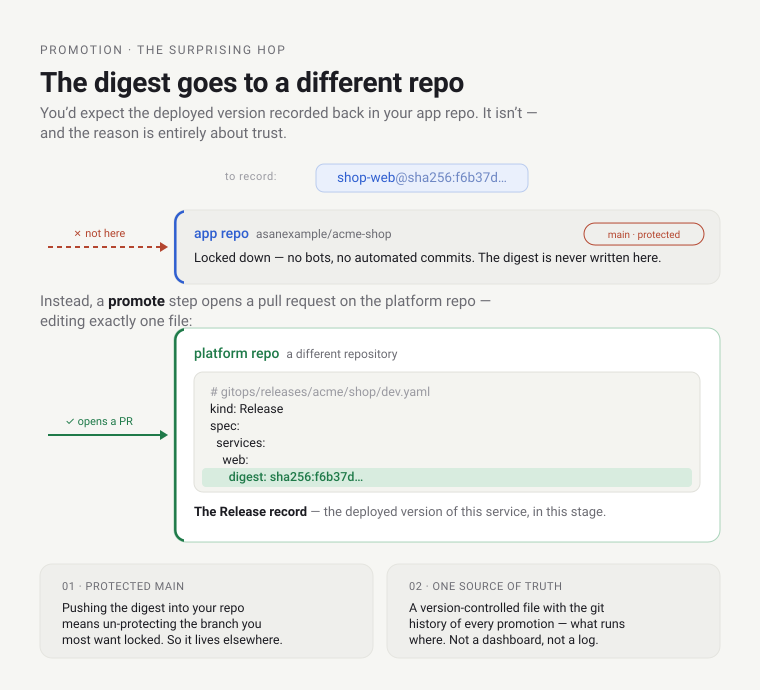
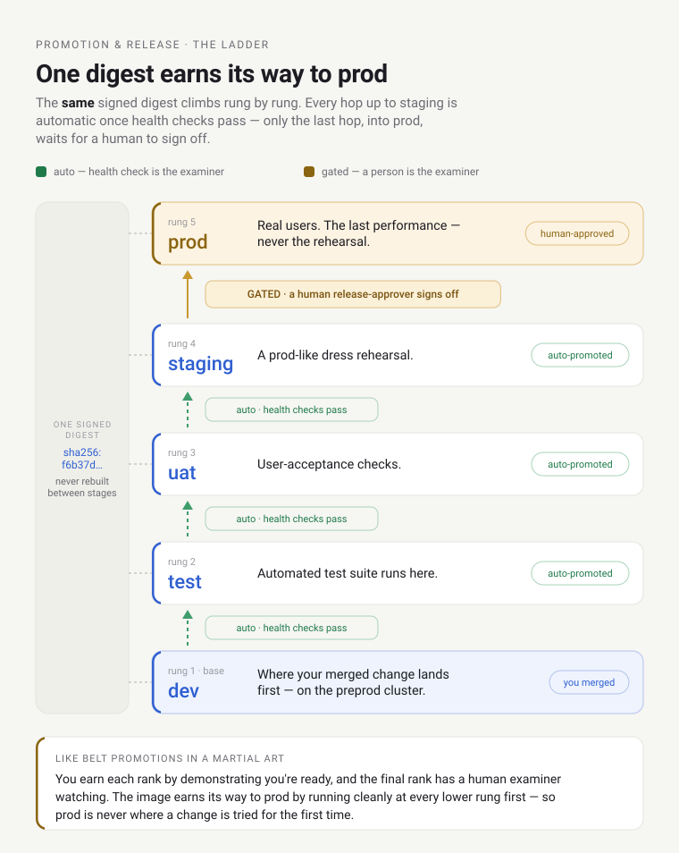

# The Life of a Deployment

## The question

You're a developer on the `acme` team. You fix a one-line bug in the `shop` product's `web` service, open
a PR, and merge it. You go make coffee. By the time you're back, the fix is serving real users.

What actually happened in those few minutes? Not the tidy arrows on an architecture slide — the real
chain of machinery, plane by plane, and who did what and why. The honest answer is surprising, and once
you see it the whole platform stops feeling like magic and starts feeling like a system you could reason
about at 3 a.m. during an incident.

This doc is that answer: one `git push`, followed all the way to a running pod, teaching each plane it
touches as we go. It's long on purpose — that's the right length for the thing that connects everything
else.

## The one idea: there is no conductor

Start by throwing away the mental model you almost certainly have. Most people picture something like this:

> **a conveyor belt.** Your code is a package. You drop it on the belt, and a big *build-and-deploy robot*
> carries it from station to station — build, test, ship — until it pops out the far end, running in
> production. One machine, one pipeline, pushing your work along.

There is no belt. There is no robot. Nothing *pushes* your code anywhere.

What's actually there is **a room full of thermostats.** Take one — Crossplane, the control plane behind
[the Environment API](../environment-api/orientation.md): it sits there watching desired state versus
actual state and quietly closes the gap whenever they drift, forever, without being asked. That wasn't a
one-off. That is how the entire platform is built. A dozen different control planes, each a thermostat for
its own concern: each watches one thing — either the git repository or the live cluster — and reconciles
its own slice of your intent toward what you declared.


Your deployment is not a package riding a belt. It's what you *observe* when, one after another, each of
these thermostats notices its cue and acts.

And the thing they all watch — the shared source of truth that coordinates the whole dance without any of
them talking to each other — is **git.** You never call these planes. You never trigger a pipeline. You
change a file in git, and they notice, because noticing is the only thing they do. This pattern has a
name — [**GitOps**](https://opengitops.dev/): the desired state of the system lives in git, and automated
agents continuously make reality match it.

That's the whole idea, and it's worth saying plainly, because everything below is just this idea playing
out ten times:

> **The platform is choreography, not orchestration.** No central conductor pushes work through stages.
> Independent control loops each react to a shared source of truth (git) and converge the world toward it.

<!-- -->

> **Where the thermostat picture breaks** (metaphors always do — say how, or they mislead): a real
> thermostat watches a *smooth, continuous* value — temperature — and nudges gently. These watch *discrete
> desired state* — a specific manifest, an exact image — and either it matches or it doesn't. And "a room
> of thermostats" makes it sound like they take turns; they don't. Every plane runs **continuously and in
> parallel**, all the time. The *order* you're about to walk through is simply the order in which each
> plane's cue happens to arrive. Keep those two caveats and the metaphor will carry you the whole way.


Ten planes. We'll walk each — what it does, why it exists, the idea it's built on — following the `web`
service of `acme`'s `shop` from your merge to live traffic.

---

## 1 · You merge (your repo)

Your PR lands on `main` in `asanexample/acme-shop`. That's it. That is the **last thing a human does by
hand** in this entire story (well — until a human *chooses* to approve the production release near the end).
Everything from here is a machine noticing that something changed.

Notice how unusual that is. You didn't run a deploy command. You didn't open a dashboard and click "ship."
You didn't file a ticket for ops. You changed code and merged it — the same thing you'd do on a solo hobby
project — and the platform took it from there. That's the point of a platform: turn "deploy to a compliant,
observable, multi-account, progressively-delivered production environment" into "merge your PR." Everything
below is the machinery that makes that trade honest.

## 2 · CI builds, signs, and *attests* it (the supply chain)

The moment your merge lands, your repo's CI wakes up. But notice what it is: your repo's workflow is a thin
**caller** of *shared* workflows the platform owns — you don't copy-paste a hundred lines of
Docker-and-security YAML into every app; you call the platform's versions and inherit their guarantees.
(This is the paved-road idea: the safe path is the easy path.)

Your CI thinly calls two shared workflows, which together do three things:

1. **Builds** your code into a container image *(build-sign workflow)*.
2. **Pushes** it to the platform's registry as `team-acme/shop-web@sha256:…`, then **cosign-signs** it and
   records a software bill of materials *(still the build-sign workflow)*.
3. **Attests** it — a *separate, isolated* provenance workflow writes the SLSA build attestation from its own
   identity. This is the part worth teaching, because it's the platform's answer to a whole category of attack.

The problem it solves: a container image is just a blob in a registry. How does the *cluster*, later, know
that a given blob is really *your* code, built by *your* CI from *your* repo — and not something a
compromised laptop or a poisoned dependency slipped in? You can't just trust the name; names can be
overwritten.

So the workflow **cosign-signs** the image. [Cosign](https://docs.sigstore.dev/cosign/signing/overview/)
does *keyless* signing: instead of a secret key someone could steal, it uses CI's own short-lived OIDC
identity (the GitHub Actions run proving "I am the `build-sign` workflow of this repo") to produce a
signature, and records it in a public transparency log. Then a *separate, isolated* provenance workflow writes a
[**SLSA provenance**](https://slsa.dev/) attestation — a signed statement describing *how and where this
image was built* (which repo, which commit, which workflow). Keeping provenance in its own workflow and identity
is what earns the SLSA L3 "isolated builder" guarantee.


> Think of it as a **tamper-evident wax seal plus a notarized receipt.** The signature is the seal: break
> it — alter one byte of the image — and the seal doesn't match, visibly. The provenance is the notarized
> receipt: it doesn't just say "this is sealed," it says "made by this workshop, from these materials, on
> this date," and a notary (the transparency log) co-signed it. **Where the metaphor breaks:** a seal
> proves *origin and integrity*, not *quality* — a perfectly-sealed image can still be full of bugs. The
> seal answers "did this come from where it claims?", never "is the code good?"

Nothing is deployed yet. This stage's only job is to turn your merge into a **trustworthy artifact** and
its **digest** — a value we're about to lean on hard.

*Its own module: **[Supply chain](../supply-chain/orientation.md)** — keyless signing, isolated SLSA
provenance, the thin-caller model, verify-at-admission.*

## 3 · The digest is promoted — into a *different* repo

This is the first place the platform diverges from what you'd expect.

First, *why a digest?* The image has a name (`team-acme/shop-web`) and it could have a tag (`:latest`,
`:v1.2`). But tags are **mutable nicknames** — `:latest` can point at one image today and a different one
tomorrow; two people saying "latest" can mean two different things. A **digest** (`sha256:f6b37d…`) is a
**content fingerprint**: it's computed from the image's bytes, so it names *one exact image, forever*.
Deploy a tag and you're trusting a nickname; deploy a digest and you're pinning a fingerprint. The platform
deploys digests. ([More on image references](https://kubernetes.io/docs/concepts/containers/images/).)

Second, *where does that digest go?* Not back into your app repo. A promote step opens a pull request **on
the platform repo** — a completely different repository — editing exactly one file: the product's `Release`
record for this stage.

```yaml
# gitops/releases/acme/shop/dev.yaml   (in the PLATFORM repo, not yours)
apiVersion: platform.refplat.org/v1beta1
kind: Release
spec:
  environmentRef: acme-shop-dev
  services:
    web:
      digest: sha256:f6b37d…        # ← the freshly built, signed image
```



Why go to all that trouble to write a digest into a *foreign* repo? Two reasons, both about trust:

- **Your `main` stays protected.** Your app repo's `main` branch is locked down — no automated commits, no
  bots pushing to it. If deployment worked by having CI push a digest back into your repo, you'd have to
  *un*-protect the branch you most want protected. So the deployed digest lives elsewhere.
- **One auditable source of truth for "what is running where."** That `Release` file *is* the record of the
  deployed version of `acme-shop`'s `web` in dev. Not a dashboard, not a log — a version-controlled file
  with a full git history of every promotion.

## 4 · The Gate merges it (the promotion ladder)

That Release PR doesn't merge itself blindly. A gitops **"Gate"** reviews it. And here the platform encodes
a piece of hard-won operational wisdom: **not all environments deserve the same trust.**

Up through staging, the Gate auto-merges the promotion once health checks pass — dev, test, uat, staging
all flow automatically, because a bad change there hurts no real user. At **prod**, the Gate stops and waits
for a human **release-approver** to sign off. Same image, the exact same signed digest, climbing rung by
rung:



Everything up to staging promotes automatically once health checks pass; only the last hop, into prod,
waits for a human release-approver.

> Think of it as **belt promotions in a martial art.** You don't award a black belt to someone who just
> walked in. You earn each rank by demonstrating you're ready, and the final rank has a *human examiner*
> watching. The image "earns its way" to prod by running cleanly at every lower stage first — so prod is
> never the place a change is tried for the *first* time. **Where it breaks:** unlike belts, a promotion
> can be *automatic* below prod — the "examiner" for the lower rungs is a health check, not a person.

Our `dev` change is at the bottom rung, so it auto-merges. The digest is now committed to the platform
repo's `main`. Which means: **git has changed.** And something is always watching git.

*Its own module, later: **Promotion & release** — the full ladder, Release-keyed delivery, the approver
role. Source: [Promotion & Release](../../architecture/promotion-and-release.md).*

## 5 · ArgoCD notices, and syncs (delivery)

Nobody told [ArgoCD](https://argo-cd.readthedocs.io/en/stable/) to deploy anything — and that's the GitOps
idea made concrete. ArgoCD's entire job is to **continuously compare the cluster to git** and fix any
difference. The merged Release *is* a difference. So ArgoCD reconciles it, unprompted, the same way the
thermostat in your hallway doesn't wait for permission to notice the room got cold.

Mechanically: a per-Product **ApplicationSet** turns each `Release` record into one ArgoCD Application. That
Application pulls your service's Kubernetes manifests from your app repo's `k8s/overlays/dev` folder — and
**injects the promoted digest** over the `:placeholder` the overlay ships with. (So your overlay never has
to contain a real digest either; the platform supplies it at sync time from the Release.) ArgoCD then
applies the finished manifests to the `acme-shop-dev` namespace on the preprod cluster.

Look at what was *already sitting there*, waiting for this workload to arrive: the `acme-shop-dev`
namespace, its dedicated image registry, its scoped AWS permissions, its network policies and resource
quotas. None of that was created just now. **[The Environment API](../environment-api/orientation.md)
provisioned it earlier** — when the *Environment* was first declared — using the very same reconcile-toward-
git pattern. This deploy isn't building a house; it's a tenant moving into a house that was already built,
inspected, and furnished. (That's the whole "provision once, deploy many times" split from the domain
model.)


*Its own module: **[Delivery](../delivery/orientation.md)** — ArgoCD, ApplicationSets, the promotion
ladder, and Rollouts, in depth.*

## 6 · Kyverno admits it (policy)

The manifests reach the cluster's API server — and immediately hit a checkpoint they must clear before they
can exist:
[**admission control**](https://kubernetes.io/docs/reference/access-authn-authz/admission-controllers/).
Every single object that tries to enter a Kubernetes cluster passes through admission first; it's a
built-in gate at the door of the API. The platform puts a policy engine,
[**Kyverno**](https://kyverno.io/docs/), on that gate.

> It's **passport control at a border.** Everything arriving has to present its papers. Kyverno inspects
> them against the rules and does two kinds of thing: it **turns away** anything that violates a hard rule,
> and it **stamps in** the compliant travellers — sometimes *adding* a required stamp they forgot.
> **Where it breaks:** border control checks your *documents*, not whether you're a good person; Kyverno
> checks that a workload is *compliant*, not that your app *works*.

What it rejects your deploy for (a partial list): an image from another team's registry; an image that
isn't signed and attested (yes — it re-verifies, at deploy time, the very signature CI made in step 2,
because trust is checked at the moment of use, not taken on faith); missing resource limits or health
probes; a hostname the Environment isn't allowed to claim; in prod, fewer than two replicas. Fail any of
these and the workload *never runs* — it's stopped here, at the door, with a clear error, instead of
half-deploying and paging someone at midnight.

What it quietly adds for you (so every workload is safe-by-default without every developer remembering every
rule): a locked-down security context, a PodDisruptionBudget so it can't be drained to zero, topology spread
so its replicas don't all land on one node. You write the *interesting* 80% of the manifest; the platform
fills in the safety boilerplate.

This is **policy as code**: the rules that used to live in a wiki page nobody read, or in a reviewer's
head, are executable and enforced identically every time, on every cluster.

*Its own module: **[Policy & admission](../policy/orientation.md)** — Kyverno, the three verbs
(validate/mutate/generate), the catalog, audit→enforce.*

## 7 · The Rollout canaries it (progressive delivery)

Admitted — but not yet live to everyone. Because your workload isn't a plain Kubernetes Deployment that
swaps all its pods at once. It's an [**Argo Rollout**](https://argo-rollouts.readthedocs.io/en/stable/), and
it deploys *cautiously*, on **every** stage — not just prod.

Instead of replacing all the old pods with new ones in one move (and betting the whole service on the new
version being good), a Rollout brings up the new version alongside the old and shifts only a **slice** of
traffic to it — say 10%. Then it *watches the metrics* for that slice: error rate, latency, whatever the
service's SLO cares about. Healthy? It widens the slice — 25%, 50%, 100% — step by step. Unhealthy? It
**automatically rolls back** to the old version, no human, no page.


> This is, literally, the **canary in the coal mine.** Miners carried a canary underground because the
> small bird succumbed to invisible gas *before* the humans did — an early, contained warning. Your canary
> pod is the same: it takes a *little* real traffic so that if the new version is toxic, a *small* fraction
> of requests notice before *everyone* does. **Where it breaks (and it's the humane part):** the coal-mine
> canary was sacrificed; yours isn't. When the canary detects trouble, the Rollout *rolls it back* — the
> whole point is that the early warning *prevents* the harm rather than just marking it.

Notice the loop closing here: the metrics the canary analysis uses to decide "healthy or not?" are the same
signals we're about to see the observability plane collect in step 10. Progressive delivery isn't a separate
safety system bolted on — it's *built out of* the observability the platform already has. And because a
Rollout runs on every stage, by the time a change reaches prod its canary logic has already rehearsed at
dev, test, uat, and staging. Prod is the *last* performance, never the dress rehearsal.

*Its own module, later: **Progressive delivery** (Argo Rollouts, metric analysis, auto-rollback).*

## 8 · It gets a machine to run on (the substrate)

The new pods need somewhere to actually execute, a network to speak on, and an identity to act as. Three
more planes engage, each watching for its own cue.

- **A node to run on.** If the cluster has spare capacity, great. If not,
  [**Karpenter**](https://karpenter.sh/) — watching for *unschedulable pods* — provisions a right-sized EC2
  node in seconds, just for them, and removes it later when it's idle. *Think of it as a restaurant that
  doesn't keep a hall full of empty tables heated all night — it sets a table the moment a party arrives,
  and clears it when they leave.* Just-in-time capacity instead of a standing, costly reservation. (What
  *made* the pods unschedulable? Often the service's **default HPA** scaling replicas up under load — more
  pods than the current nodes can hold. When load falls the HPA scales them back down, and Karpenter
  consolidates the now-idle node away: the same loop run in reverse.)
- **A network to speak on.** [**Cilium**](https://docs.cilium.io/en/stable/overview/intro/), the cluster's
  CNI (Container Network Interface), wires the new pod into the pod network — assigns it an address, and
  enforces which other pods it's allowed to talk to. *It's the switchboard: it connects your pod's line
  into the exchange and honors the rules about who may call whom.*
- **An identity to act as.** Your `shop` code needs to reach *its* AWS resources — an S3 bucket, a queue.
  It gets those credentials through
  [**EKS Pod Identity**](https://docs.aws.amazon.com/eks/latest/userguide/pod-identities.html): the pod
  assumes a scoped AWS role *through its ServiceAccount*, with **no static keys** baked into the image or a
  secret. *It's a visitor badge, not a copied master key* — issued on arrival, scoped to exactly what this
  workload may touch, and it expires. Nothing to leak, nothing to rotate, nothing to steal from a repo.

*Their own modules, later: **Nodes & compute** (Karpenter), **The cluster & CNI** (Cilium),
**Workload identity** (Pod Identity).*

## 9 · Traffic finds it (ingress)

The pods are running and healthy — but the internet can't reach them yet. That last hop is **ingress**, and
the platform routes it through the [**Gateway API**](https://gateway-api.sigs.k8s.io/) (the modern
successor to Kubernetes Ingress). A resource called an **HTTPRoute** maps the Environment's public
hostname — `shop-acme-dev.preprod.aws.refplat.org`, which the Environment API generated and which Kyverno
just confirmed this team is allowed to use — to your service.

External requests arrive at the cluster's gateway (Cilium's built-in Envoy proxy), where TLS is terminated
using a certificate that [**cert-manager**](https://cert-manager.io/docs/) obtained and renews
*automatically* — no one files a ticket for a cert. From there the request is routed to one of your healthy
pods.

> Picture a **large office's front desk.** Visitors don't wander the building looking for the right room;
> they arrive at reception, which knows the directory ("`shop-acme-dev` → the `web` team's floor") and
> sends them to the right place. TLS is the sealed courier envelope the message travels in so nobody can
> read or tamper with it on the way. The HTTPRoute is the line in reception's directory; cert-manager keeps
> the envelopes stocked.

The fix is now live — reachable, encrypted, routed only to healthy pods.

*Its own module, later: **Ingress & traffic** (Gateway API, cert-manager, the hostname convention).*

## 10 · Everything watches it (observability & on-call)

The deploy "finished" — but the platform's attention doesn't move on. From its first breath, the pod emits
**signals**: metrics (how many requests, how fast, how many errors), traces (the path of a request across
services), logs, and profiles. A lot of this is collected *automatically*, without you hand-instrumenting much,
because the platform's observability stack watches every workload. (The open standard underneath is
[**OpenTelemetry**](https://opentelemetry.io/docs/).)

This is the *same* stream of data the Rollout's canary analysis used three steps ago to decide the new
version was safe. Observability isn't a passive dashboard you check after the fact — it's the platform's
live nervous system, feeding decisions in real time.

> It's the **cockpit instruments** of the platform. You cannot fly a modern aircraft by looking out the
> window; you fly it on instruments that tell you attitude, altitude, and airspeed continuously. The
> service's dashboards, traces, and SLOs are those instruments — and, like a stall-warning horn, some of
> them are wired to *act*.

Which is the last loop: those signals feed **SLOs** (service-level objectives — an explicit target like
"99.9% of requests succeed"). If a service starts *burning through* its error budget too fast, an alert
fires and routes to `acme`'s **on-call** — the platform knows *which team owns this workload* and pages
*them*, not a generic ops pager — and the triage copilot may post a first-pass diagnosis before a human
even opens their laptop. ([SLO-based alerting](https://sre.google/workbook/alerting-on-slos/) is a whole
discipline; the platform bakes it in.)

The loop never truly closes. Long after your merge, every thermostat is still running, still watching.

*Their own modules, later: **Observability** (the stack, the four signals, SLOs),
**On-call & owner routing** (PagerDuty, the triage copilot).*

---

## The real insight: nobody pushed

Walk back over those ten steps and notice the thing that was true at *every* one of them: **nothing pushed
your code forward.** There was no pipeline carrying a package. Each plane *pulled*, independently, the
instant its own cue appeared:

| Plane | Watches… | Reconciles toward… |
| --- | --- | --- |
| CI / supply chain | your repo's `main` | a signed, attested image + its digest |
| Promotion / the Gate | a new digest | a merged `Release` record |
| ArgoCD | the platform git repo | the cluster matching git |
| Kyverno | admission requests | only compliant resources existing |
| Argo Rollouts | the Rollout + live metrics | traffic on a *healthy* version |
| Karpenter | unschedulable pods | enough nodes, no waste |
| Cilium / Pod Identity | new pods | networking + scoped credentials |
| Gateway / cert-manager | routes + certs | traffic reaching healthy pods, encrypted |
| Observability / on-call | the running service | signals, SLOs, the right team paged |

This is why the platform is **resilient rather than fragile.** There's no single pipeline whose failure
stops everything, because there *is* no single pipeline. Kill a pod and the Rollout replaces it.
Hand-edit a live resource and ArgoCD reverts it to match git. Let a node die and Karpenter makes another.
Drift *anything* from its declared desired state and the thermostat responsible for that concern drives it
back — no human, no runbook, no page. You don't operate this platform by pushing things through it. You
operate it by **changing the desired state in git and letting the loops converge.**

That's also why "how do I roll back?" has a boring, wonderful answer — *for a stateless change*: revert the
git commit, and the same choreography that shipped it ships the revert.

**The honest limit of that story is data.** Reverting the commit reverts the *code*, not the *schema*. A
release that ran a database migration can't be undone by reverting code alone — the schema already changed,
and down-migrations are often lossy or impossible. In fact the platform's *own* canary (step 7) already
runs two app versions against the same database at once, so it *quietly assumes* every schema change is
backward-compatible with the previous version — a contract nothing here yet enforces or even writes down.
Making applications genuinely rollback-resilient — additive **expand/contract** migrations, decoupled from
the deploy — is a real frontier this platform still owes itself. We name it plainly rather than pretend the
git-revert answer stretches to cover your data too.

## Common mix-ups

- **"CI deployed my code."** CI *built and signed* it; CI never touches a cluster. The deploy was ArgoCD
  reconciling a git change — a different plane entirely, and it only ran because *git* changed, not because
  CI called it.
- **"The running digest lives in my app repo."** It lives in the platform repo's `Release` record. Your
  `main` stays protected and free of CI commits — on purpose.
- **"Canaries are a prod thing."** Every stage deploys as a Rollout with canary logic; prod is just the
  last, human-gated rung of a ladder the change already climbed cleanly.
- **"Signing at build time is what keeps prod safe."** Signing is only half of it — the other half is
  *verifying at admission*. A signature nothing checks protects nothing; Kyverno is the check.
- **"Something orchestrates all this."** Nothing does. Independent loops share one git source of truth.
  Remove any single one and the others wouldn't even notice the "conductor" is gone — because there never
  was one.

## Go deeper

**The same structure *at rest*** — the standing map these planes form, and where each one physically runs:
[How the Platform Fits](how-the-platform-fits.md).

**The other half in motion** — a live *user request* through the data plane (vs. this deploy through the
control plane): [The Life of a Request](life-of-a-request.md).

**The planes as full modules** (built, or coming — each zooms in on one step above):

- [The Environment API](../environment-api/orientation.md) — the plane that built the house before the
  workload moved in *(built)*.
- [The domain model](../domain-model/orientation.md) — what Team / Product / Service / Environment actually
  mean *(built)*.
- [Delivery](../delivery/orientation.md) (ArgoCD + the promotion ladder + Rollouts) *(built)*.
- [Policy & admission](../policy/orientation.md) (Kyverno: validate/mutate/generate) *(built)*.
- [Identity & access](../identity/orientation.md) (Keycloak + Pod Identity + temporary power) *(built)*.
- [Supply chain](../supply-chain/orientation.md) (signing + provenance + verify) *(built)*.
- [Foundations](../foundations/orientation.md) — the substrate (accounts · network · cluster · nodes · access) *(built)*. [Observability](../observability/orientation.md) *(built)*.

**Source of truth (as-built):**
[Promotion & Release](../../architecture/promotion-and-release.md).

**Learn the substrate itself (optional depth, never required to follow the story above):**
[GitOps](https://opengitops.dev/) · [ArgoCD](https://argo-cd.readthedocs.io/en/stable/) ·
[Argo Rollouts](https://argo-rollouts.readthedocs.io/en/stable/) · [Kyverno](https://kyverno.io/docs/) ·
[cosign](https://docs.sigstore.dev/cosign/signing/overview/) · [SLSA](https://slsa.dev/) ·
[Karpenter](https://karpenter.sh/) · [Cilium](https://docs.cilium.io/en/stable/overview/intro/) ·
[Gateway API](https://gateway-api.sigs.k8s.io/) · [cert-manager](https://cert-manager.io/docs/) ·
[EKS Pod Identity](https://docs.aws.amazon.com/eks/latest/userguide/pod-identities.html) ·
[OpenTelemetry](https://opentelemetry.io/docs/) ·
[Kubernetes controllers](https://kubernetes.io/docs/concepts/architecture/controller/).
