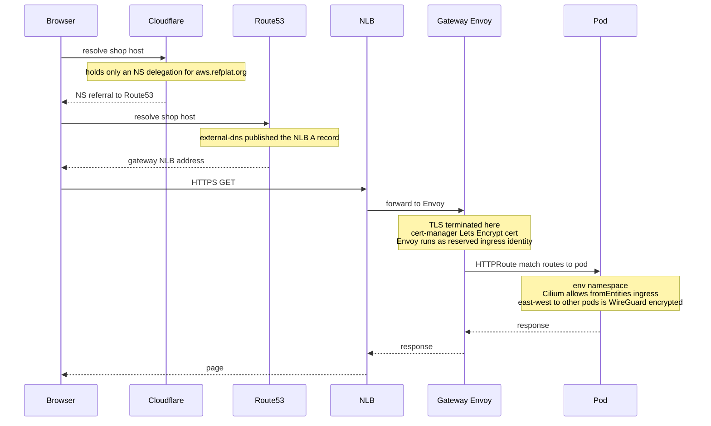

# The Life of a Request

> **A spine doc — the data plane in motion.** [The Life of a Deployment](life-of-a-deployment.md) followed
> one `git push` through the *control* plane — the machinery that makes things *exist*. This follows one
> *user request* through the *data* plane — the machinery that *serves* them. They're the two halves of the
> platform in motion; read the deployment one first. Long-form, like all spine docs.

## The question

Your fix is live. Now a real customer opens their browser and hits
`https://shop-alpha-dev.preprod.aws.refplat.org`. A few dozen milliseconds later they have a page.

**What happened in those milliseconds — between their browser and your pod?** And, just as revealing:
**what *didn't* happen?** Because the answer to the second question is the whole point of this doc, and it's
the cleanest way to understand the single most important boundary in the platform.

## The one idea: this is the *data* plane, and it barely touches the control plane

Follow the request all the way through and you'll notice something striking: **it never talks to ArgoCD.
Never talks to Crossplane. Never talks to Kyverno.** None of the control planes that *built* this
environment are in the request's path at all. The request flows through the **running result** of all that
machinery — not the machinery itself.

That's the **control plane / data plane** split from [How the Platform Fits](how-the-platform-fits.md), and
a live request is the clearest way to feel it:

> **The control plane *makes things exist and keeps them healthy*. The data plane *serves actual users*.**
> A deployment is a control-plane event (ArgoCD, Crossplane, Kyverno, Rollouts *deciding* what should run).
> A request is a data-plane event (DNS, the gateway, Cilium, your pod *carrying real traffic*). Different
> planes, different components, different failure consequences.

<!-- -->

> Hold the whole journey with a metaphor from the last doc, extended: the deployment **built and staffed an
> office building** — poured the foundation, wired it, hired the staff (all control plane). A request is a
> **visitor walking in to be served** (data plane). The builders and the facilities managers aren't in the
> room when the visitor is helped; the *building they made* does the work. **Where it breaks:** unlike a
> real building, this one is still being continuously re-inspected and self-healed *while* visitors are
> served — the control plane never fully leaves, it just isn't *in the request path*.

Let's walk the visitor in.

## Watch it happen — one request, edge to pod and back

Follow one HTTP GET to `shop`'s `web` service, from the customer's browser to the response.

Here's the whole path at a glance — edge to pod and back — before we walk each hop:

**1 · DNS — finding the door.** The browser first has to turn `shop-alpha-dev.preprod.aws.refplat.org` into
an IP address. That name exists because **external-dns** published a Route53 record for it when the
`HTTPRoute` was created — pointing at the cluster's **shared** gateway load balancer (one gateway, with a
wildcard `*.<domain>` listener, fronts *every* environment's routes). *This is looking up the building's
address before you drive there.* The browser now has an IP: the gateway.

**2 · The edge — arriving at the gateway.** The request lands on the gateway's network load balancer, which
fronts **Cilium's built-in Envoy proxy** — the single ingress point for external traffic into the cluster.
*The front entrance of the building.* (On preprod, tenant apps are internet-facing for external testing and
demos; platform and internal services instead sit behind a Tailscale-only internal gateway — same
machinery, a different door.)

**3 · TLS — the sealed envelope is opened.** Envoy terminates **TLS** using a certificate **cert-manager**
obtained and auto-renews. From here in, the request travels the cluster's private network. *The courier's
sealed envelope is opened at the front desk by someone authorized to read it.* Notice: Envoy acts under a
special reserved Cilium identity — **`ingress`** — which matters in two steps' time.

**4 · The HTTPRoute — the receptionist routes you.** Now the [Gateway API](https://gateway-api.sigs.k8s.io/)
does its job. An **HTTPRoute** matches the request's Host (`shop-alpha-dev…`) and path and picks the backend:
`shop`'s `web` Service. *The receptionist reads your appointment and sends you to the right floor.*

And here is the **one place this story touches the deployment story.** If `shop` is mid-rollout, that
HTTPRoute is **weighted** — [Argo Rollouts](https://argo-rollouts.readthedocs.io/en/stable/), via its
Gateway-API traffic-router plugin, has edited the route so that (say) 10% of requests go to the *canary*
version and 90% to *stable*. So *this very request* is assigned to canary-or-stable **by a weight the
control plane set.** *Reception waves some visitors into the newly-renovated wing and some into the original
— deciding per visitor.* The [canary analysis](life-of-a-deployment.md) you read about earlier is watching
what happens to these exact requests.

> **Quick check:** the request never spoke to Argo Rollouts — so how did a *deployment* decision (10% to
> canary) end up steering a live request? *(Rollouts, a control plane, expressed its decision by editing the
> **HTTPRoute weights** — a data-plane object. The control plane changes the data plane's configuration,
> then steps out of the request path. The request just follows the weights it finds.)*

**5 · Network policy — the security checkpoint.** Before the traffic reaches a pod, **Cilium** checks its
network policy: is the source — Envoy's **`ingress`** identity — *allowed* to reach `shop-web`'s pods? The
environment's `CiliumNetworkPolicy` must explicitly permit `fromEntities: [ingress]`, or the packet is
dropped. *A badge reader at the floor's entrance: even inside the building, you don't get in without the
right credential.* (This is a data-plane wall from [the security model](the-security-model.md) — least-
privilege connectivity, enforced on every packet.)

**6 · Service to pod — the elevator dispatcher.** The Service is a `ClusterIP`, and Cilium — running
**[kube-proxy replacement](https://docs.cilium.io/en/stable/overview/intro/) in eBPF** (there is no
kube-proxy here) — load-balances the connection to one *healthy* pod of whichever `shop-web` Service
(stable or canary) the weighted `HTTPRoute` already picked back in step 4, honoring the readiness gates.
*The dispatcher sends you to an available, staffed floor — never a dark one.*

**7 · The pod serves — the actual work.** Finally the request reaches your application code, and it does the
thing: renders the page. If it needs AWS along the way — read its S3 bucket, enqueue a job — it uses the
credentials it got from **Pod Identity** (short-lived, scoped, no static keys). If it needs *another
service* — say it calls a `checkout` API — that's an **east-west** hop, allowed (or denied) by Cilium
network policy between pods, **encrypted on the wire** (WireGuard) and, where a policy sets
`authentication.mode: required`, **mutually authenticated** so the two services cryptographically prove who
they are (SPIFFE identity via SPIRE). *(This is the live `alpha-shop → alpha-checkout` showcase —
[ADR-057](../../adrs/057-service-identity-and-east-west-zero-trust.md); fleet-wide enforcement is the
remaining step.)*

**8 · Observability — the CCTV and the logbook.** The entire time, the request is being *watched* without
anyone instrumenting it by hand: **[OpenTelemetry](https://opentelemetry.io/docs/)** / eBPF auto-
instrumentation records a **trace** of the request's path, **RED metrics** (rate, errors, duration) tick up,
and logs are captured. *Security cameras and a visitor logbook that write themselves.* This is the same data
feeding the SLO and — if `shop` is mid-rollout — the canary analysis deciding whether the new version lives.

**9 · The response — back out the door.** The pod's response retraces the path: back through Cilium, back to
Envoy, back out the load balancer, back to the browser. Milliseconds after they clicked, the customer has
their page — and has no idea any of the above happened. *Which is exactly the goal.*

> **Quick check:** list the components that touched this request. Now list the ones from
> [The Life of a Deployment](life-of-a-deployment.md) that *didn't*. *(Touched: DNS/Route53, the NLB, Envoy,
> cert-manager's cert, the HTTPRoute, Cilium (policy + eBPF LB), your pod, Pod Identity, observability.
> **Absent:** ArgoCD, Crossplane, Kyverno, the Gate, CI. The control plane set the stage and left.)*

## Why the two planes being separate is the whole point

Line up who was involved in each "life" and the platform's most important safety property falls right out:

| | Control plane (a deployment) | Data plane (a request) |
| --- | --- | --- |
| Job | make things exist, keep them healthy | serve real user traffic |
| Cast | ArgoCD · Crossplane · Kyverno · Rollouts · CI | DNS · Envoy · Cilium · your pod · Pod Identity |
| Triggered by | a git change | a user's click |
| If it's down | *new* changes can't be made | **traffic stops** |

That last row is the payoff, and it's the **air-traffic-control** metaphor from
[the security model](the-security-model.md) made literal: **if the control plane goes dark, planes already
in the air keep flying.** ArgoCD down? Existing requests still serve — you just can't *deploy*. Crossplane
down? Running environments still take traffic — you just can't *provision new ones*. The request path
depends on almost none of the control plane, *by design*, so the blast radius of a control-plane outage is
"can't change things," not "everything is down." Separating the planes is what buys that.

The one deliberate coupling — the HTTPRoute weight — is worth appreciating for how *clean* it is: the
control plane doesn't sit in the request path steering traffic packet-by-packet; it just *edits a piece of
data-plane config* (the route weights) and lets the data plane carry it out. Configure-then-step-back, the
same instinct as everything else on the platform.

## Common mix-ups

- **"The gateway load-balances to my pods."** The gateway (Envoy) routes by Host/path to a *Service*;
  **Cilium's eBPF** does the actual pod-level load-balancing (there's no kube-proxy). Two different jobs.
- **"Argo Rollouts sits in the traffic path during a canary."** No — it *edits the HTTPRoute weight* and
  leaves. The data plane routes each request by the weight it finds; Rollouts just watches the metrics.
- **"A request goes through Kyverno."** Kyverno is *admission* — it gates resources being *created*, not
  requests being *served*. It's nowhere near the data path.
- **"If ArgoCD is down, the site is down."** The site keeps serving; you just can't deploy changes.
  Control-plane availability ≠ data-plane availability.

## Recap — say it back

Try it cold: *what happens when a user hits my service, and what doesn't?* If you can say —

> "The browser resolves the host via **Route53** (published by external-dns) → hits the gateway **NLB** →
> **Envoy** terminates TLS → an **HTTPRoute** routes by Host to my Service (**weighted** by Rollouts if I'm
> mid-canary) → **Cilium** checks network policy (`fromEntities: [ingress]`) and eBPF-load-balances to a
> healthy pod → my code runs, using **Pod Identity** for AWS → **OpenTelemetry** traces it → the response
> flows back. And the whole time it touched **none** of the control plane — ArgoCD, Crossplane, Kyverno set
> the stage and stepped out — which is *why a control-plane outage can't take the site down*" —

— then you hold both halves of the platform in motion: the control plane that *builds*, and the data plane
that *serves*, and the clean seam between them.

## Go deeper

- The other half — the control plane in motion: [The Life of a Deployment](life-of-a-deployment.md).
- The standing structure both move through: [How the Platform Fits](how-the-platform-fits.md) (see the
  control-plane / data-plane boundary) · [The Security Model](the-security-model.md) (the data-plane walls:
  network policy, mTLS gap).
- The planes as full modules *(coming — [inventory](../_inventory.md))*: Ingress & traffic (Gateway API,
  cert-manager), the cluster & CNI (Cilium), Progressive delivery (Rollouts), Observability.
- The substrate: [Gateway API](https://gateway-api.sigs.k8s.io/) · [Cilium](https://docs.cilium.io/en/stable/overview/intro/) ·
  [cert-manager](https://cert-manager.io/docs/) · [Argo Rollouts](https://argo-rollouts.readthedocs.io/en/stable/) ·
  [OpenTelemetry](https://opentelemetry.io/docs/).
