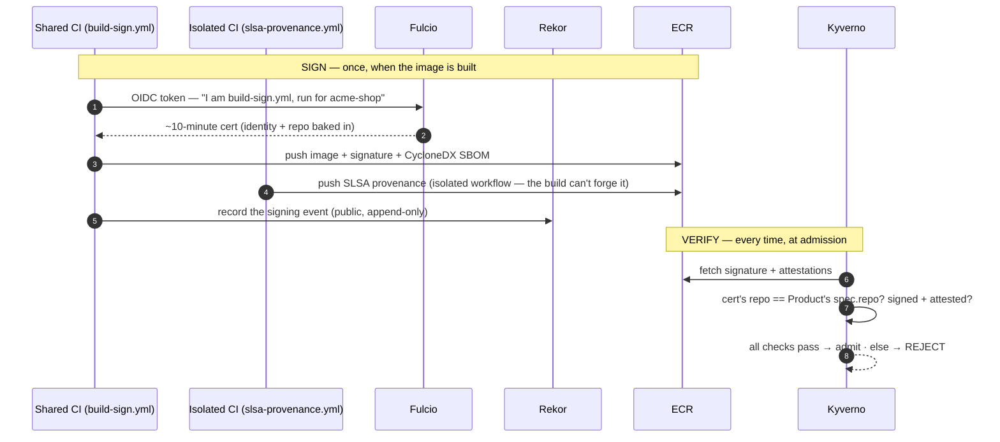

# Learn: Supply Chain — orientation

How the platform knows an image is trustworthy — that it's really your code, built by a CI you trust, and
hasn't been tampered with — and how it refuses to run anything that isn't. This is the produce side of the
trust story. The enforce side — the cluster rejecting an unsigned image — lives in
[Policy & Admission](../policy/orientation.md). This side is how the signed, attested, provenance-carrying
image gets made in the first place.

## The question

An image sitting in a registry is just a blob of bytes with a name. How does the cluster know a given blob is
really `shop`'s code, built by `shop`'s CI from `shop`'s repo — and not something a compromised laptop, a
poisoned dependency, or a malicious PR slipped in under the same name? You can't trust the name; names can be
pushed over. This is the whole problem the software supply chain worries about — SolarWinds made it a
board-level question: what actually makes an artifact trustworthy, and who checks?

## Trust provenance, not names — verify at the door

The model inverts the naive assumption:

> An image isn't trusted because of what it's *called*. It's trusted because it carries **cryptographic
> proof** of where it came from and how it was built — a signature and a provenance record — produced by a
> shared CI the app team can't tamper with, and the cluster refuses to run anything whose proof doesn't check
> out.

Three moving parts, and you can see all three on a real image with one command. Here's acme's live `shop-web`
image, inspected with `cosign`:

```console
$ cosign tree <platform-acct>.dkr.ecr.us-east-1.amazonaws.com/team-acme/shop-web@sha256:f6b37d…
📦 Supply Chain Security Related artifacts …
└── 🔐 Signatures for an image …          ← it's SIGNED
└── 💾 Attestations for an image …        ← it carries 2 ATTESTATIONS (SLSA provenance + SBOM)
```

And who signed it, and from where — the trust anchor, pulled from the signing certificate:

```console
$ cosign verify … team-acme/shop-web@sha256:f6b37d…
Issuer:  https://token.actions.githubusercontent.com          ← keyless: signed by a GitHub Actions OIDC identity
Subject: …/asanexample/trusted-ci/.github/workflows/build-sign.yml@…   ← the SHARED signing workflow
githubWorkflowRepository: asanexample/acme-shop              ← built from shop's OWN repo (the trust anchor)
```

Those three facts are the supply-chain model:

1. **It's signed, keylessly.** No private key was used, so there's nothing to steal. The signer is a GitHub
   Actions OIDC identity, cert issued on the spot.
2. **The signer is the shared `trusted-ci/build-sign.yml` workflow** — not `shop`'s own hand-rolled CI.
3. **The cert carries `githubWorkflowRepository: asanexample/acme-shop`** — proof the build ran from shop's
   declared repo. That's what the cluster checks against.

## Keyless signing — no key to steal

Traditional signing has a fatal operational flaw: a private key. Wherever you keep it, it can be stolen — and
then anyone can sign anything as you, and the forgeries are indistinguishable from the real thing. This isn't
hypothetical. In the [SolarWinds attack](https://www.sonatype.com/blog/software-supply-chain-attacks-solarwind-how-developers-fortify-apps),
the malicious updates were properly signed: attackers had compromised the build and were using the company's
own signing key, so ~18,000 organizations installed a backdoor that verified perfectly. A stolen key doesn't
just fail to help — it makes the forgery *more* trusted. That's the flaw keyless removes: no long-lived key,
nothing to steal.

So the platform signs keylessly ([cosign](https://docs.sigstore.dev/cosign/signing/overview/) /
[Sigstore](https://www.sigstore.dev/)). Instead of a stored key, the CI job proves who it is with a
short-lived OIDC identity (the GitHub Actions token — "I am the `build-sign` workflow of this run"), a
certificate authority (Fulcio) issues a signing certificate with that identity baked in, the artifact is
signed, and the event is recorded in a public transparency log (Rekor). The certificate lives about ten
minutes — long enough to sign, too short to steal, and short enough that there's no revocation to manage: it's
worthless before anyone could misuse it. No standing secret exists anywhere.

The transparency log is what makes keyless trustworthy at scale. Every signature is written to a public,
append-only ledger, so a signature can't be quietly forged or backdated after the fact, and if a signing
identity were ever misused the evidence is public and permanent. It upgrades "trust the signer" to "trust the
signer, and let anyone audit that they signed exactly this, exactly then." Non-repudiation, for free.

> Think of the difference between a rubber stamp and signing in person with your ID checked. A rubber stamp (a
> private key) can be copied or stolen, and then forgeries are indistinguishable. Keyless is the notary who
> checks your live ID, watches you sign, and logs it in a public ledger — the authority comes from who you
> provably were at that moment, not from an object anyone could pocket. **Where it breaks:** keyless proves
> identity and integrity — that this workflow really produced this artifact — not that the code is good; a
> legitimately-signed image can still contain a bug (or a poisoned dependency the build didn't know about).

The "no standing key" instinct is the same one behind Pod Identity in [Identity & access](../identity/orientation.md)
— the platform's allergy to long-lived secrets, applied to the build.

## Provenance & SBOM — the artifact's notarized passport

A signature proves who made it. The attestations prove how and from what, and there are two:

- **SLSA provenance** — a signed statement of the build: which repo, which commit, which workflow produced
  this exact digest. It's SLSA Build L3: the
  provenance is generated in an isolated workflow the app team cannot write to, so the build can't forge its
  own paperwork. That isolation is the difference between "the build says it's fine" and "an independent,
  tamper-resistant process attests it." ([SLSA](https://slsa.dev/spec/v1.0/levels) grades this on a ladder —
  L1 merely has provenance, L2 adds a signed hosted build, L3 adds the isolation that stops a build forging
  its own; L3 is the bar worth clearing.)
- **SBOM** — a Software Bill of Materials (ours is [CycloneDX](https://cyclonedx.org/specification/overview/),
  the OWASP security-first format whose package identifiers map straight to vulnerability databases): the
  ingredient list of what's inside the image, so "which of our images ship `log4j 2.14`?" is a query, not a
  fire drill. Both attestations are [in-toto](https://in-toto.io/) statements — a signed claim about an
  artifact — stored beside the image and keyed to its digest.

> If the signature is the tamper-evident seal, the provenance is the notarized chain of custody stapled to the
> crate — made in this workshop, from these materials, on this date, by this worker — co-signed by a registrar
> (Rekor) nobody in the workshop controls.

The image is signed and has valid provenance, so why can a poisoned dependency still get through? Because
signing and provenance prove origin and integrity — this really is shop's CI's output from shop's repo — not
innocence. A dependency compromised upstream is legitimately built and signed. That's the hole the
[security model](../spine/the-security-model.md)'s threat-walk names, and why signing is one layer, not the
whole defense.

## The thin-caller model — teams don't build this, they call it

Developers find this part surprising: `shop`'s CI doesn't implement any of the above. The signer earlier was
`asanexample/trusted-ci/build-sign.yml`, not a workflow in the shop repo. That's the design: the entire
supply-chain backbone — build →
push to ECR → cosign-sign → provenance → SBOM — lives in one shared, reusable workflow the platform owns, and
each app's CI is a thin caller of it.

Two things follow:

- **Consistency.** Every product's images are signed and attested the same way, because they all go through
  the same workflow. No team reinvents (or subtly weakens) supply-chain security.
- **App teams can't lower the bar.** The signing workflow lives in a repo the app team can't write to, so
  they can't disable signing, swap the signer, or forge provenance — even if they wanted to, or were
  compromised. The security is inherited, not implemented.

## Trust from the repo — why this signature counts

A signature is only useful if something decides which signatures to trust. The platform's rule is precise and
registry-derived: an image is trusted only if its signing cert's `githubWorkflowRepository` matches the
Product's own declared repo. `shop`'s images must be signed from a build that ran in `asanexample/acme-shop`
(shop's `spec.repo` in the Product registry); a signature from any other repo, even a validly-signed one, is
rejected. Trust is per-product, derived from the registry — not a blanket "any signed image is fine."

## Verify at the door — where the enforce side hooks in

Producing the proof is half the story; checking it is the other. On admission, Kyverno fetches the signature
and attestations from ECR and enforces them — `verify-images-product-<team>-<product>` (signed, correct repo)
and `verify-attestations-product-<team>-<product>` (SBOM + SLSA present), both Enforce on preprod. An image
that isn't signed, isn't attested, or was signed from the wrong repo never gets admitted. That's the
[Policy & Admission](../policy/orientation.md) module's job: supply chain produces the proof, policy verifies
it — two halves of one control.

So the full loop: shared CI signs keylessly and attaches provenance/SBOM → ECR stores them → Kyverno verifies
at admission against the product's repo → only then does it run. Seen end to end:



The signing half runs once per image; the verify half runs every time a pod is admitted — so a tampered or
wrong-repo image is caught even if it somehow reached the registry.

## When it breaks — the ones you'll actually hit

- **"My image is signed but admission rejects it."** Check the repo in the cert against the Product's
  `spec.repo` — a signature from the wrong (or renamed) repo is treated as untrusted, by design. Confirm both
  the signature and the attestations are present (`cosign tree`); the attestation policy is separate from the
  signature policy.
- **"I didn't sign anything and it still works."** Correct — you're a thin caller; the shared workflow signs
  for you. If it's not signed, you're probably not calling the shared workflow, or you're bypassing it.
- **"Signing is green but the image is vulnerable."** Signing proves origin, not safety — necessary, not
  sufficient. [SLSA's own threat model](https://slsa.dev/spec/v1.0/threats) draws the boundary explicitly: it
  defends against tampering with the build, not a malicious author or a poisoned upstream dependency, both of
  which produce a legitimately signed image. Catching those is the job of the SBOM (feeding vulnerability
  scanning) and runtime controls, layered on top.

## For developers: what you actually do

You don't implement any of this. To get signed, attested, provenance-carrying images, call the shared
`build-sign` workflow from your app's CI — a few lines; the `supply-chain-onboarding` skill has the exact
snippet. Your images come out signed and attested from your own repo, and the cluster requires it, so you
can't accidentally ship an unverifiable image. You never touch a signing key, because there isn't one.

## Go deeper

- The full mechanism + gotchas: the [Reference](reference.md).
- The *enforce* half: [Policy & Admission](../policy/orientation.md); the whole flow:
  [The Life of a Deployment](../spine/life-of-a-deployment.md); the threat framing:
  [The Security Model](../spine/the-security-model.md).
- Onboard your app (the thin-caller snippet): the `supply-chain-onboarding` skill.
- The concepts, explained well (none of this is obvious the first time — these are the on-ramps):
  - [How Sigstore's keyless trust works](https://docs.sigstore.dev/about/security/) — the Fulcio + Rekor +
    OIDC trust root, and why a ~10-minute cert needs no revocation.
  - [The Rekor transparency log](https://docs.sigstore.dev/logging/overview/) — how a public append-only log
    makes signing non-repudiable and mis-issuance detectable (the same idea as Certificate Transparency for
    the web).
  - [SLSA — what the levels mean](https://slsa.dev/spec/v1.0/levels), and crucially
    [the SLSA threat model](https://slsa.dev/spec/v1.0/threats) — exactly which supply-chain attacks
    provenance does and doesn't stop. Gentler on-ramp:
    [Chainguard Academy's SLSA intro](https://edu.chainguard.dev/compliance/slsa/what-is-slsa/).
  - [in-toto attestations](https://in-toto.io/) (the signed-claim framework) ·
    [CycloneDX](https://cyclonedx.org/specification/overview/) (our SBOM format) ·
    [cosign](https://docs.sigstore.dev/cosign/signing/overview/) (the tool).
  - [The SolarWinds attack, for developers](https://www.sonatype.com/blog/software-supply-chain-attacks-solarwind-how-developers-fortify-apps)
    — a stolen signing key is the whole reason keyless exists.
