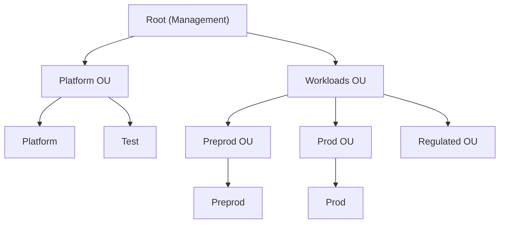
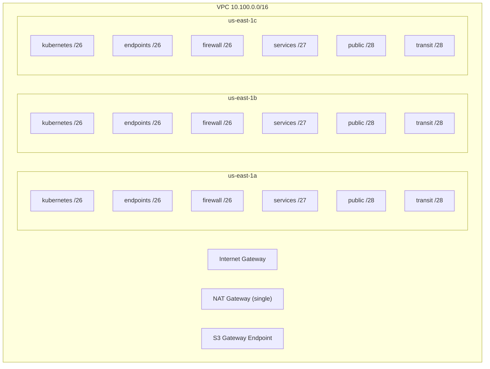
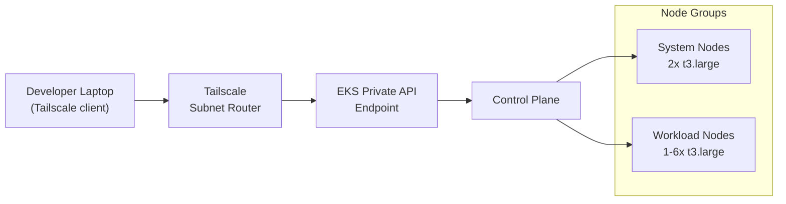
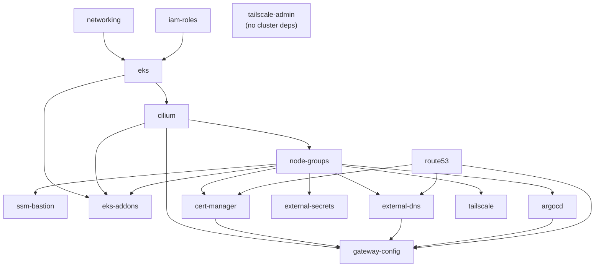
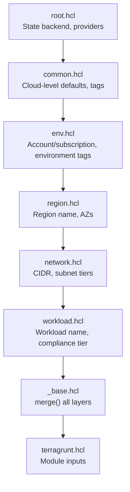

# Architecture Overview

## Design Principles

1. **Infrastructure as Code** -- all infrastructure is defined in
   OpenTofu modules managed by Terragrunt. No manual configuration.
2. **Modularity** -- infrastructure is decomposed into single-purpose
   modules (networking, EKS, IAM roles, etc.) composed via Terragrunt
   dependency graphs.
3. **Multi-cloud portability (AWS-first)** -- shared modules (Cilium, ArgoCD,
   cert-manager, etc.) are cloud-agnostic. Cloud-specific modules live under
   `infra/modules/aws/` today (`azure/`, `gcp/` are planned). Live units handle
   cloud-specific provider configuration.
4. **Hierarchical configuration** -- settings are defined at the broadest
   applicable layer (cloud, environment, region, workload) and merged at
   apply time. Later layers override earlier ones.
5. **Least privilege** -- IAM roles are purpose-built (PlatformAdmin,
   PlatformDeployer, per-team DeveloperAccess-\<team\>). SCPs enforce guardrails at the
   organization level.
6. **BYOCNI** -- Cilium replaces the default CNI (ENI mode on AWS;
   `kubeProxyReplacement = true`) for consistent network policy, Hubble
   observability, and eBPF-based networking. Designed to extend to other clouds
   (e.g. overlay mode) when they land.

## Implementation Status

| Cloud | Status | What's Deployed |
|-------|--------|-----------------|
| AWS | **Live** | **Platform** account: full EKS hub in us-east-1 (networking, IAM, EKS, Cilium, node groups, ArgoCD, cert-manager, external-dns/secrets, Kyverno, Tailscale, gateway ingress, **observability + Mimir**). **Preprod** account: a full tenant cluster (EKS, Cilium, tenants/Kyverno-Enforce, public gateway, **Falco**, Pod Identity). **Prod** account: networking + org scaffolding (no cluster yet). |
| Azure | **Planned** | No `live/azure` or `modules/azure` exists yet. The shared modules and config hierarchy are parameterized so Azure can be added without restructuring (ADR-001/008). |
| GCP | **Planned** | Same as Azure — reserved in the CIDR plan (ADR-015), not yet present. |

## AWS Architecture

### Account Structure

The AWS Organization has five accounts across three organizational units:

| Account | ID | Purpose |
|---------|-----|---------|
| Management | <MGMT_ACCOUNT_ID> | Organizations, Identity Center, Terraform state, GitHub OIDC |
| Platform | <PLATFORM_ACCOUNT_ID> | EKS cluster, platform services, IAM roles |
| Test | <TEST_ACCOUNT_ID> | Terratest CI execution (GitHub Actions) |
| Preprod | <PREPROD_ACCOUNT_ID> | Workload pre-production (networking only) |
| Prod | <PROD_ACCOUNT_ID> | Workload production (networking only) |

**Service Control Policies** are attached per OU:

- **Root**: baseline-guardrails, protect-security-services, enforce-encryption, deny-regions
- **Platform**: protect-data-and-network
- **Workloads**: protect-data-and-network, require-tagging, restrict-iam-users

### IAM Roles

| Role | Account | Trust | Purpose |
|------|---------|-------|---------|
| PlatformAdmin | Platform, PreProd | SSO AdministratorAccess | kubectl operate/debug + SSM tunnel — least-privilege, not author (ADR-040) |
| PlatformDeployer | Platform | mgmt account | Terragrunt apply, Helm/K8s providers (2hr sessions) |
| DeveloperAccess-\<team\> | PreProd | team's `Dev-<team>` SSO set | Per-team namespace-scoped kubectl (one per team; ADR-039) |
| TerraformStateAccess | Management | PlatformDeployer | S3 state bucket + DynamoDB lock table |

Authentication flows through AWS IAM Identity Center (SSO) with three
permission sets (AdministratorAccess, PowerUserAccess, ReadOnlyAccess)
assigned to groups (Admins, Developers, ReadOnly).

### Network Topology

The platform account VPC uses a multi-AZ, multi-tier subnet layout:

| Subnet Tier | Size | Scope | Purpose |
|-------------|------|-------|---------|
| kubernetes | /26 (62 IPs) | Private | EKS node groups and pods |
| endpoints | /26 (62 IPs) | Private | VPC endpoints, private links |
| firewall | /26 (62 IPs) | Private | Network firewall (future) |
| services | /27 (30 IPs) | Private | Internal services, load balancers |
| public | /28 (14 IPs) | Public | NAT gateway, bastion, public ALBs |
| transit | /28 (14 IPs) | Private | Cross-account/cross-region peering (future) |

VPC Flow Logs ship to CloudWatch with 30-day retention. An S3 gateway
endpoint reduces NAT costs for S3 traffic.

CIDR allocation follows a per-environment `/16` scheme:

| Environment | VPC CIDR |
|-------------|----------|
| Platform | `10.100.0.0/16` |
| Preprod | `10.101.0.0/16` |
| Prod | `10.102.0.0/16` |

### EKS Cluster and Platform Services

The platform account runs a single EKS cluster (`platform-use1-eks`,
Kubernetes 1.35) with a private-only API endpoint. Developer access is
via Tailscale VPN; SSM tunnel is the fallback.

**Node groups:**

| Group | Instance Type | Min | Max | Labels |
|-------|--------------|-----|-----|--------|
| system | t3.large | 2 | 4 | `node-role=system` |
| workload | t3.large | 1 | 6 | `node-role=workload` |

**Platform services deployed via Helm:**

| Service | Chart Version | Purpose |
|---------|--------------|---------|
| Cilium | 1.19.4 | CNI (ENI mode, `kubeProxyReplacement`, Hubble observability) |
| ArgoCD | 9.5.14 | GitOps continuous delivery, SSO via Identity Center SAML |
| cert-manager | 1.17.1 | TLS certificate management (Let's Encrypt, DNS01 via Route53) |
| external-dns | 1.16.1 | DNS record sync to Route53 |
| external-secrets | 0.14.3 | Secrets from AWS Secrets Manager + SSM Parameter Store |
| Kyverno | 3.8.1 | Policy engine — `validate` + `mutate` + cosign image/attestation verification (Enforce) above the PSA baseline floor |
| Tailscale Operator | 1.96.5 | Mesh VPN subnet router for private cluster access |
| kube-prometheus-stack | 86.1.0 | Observability hub: Prometheus + Grafana + Alertmanager (platform) |
| Grafana Mimir | 6.0.6 | Durable, S3-backed, multi-tenant metrics store (platform) |
| Falco | 9.0.0 | Runtime threat detection (preprod) |

All Helm chart versions are pinned in `infra/live/aws/_versions.hcl`.

**Deployment dependency graph:**

EKS uses BYOCNI (`bootstrap_self_managed_addons = false`), so Cilium
must be deployed before node groups can join the cluster. EKS managed
add-ons (coredns) are in a separate `eks-addons` unit that depends on
Cilium and node-groups, since addon pods need the CNI to schedule.

### DNS

Route53 hosts the `aws.refplat.org` subdomain. Cloudflare manages the
parent `refplat.org` zone and delegates via NS records. external-dns
syncs Kubernetes ingress/service records to Route53. cert-manager uses
Route53 DNS01 challenges for Let's Encrypt certificates.

### Private Cluster Access

The EKS API endpoint is private-only. Two access methods:

1. **Tailscale VPN** (primary) -- the Tailscale Operator runs as a subnet
   router advertising `10.100.0.0/16` to the tailnet. Split DNS routes
   `*.eks.amazonaws.com` to the VPC DNS resolver. Developers install
   Tailscale, join the tailnet, and `kubectl` works directly.
2. **SSM tunnel** (fallback) -- `scripts/eks-tunnel.sh` opens a port
   forward through the SSM bastion to the cluster endpoint.

## Azure / GCP (Planned)

Azure and GCP are **not deployed** and there are no `modules/azure`, `modules/gcp`,
`live/azure`, or `live/gcp` trees today. The platform is multi-cloud *by design*:
the shared modules (Cilium, ArgoCD, cert-manager, External Secrets, tenant, etc.)
are cloud-agnostic, the live hierarchy is cloud-parameterized (`live/{cloud}/…`),
and the CIDR plan reserves non-overlapping ranges per cloud (ADR-015), so a second
cloud can be added without restructuring. When Azure lands it would reuse the shared
modules with cloud-specific modules under `modules/azure/` and an
`environment_subscription_map` mirroring the AWS account map (see ADR-008, ADR-001).

## Configuration Hierarchy

The layered configuration pattern (AWS today; the same shape applies per cloud):

Tags, module sources, and Helm versions are composed from these layers.
`_base.hcl` merges tags and exposes all computed locals to live units via
`include.base.locals.*`. Safety validations assert that directory paths
match the declared environment and account ID.

See [Configuration Hierarchy](../../docs/architecture/config-hierarchy.md)
for the full breakdown.

## State Management

| Cloud | Backend | Location |
|-------|---------|----------|
| AWS | S3 + DynamoDB | state bucket (from `secrets.hcl`) in us-east-1, `terraform-locks` lock table |

(An Azure Blob backend would be added when Azure lands; the `root.hcl` backend is
unconditionally `s3` today.)

State paths follow the directory structure:
`{env}/{region}/{workload}/{unit}/terraform.tfstate`. The S3 bucket and
DynamoDB table are bootstrapped by the `state-bootstrap` unit in the
management account. Encryption is enabled on both backends.

The `TerraformStateAccess` role in the management account grants the
`PlatformDeployer` role cross-account access to the state bucket and
lock table.

## Technology Stack

| Component | Version |
|-----------|---------|
| OpenTofu | >= 1.6.0 (CI uses 1.9.0; 1.11 in use locally) |
| Terragrunt | Latest (installed in CI from GitHub releases) |
| AWS Provider | 6.47.0 |
| Helm Provider | >= 3.0 |
| Kubernetes Provider | >= 2.35.0 |
| Tailscale Provider | ~> 0.29 |
| Kubernetes | 1.35 (EKS) |
| Go (tests) | 1.22+ |

## Next Steps

Continue to [Infrastructure as Code Approach](03-infrastructure-as-code.md)
to understand how the architecture is implemented using OpenTofu and
Terragrunt.
