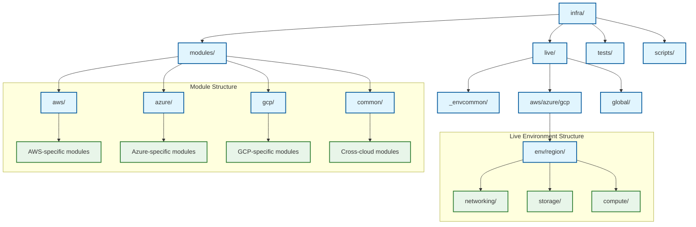
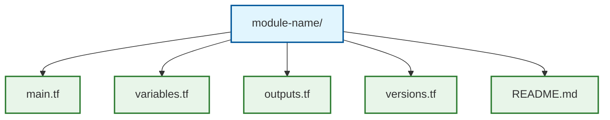
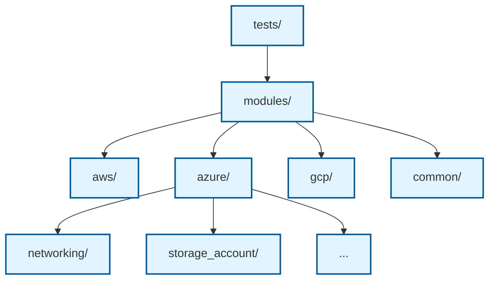
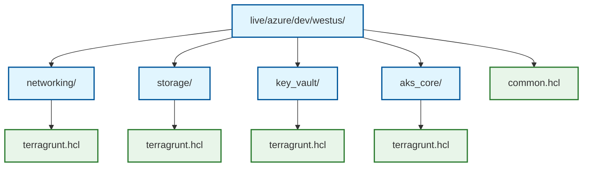
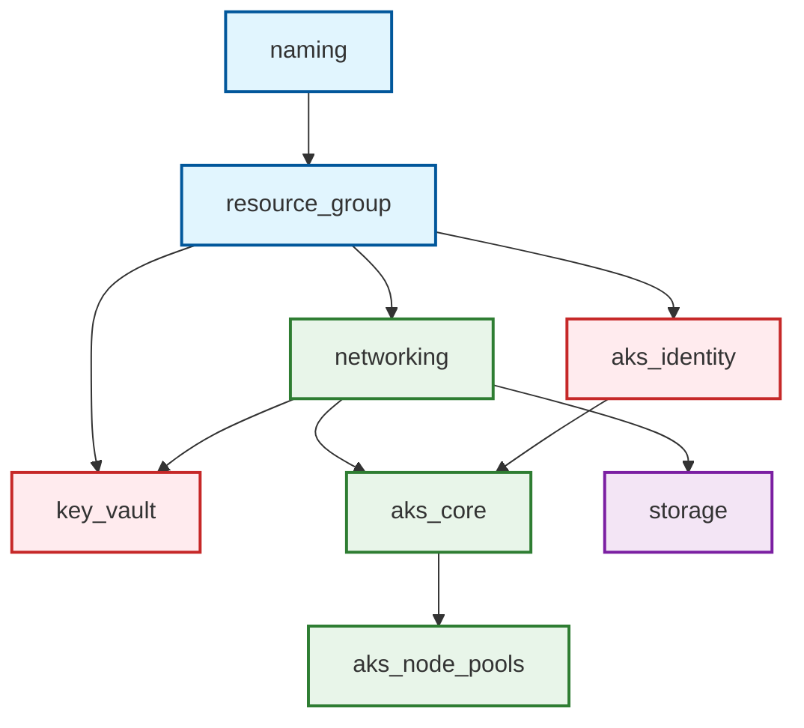

# Infrastructure as Code Approach

## Overview

The VIP Platform adopts a comprehensive Infrastructure as Code (IaC) approach using Terraform and Terragrunt to define, deploy, and manage all cloud resources. This approach ensures consistency, repeatability, and maintainability across all environments and cloud providers.

## Core Technologies

### Terraform

[Terraform](https://www.terraform.io/) is an open-source IaC tool that allows us to define infrastructure resources using a declarative configuration language. The platform uses Terraform for:

- Defining cloud resources using HCL (HashiCorp Configuration Language)
- Managing infrastructure state
- Planning and applying infrastructure changes
- Testing infrastructure configurations
- Validating security and compliance requirements

The minimum required Terraform version for this project is 1.6.0, which provides essential features like:

- Enhanced testing capabilities
- Improved validation functionality
- Enhanced provider abstraction

### Terragrunt

[Terragrunt](https://terragrunt.gruntwork.io/) is a thin wrapper for Terraform that provides additional features to enhance the Terraform experience. We use Terragrunt for:

- Keeping Terraform configurations DRY (Don't Repeat Yourself)
- Managing remote state configuration
- Implementing dependencies between Terraform modules
- Executing commands across multiple Terraform modules
- Providing consistent environment-specific variables

The minimum required Terragrunt version is 0.53.0.

## Project Structure

The VIP Platform follows a well-organized directory structure to manage infrastructure code:



### Modules Directory

The `modules` directory contains reusable Terraform modules organized by cloud provider:

- **AWS Modules**: Specific to AWS resources and patterns
- **Azure Modules**: Specific to Azure resources and patterns
- **GCP Modules**: Specific to GCP resources and patterns
- **Common Modules**: Cloud-agnostic patterns and abstractions

Each module follows a consistent structure:



### Tests Directory

The `tests` directory contains all test configurations for validating infrastructure modules. Tests are organized to mirror the module structure:



The tests directory contains:
- Unit tests for individual modules
- Integration tests for combinations of modules
- Compliance tests for security and best practices

> **Important**: Tests must be placed in the `tests` directory, not within module directories, to maintain separation between implementation and test code.

### Live Directory

The `live` directory contains the actual infrastructure configurations for different environments and regions:

- **_envcommon**: Common configurations shared across environments
- **Global**: Global resources not tied to specific regions
- **AWS/Azure/GCP**: Cloud-specific resources organized by environment and region

Each environment/region directory contains Terragrunt configurations for different infrastructure components:



## Development Workflow

### Module Development

1. **Create Module Template**: Start with a standardized module template
2. **Define Interfaces**: Clearly define input variables and outputs
3. **Write Tests**: Create tests to validate module functionality
4. **Implement Module**: Develop the module implementation
5. **Test and Validate**: Run tests to ensure module works as expected
6. **Document**: Create comprehensive README documentation

### Infrastructure Deployment

1. **Plan Changes**: Review proposed changes with `terragrunt plan`
2. **Apply Changes**: Apply changes with `terragrunt apply`
3. **Validate Deployment**: Verify resources are created correctly
4. **Run Tests**: Execute automated tests to validate infrastructure

## Module Dependencies

Terragrunt manages dependencies between modules to ensure proper deployment order. Below is an example of a typical dependency graph for Azure resources:



This dependency graph ensures that resources are created in the correct order, with foundational resources like resource groups created first, followed by networking resources, and finally application-specific resources.

## Example: Terragrunt Configuration

A typical Terragrunt configuration file (`terragrunt.hcl`) looks like:

```hcl
include "root" {
  path = find_in_parent_folders()
}

include "env" {
  path = find_in_parent_folders("env.hcl")
}

include "region" {
  path = find_in_parent_folders("region.hcl")
}

terraform {
  source = "${get_path_to_repo_root()}/infra/modules/azure/networking"
}

dependency "resource_group" {
  config_path = "../resource_group"
  mock_outputs = {
    resource_group_name = "mock-rg"
  }
}

inputs = {
  resource_group_name = dependency.resource_group.outputs.resource_group_name
  address_space       = ["10.0.0.0/16"]
  
  subnets = {
    "az1-node-subnet" = {
      address_prefix = "10.0.0.0/24"
      security_rules = ["allow_ssh", "allow_http"]
    }
    "az2-node-subnet" = {
      address_prefix = "10.0.1.0/24"
      security_rules = ["allow_ssh", "allow_http"]
    }
  }
}
```

## Example: Module Structure

A typical module implementation looks like:

```hcl
# main.tf

resource "azurerm_virtual_network" "vnet" {
  name                = var.vnet_name
  location            = var.location
  resource_group_name = var.resource_group_name
  address_space       = var.address_space
  
  tags = var.tags
}

resource "azurerm_subnet" "subnet" {
  for_each = var.subnets
  
  name                 = each.key
  resource_group_name  = var.resource_group_name
  virtual_network_name = azurerm_virtual_network.vnet.name
  address_prefixes     = [each.value.address_prefix]
}

resource "azurerm_network_security_group" "nsg" {
  for_each = var.subnets
  
  name                = "${each.key}-nsg"
  location            = var.location
  resource_group_name = var.resource_group_name
  
  tags = var.tags
}

resource "azurerm_subnet_network_security_group_association" "nsg_association" {
  for_each = var.subnets
  
  subnet_id                 = azurerm_subnet.subnet[each.key].id
  network_security_group_id = azurerm_network_security_group.nsg[each.key].id
}
```

## Testing Approach

The VIP Platform uses Terraform's built-in testing framework to validate module functionality:

```hcl
# Example test file: networking/tests/basic.tftest.hcl

variables {
  vnet_name           = "test-vnet"
  resource_group_name = "test-rg"
  location            = "eastus"
  address_space       = ["10.0.0.0/16"]
  
  subnets = {
    "subnet1" = {
      address_prefix = "10.0.0.0/24"
      security_rules = ["allow_ssh"]
    }
  }
}

run "verify_vnet_creation" {
  command = apply
  
  assert {
    condition     = azurerm_virtual_network.vnet.name == "test-vnet"
    error_message = "VNet name did not match expected value"
  }
  
  assert {
    condition     = length(azurerm_subnet.subnet) == 1
    error_message = "Expected 1 subnet to be created"
  }
}
```

## Best Practices

1. **Module Design**:
   - Focus on single responsibility
   - Provide sensible defaults
   - Validate inputs
   - Include comprehensive documentation

2. **Terragrunt Usage**:
   - Keep DRY with common includes
   - Use dependencies for resource references
   - Use mock outputs for testing
   - Maintain consistent directory structure

3. **State Management**:
   - Use remote state with locking
   - Isolate state by environment and component
   - Back up state files regularly
   - Monitor for state drift

4. **Secret Management**:
   - Never store secrets in version control
   - Use Azure Key Vault for secure storage
   - Use environment variables for sensitive inputs
   - Leverage managed identities where possible

5. **Testing**:
   - Write tests for all modules
   - Use both unit and integration tests
   - Include negative test cases
   - Verify resource properties and security configurations

## Next Steps

Continue to [Multi-Cloud Strategy](04-multi-cloud-strategy.md) to understand how the VIP Platform implements a consistent approach across different cloud providers. 