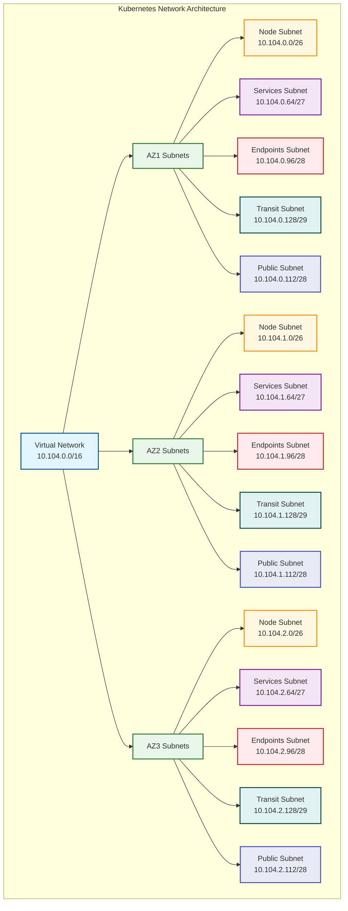

# Kubernetes Network Design

## Overview

The VIP Platform uses a specialized network design for Kubernetes clusters to ensure proper isolation, security, and performance. This document outlines the network architecture, CIDR allocation, and configuration patterns for AKS, EKS, and GKE clusters across all supported environments.

## Design Principles

The Kubernetes network design follows these core principles:

1. **Multi-AZ Deployment**: Distribute Kubernetes resources across multiple availability zones for high availability.
2. **Network Segmentation**: Separate different types of Kubernetes traffic using specialized subnets.
3. **Security by Default**: Apply restrictive security controls with explicit allowances only where needed.
4. **Performance Optimization**: Minimize network hops and latency for cluster communication.
5. **Future-Proof Scaling**: Allocate address space to accommodate future growth.
6. **Cloud Provider Integration**: Leverage native cloud networking capabilities for Kubernetes.

## Network Architecture

The Kubernetes network architecture consists of separate subnets for different functions distributed across availability zones:



### Zone-Based Infrastructure

The infrastructure is divided across three availability zones for high availability:

- **Zone 1 Infrastructure**:
  - Kubernetes Node Subnet: 10.104.0.0/26 (62 IPs)
  - Services Subnet: 10.104.0.64/27 (30 IPs)
  - Endpoints Subnet: 10.104.0.96/28 (14 IPs)
  - Transit Subnet: 10.104.0.128/29 (6 IPs)
  - Public Subnet: 10.104.0.112/28 (14 IPs)

- **Zone 2 Infrastructure**:
  - Kubernetes Node Subnet: 10.104.1.0/26 (62 IPs)
  - Services Subnet: 10.104.1.64/27 (30 IPs)
  - Endpoints Subnet: 10.104.1.96/28 (14 IPs)
  - Transit Subnet: 10.104.1.128/29 (6 IPs)
  - Public Subnet: 10.104.1.112/28 (14 IPs)

- **Zone 3 Infrastructure**:
  - Kubernetes Node Subnet: 10.104.2.0/26 (62 IPs)
  - Services Subnet: 10.104.2.64/27 (30 IPs)
  - Endpoints Subnet: 10.104.2.96/28 (14 IPs)
  - Transit Subnet: 10.104.2.128/29 (6 IPs)
  - Public Subnet: 10.104.2.112/28 (14 IPs)

### Address Space Allocation

Each Kubernetes cluster requires several CIDR ranges:

1. **Node Subnet CIDRs**: For worker node host IPs
2. **Pod CIDR**: For pod IP assignments
3. **Service CIDR**: For Kubernetes service IP assignments
4. **Load Balancer CIDRs**: For cloud load balancer IPs

Example allocations for our AKS cluster in Azure:

| CIDR Type | Address Range | Size | Purpose |
|-----------|---------------|------|---------|
| AZ1 Node Subnet | 10.104.0.0/26 | /26 (62 IPs) | Worker nodes in AZ1 |
| AZ2 Node Subnet | 10.104.1.0/26 | /26 (62 IPs) | Worker nodes in AZ2 |
| AZ3 Node Subnet | 10.104.2.0/26 | /26 (62 IPs) | Worker nodes in AZ3 |
| Pod CIDR | 10.240.0.0/16 | /16 (65,534 IPs) | Pod IP addresses |
| Service CIDR | 10.241.0.0/16 | /16 (65,534 IPs) | Kubernetes service IPs |
| AZ1 Public Subnet | 10.104.0.112/28 | /28 (14 IPs) | Load balancers in AZ1 |
| AZ2 Public Subnet | 10.104.1.112/28 | /28 (14 IPs) | Load balancers in AZ2 |
| AZ3 Public Subnet | 10.104.2.112/28 | /28 (14 IPs) | Load balancers in AZ3 |
| AZ1 Services Subnet | 10.104.0.64/27 | /27 (30 IPs) | Databases and cloud resources in AZ1 |
| AZ2 Services Subnet | 10.104.1.64/27 | /27 (30 IPs) | Databases and cloud resources in AZ2 |
| AZ3 Services Subnet | 10.104.2.64/27 | /27 (30 IPs) | Databases and cloud resources in AZ3 |

## Network Implementation

The VIP Platform currently uses Cilium CNI for Kubernetes networking, providing enhanced security, visibility, and performance through eBPF technology.

### Cilium CNI Implementation

Cilium is implemented using a "bring your own CNI" approach with the following configuration:

- **Network Plugin**: "none" (Bring Your Own CNI)
- **CNI Implementation**: Cilium
- **Pod CIDR Allocation**: Managed by Cilium in separate address space
- **Network Policy**: Cilium Network Policy (extends Kubernetes Network Policy)
- **Service Connectivity**: Azure Load Balancer integration
- **eBPF Features**: Advanced security, visibility, and performance capabilities

Implementation approach:

1. Create the AKS cluster with `network_plugin` set to "none" to allow for BYO CNI
2. Configure Cilium with appropriate settings for AKS:
   - Enable AKS-specific integration
   - Configure VXLAN tunneling
   - Enable kube-proxy replacement
   - Set up Hubble for observability

**Benefits of Cilium CNI**:

- Enhanced network policy with Layer 7 visibility (HTTP, gRPC, Kafka)
- Improved security with eBPF-based enforcement
- Better performance through direct routing and eBPF optimizations
- Advanced observability with Hubble
- Native multi-cluster support
- Future-proof networking with Kubernetes and service mesh integration
- Kube-proxy replacement for improved performance
- Support for transparent encryption

**Important Considerations for Cilium**:

- **Immutable Properties**: When using Cilium, avoid specifying `pod_cidr` in the AKS configuration as this is an immutable property that would require cluster recreation if changed.
- **Upgrade Process**: Cilium upgrades should be performed carefully, typically before AKS version upgrades.
- **Feature Support**: Using BYO CNI mode may limit some AKS features; ensure compatibility with required platform capabilities.
- **Observability**: Enable Hubble for enhanced network observability.
- **Performance Tuning**: Consider Cilium-specific performance optimizations for production environments.

### Other Networking Options (Not Currently Used)

While our current implementation uses Cilium, the platform is designed to support other networking options as well:

#### Azure CNI Networking

- **Network Plugin**: Azure CNI
- **Pod CIDR Allocation**: Pre-allocated from VNet address space
- **Node-Pod Connectivity**: Direct within VNet
- **Network Policy**: Calico or Azure Network Policy
- **Service Connectivity**: Azure Load Balancer integration

#### Kubenet Networking

- **Network Plugin**: Kubenet
- **Pod CIDR Allocation**: Uses separate address space with NAT
- **Node-Pod Connectivity**: Through NAT and routing tables
- **Network Policy**: Limited options
- **Service Connectivity**: Azure Load Balancer integration

### Future Cloud Provider Support

The networking design is prepared for future expansion to additional cloud providers:

#### AWS EKS Networking (Planned)

- **Network Plugin**: Custom CNI (Cilium planned)
- **Pod CIDR Allocation**: Separate address space
- **Network Policy**: Cilium Network Policy
- **Service Connectivity**: AWS Load Balancer integration

#### GCP GKE Networking (Planned)

- **Network Plugin**: Custom CNI (Cilium planned)
- **Pod CIDR Allocation**: Separate address space
- **Network Policy**: Cilium Network Policy
- **Service Connectivity**: GCP Load Balancer integration

## Security Considerations

### Network Security Groups / Security Groups

Each subnet has specific security rules:

- **Kubernetes Node Subnets**:
  - Allow API server communication
  - Allow node-to-node traffic
  - Allow monitoring traffic
  - Allow Azure Load Balancer inbound
  - Deny all other inbound traffic
  - Allow outbound internet access for node operations

- **Services Subnets**:
  - Allow database and cloud service traffic on specified ports
  - Allow monitoring traffic
  - Deny unnecessary external access

- **Endpoints Subnets**:
  - Allow traffic to specific private endpoints
  - Deny all other traffic

- **Public Subnets**:
  - Allow load balancer health probes
  - Allow application traffic on specified ports
  - Implement throttling and DDoS protection

### Network Policies

Kubernetes network policies implemented via Cilium for pod-to-pod traffic control:

1. **Default Deny**: Start with deny-all policy
2. **Namespace Isolation**: Restrict traffic between namespaces
3. **Application-Specific Policies**: Allow only required communication paths
4. **Egress Control**: Limit outbound connections from pods
5. **Layer 7 Filtering**: Control HTTP/gRPC/DNS traffic

Example network policy:

```yaml
apiVersion: cilium.io/v2
kind: CiliumNetworkPolicy
metadata:
  name: default-deny-all
spec:
  endpointSelector: {}
  ingress:
  - {}
  egress:
  - {}
```

### Private Cluster Configuration

For production environments, Kubernetes API server access is restricted:

- **Private API Server**: No public endpoint for the Kubernetes API
- **Authorized IP Ranges**: Strict allowlist for API access
- **Private Link/Endpoint**: Private connectivity to the API server
- **Bastion Host**: Jump server for secure cluster administration

## Network Observability

The platform implements comprehensive network monitoring through Cilium's Hubble:

1. **Flow Logs**: Record network traffic for analysis and troubleshooting
2. **Metrics Collection**: Gather performance metrics for pods, nodes, and services
3. **Network Visualization**: Map pod-to-pod and pod-to-service communication
4. **Anomaly Detection**: Identify unusual network patterns
5. **Service Maps**: Visualize service dependencies
6. **HTTP/gRPC Visibility**: Layer 7 traffic analysis

## Implementation in Terraform

Network configuration is implemented using the `networking` module and the AKS-specific modules:

```hcl
module "networking" {
  source = "../../modules/azure/networking"
  
  # Basic Information
  resource_group_name = var.resource_group_name
  location            = var.location
  
  # Network Configuration
  vnet_name           = dependency.naming.outputs.virtual_network
  address_space       = ["10.104.0.0/16"]
  
  # Subnet Configuration
  subnets = {
    "az1-kubernetes" = {
      address_prefixes  = ["10.104.0.0/26"]
      service_endpoints = ["Microsoft.Storage", "Microsoft.KeyVault", "Microsoft.ContainerRegistry"]
    },
    "az1-services" = {
      address_prefixes  = ["10.104.0.64/27"]
      service_endpoints = ["Microsoft.Storage", "Microsoft.KeyVault", "Microsoft.Sql"]
    },
    "az1-endpoints" = {
      address_prefixes  = ["10.104.0.96/28"]
      service_endpoints = ["Microsoft.Storage", "Microsoft.Sql", "Microsoft.KeyVault"]
    },
    "az1-transit" = {
      address_prefixes  = ["10.104.0.128/29"]
      service_endpoints = ["Microsoft.Storage"]
    },
    "az1-public" = {
      address_prefixes  = ["10.104.0.112/28"]
      service_endpoints = ["Microsoft.Storage"]
    }
    # AZ2 and AZ3 subnets defined similarly
  }
  
  # AKS Specific Configuration
  enable_aks_networking = true
  aks_subnet_name = "az1-kubernetes"
  aks_cluster_name = dependency.naming.outputs.aks_cluster
  aks_private_cluster_enabled = true
}
```

## Best Practices

1. **Sizing Guidelines**:
   - Allocate appropriate Pod CIDR based on maximum pod density
   - Ensure node subnets can accommodate expected node count plus growth
   - Size Service CIDR for maximum expected services

2. **Performance Optimization**:
   - Use accelerated networking/enhanced networking on worker nodes
   - Configure appropriate MTU sizes for Cilium
   - Enable Cilium's kube-proxy replacement for optimized service handling
   - Place related pods in the same availability zone when possible

3. **Security Guidelines**:
   - Use private clusters for production workloads
   - Implement least-privilege network policies with Cilium
   - Leverage Cilium's Layer 7 policies for HTTP/gRPC/DNS traffic
   - Regularly audit network flows and security rules

4. **Operational Recommendations**:
   - Document all CIDR allocations in the central allocation file
   - Implement automated validation of network configurations
   - Monitor IP address utilization in subnets
   - Leverage Hubble for network observability and troubleshooting

## Troubleshooting Guide

Common Kubernetes networking issues and solutions:

1. **Pod-to-Pod Communication Issues**:
   - Check Cilium network policy configuration
   - Verify Cilium agent status on nodes
   - Examine Hubble flows for blocked traffic
   - Check node subnet NSG/security group rules

2. **Service Connectivity Problems**:
   - Verify service CIDR configuration
   - Check Cilium's kube-proxy replacement functionality
   - Verify endpoint connectivity
   - Examine service definition and selectors

3. **External Access Issues**:
   - Validate load balancer health probes
   - Check ingress controller configuration
   - Verify public IP allocations and DNS settings
   - Examine public subnet NSG rules

4. **Node Connectivity Issues**:
   - Check node subnet security rules
   - Verify kubelet configuration
   - Validate node-to-control-plane communication
   - Check Cilium node-init status

## Next Steps

Continue to [Security Architecture](09-security-architecture.md) to understand how network security integrates with the overall security design of the VIP Platform. 