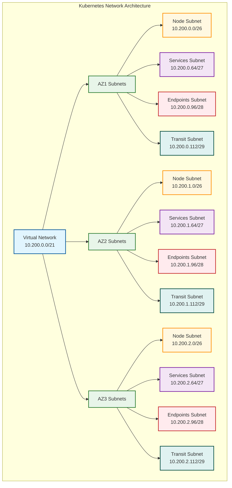

# Kubernetes Network Design

## Overview

The VIP Platform uses a specialized network design for Kubernetes clusters to ensure proper isolation, security, and performance. This document outlines the network architecture, CIDR allocation, and configuration patterns for AKS, EKS, and GKE clusters across all supported environments.

## Design Principles

The Kubernetes network design follows these core principles:

1. **Multi-AZ Deployment**: Distribute Kubernetes resources across multiple availability zones for high availability.
2. **Network Segmentation**: Separate different types of Kubernetes traffic using specialized subnets.
3. **Security by Default**: Apply restrictive security controls with explicit allowances only where needed.
4. **Performance Optimization**: Minimize network hops and latency for cluster communication.
5. **Future-Proof Scaling**: Allocate address space to accommodate future growth.
6. **Cloud Provider Integration**: Leverage native cloud networking capabilities for Kubernetes.

## Network Architecture

The Kubernetes network architecture consists of separate subnets for different functions distributed across availability zones:



### Zone-Based Infrastructure

The infrastructure is divided across three availability zones for high availability:

- **Zone 1 Infrastructure**:
  - Node Subnet: 10.200.0.0/26 (62 IPs)
  - Services Subnet: 10.200.0.64/27 (30 IPs)
  - Endpoints Subnet: 10.200.0.96/28 (14 IPs)
  - Transit Subnet: 10.200.0.112/29 (6 IPs)

- **Zone 2 Infrastructure**:
  - Node Subnet: 10.200.1.0/26 (62 IPs)
  - Services Subnet: 10.200.1.64/27 (30 IPs)
  - Endpoints Subnet: 10.200.1.96/28 (14 IPs)
  - Transit Subnet: 10.200.1.112/29 (6 IPs)

- **Zone 3 Infrastructure**:
  - Node Subnet: 10.200.2.0/26 (62 IPs)
  - Services Subnet: 10.200.2.64/27 (30 IPs)
  - Endpoints Subnet: 10.200.2.96/28 (14 IPs)
  - Transit Subnet: 10.200.2.112/29 (6 IPs)

### Address Space Allocation

Each Kubernetes cluster requires several CIDR ranges:

1. **Node Subnet CIDRs**: For worker node host IPs
2. **Pod CIDR**: For pod IP assignments
3. **Service CIDR**: For Kubernetes service IP assignments
4. **Load Balancer CIDRs**: For cloud load balancer IPs

Example allocations for an AKS cluster in Azure:

| CIDR Type | Address Range | Size | Purpose |
|-----------|---------------|------|---------|
| AZ1 Node Subnet | 10.200.0.0/26 | /26 (62 IPs) | Worker nodes in AZ1 |
| AZ2 Node Subnet | 10.200.1.0/26 | /26 (62 IPs) | Worker nodes in AZ2 |
| AZ3 Node Subnet | 10.200.2.0/26 | /26 (62 IPs) | Worker nodes in AZ3 |
| Pod CIDR | 10.240.0.0/16 | /16 (65,534 IPs) | Pod IP addresses |
| Service CIDR | 10.241.0.0/16 | /16 (65,534 IPs) | Kubernetes service IPs |
| AZ1 Services Subnet | 10.200.0.64/27 | /27 (30 IPs) | Load balancers in AZ1 |
| AZ2 Services Subnet | 10.200.1.64/27 | /27 (30 IPs) | Load balancers in AZ2 |
| AZ3 Services Subnet | 10.200.2.64/27 | /27 (30 IPs) | Load balancers in AZ3 |

## Network Implementation Options

The VIP Platform supports multiple Kubernetes networking implementations depending on cloud provider and requirements:

### Azure AKS Networking

#### Azure CNI Networking

The primary networking mode for AKS clusters in production environments:

- **Network Plugin**: Azure CNI
- **Pod CIDR Allocation**: Pre-allocated from VNet address space
- **Node-Pod Connectivity**: Direct within VNet
- **Network Policy**: Calico or Azure Network Policy
- **Service Connectivity**: Azure Load Balancer integration

Implementation example:

```hcl
module "aks_networking" {
  source = "../../modules/azure/aks_networking"
  
  resource_group_name = var.resource_group_name
  location            = var.location
  
  # VNet Configuration
  vnet_name           = "vip-vnet-${var.stage}-${var.region_abbv}"
  address_space       = ["10.200.0.0/21"]
  
  # Subnet Configuration
  subnets = {
    "az1-node-subnet" = {
      address_prefix = "10.200.0.0/26"
      security_rules = ["allow_aks"]
    }
    "az2-node-subnet" = {
      address_prefix = "10.200.1.0/26"
      security_rules = ["allow_aks"]
    }
    "az3-node-subnet" = {
      address_prefix = "10.200.2.0/26"
      security_rules = ["allow_aks"]
    }
  }
  
  # AKS Network Configuration
  network_plugin      = "azure"
  network_policy      = "calico"
  service_cidr        = "10.241.0.0/16"
  dns_service_ip      = "10.241.0.10"
  pod_cidr            = "10.240.0.0/16"
}
```

#### Kubenet Networking

Used for development environments or where IP address space is constrained:

- **Network Plugin**: Kubenet
- **Pod CIDR Allocation**: Uses separate address space with NAT
- **Node-Pod Connectivity**: Through NAT and routing tables
- **Network Policy**: Limited options
- **Service Connectivity**: Azure Load Balancer integration

### AWS EKS Networking

#### VPC CNI

Primary networking mode for EKS clusters:

- **Network Plugin**: Amazon VPC CNI
- **Pod CIDR Allocation**: Secondary IP addresses from VPC
- **Node-Pod Connectivity**: Direct within VPC
- **Network Policy**: Calico
- **Service Connectivity**: AWS Load Balancer integration

#### Custom CNI Options

For specialized scenarios (Calico, Cilium, etc.):

- **Network Plugin**: Custom CNI
- **Pod CIDR Allocation**: Separate address space
- **Network Policy**: Built into CNI
- **Service Connectivity**: AWS Load Balancer integration

### GCP GKE Networking

#### VPC Native

Primary networking mode for GKE clusters:

- **Network Plugin**: VPC Native
- **Pod CIDR Allocation**: Alias IP ranges
- **Node-Pod Connectivity**: Direct within VPC
- **Network Policy**: Calico
- **Service Connectivity**: GCP Load Balancer integration

## Security Considerations

### Network Security Groups / Security Groups

Each subnet has specific security rules:

- **Node Subnets**:
  - Allow API server communication
  - Allow node-to-node traffic
  - Allow monitoring traffic
  - Deny unnecessary external access

- **Services Subnets**:
  - Allow load balancer health probes
  - Allow application traffic on specified ports
  - Deny unnecessary external access

- **Endpoints Subnets**:
  - Allow traffic to specific private endpoints
  - Deny all other traffic

### Network Policies

Kubernetes network policies implemented for pod-to-pod traffic control:

1. **Default Deny**: Start with deny-all policy
2. **Namespace Isolation**: Restrict traffic between namespaces
3. **Application-Specific Policies**: Allow only required communication paths
4. **Egress Control**: Limit outbound connections from pods

Example network policy:

```yaml
apiVersion: networking.k8s.io/v1
kind: NetworkPolicy
metadata:
  name: default-deny-all
spec:
  podSelector: {}
  policyTypes:
  - Ingress
  - Egress
```

### Private Cluster Configuration

For production environments, Kubernetes API server access is restricted:

- **Private API Server**: No public endpoint for the Kubernetes API
- **Authorized IP Ranges**: Strict allowlist for API access
- **Private Link/Endpoint**: Private connectivity to the API server
- **Bastion Host**: Jump server for secure cluster administration

## Network Observability

The platform implements comprehensive network monitoring:

1. **Flow Logs**: Record network traffic for analysis and troubleshooting
2. **Metrics Collection**: Gather performance metrics for pods, nodes, and services
3. **Network Visualization**: Map pod-to-pod and pod-to-service communication
4. **Anomaly Detection**: Identify unusual network patterns

## Implementation in Terraform

Network configuration is implemented using the `aks_networking` module:

```hcl
module "aks_networking" {
  source = "../../modules/azure/aks_networking"
  
  # Basic Information
  resource_group_name = var.resource_group_name
  location            = var.location
  
  # Network Configuration
  vnet_name           = "vip-vnet-${var.stage}-${var.region_abbv}"
  address_space       = ["10.200.0.0/21"]
  dns_servers         = var.dns_servers
  
  # Subnet Configuration
  subnets = {
    "az1-node-subnet" = {
      address_prefix = "10.200.0.0/26"
      security_rules = ["allow_aks", "allow_ssh"]
      route_table    = "aks-routes"
    }
    "az2-node-subnet" = {
      address_prefix = "10.200.1.0/26"
      security_rules = ["allow_aks", "allow_ssh"]
      route_table    = "aks-routes"
    }
    "az3-node-subnet" = {
      address_prefix = "10.200.2.0/26"
      security_rules = ["allow_aks", "allow_ssh"]
      route_table    = "aks-routes"
    }
    "az1-lb-subnet" = {
      address_prefix = "10.200.0.64/27"
      security_rules = ["allow_lb"]
    }
    "az2-lb-subnet" = {
      address_prefix = "10.200.1.64/27"
      security_rules = ["allow_lb"]
    }
    "az3-lb-subnet" = {
      address_prefix = "10.200.2.64/27"
      security_rules = ["allow_lb"]
    }
  }
  
  # AKS Specific Configuration
  network_plugin      = "azure"
  network_policy      = "calico"
  service_cidr        = "10.241.0.0/16"
  dns_service_ip      = "10.241.0.10"
  pod_cidr            = "10.240.0.0/16"
  outbound_type       = "userDefinedRouting"
  private_cluster     = true
  api_server_authorized_ip_ranges = ["10.0.0.0/8"]
  
  # Tags
  tags = {
    Environment = var.stage
    ManagedBy   = "Terragrunt"
    Component   = "Networking"
    Project     = "VIP Platform"
  }
}
```

## Best Practices

1. **Sizing Guidelines**:
   - Allocate appropriate Pod CIDR based on maximum pod density
   - Ensure node subnets can accommodate expected node count plus growth
   - Size Service CIDR for maximum expected services

2. **Performance Optimization**:
   - Use accelerated networking/enhanced networking on worker nodes
   - Configure appropriate MTU sizes for CNI
   - Place related pods in the same availability zone when possible

3. **Security Guidelines**:
   - Use private clusters for production workloads
   - Implement least-privilege network policies
   - Regularly audit network flows and security rules

4. **Operational Recommendations**:
   - Document all CIDR allocations in the central allocation file
   - Implement automated validation of network configurations
   - Monitor IP address utilization in subnets

## Troubleshooting Guide

Common Kubernetes networking issues and solutions:

1. **Pod-to-Pod Communication Issues**:
   - Verify network policy configuration
   - Check node subnet NSG/security group rules
   - Validate route tables and user-defined routes

2. **Service Connectivity Problems**:
   - Verify service CIDR configuration
   - Check kube-proxy status on nodes
   - Verify load balancer subnet configuration

3. **External Access Issues**:
   - Validate load balancer health probes
   - Check ingress controller configuration
   - Verify public IP allocations and DNS settings

4. **Node Connectivity Issues**:
   - Check node subnet security rules
   - Verify kubelet configuration
   - Validate node-to-control-plane communication

## Next Steps

Continue to [Security Architecture](09-security-architecture.md) to understand how network security integrates with the overall security design of the VIP Platform. 