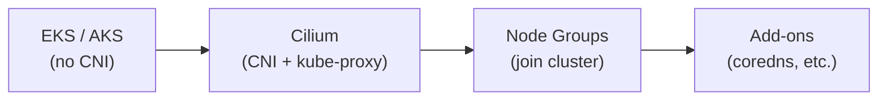

# Kubernetes Network Design

## Overview

All Kubernetes clusters use Cilium as the CNI via a "bring your own CNI"
approach. Cilium is installed after the cluster is created but before
node groups join. This gives consistent network policy, eBPF-based
networking, and Hubble observability across AWS (EKS) and Azure (AKS).

## Design Principles

1. **BYOCNI** -- clusters are created without a default CNI. Cilium is
   deployed via Helm as a separate Terragrunt unit, ensuring the CNI is
   ready before nodes join.
2. **Overlay networking** -- pod and service CIDRs use separate,
   non-routable ranges. Pod IPs are not exposed on the VPC/VNet.
3. **Multi-AZ** -- worker nodes span 3 availability zones. Each AZ has
   a dedicated kubernetes subnet.
4. **Cloud-native integration** -- Cilium adapts to each cloud's
   networking model (ENI mode on AWS, VXLAN overlay on Azure).

## Node Subnet Layout

Worker nodes run in the `kubernetes` tier subnets, one per AZ. The full
subnet tier structure is documented in
[CIDR Allocation](06-cidr-allocation.md#subnet-tiers); the kubernetes
tier is the largest at /26 (62 IPs) per AZ.

Example for AWS Platform (us-east-1, VPC `10.100.0.0/16`):

| AZ | Kubernetes Subnet | Size |
|----|-------------------|------|
| us-east-1a | `10.100.0.0/26` | 62 IPs |
| us-east-1b | `10.100.1.0/26` | 62 IPs |
| us-east-1c | `10.100.2.0/26` | 62 IPs |

Subnets are computed from `vpc_cidr` + `azs` using `cidrsubnet()` in
`network.hcl`. EKS subnets are auto-tagged for load balancer discovery
(`kubernetes.io/role/internal-elb`).

## Overlay CIDRs

Kubernetes overlay networks use separate address ranges not routed on
the VPC/VNet:

| Purpose | CIDR | Notes |
|---------|------|-------|
| Pod CIDR | `10.240.0.0/16` | Cilium overlay (VXLAN or ENI-allocated) |
| Service CIDR | `10.241.0.0/16` | Cluster-internal only |
| DNS Service IP | `10.241.0.10` | CoreDNS |

These ranges are shared across clusters. Overlay encapsulation prevents
collisions. Cross-cluster pod communication would use Cilium ClusterMesh
at L7, not L3 routing.

## Cilium Configuration

### Cloud-Specific Modes

The shared `cilium` module (`infra/modules/cilium/`) accepts a
`cloud_provider` variable that selects the appropriate networking mode:

| Setting | AWS (EKS) | Azure (AKS) |
|---------|-----------|-------------|
| IPAM mode | ENI | Cluster pool |
| Routing | Native (AWS ENI) | VXLAN tunnel |
| Masquerade | `ens+` (AL2023 predictable names) | Default |
| kube-proxy replacement | Enabled | Enabled |
| Hubble | Enabled (TLS via `helm` method) | Enabled |

### AWS: ENI Mode

On EKS, Cilium uses AWS ENI mode with native routing. Each pod gets an
IP from the VPC subnet via an ENI secondary IP. This means pod-to-pod
traffic stays within the VPC fabric without encapsulation overhead.

The `egressMasqueradeInterfaces` must be set to `ens+` (regex) because
AL2023 uses predictable interface names (`ens5`, not `eth0`). Without
this, pods lose internet egress.

### Azure: Overlay Mode

On AKS, the cluster is created with `network_plugin = "none"` (BYOCNI).
Cilium uses VXLAN tunneling for pod-to-pod traffic. Pod IPs come from
Cilium's cluster pool, not the VNet address space.

### Hubble TLS

On AWS, Hubble TLS certificates use the `helm` method (certificates
generated by the Helm chart) rather than `certmanager`. This avoids a
chicken-and-egg problem: cert-manager requires a running CNI to
schedule, but Cilium must be deployed before cert-manager.

## Deployment Order

Cilium's BYOCNI approach creates a strict dependency chain:

1. **Cluster** -- created without a CNI. API server is reachable but no
   pods can schedule.
2. **Cilium** -- deployed via Helm. Installs CRDs, starts agents.
3. **Node groups** -- join the cluster. Cilium agents configure
   networking on each node.
4. **Add-ons** -- EKS managed add-ons (coredns) can now schedule since
   the CNI is ready.

On EKS, this is enforced by `bootstrap_self_managed_addons = false` on
the cluster, and a Terragrunt dependency from `node-groups` on `cilium`.

## Private Cluster Access

### AWS (EKS)

The EKS API endpoint is private-only. Access methods:

1. **Tailscale VPN** (primary) -- subnet router advertises
   `10.100.0.0/16` to the tailnet. Split DNS routes
   `*.eks.amazonaws.com` to the VPC DNS resolver (`10.100.0.2`).
   Uses userspace mode (`TS_USERSPACE=true`) to avoid kernel routing
   conflicts with Cilium eBPF.
2. **SSM tunnel** (fallback) -- `scripts/eks-tunnel.sh` forwards port
   8443 through the SSM bastion to the cluster endpoint.

### Azure (AKS)

AKS can be configured as a private cluster with a private link endpoint.
Access is via the VNet or VPN.

## Security

### Network Policies

Cilium extends Kubernetes NetworkPolicy with CiliumNetworkPolicy CRDs
that support L7 filtering (HTTP, gRPC, DNS), FQDN-based egress rules,
and identity-aware policies.

### Node Security Groups

- **AWS**: EKS security group allows all traffic within the group
  (self-referencing ingress) and unrestricted egress. Subnets tagged for
  EKS load balancer discovery.
- **Azure**: NSGs per subnet with rules for API server communication,
  node-to-node traffic, and load balancer health probes.

### Pod Security

Kyverno (deployed via the `policy` module) enforces pod security
standards: image provenance, pod security contexts, resource limits.
The `compliance_tier` in `workload.hcl` can drive stricter policies for
HIPAA/PCI workloads.

## Observability

Cilium's Hubble provides:

- **Flow logs** -- per-pod network flow visibility
- **Service maps** -- visualize service-to-service communication
- **L7 metrics** -- HTTP/gRPC request rates, latencies, error codes
- **DNS visibility** -- DNS query/response logging

Hubble UI and metrics are accessible within the cluster. On Azure,
Prometheus DCR and Managed Grafana provide additional dashboards.

## Next Steps

Continue to [Security Architecture](09-security-architecture.md) to
understand how network security integrates with the overall platform
security design.
