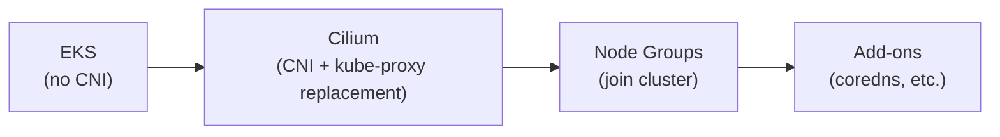

# Kubernetes Network Design

## Overview

EKS clusters use **Cilium** (1.19.4) as the CNI via a "bring your own CNI" (BYOCNI)
approach — the cluster is created with no default CNI, and Cilium is installed via Helm
before node groups join. On AWS the datapath is an **overlay**: `cluster-pool` IPAM +
VXLAN tunnel, so pod IPs come from a private pod CIDR **decoupled from the VPC** rather
than consuming VPC ENI IPs. This gives eBPF networking, identity-based NetworkPolicy,
Hubble observability, and pod density bounded by CPU/memory rather than subnet size.

EKS is the only deployed cloud today. The shared `cilium` module is cloud-agnostic (a
`cloud_provider` variable + a configurable datapath), so the same design extends to
Azure (AKS) / GCP (GKE) when those clouds land.

## Design Principles

1. **BYOCNI** — clusters are created without a CNI; Cilium is deployed as a separate
   Terragrunt unit so the CNI is ready before nodes join (`bootstrap_self_managed_addons = false`).
2. **Overlay, VPC-decoupled pods** — `ipam.mode=cluster-pool` + `routingMode=tunnel`
   (VXLAN). Pod IPs come from the cluster's pod CIDR and are **not** VPC addresses; pod
   egress to the VPC/internet is masqueraded to the node IP.
3. **Multi-AZ** — worker nodes span 3 availability zones; each AZ has a dedicated
   `kubernetes`-tier subnet. The system node group runs `desired=3` so every AZ has a
   node (AZ-pinned EBS volumes for single-replica StatefulSets need per-AZ coverage).
4. **Configurable datapath** — `ipam_mode`/`routing_mode`/`tunnel_protocol` are module
   variables (default overlay). Setting `ipam_mode="eni"` + `routing_mode="native"`
   switches to VPC-native routing (pods get routable VPC IPs) without code changes.

## Pod and Service Addressing

| Purpose | Value | Notes |
|---------|-------|-------|
| Pod CIDR (platform) | `10.240.0.0/16` | Cilium cluster-pool; VXLAN-encapsulated, not routed on the VPC |
| Pod CIDR (preprod) | `10.241.0.0/16` | Per-cluster `/16` from the reserved `10.240.0.0/14` pod supernet |
| Per-node pod block | `/24` (≈250 pods) | `clusterPoolIPv4MaskSize=24`; the operator hands each node a `/24` |
| Service CIDR | `172.20.0.0/16` | EKS default (the `eks` module doesn't override `service_ipv4_cidr`) |
| DNS Service IP | `.10` of the service CIDR | CoreDNS (EKS-managed add-on) |

Pod CIDRs are **non-routable** (encapsulated) and per-cluster non-overlapping, which keeps
the design **ClusterMesh-ready** (mesh itself is deferred). Authoritative source: each
cluster's `network.hcl` (`pod_cidr`). See [CIDR Allocation](06-cidr-allocation.md).

### Node subnets vs pod density

In overlay mode the `kubernetes`-tier `/26` subnets hold only **node** primary-ENI IPs
(≈60 nodes/AZ), not pods. Kubelet `--max-pods` is raised to **110** (`max_pods` in the
node-group launch template via an AL2023 `NodeConfig`) — EKS/AL2023 otherwise defaults it
to the instance's ENI IP capacity (≈35 on `t3.large`), which would cap density even though
overlay pods don't use ENI IPs.

## Cilium Configuration (AWS)

The shared `cilium` module (`infra/modules/cilium/`) composes Helm values from a
variable-driven, cloud-agnostic **datapath** layer plus an irreducible per-cloud
**plumbing** layer selected by `cloud_provider`.

| Setting | Value | Why |
|---------|-------|-----|
| IPAM | `cluster-pool` | Overlay pod IPs from the pod CIDR |
| Routing | `tunnel` / VXLAN | Encapsulated pod-to-pod; no VPC routing of pod IPs |
| Masquerade | iptables, all interfaces | Pod egress SNAT'd to the node IP |
| kube-proxy replacement | Enabled (required) | EKS BYOCNI deploys no kube-proxy DaemonSet |
| Hubble | Enabled (TLS via `helm` method) | Avoids a BYOCNI post-install-hook chicken-and-egg |
| Gateway API | Enabled | Cilium Gateway controller + experimental CRDs |

The `egressMasqueradeInterfaces=ens+` / `l2NeighDiscovery` / `eni.enabled` settings apply
only to the non-default **ENI native** datapath, not overlay.

### Hubble TLS

Hubble TLS certificates use the chart's `helm` method (not cert-manager): cert-manager
needs a running CNI to schedule, but Cilium must be installed before cert-manager — the
`helm` method avoids that ordering loop.

## Admission webhooks on overlay (EKS gotcha)

The **EKS managed control plane reaches in-cluster admission webhooks only at VPC-routable
addresses**. With overlay, webhook pods are on pod-CIDR IPs the control plane cannot route
to, so every API-server→webhook call fails with `Address is not allowed` — breaking Kyverno
(policy enforcement), cert-manager (TLS issuance), and external-secrets at admission.

**Fix:** the webhook-serving components run with **`hostNetwork: true`** (so their Service
endpoints are the node's VPC IP), gated by a `webhook_host_network` flag on the `policy`,
`cert-manager`, and `external-secrets` modules. On hostNetwork the server (and metrics)
ports are moved off conflicting defaults (kyverno admission `9443`/cleanup `9444`,
cert-manager `10260`, external-secrets `10261`/metrics `10262`). This is required on EKS
whenever overlay is used; ENI-native datapaths don't need it (pods are VPC-routable).

## Deployment Order

BYOCNI creates a strict dependency chain:

1. **Cluster** — created without a CNI; API reachable but no pods can schedule.
2. **Cilium** — deployed via Helm; the operator pre-stages the pod CIDR pool.
3. **Node groups** — join; the operator assigns each node a `/24` from the pod CIDR.
4. **Add-ons** — EKS managed add-ons (coredns) schedule once the CNI + nodes are ready.

Enforced by `bootstrap_self_managed_addons = false` and a Terragrunt dependency from
`node-groups` on `cilium`.

> **Datapath cutover note:** switching an existing cluster's `ipam_mode` (e.g. eni→overlay)
> is disruptive — roll it via scale-node-groups-to-zero → apply → scale up, so nodes come up
> on the new datapath. hostNetwork webhooks only function once the overlay Cilium
> (`kubeProxyReplacement=true`) is in place, so apply them after the cutover.

## Private Cluster Access

The EKS API endpoint is **private-only**. Access methods:

1. **Tailscale VPN** (primary) — a subnet router advertises the VPC CIDR to the tailnet;
   split DNS routes `*.eks.amazonaws.com` to the VPC resolver. The subnet router runs as an
   in-cluster pod, so it follows the pods onto overlay (and is unavailable at zero nodes).
2. **SSM tunnel** (fallback) — `scripts/eks-tunnel.sh` forwards through the SSM bastion
   (an EC2 instance independent of the node groups).

For node-group operations that scale to zero, the bastion path or a temporary public
endpoint (IP-locked) is used since the Tailscale router is down with the nodes.

## Security

### Network Policies

Cilium extends Kubernetes NetworkPolicy with `CiliumNetworkPolicy` (L7 HTTP/gRPC/DNS,
FQDN egress, identity-aware rules). Environment isolation is **identity-based**, not IP-based,
so the overlay pod-IP scheme doesn't affect policy. Environment namespaces are default-deny
ingress with explicit allows for the Gateway (`fromEntities: [ingress]`), DNS, and the
Pod Identity agent.

### IMDS protection

Environment pods are blocked from stealing the node IAM role via IMDS (`169.254.169.254`) by
**IMDSv2 hop-limit = 1** on the node (`HttpPutResponseHopLimit=1` in the launch template).
This holds under overlay: link-local is not masqueraded, so a pod's IMDSv2 token request
is >1 hop and the token response never reaches it. (Validated: a `team-*` pod gets a `401`
on a metadata GET but no IMDSv2 token.)

### Node Security Groups

The EKS cluster security group allows all intra-group traffic (self-referencing), which
covers the overlay's node-to-node VXLAN (UDP `8472`) and Cilium health (`4240`). Subnets
are tagged for Gateway/load-balancer discovery.

### Pod Security

Kyverno (the `policy` module) enforces pod security standards — image provenance, security
contexts, resource limits — above the PSA `baseline` floor. `compliance_tier` in
`workload.hcl` drives stricter policies for HIPAA/PCI.

## Observability

Cilium's **Hubble** provides per-pod flow logs, service maps, L7 metrics, and DNS
visibility. Because overlay traffic is VXLAN-encapsulated, **VPC Flow Logs see node IPs
only** — pod-level network forensics rely on Hubble (durable export is a planned
follow-up). Hubble UI/metrics are in-cluster; the platform observability hub
(Prometheus + mimir + Grafana) provides dashboards.

## Next Steps

Continue to [Security Architecture](09-security-architecture.md) to understand how network
security integrates with the overall platform security design.
