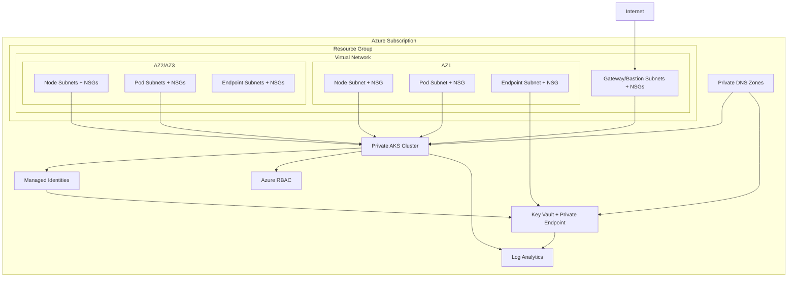

# Infrastructure Security Features

This document outlines the security features implemented across our Azure infrastructure, particularly focusing on Kubernetes (AKS) deployments, networking, identity management, and secret handling.

## Security Architecture Overview

## 1. Network Security

### Network Isolation and Segmentation

- **Virtual Network Segregation**: Infrastructure is deployed in isolated virtual networks with well-defined address spaces.
- **Subnet Segmentation**: Resources are segregated into purpose-specific subnets:
  - Node subnets for AKS worker nodes
  - Pod subnets for Kubernetes pods
  - Private endpoint subnets for secure service connections
  - Gateway and bastion subnets for controlled access

### Network Security Groups (NSGs)

- **Subnet-level NSGs**: Every subnet has a dedicated NSG with restrictive rules.
- **AKS-specific Rules**:
  - Allow traffic from Azure Load Balancer (required for service functionality)
  - Default deny for all other inbound traffic (priority 4096)
- **Service Endpoints**: Configured on endpoint subnets to securely connect to Azure services:
  - Microsoft.Storage
  - Microsoft.KeyVault

### Private Connectivity

- **Private AKS Clusters**: API servers are only accessible via private IPs within the VNet.
- **Private DNS Zones**: Automatic creation of `privatelink.{region}.azmk8s.io` for AKS private clusters.
- **VNet Integration**: Direct connections between services through private endpoints.
- **Private Endpoints**: Used for secure connectivity to Azure PaaS services including:
  - Key Vault
  - Storage Accounts
  - Container Registry

## 2. Identity and Access Management

### RBAC Authorization

- **Azure RBAC**: Enabled for Azure resources with least-privilege access controls.
- **Key Vault RBAC**: Utilizing RBAC authorization for Key Vault instead of access policies.
- **AKS RBAC**: Integration with Azure AD for Kubernetes RBAC.

### Managed Identities

- **User-assigned Managed Identities**: Creating dedicated identities for AKS clusters.
- **System-assigned Identities**: Applied where appropriate to reduce credential management.
- **Workload Identity Federation**: Implemented for Kubernetes workloads to access Azure resources.

### AKS Identity Configuration

- **Local Account Disabled**: Disabling local Kubernetes accounts.
- **Workload Identity Enabled**: Modern authentication for pods.
- **OIDC Issuer Enabled**: Supporting federation with external identity providers.

## 3. Kubernetes Security

### Private Cluster Configuration

- **Private API Server**: No public endpoint for the Kubernetes API server.
- **Private DNS Integration**: Internal DNS resolution for cluster communication.

### Network Security

- **Azure CNI**: Using Azure CNI (Container Network Interface) for enhanced network security.
- **Network Policies**: Enabled with Azure policy engine to control pod-to-pod traffic.
- **Pod CIDR**: Isolated pod IP space (`10.244.0.0/16`).
- **Service CIDR**: Dedicated service IP range (`10.0.0.0/16`).

### Node Security

- **System Node Pools**: Dedicated node pools for system workloads with appropriate labels.
- **Auto-scaling**: Dynamic scaling based on workload requirements.
- **Regularly Updated Kubernetes Version**: Currently using version 1.26.6.

## 4. Data Encryption

### Data at Rest Encryption

- **Storage Account Encryption**: All Azure Storage accounts use Azure Storage Service Encryption (SSE) with platform-managed keys by default.
- **Disk Encryption**: 
  - Azure Managed Disks are encrypted using Storage Service Encryption (SSE)
  - AKS node OS and data disks can be encrypted with customer-managed keys
  - Disk encryption keys are stored in Key Vault for secure management
- **Azure SQL Database/Cosmos DB**: Transparent Data Encryption (TDE) enabled by default

### Data in Transit Encryption

- **TLS Encryption**: All services require TLS 1.2+ for secure communications
- **Private Network Traffic**: Most traffic kept within VNet boundaries using private endpoints
- **Service-to-Service Communication**: Communication between services uses mutual TLS authentication
- **Kubernetes Traffic**: 
  - HTTPS for API server communication
  - TLS for etcd cluster communication
  - Encrypted pod-to-pod traffic

### Key Management

- **Centralized Key Management**: Azure Key Vault used as the central repository for encryption keys
- **Key Rotation**: Automated key rotation policies defined for critical keys
- **Hardware Security Modules (HSM)**: Support for HSM-backed keys for the highest level of protection

## 5. Secret Management

### Azure Key Vault

- **Centralized Secrets**: Storing all sensitive information in Key Vault.
- **Disk Encryption**: Creating disk encryption keys for VM and storage encryption.
- **Strict Network Controls**: Restricting access with network rules:
  - Bypass: AzureServices (allowing required Azure services)
  - Default action: Deny (blocking all other access)

### Key Vault Integration

- **Private Endpoint**: Secure connectivity to Key Vault through private endpoints.
- **Private DNS Zones**: Internal DNS resolution for Key Vault.
- **Service Connection**: Secure connection to the vault subresource.

## 6. Resource Governance

### Resource Naming and Tagging

- **Standardized Naming Convention**: Consistent naming across all resources.
- **Descriptive Tags**: Environment, application, and management tags for governance.

### Resource Restrictions

- **SKU Restrictions**: Standard tier for production resources.
- **Azure Policy**: Enforcement of organizational standards and compliance requirements.

## 7. Monitoring and Auditing

### Log Analytics Integration

- **Centralized Logging**: All infrastructure logs sent to Log Analytics.
- **AKS Monitoring**: Container insights enabled for comprehensive visibility.
- **Diagnostic Settings**: Enabled on all resources to capture audit trails.

## 8. Access Controls and Management

### Bastion Access

- **Secure Jump Host**: Azure Bastion for secure remote management.
- **No Direct SSH**: No direct external SSH access to nodes.

### Terraform State Management

- **State Isolation**: State files managed with proper locking mechanisms.
- **Least Privilege Execution**: Service principals with minimal permissions.

## 9. Security Best Practices

### Design Principles

- **Defense in Depth**: Multiple layers of security controls.
- **Least Privilege**: Minimal permissions for identities and resources.
- **Network Segmentation**: Isolation of different components.
- **Secure by Default**: Secure configurations out of the box.

### Operational Security

- **Regular Updates**: Maintaining current Kubernetes and OS versions.
- **Secrets Rotation**: Procedures for rotating credentials and secrets.
- **Vulnerability Management**: Regular scanning and remediation.

## 10. Compliance Considerations

- **Azure Security Baseline**: Alignment with Microsoft's security recommendations.
- **Industry Standards**: Implementation following security best practices like NIST and CIS.

## 11. Security Incident Response

### Detection Capabilities

- **Azure Security Center Alerts**: Real-time security alerts from Azure Defender
- **AKS Threat Detection**: Anomaly detection for Kubernetes workloads
- **Log Analytics Queries**: Custom alerting based on log patterns
- **Resource Health Monitoring**: Detection of resource availability issues

### Incident Response Process

1. **Detection Phase**:
   - Automated alerts from Azure Security Center
   - Log Analytics custom queries
   - Infrastructure monitoring alerts
   - Manual escalation processes

2. **Triage Phase**:
   - Severity assessment
   - Impact determination
   - Stakeholder notification
   - Incident tracking in ticketing system

3. **Investigation Phase**:
   - Log analysis
   - Attack vector identification
   - Security posture evaluation
   - Access reviews

4. **Containment Phase**:
   - Network isolation
   - Resource suspension
   - Credential revocation
   - Temporary access controls

5. **Eradication Phase**:
   - Malicious component removal
   - Compromised resource replacement
   - Configuration hardening
   - Vulnerability remediation

6. **Recovery Phase**:
   - Service restoration
   - Verification of security controls
   - Performance monitoring
   - Post-recovery validation

7. **Lessons Learned Phase**:
   - Root cause analysis
   - Security control improvements
   - Process documentation
   - Training updates

### Disaster Recovery

- **Infrastructure as Code**: Complete environment can be redeployed from Terraform code
- **Backup Strategies**: Key configurations and data backed up
- **Multi-region Recovery**: Architecture supports regional failover when configured
- **Data Recovery Plans**: Procedures for restoring critical data

## 12. Terraform Module Security Features

Below is a breakdown of the security features implemented in our key Terraform modules:

### Networking Module

| Feature | Description |
|---------|-------------|
| NSG per Subnet | Each subnet has its own Network Security Group with specific rules |
| Service Endpoints | Endpoint subnets have service endpoints for Azure services |
| AKS-specific NSG Rules | Special rules for AKS node subnets to allow LoadBalancer traffic |
| Private DNS Zones | Automatic creation and linking of private DNS zones |

### Key Vault Module

| Feature | Description |
|---------|-------------|
| RBAC Authorization | Using modern RBAC model instead of access policies |
| Network ACLs | Strict network rules controlling access |
| Private Endpoints | Private network connectivity only |
| Disk Encryption Keys | Support for VM and storage encryption |

### AKS Module

| Feature | Description |
|---------|-------------|
| Private Cluster | API server only accessible from within VNet |
| Managed Identities | Using Azure managed identities for authentication |
| Workload Identity | Modern pod-level identity federation |
| Network Policy | Pod-to-pod traffic controls |

## 13. Security Recommendations for Future Enhancements

### Network Security Enhancements

- **Web Application Firewall (WAF)**: Deploy Azure Application Gateway with WAF for ingress traffic protection
- **DDoS Protection**: Enable Azure DDoS Protection Standard for enhanced DDoS mitigation
- **Azure Firewall**: Implement Azure Firewall for centralized network traffic filtering
- **Network Watcher Flow Logs**: Enable flow logs for deeper network visibility and forensics

### Identity Enhancements

- **Conditional Access Policies**: Implement Azure AD Conditional Access for context-based access controls
- **Privileged Identity Management (PIM)**: Deploy Azure AD PIM for just-in-time privileged access
- **Consolidated Identity Alerts**: Create a unified dashboard for identity-related security alerts

### AKS Security Enhancements

- **Azure Policy for Kubernetes**: Implement built-in and custom policies for kubernetes compliance
- **Azure Defender for Kubernetes**: Enable for runtime threat protection
- **Pod Security Standards**: Implement stricter Pod Security Standards (PSS) across all namespaces
- **Kyverno/OPA**: Deploy policy engines for kubernetes governance

### Monitoring Enhancements

- **SIEM Integration**: Send security logs to a SIEM solution for centralized security monitoring
- **Sentinel Workbooks**: Create AKS-specific Azure Sentinel workbooks
- **Advanced Threat Protection**: Enable ATP for critical resources
- **Automated Response Playbooks**: Create automated response workflows for common security events

### Secret Management Enhancements

- **External Key Management**: Consider HSM-backed key management for the most sensitive keys
- **Dynamic Secret Rotation**: Implement automated rotation for all secrets using Key Vault rotation policies
- **Secret Scanning**: Implement scanning tools to detect secrets in code repositories

---

This document provides an overview of the security features implemented in our infrastructure. For specific implementation details, refer to the respective module documentation and configuration files. 