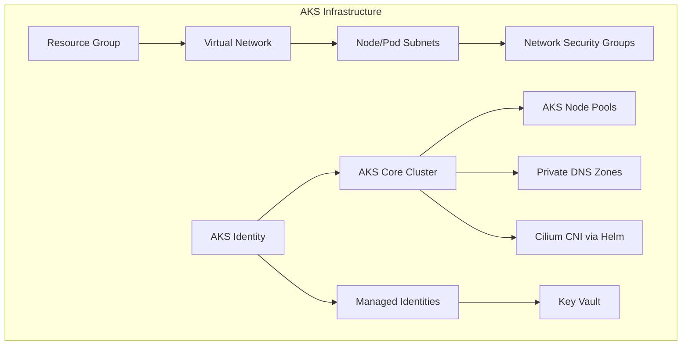

# AKS Configuration and Deployment Guide

This document outlines the architecture, components, and best practices for Azure Kubernetes Service (AKS) deployments across our multi-cloud platform.

## Architecture Overview

The AKS deployment is designed with a modular approach, separating core concerns into distinct components:



## Module Structure

Our AKS implementation is split into three primary modules:

1. **aks_identity**: Manages managed identities for AKS and workloads
2. **aks_core**: Provisions the base AKS cluster with system node pools
3. **aks_node_pools**: Adds additional node pools for workloads

Additionally, post-provisioning, we deploy:

4. **Cilium CNI**: Advanced networking via Helm charts

### AKS Identity Module

This module creates and configures the managed identities needed by the AKS cluster and workloads:

```hcl
module "aks_identity" {
  source = "../../modules/azure/aks_identity"
  
  # Identity naming
  prefix      = "centric"
  stage       = "dev"
  region_abbv = "wus"
  
  # Resource details
  resource_group_name = dependency.resource_group.outputs.name
  location = dependency.resource_group.outputs.location
  
  # Network configuration
  subnet_id = dependency.networking.outputs.subnet_ids["az1-kubernetes"]
  
  # Workload identity configuration
  create_workload_identities = true
  workload_identity_enabled = true
  oidc_issuer_enabled = true
}
```

**Key Features:**
- Creates a user-assigned managed identity for the AKS cluster
- Assigns necessary Network Contributor permissions
- Optionally creates workload identities for services like cert-manager and karpenter
- Supports federated credentials for Kubernetes workloads

### AKS Core Module

This module deploys the base AKS cluster with essential configuration:

```hcl
module "aks_core" {
  source = "../../modules/azure/aks_core"
  
  # Naming
  prefix      = "centric"
  stage       = "dev"
  region_abbv = "wus"
  
  # Resource details
  resource_group_name = dependency.resource_group.outputs.name
  location = dependency.resource_group.outputs.location
  
  # Azure AD integration
  azure_active_directory_role_based_access_control = {
    admin_group_object_ids = ["00000000-0000-0000-0000-000000000000"]
    azure_rbac_enabled = true
  }
  
  # Identity configuration
  identity_type = "UserAssigned"
  user_assigned_identity_id = dependency.aks_identity.outputs.aks_identity_id
  
  # Network profile - no CNI installed by default
  network_plugin = "none"
  network_policy = null
  subnet_id = dependency.networking.outputs.subnet_ids["az1-kubernetes"]
  
  # Private cluster configuration
  private_cluster_enabled = true
  private_dns_zone_id = dependency.networking.outputs.aks_private_dns_zone_id
  
  # Default node pool
  default_nodepool_vm_size = "Standard_D2s_v4"
  default_nodepool_enable_auto_scaling = true
  default_nodepool_min_count = 2
  default_nodepool_max_count = 3
}
```

**Key Features:**
- Private AKS cluster deployment
- No CNI installed by default (will install Cilium separately)
- Azure AD integration with RBAC
- User-assigned managed identity
- System node pool with auto-scaling
- OIDC issuer and workload identity support

### AKS Node Pools Module

This module adds additional node pools for application workloads:

```hcl
module "aks_node_pools" {
  source = "../../modules/azure/aks_node_pools"
  
  # Naming
  prefix      = "centric"
  stage       = "dev"
  region_abbv = "wus"
  
  # AKS reference
  aks_cluster_id = dependency.aks_core.outputs.id
  
  # App node pool configuration
  app_node_pool_enabled = true
  app_node_pool_vm_size = "Standard_D4s_v4"
  app_node_pool_enable_auto_scaling = true
  app_node_pool_min_count = 2
  app_node_pool_max_count = 5
  app_node_pool_max_pods = 110
  app_node_pool_node_labels = {
    "nodepool" = "apps"
    "workload" = "general"
  }
}
```

**Key Features:**
- Additional node pools for application workloads
- Separate from system workloads for better resource isolation
- Configurable auto-scaling
- Custom node labels for workload targeting
- Support for node taints to control pod scheduling

### Cilium CNI Deployment

After the AKS cluster is provisioned, we deploy Cilium as our CNI using Helm:

```hcl
resource "helm_release" "cilium" {
  name       = "cilium"
  repository = "https://helm.cilium.io/"
  chart      = "cilium"
  version    = "1.14.0"
  namespace  = "kube-system"
  
  depends_on = [module.aks_core]
  
  values = [
    templatefile("${path.module}/cilium-values.yaml", {
      cluster_name = module.aks_core.name
      azure_subscription_id = var.azure_subscription_id
    })
  ]
}
```

**Key Features:**
- Enhanced eBPF-based networking
- Advanced network policy enforcement
- Network flow visibility via Hubble
- Identity-aware network policies
- Transparent encryption options
- Exclusive CNI mode since no other CNI is installed

## Deployment Workflow

The AKS deployment follows this sequence:

1. **Prerequisite Resources**:
   - Resource Group
   - Networking (VNet, Subnets, NSGs)
   - Naming conventions

2. **Identity Deployment**:
   - Deploy the aks_identity module
   - Create the cluster and workload identities

3. **Core Cluster Deployment**:
   - Deploy the aks_core module with no CNI
   - Configure the base cluster and system node pool

4. **Node Pool Deployment**:
   - Deploy the aks_node_pools module
   - Add application-specific node pools

5. **Cilium CNI Deployment**:
   - Install Cilium via Helm chart
   - Configure network policies
   - Set up Hubble for network monitoring

## Security Features

The AKS deployment includes these security features:

- **Private Cluster**: No public endpoint for the Kubernetes API
- **Azure AD Integration**: Authentication via Azure AD
- **RBAC**: Azure RBAC for Kubernetes authorization
- **Managed Identities**: No credential storage in configuration
- **Network Security**: 
  - Cilium CNI with advanced policy enforcement
  - Identity-based network policies
  - L3-L7 filtering capabilities
- **Workload Identity**: Secure access for Kubernetes workloads

## Multi-Region Considerations

For multi-region deployments:

- Each region gets its own AKS cluster
- Clusters can be configured for active-active or active-passive setups
- Use Azure Front Door for global traffic distribution
- Consider Azure Cosmos DB for globally distributed data
- Cilium provides consistent networking across regions

## Best Practices

1. **Node Pool Separation**:
   - Keep system and application workloads on separate node pools
   - Consider specialized node pools for resource-intensive workloads

2. **Identity Management**:
   - Use workload identity for pod authentication
   - Implement least privilege for all identities

3. **Network Design**:
   - Plan IP address space carefully
   - Implement network policies with Cilium
   - Use Cilium's advanced features for micro-segmentation

4. **Scalability**:
   - Enable auto-scaling for all node pools
   - Set appropriate min/max node counts based on workloads

5. **Upgrades**:
   - Regularly update Kubernetes version
   - Use node pool replacement for zero-downtime upgrades
   - Test Cilium upgrades in dev/test environments first

6. **Monitoring**:
   - Enable Azure Monitor for containers
   - Configure diagnostic settings for audit logs
   - Deploy Hubble UI for network visibility

## Troubleshooting

Common issues and solutions:

1. **Networking Issues**:
   - Initial connectivity will be missing until Cilium is installed
   - Check subnet delegation
   - Verify NSG rules
   - Confirm CIDR allocations don't overlap
   - Use Cilium Hubble to debug network flows
   - Verify Cilium CNI installation and configuration

2. **Identity Problems**:
   - Verify role assignments
   - Check federated credential configuration
   - Validate service principal permissions

3. **Cluster Deployment Failures**:
   - Validate resource quotas
   - Check for resource name conflicts
   - Verify managed identity permissions

4. **Cilium-specific Issues**:
   - Check Cilium pod logs in kube-system namespace
   - Verify compatibility between Cilium version and Kubernetes version
   - Confirm proper installation values for Cilium's helm chart

## References

- [Azure AKS Documentation](https://docs.microsoft.com/en-us/azure/aks/)
- [AKS Networking](https://docs.microsoft.com/en-us/azure/aks/concepts-network)
- [AKS Security Best Practices](https://docs.microsoft.com/en-us/azure/aks/operator-best-practices-cluster-security)
- [Cilium Documentation](https://docs.cilium.io/)
- [Helm Chart Reference for Cilium](https://docs.cilium.io/en/stable/installation/k8s-install-helm/) 