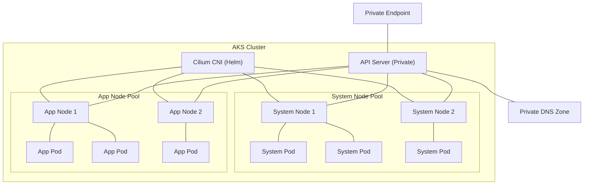
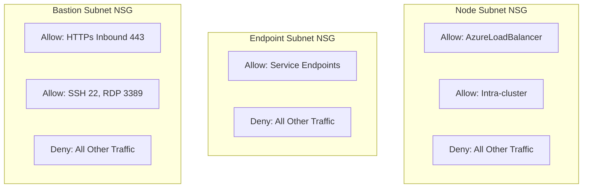

# Network Topology

This document describes the network topology implemented across our multi-cloud infrastructure, with a focus on the Azure environments.

## Source of Truth

The network CIDR allocations and subnet organization defined in this document are sourced from the central allocation CSV file maintained at the root of the repository:

```
/allocations.csv
```

This file serves as the single source of truth for all IP address allocations across all cloud providers, regions, availability zones, and subnet types. Any changes to network allocations should be made in this file first, and then reflected in infrastructure code.

## Azure Network Architecture

The Azure network architecture follows a hub-and-spoke model with regional deployments:

```mermaid
graph TD
    subgraph "Azure Subscription"
        subgraph "Region (e.g., West US)"
            subgraph "Virtual Network (10.101.24.0/21)"
                subgraph "AZ1"
                    AZ1_NodeSubnet["Node Subnet (10.101.24.0/26)"]
                    AZ1_ServiceSubnet["Service Subnet (10.101.24.64/27)"]
                    AZ1_EndpointSubnet["Endpoint Subnet (10.101.24.96/28)"]
                    AZ1_TransitSubnet["Transit Subnet (10.101.24.112/29)"]
                end
                subgraph "AZ2"
                    AZ2_NodeSubnet["Node Subnet (10.101.25.0/26)"]
                    AZ2_ServiceSubnet["Service Subnet (10.101.25.64/27)"]
                    AZ2_EndpointSubnet["Endpoint Subnet (10.101.25.96/28)"]
                    AZ2_TransitSubnet["Transit Subnet (10.101.25.112/29)"]
                end
                subgraph "AZ3"
                    AZ3_NodeSubnet["Node Subnet (10.101.26.0/26)"]
                    AZ3_ServiceSubnet["Service Subnet (10.101.26.64/27)"]
                    AZ3_EndpointSubnet["Endpoint Subnet (10.101.26.96/28)"]
                    AZ3_TransitSubnet["Transit Subnet (10.101.26.112/29)"]
                end
                GatewaySubnet["Gateway Subnet"]
                BastionSubnet["Bastion Subnet"]
            end
        end
        
        subgraph "Region (e.g., East US)"
            EastVNet["Virtual Network (10.101.0.0/21)"]
            EastSubnets["Similar subnet structure"]
        end
    end
    
    InternetGW["Internet Gateway"]
    OnPrem["On-Premises Network"]
    
    InternetGW --> GatewaySubnet
    GatewaySubnet --> OnPrem
    BastionSubnet --> AZ1_NodeSubnet
    BastionSubnet --> AZ2_NodeSubnet
    BastionSubnet --> AZ3_NodeSubnet
```



## CIDR Allocation Pattern

Our network CIDR allocations follow a consistent pattern defined in the allocations.csv file:

1. Each cloud provider is allocated a /8 block:
   - AWS: 10.100.0.0/8
   - Azure: 10.101.0.0/8
   - GCP: 10.102.0.0/8
   - Test/Dev environments: 10.103.0.0/8+

2. Within each cloud provider, each account has a dedicated VPC or VNet CIDR (/16):
   - Example: innovation-operations-azure VPC: 10.101.0.0/16

3. Each region within a VPC is allocated a range (/21):
   - westus: 10.101.24.0/21
   - eastus: 10.101.0.0/21
   - centralus: 10.101.16.0/21

4. Each availability zone within a region gets a /24 block:
   - westus-1: 10.101.24.0/24
   - westus-2: 10.101.25.0/24
   - westus-3: 10.101.26.0/24

5. Within each availability zone, subnets are created with different sizes based on purpose:
   - Kubernetes: /26 (62 usable IPs)
   - Services: /27 (30 usable IPs)
   - Endpoints: /28 (14 usable IPs)
   - Transit: /29 (6 usable IPs)

## Azure Kubernetes Service (AKS) Networking

AKS clusters are deployed with the following network configuration:

### Network Plugin: Cilium CNI

Our AKS clusters are deployed with no CNI (`network_plugin = "none"`), and Cilium is installed via Helm as the only CNI. This approach provides:

- Enhanced eBPF-based networking capabilities
- Advanced network policy enforcement
- Better observability and troubleshooting
- Fine-grained network security policies

### Network Configuration



### Network CIDR Configuration

AKS clusters use the following CIDR allocations:

- **Pod CIDR**: 10.244.0.0/16
  - Used for Kubernetes pod IP addresses
- **Service CIDR**: 10.0.0.0/16
  - Used for Kubernetes service IP addresses
- **Docker Bridge CIDR**: 172.17.0.1/16
  - Used for Docker container networking
- **DNS Service IP**: 10.0.0.10
  - Used for Kubernetes DNS service

### Subnet Roles and Configurations

Based on the allocations.csv file, each subnet has a specific role:

| Subnet Role | Prefix Length | Usable IPs | Purpose |
|-------------|---------------|------------|---------|
| Kubernetes  | /26           | 62         | AKS nodes, Virtual Machines |
| Services    | /27           | 30         | Load Balancers, Application Gateways |
| Endpoints   | /28           | 14         | Private Endpoints |
| Transit     | /29           | 6          | VPN, ExpressRoute, Gateways |

### Private Cluster Configuration

All AKS clusters are deployed as private clusters:

- **API Server**: No public IP, only accessible within the virtual network
- **Private DNS Zone**: Automatically created to resolve to the private API server
- **VNET Integration**: Cluster fully integrated with the virtual network

## Network Security

### Cilium Network Policies

Cilium provides enhanced network policy capabilities beyond standard Kubernetes NetworkPolicy:

- **L3-L7 Policies**: Filter traffic based on DNS, HTTP, and other application-level protocols
- **Identity-Based Policies**: Define policies based on Kubernetes identities
- **Encryption**: Transparent encryption of pod traffic with WireGuard
- **Visibility**: Network flow logs and policy decision tracing

### Network Security Groups (NSGs)

Each subnet has its own NSG with customized rules:



### Private Endpoints

Critical Azure services are accessed via private endpoints:

- **Key Vault**: Secure credential storage
- **Storage Accounts**: For persistent storage
- **Container Registry**: For container images
- **Database Services**: For managed database services

## Multi-Region Connectivity

Regions are connected using:

1. **Global VNet Peering**:
   - Direct connectivity between regions
   - No gateway transit required
   - Low latency

2. **Azure Front Door**:
   - Global load balancing
   - Traffic acceleration
   - Web Application Firewall (WAF)

## Subnet Allocation Tables

The following tables show the subnet allocations by region and availability zone for Azure environments, extracted from allocations.csv:

### West US Region (10.101.24.0/21)

| AZ | Purpose | CIDR | Usable IPs |
|----|---------|------|------------|
| westus-1 | Kubernetes | 10.101.24.0/26 | 62 |
| westus-1 | Services | 10.101.24.64/27 | 30 |
| westus-1 | Endpoints | 10.101.24.96/28 | 14 |
| westus-1 | Transit | 10.101.24.112/29 | 6 |
| westus-2 | Kubernetes | 10.101.25.0/26 | 62 |
| westus-2 | Services | 10.101.25.64/27 | 30 |
| westus-2 | Endpoints | 10.101.25.96/28 | 14 |
| westus-2 | Transit | 10.101.25.112/29 | 6 |
| westus-3 | Kubernetes | 10.101.26.0/26 | 62 |
| westus-3 | Services | 10.101.26.64/27 | 30 |
| westus-3 | Endpoints | 10.101.26.96/28 | 14 |
| westus-3 | Transit | 10.101.26.112/29 | 6 |

### East US Region (10.101.0.0/21)

| AZ | Purpose | CIDR | Usable IPs |
|----|---------|------|------------|
| eastus-1 | Kubernetes | 10.101.0.0/26 | 62 |
| eastus-1 | Services | 10.101.0.64/27 | 30 |
| eastus-1 | Endpoints | 10.101.0.96/28 | 14 |
| eastus-1 | Transit | 10.101.0.112/29 | 6 |
| eastus-2 | Kubernetes | 10.101.1.0/26 | 62 |
| eastus-2 | Services | 10.101.1.64/27 | 30 |
| eastus-2 | Endpoints | 10.101.1.96/28 | 14 |
| eastus-2 | Transit | 10.101.1.112/29 | 6 |
| eastus-3 | Kubernetes | 10.101.2.0/26 | 62 |
| eastus-3 | Services | 10.101.2.64/27 | 30 |
| eastus-3 | Endpoints | 10.101.2.96/28 | 14 |
| eastus-3 | Transit | 10.101.2.112/29 | 6 |

## Implementation in Terraform/Terragrunt

The network topology is implemented using the following module structure:

```
infra/
└── modules/
    └── azure/
        ├── networking/          # Core network module
        ├── private_endpoint/    # Private endpoint module
        └── aks_core/            # AKS with network config
```

### Example Network Configuration

The configuration is derived directly from the allocations.csv file:

```hcl
module "networking" {
  source = "../../modules/azure/networking"
  
  # Basic details
  name                = module.naming.virtual_network
  resource_group_name = azurerm_resource_group.this.name
  location            = azurerm_resource_group.this.location
  
  # CIDR allocation - from allocation.csv
  address_space       = ["10.101.24.0/21"]  # westus region
  
  # Subnet configuration
  subnets = {
    "westus-1-kubernetes" = {
      address_prefix  = "10.101.24.0/26"
      security_rules  = local.node_subnet_rules
    },
    "westus-1-services" = {
      address_prefix  = "10.101.24.64/27"
      security_rules  = local.service_subnet_rules
    },
    "westus-1-endpoints" = {
      address_prefix  = "10.101.24.96/28"
      security_rules  = local.endpoint_subnet_rules
    },
    "westus-1-transit" = {
      address_prefix  = "10.101.24.112/29"
      security_rules  = local.transit_subnet_rules
    },
    # Additional subnets for AZ2 and AZ3
    "westus-2-kubernetes" = {
      address_prefix  = "10.101.25.0/26"
      security_rules  = local.node_subnet_rules
    },
    # More subnet configurations...
  }
  
  # Tags
  tags = {
    Environment = "dev"
    ManagedBy   = "terraform"
    NetworkType = "spoke"
  }
}
```

## Maintenance Process

The network allocation process follows these steps:

1. Allocations are first made in the `/allocations.csv` file
2. Network team reviews and approves changes
3. CIDR allocations are implemented in Terraform/Terragrunt code
4. Changes are applied through the CI/CD pipeline

## References

- [Azure Networking Documentation](https://docs.microsoft.com/en-us/azure/networking/)
- [AKS Networking Concepts](https://docs.microsoft.com/en-us/azure/aks/concepts-network)
- [Cilium Documentation](https://docs.cilium.io/)
- [Network CIDR Allocations](/infra/docs/network-cidr-allocations.md)
- [Allocations CSV File](/allocations.csv)

## Network Integration with AKS

The AKS cluster is integrated with the network using:

```hcl
module "aks_core" {
  source = "../../modules/azure/aks_core"
  
  # Basic details
  name                = module.naming.aks_cluster
  resource_group_name = azurerm_resource_group.this.name
  location            = azurerm_resource_group.this.location
  
  # Network configuration
  network_plugin = "azure"  # Initial plugin, replaced by Cilium post-deployment
  network_policy = "azure"
  pod_cidr       = "10.244.0.0/16"
  service_cidr   = "10.0.0.0/16"
  dns_service_ip = "10.0.0.10"
  docker_bridge_cidr = "172.17.0.1/16"
  subnet_id     = module.networking.subnet_ids["az1-nodes"]
  
  # Private cluster configuration
  private_cluster_enabled = true
  private_dns_zone_id     = module.networking.private_dns_zone_id
  
  # Other AKS configuration...
}
```

### Cilium Helm Deployment

Post-AKS cluster creation, Cilium is deployed via Helm chart:

```hcl
resource "helm_release" "cilium" {
  name       = "cilium"
  repository = "https://helm.cilium.io/"
  chart      = "cilium"
  version    = "1.14.0"
  namespace  = "kube-system"
  
  depends_on = [module.aks_core]
  
  # Cilium configuration values
  values = [
    templatefile("${path.module}/cilium-values.yaml", {
      cluster_name = module.aks_core.name
      azure_subscription_id = var.azure_subscription_id
    })
  ]
}
```

## Network Connectivity for Application Users

Users connect to applications running in AKS through:

1. **Private Applications**:
   - Azure private endpoint access
   - ExpressRoute or VPN connectivity

2. **Public-facing Applications**:
   - Azure Front Door
   - Web Application Firewall (WAF)
   - Anycast IP routing

## Monitoring and Troubleshooting

Network monitoring is implemented through:

1. **Network Watcher**:
   - Connection monitoring
   - Flow logs
   - Traffic analytics

2. **Azure Monitor**:
   - Network performance metrics
   - Container insights
   - Log Analytics
   
3. **Cilium Hubble**:
   - Real-time pod-to-pod communication visibility
   - Network policy debugging
   - Flow visualization

## Network Scaling Considerations

As the infrastructure grows, consider:

1. **IP Address Space**: Carefully follow the CIDR allocation strategy
2. **Subnet Sizing**: Size subnets appropriately for node and pod density
3. **Service Limits**: Be aware of Azure subscription and service limits
4. **Cross-Region Traffic**: Optimize for data transfer costs

## Network Security Best Practices

1. **Defense in Depth**: Multiple security layers
2. **Least Privilege**: Restrict traffic with NSGs and Cilium policies
3. **Network Segmentation**: Isolate workloads
4. **Private Endpoints**: Use for all PaaS services
5. **Encryption in Transit**: TLS for all services and consider Cilium transparent encryption 