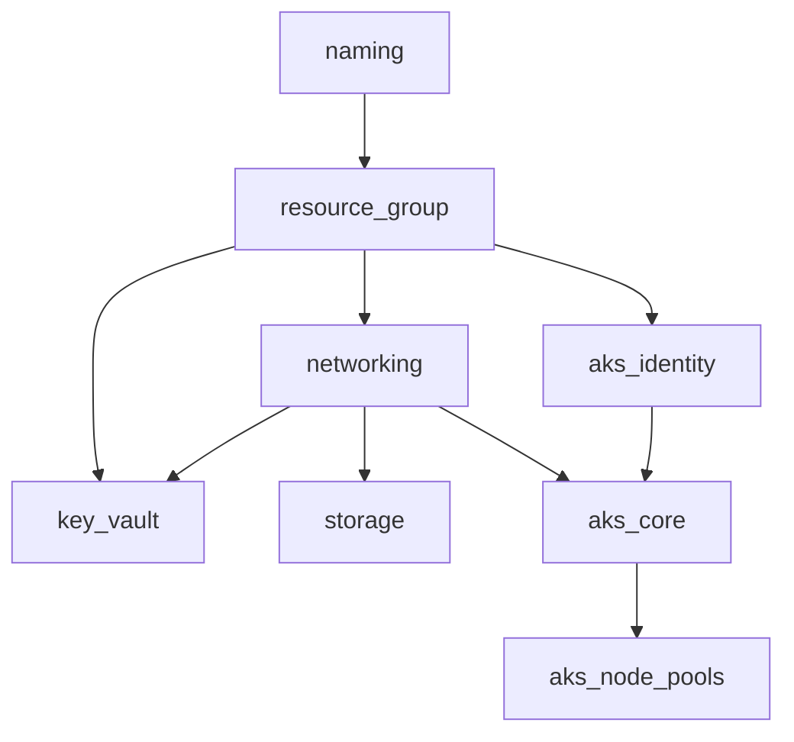

# Terragrunt Azure Infrastructure - West US Region (Dev Environment)

This directory contains Terragrunt configurations for deploying Azure infrastructure in the West US region for the development environment.

## Module Structure

This infrastructure is organized into self-contained modules with clear dependencies:

- **naming**: Centralizes the naming standards for all resources
- **resource_group**: Creates the resource group container for all resources
- **networking**: Manages VNet, subnets, and network security
- **storage**: Provisions storage accounts with proper security settings
- **key_vault**: Sets up Azure Key Vault with network restrictions
- **aks_identity**: Creates managed identities for AKS
- **aks_core**: Deploys the AKS cluster with system node pools
- **aks_node_pools**: Creates additional node pools for the AKS cluster

## Module Dependencies

The modules have the following dependency hierarchy:



## Configuration Files

Each module directory contains:
- **terragrunt.hcl**: The main Terragrunt configuration for the module
- **README.md**: Standardized documentation for the module

The following shared configuration files are also used:
- **env.hcl**: Environment-specific variables for the dev environment
- **region.hcl**: Region-specific variables for westus
- **network.hcl**: Network CIDR allocations and subnet definitions
- **common.hcl**: Common variables shared across the environment (at parent level)

## Standardized Documentation

Each module includes standardized documentation with the following sections:

1. **Overview**: Brief description of the module's purpose
2. **Configuration Details**:
   - **Purpose**: What the module accomplishes
   - **Dependencies**: Other modules this module depends on
   - **Key Configuration Settings**: Important settings and parameters
3. **Usage Example**: How to apply the module
4. **Dependencies on this Module**: Which other modules depend on this one

## Applying Changes

To apply changes to a specific module:

```bash
cd <module-name>
terragrunt apply
```

To apply all modules in the correct dependency order:

```bash
cd ..
terragrunt run-all apply
```

## Benefits of This Approach

1. **Separation of state files**: Each component has its own state, reducing risk
2. **Granular deployments**: Apply changes to specific components without affecting others
3. **Explicit dependencies**: Dependencies between resources are clearly defined
4. **Simplified modules**: Individual modules focus on their specific responsibilities
5. **Easier troubleshooting**: Issues are isolated to specific components
6. **Comprehensive documentation**: Each module has standardized documentation 